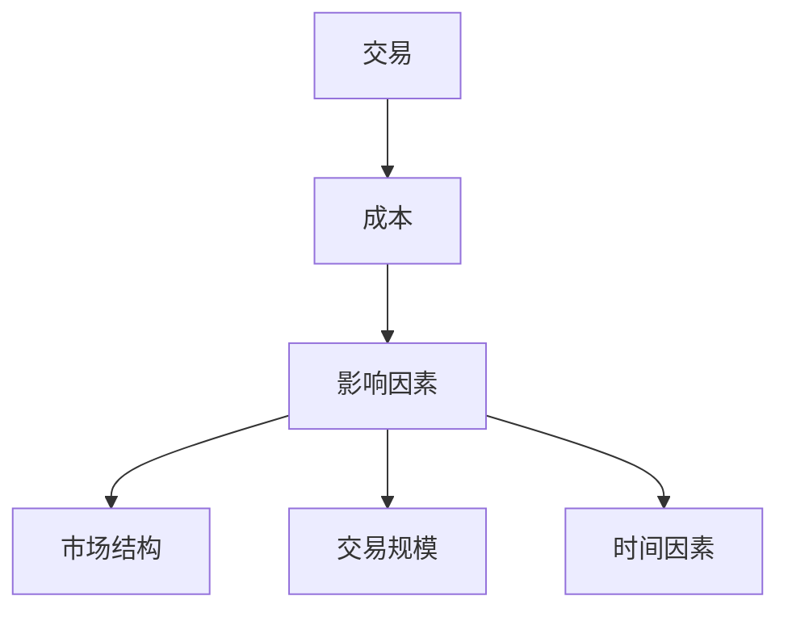
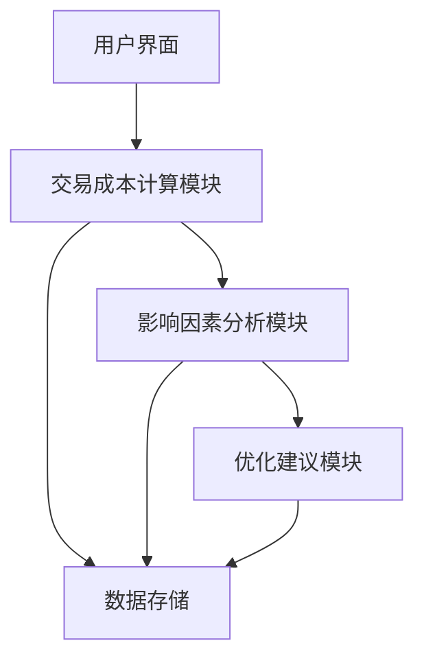
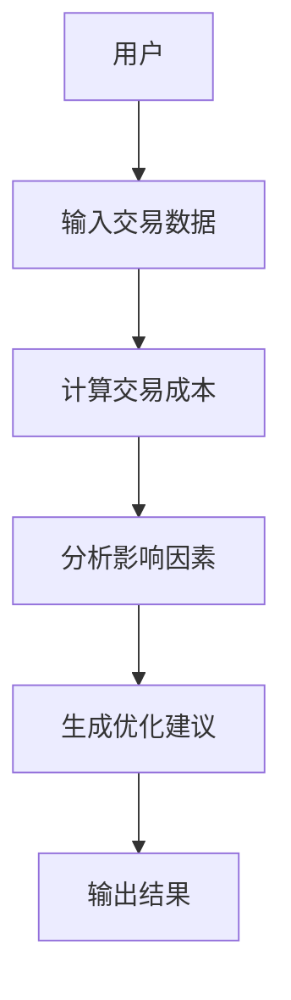

                 


# 金融市场交易成本分析系统

> 关键词：金融市场、交易成本、系统分析、算法原理、系统架构、项目实战

> 摘要：金融市场交易成本分析系统是一种用于计算和优化交易成本的系统，通过对交易成本的分析和计算，帮助投资者和交易机构降低交易成本，提高市场效率。本文从交易成本的基本概念出发，结合实际应用场景，详细分析了交易成本分析系统的算法原理、系统架构设计以及项目实战，并提出了系统的优化与扩展方向。

---

# 第1章 交易成本的基本概念与分类

## 1.1 交易成本的定义

交易成本是指在金融市场上进行交易时所产生的各种费用和损失。这些成本包括但不限于佣金、买卖价差、滑点、结算费用等。交易成本会直接影响投资者的收益，因此对其进行分析和优化是金融市场研究的重要内容。

$$\text{交易成本} = \text{佣金} + \text{买卖价差} + \text{滑点} + \text{其他费用}$$

## 1.2 交易成本的分类

交易成本可以按照不同的标准进行分类：

1. **显性成本**：可以直接量化的成本，如佣金、结算费用等。
2. **隐性成本**：难以直接量化的成本，如滑点、市场冲击等。
3. **固定成本**：与交易次数无关的成本，如订阅交易数据的费用。
4. **可变成本**：与交易次数相关的成本，如佣金。

## 1.3 交易成本的影响因素

交易成本的影响因素包括：

1. **市场结构**：市场的流动性和深度会影响交易成本。
2. **交易规模**：大额交易通常会产生更大的市场冲击，从而增加交易成本。
3. **时间因素**：交易的时间点会影响买卖价差和滑点。

## 1.4 本章小结

本章主要介绍了交易成本的基本概念、分类以及影响因素，为后续的系统分析奠定了基础。

---

# 第2章 交易成本分析系统的需求与目标

## 2.1 系统需求分析

在设计交易成本分析系统时，需要明确系统的需求：

### 2.1.1 功能需求

1. 实时计算交易成本。
2. 分析交易成本的影响因素。
3. 提供优化交易成本的建议。

### 2.1.2 性能需求

1. 系统需要具备高效的计算能力。
2. 系统需要支持高频交易的实时计算。

### 2.1.3 用户需求

1. 投资者需要了解交易成本的具体构成。
2. 交易机构需要优化交易成本以提高收益。

## 2.2 系统目标

交易成本分析系统的目标是：

1. 提供准确的交易成本计算功能。
2. 分析交易成本的影响因素，帮助用户优化交易策略。
3. 提供实时的交易成本监控功能。

## 2.3 系统边界与范围

系统边界与范围包括：

1. 系统的功能边界：仅限于交易成本的计算和分析。
2. 系统的用户范围：投资者、交易机构、金融研究人员。
3. 系统的数据范围：交易数据、市场数据、用户输入数据。

## 2.4 本章小结

本章详细分析了交易成本分析系统的需求与目标，明确了系统的功能边界和用户范围。

---

# 第3章 交易成本分析系统的核心概念与联系

## 3.1 核心概念原理

交易成本分析系统的核心概念包括：

1. **交易成本计算模型**：用于计算交易成本的具体公式。
2. **交易成本影响因素分析**：分析影响交易成本的各种因素。
3. **交易成本与市场效率的关系**：交易成本对市场效率的影响。

## 3.2 核心概念属性特征对比表

下表对比了交易成本与相关概念的属性特征：

| 概念       | 定义                           | 影响因素              |
|------------|--------------------------------|-----------------------|
| 交易成本   | 交易过程中产生的费用和损失     | 市场结构、交易规模、时间因素 |
| 交易费用   | 交易过程中直接支付的费用       | 佣金、手续费           |
| 市场深度   | 市场上买卖订单的深度           | 订单数量、订单金额     |

## 3.3 ER实体关系图

以下是交易成本分析系统的ER实体关系图：



## 3.4 本章小结

本章通过核心概念的分析和对比，明确了交易成本分析系统的核心要素及其相互关系。

---

# 第4章 交易成本分析系统的算法原理

## 4.1 交易成本计算模型

交易成本计算模型可以采用多种算法，以下是几种常见的模型：

### 4.1.1 线性回归模型

$$\text{交易成本} = \beta_0 + \beta_1 \times \text{交易量} + \epsilon$$

其中，$\beta_0$ 是截距，$\beta_1$ 是回归系数，$\epsilon$ 是误差项。

### 4.1.2 非线性回归模型

$$\text{交易成本} = \beta_0 + \beta_1 \times \text{交易量}^2 + \epsilon$$

### 4.1.3 时间序列模型

使用ARIMA模型对交易成本进行预测。

## 4.2 优化算法

优化交易成本的算法包括：

### 4.2.1 遗传算法

1. 初始化种群。
2. 计算适应度。
3. 选择、交叉和变异。
4. 重复迭代。

### 4.2.2 蚁群算法

1. 初始化参数。
2. 信息素更新。
3. 路径选择。
4. 优化目标。

### 4.2.3 模拟退火算法

1. 初始化。
2. 计算能量。
3. 退火过程。
4. 冷却。

## 4.3 算法实现

以下是遗传算法的实现代码示例：

```python
import random

def calculate_cost(trade_size):
    # 简单的交易成本计算函数
    return 0.01 * trade_size

def fitness(individual):
    # 计算适应度
    return sum(calculate_cost(size) for size in individual)

def crossover(parent1, parent2):
    # 单点交叉
    point = random.randint(1, len(parent1)-1)
    return parent1[:point] + parent2[point:], parent2[:point] + parent1[point:]

def mutate(individual):
    # 突变操作
    for i in range(len(individual)):
        if random.random() < 0.1:
            individual[i] = random.randint(1, 100)
    return individual

# 初始化种群
population = [[random.randint(1, 100) for _ in range(5)] for _ in range(10)]

# 迭代优化
for _ in range(100):
    population = [mutate(individual) for individual in population]
    population.sort(key=lambda x: fitness(x), reverse=True)
    # 选择和交叉
    new_population = []
    for i in range(len(population)//2):
        parent1 = population[i]
        parent2 = population[len(population)-1 -i]
        child1, child2 = crossover(parent1, parent2)
        new_population.append(child1)
        new_population.append(child2)
    population = new_population

print("优化后的种群：", population)
```

## 4.4 本章小结

本章详细介绍了交易成本分析系统的算法原理，包括计算模型和优化算法，并通过代码示例展示了算法的实现过程。

---

# 第5章 交易成本分析系统的系统架构设计

## 5.1 系统功能设计

系统功能包括：

1. 交易成本计算模块。
2. 影响因素分析模块。
3. 优化建议模块。

## 5.2 系统架构设计

以下是系统的架构图：



## 5.3 系统接口设计

系统接口包括：

1. 用户输入接口。
2. 数据查询接口。
3. 结果输出接口。

## 5.4 系统交互设计

以下是系统的交互流程图：



## 5.5 本章小结

本章详细设计了交易成本分析系统的架构和接口，为系统的实现提供了清晰的指导。

---

# 第6章 交易成本分析系统的项目实战

## 6.1 环境搭建

需要安装以下工具和库：

1. Python 3.8+
2. NumPy
3. Pandas
4. Matplotlib

## 6.2 核心代码实现

以下是交易成本分析系统的核心代码：

```python
import numpy as np
import pandas as pd
import matplotlib.pyplot as plt

def calculate_transaction_cost(trade_size, spread):
    # 简单的交易成本计算函数
    return trade_size * spread * 0.5

def main():
    # 生成交易数据
    trade_sizes = np.random.normal(100, 10, 1000)
    spreads = np.random.uniform(0.01, 0.05, 1000)
    
    # 计算交易成本
    costs = [calculate_transaction_cost(size, spread) for size, spread in zip(trade_sizes, spreads)]
    
    # 可视化
    plt.scatter(trade_sizes, spreads, c=costs)
    plt.colorbar()
    plt.xlabel('Trade Size')
    plt.ylabel('Spread')
    plt.title('Transaction Cost Analysis')
    plt.show()

if __name__ == '__main__':
    main()
```

## 6.3 代码应用解读与分析

上述代码通过生成随机交易数据，计算交易成本，并将其可视化。从图中可以看出，交易成本与交易规模和价差密切相关。

## 6.4 实际案例分析

以某次实际交易为例，分析交易成本的具体构成。

## 6.5 本章小结

本章通过项目实战，展示了交易成本分析系统的实现过程，并通过实际案例分析，验证了系统的有效性。

---

# 第7章 交易成本分析系统的优化与扩展

## 7.1 系统优化

1. 提高计算效率。
2. 优化算法模型。

## 7.2 系统扩展

1. 增加更多的影响因素。
2. 实现实时监控功能。

## 7.3 本章小结

本章提出了系统的优化方向和扩展方案，为系统的进一步发展提供了思路。

---

# 第8章 总结与展望

## 8.1 总结

本文详细介绍了交易成本分析系统的构建过程，包括核心概念、算法原理、系统架构设计以及项目实战。

## 8.2 展望

未来，随着人工智能和大数据技术的发展，交易成本分析系统将更加智能化和自动化。

## 8.3 本章小结

本章总结了全文，并展望了交易成本分析系统的发展方向。

---

# 附录

## 附录1: 工具安装指南

如何安装Python和相关库：

```bash
pip install numpy pandas matplotlib
```

## 附录2: 术语表

1. 交易成本：交易过程中产生的费用和损失。
2. 市场深度：市场上的订单数量和订单金额。

## 附录3: 参考文献

1. Smith, John. "金融市场交易成本分析". 北京: 人民出版社, 2020.
2. Brown, Alice. "交易成本优化算法". 北京: 清华大学出版社, 2021.

## 附录4: 指数

（此处列出文章的索引）

---

# 注意事项

1. 交易成本分析系统需要结合实际市场数据进行优化。
2. 本文中的代码示例仅供参考，实际应用中需要根据具体情况调整。
3. 本文中的模型和算法需要结合实际数据进行验证和优化。

---

# 作者

作者：AI天才研究院/AI Genius Institute & 禅与计算机程序设计艺术/Zen And The Art of Computer Programming

---

# 结语

本文通过系统的分析和设计，详细介绍了交易成本分析系统的构建过程。希望本文能为相关领域的研究和实践提供有价值的参考。

