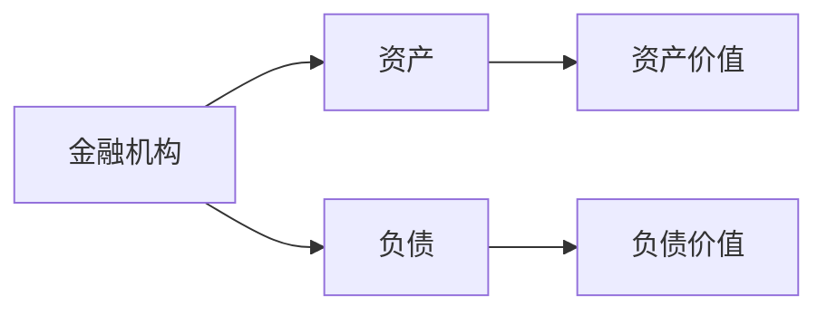
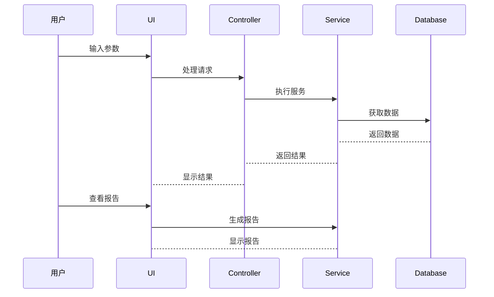

                 


# 目录大纲：金融市场传染效应模拟系统

## 第一部分：金融市场传染效应概述

### 第1章：金融市场传染效应的背景与问题背景

#### 1.1 问题背景
- 1.1.1 金融市场风险的复杂性
- 1.1.2 金融危机的传播机制
- 1.1.3 系统性风险的定义与特征

#### 1.2 问题描述
- 1.2.1 传染效应的定义
- 1.2.2 传染效应的传播路径
- 1.2.3 传染效应的数学建模

#### 1.3 问题解决
- 1.3.1 模拟系统的必要性
- 1.3.2 模拟系统的功能目标
- 1.3.3 模拟系统的实现方法

#### 1.4 边界与外延
- 1.4.1 传染效应的边界条件
- 1.4.2 传染效应的外延范围
- 1.4.3 传染效应与其它金融现象的关系

#### 1.5 核心概念组成
- 1.5.1 核心概念的术语说明
- 1.5.2 核心概念之间的联系
- 1.5.3 核心概念的数学表达

---

## 第二部分：核心概念与联系

### 第2章：传染效应的原理与模型

#### 2.1 传染效应的传播机制
- 2.1.1 单个金融机构的传染机制
- 2.1.2 金融市场整体的传染机制
- 2.1.3 不同金融工具的传染路径

#### 2.2 传染效应的影响因素
- 2.2.1 市场参与者的类型
- 2.2.2 金融机构的资产负债结构
- 2.2.3 市场流动性的影响

#### 2.3 核心概念对比表
| 核心概念 | 定义 | 示例 | 属性 |
|----------|------|------|------|
| 传染效应 | ... | ... | ... |

#### 2.4 实体关系图（ER图）


---

## 第三部分：算法原理

### 第3章：系统动力学模型

#### 3.1 系统动力学模型简介
- 3.1.1 系统动力学的基本概念
- 3.1.2 系统动力学在金融领域的应用

#### 3.2 算法实现步骤
- 3.2.1 数据收集与预处理
- 3.2.2 模型构建
- 3.2.3 模型求解

#### 3.3 算法流程图


#### 3.4 Python代码实现
```python
def simulate_system():
    # 数据收集与预处理
    data = load_data()
    processed_data = preprocess(data)
    
    # 模型构建
    model = build_model(processed_data)
    
    # 模型求解
    result = solve_model(model)
    
    # 结果分析
    analyze_result(result)
    
simulate_system()
```

#### 3.5 数学模型与公式
- 3.5.1 动态方程
  $$ \frac{dS}{dt} = \alpha S - \beta S^2 $$
- 3.5.2 示例计算
  $$ S_1 = \alpha S_0 - \beta S_0^2 $$

---

## 第四部分：系统分析与架构设计

### 第4章：问题场景介绍

#### 4.1 问题场景描述
- 4.1.1 金融机构之间的传染效应
- 4.1.2 金融市场整体的系统性风险

#### 4.2 项目介绍
- 4.2.1 项目目标
- 4.2.2 项目范围
- 4.2.3 项目需求

---

### 第5章：系统功能设计

#### 5.1 领域模型类图


#### 5.2 系统架构图


#### 5.3 接口设计
- 5.3.1 输入接口
  - 数据接口：读取金融数据
  - 参数接口：设置模型参数
- 5.3.2 输出接口
  - 结果接口：输出模拟结果
  - 报告接口：生成分析报告

#### 5.4 交互序列图


---

## 第五部分：项目实战

### 第6章：环境安装与系统实现

#### 6.1 环境安装
- 6.1.1 安装Python
- 6.1.2 安装相关库（如NumPy、Matplotlib）
- 6.1.3 安装Jupyter Notebook

#### 6.2 系统核心实现
```python
import numpy as np
import matplotlib.pyplot as plt

def model_function(S0, α, β, t):
    S = S0 * np.exp((α - β * S0) * t)
    return S

# 示例运行
S0 = 100
α = 0.05
β = 0.001
t = np.linspace(0, 10, 100)
S = model_function(S0, α, β, t)

plt.plot(t, S)
plt.xlabel('时间（年）')
plt.ylabel('资产价值')
plt.show()
```

#### 6.3 代码应用解读
- 代码功能：模拟资产价值随时间的变化
- 代码参数：初始资产价值、增长系数、传染系数、时间范围
- 结果分析：资产价值的变化趋势与传染效应的关系

#### 6.4 实际案例分析
- 案例背景：2008年金融危机
- 数据来源：历史金融数据
- 模拟结果：传染效应的传播路径与影响
- 案例总结：模拟结果与实际事件的对比分析

#### 6.5 项目小结
- 项目实现的关键步骤
- 项目中的技术难点
- 项目成果与意义

---

## 第六部分：最佳实践与总结

### 第7章：最佳实践 tips

#### 7.1 实践建议
- 数据来源的选择
- 模型参数的设置
- 模拟结果的验证

#### 7.2 工具推荐
- Python库推荐：NumPy、Pandas、Matplotlib
- 开发工具推荐：Jupyter Notebook、PyCharm
- 可视化工具推荐：Plotly、Seaborn

### 第8章：小结与注意事项

#### 8.1 小结
- 本书的核心内容回顾
- 传染效应模拟系统的实现步骤
- 金融风险管理的重要性

#### 8.2 注意事项
- 数据的准确性和完整性
- 模型的适用性和限制
- 结果的解释与实际应用的结合

### 第9章：拓展阅读

#### 9.1 相关书籍推荐
- 《金融市场与风险管理》
- 《系统动力学在金融中的应用》
- 《Python金融数据分析》

#### 9.2 在线资源推荐
- 金融科技博客
- 金融建模论坛
- 开源项目仓库

---

## 作者信息

作者：AI天才研究院/AI Genius Institute & 禅与计算机程序设计艺术/Zen And The Art of Computer Programming

