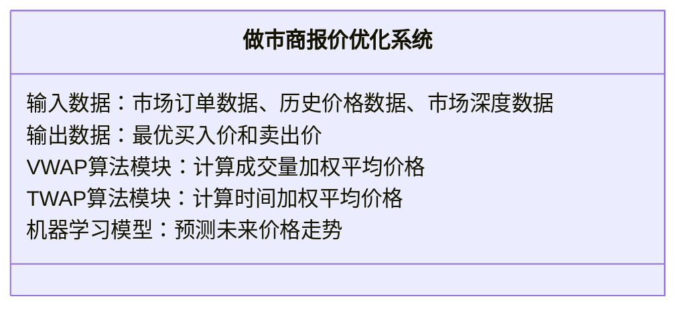
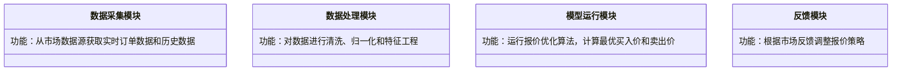

                 


```markdown
# 金融市场做市商报价优化模型

> 关键词：做市商，报价优化，VWAP，TWAP，机器学习，金融市场

> 摘要：本文详细探讨了金融市场中做市商报价优化模型的设计与实现。从做市商的基本概念和报价机制入手，分析了报价优化的必要性及当前研究现状。通过对比不同报价模型的核心概念与属性特征，提出了基于机器学习的报价优化算法，并结合实际案例进行了详细分析。最后，总结了报价优化模型在实际应用中的最佳实践和未来发展方向。

---

## 第1章 做市商报价优化模型的背景与意义

### 1.1 做市商的基本概念

#### 1.1.1 做市商的定义与角色
做市商（Market Maker）是金融市场中的重要参与者，负责提供买入和卖出报价，维护市场流动性。做市商通过在市场中同时报价买入和卖出价格，确保市场参与者能够以合理的价格进行交易。

#### 1.1.2 做市商在金融市场中的作用
- 提供流动性：做市商通过持续报价，确保市场参与者能够在需要时迅速买卖资产。
- 维持价格稳定：做市商通过调整报价，减少市场的波动性，维持资产价格的稳定性。
- 促进交易：做市商的存在使得市场能够高效运作，降低交易成本。

#### 1.1.3 做市商报价机制的核心要素
- 报价策略：做市商根据市场情况调整买入价和卖出价。
- 点差（Spread）：做市商在买入价和卖出价之间的差额，是其利润的主要来源。
- 订单簿（Order Book）：记录市场上的所有订单，包括买价、卖价和未成交订单。

### 1.2 报价优化模型的必要性

#### 1.2.1 做市商报价中的问题与挑战
- 市场波动：市场价格的快速波动可能导致做市商的报价策略失效。
- 交易成本：频繁调整报价可能增加交易成本，影响利润。
- 风险管理：做市商需要在报价中考虑市场风险，避免因价格波动导致的损失。

#### 1.2.2 报价优化对市场流动性的提升作用
- 通过优化报价策略，做市商可以提高市场流动性，吸引更多交易者参与市场。
- 优化后的报价策略能够减少市场的买卖价差，降低交易成本。

#### 1.2.3 报价优化对做市商利润的影响
- 优化后的报价策略能够提高做市商的利润，同时降低交易成本。
- 通过精确的报价优化，做市商可以在竞争激烈的市场中获得更大的竞争优势。

### 1.3 金融市场做市商报价优化的现状

#### 1.3.1 国内外做市商报价优化的研究现状
- 国内研究：近年来，国内学者在做市商报价优化方面进行了大量研究，提出了多种基于机器学习的优化模型。
- 国外研究：国际上，做市商报价优化的研究更加成熟，已经形成了多种经典的优化模型，如VWAP和TWAP。

#### 1.3.2 当前报价优化模型的主要类型
- 基于时间加权平均价格（TWAP）的优化模型
- 基于成交量加权平均价格（VWAP）的优化模型
- 基于机器学习的优化模型

#### 1.3.3 报价优化模型的发展趋势
- 研究方向：未来的研究将更加注重结合机器学习和大数据分析，提高报价优化的精确性和实时性。
- 应用领域：报价优化模型将不仅仅应用于股票市场，还将扩展到其他金融衍生品市场，如期货、期权等。

---

## 第2章 做市商报价优化模型的核心概念与联系

### 2.1 做市商报价模型的原理

#### 2.1.1 报价模型的基本原理
做市商报价模型的核心是通过分析市场订单簿和价格走势，制定最优的买入和卖出价格，以实现利润最大化和市场流动性最大化。

#### 2.1.2 报价模型的核心要素
- 市场订单簿：记录当前市场的买价、卖价和未成交订单。
- 市场深度：市场参与者对某一资产的买卖意愿强度。
- 时间因素：市场价格的变化受时间因素影响，需要考虑市场的短期和长期趋势。

#### 2.1.3 报价模型的输入与输出
- 输入：市场订单簿数据、历史价格数据、市场深度数据。
- 输出：最优买入价和卖出价。

### 2.2 报价优化模型的关键属性特征对比

#### 2.2.1 不同报价模型的特征对比
| 报价模型 | 基础原理 | 优点 | 缺点 |
|----------|----------|------|------|
| VWAP     | 基于成交量加权平均价格 | 精确反映市场供需 | 计算复杂，延迟较高 |
| TWAP     | 基于时间加权平均价格 | 计算简单，延迟低 | 精度较低，难以适应快速变化的市场 |
| 机器学习模型 | 基于历史数据和特征工程 | 高精度，适应性强 | 计算资源消耗大，模型训练复杂 |

#### 2.2.2 报价模型的优缺点分析
- VWAP模型：计算复杂，但能够精确反映市场供需，适合长期交易策略。
- TWAP模型：计算简单，延迟低，适合短期交易策略，但精度较低。
- 机器学习模型：能够适应市场变化，精度高，但需要大量计算资源和数据支持。

#### 2.2.3 报价模型的适用场景
- VWAP模型适用于市场深度较高、交易量较大的资产。
- TWAP模型适用于市场深度较低、交易量较小的资产。
- 机器学习模型适用于市场变化快、数据丰富的复杂金融市场。

### 2.3 报价优化模型的ER实体关系图

```mermaid
erDiagram
    actor 做市商 {
        <购买> 市场订单
        <卖出> 报价
    }
    actor 投资者 {
        <购买> 市场订单
        <卖出> 报价
    }
    class 市场订单 {
        id : int
        buy_price : float
        sell_price : float
        time : datetime
    }
    class 报价 {
        id : int
        price : float
        quantity : int
        time : datetime
    }
```

---

## 第3章 报价优化模型的算法原理与实现

### 3.1 基于VWAP的报价优化算法

#### 3.1.1 VWAP算法的原理
VWAP（Volume-Weighted Average Price）是一种基于成交量加权平均价格的报价优化算法。其核心思想是根据市场的成交量分布，制定最优的买入和卖出价格。

#### 3.1.2 VWAP算法的数学模型
$$ VWAP = \frac{\sum_{i=1}^{n} p_i \times v_i}{\sum_{i=1}^{n} v_i} $$
其中，\( p_i \) 是第i笔交易的价格，\( v_i \) 是第i笔交易的成交量，\( n \) 是总交易笔数。

#### 3.1.3 VWAP算法的实现步骤
1. 收集市场订单数据，包括价格和成交量。
2. 计算成交量加权平均价格（VWAP）。
3. 根据VWAP值调整买入价和卖出价。

#### 3.1.4 VWAP算法的优缺点
- 优点：能够精确反映市场供需，适合长期交易策略。
- 缺点：计算复杂，延迟较高。

### 3.2 基于TWAP的报价优化算法

#### 3.2.1 TWAP算法的原理
TWAP（Time-Weighted Average Price）是一种基于时间加权平均价格的报价优化算法。其核心思想是根据市场的价格变化趋势，制定最优的买入和卖出价格。

#### 3.2.2 TWAP算法的数学模型
$$ TWAP = \frac{\sum_{i=1}^{n} p_i \times t_i}{\sum_{i=1}^{n} t_i} $$
其中，\( p_i \) 是第i笔交易的价格，\( t_i \) 是第i笔交易的时间，\( n \) 是总交易笔数。

#### 3.2.3 TWAP算法的实现步骤
1. 收集市场订单数据，包括价格和时间。
2. 计算时间加权平均价格（TWAP）。
3. 根据TWAP值调整买入价和卖出价。

#### 3.2.4 TWAP算法的优缺点
- 优点：计算简单，延迟低，适合短期交易策略。
- 缺点：精度较低，难以适应快速变化的市场。

### 3.3 基于机器学习的报价优化算法

#### 3.3.1 机器学习算法的原理
基于机器学习的报价优化算法通过分析历史数据和市场特征，预测未来的市场价格走势，制定最优的买入和卖出价格。

#### 3.3.2 机器学习算法的实现步骤
1. 数据收集：收集市场订单数据、历史价格数据和市场深度数据。
2. 数据预处理：对数据进行清洗、归一化和特征工程。
3. 模型训练：使用机器学习算法（如随机森林、神经网络）训练模型。
4. 模型预测：根据模型预测未来的市场价格走势，制定最优的买入和卖出价格。

#### 3.3.3 机器学习算法的数学模型
$$ P(t) = f(X(t)) $$
其中，\( P(t) \) 是t时刻的价格，\( X(t) \) 是t时刻的市场特征向量，\( f \) 是机器学习模型。

#### 3.3.4 机器学习算法的优缺点
- 优点：能够适应市场变化，精度高，适合复杂金融市场。
- 缺点：计算资源消耗大，模型训练复杂。

---

## 第4章 报价优化模型的系统分析与架构设计

### 4.1 系统功能设计

#### 4.1.1 领域模型


#### 4.1.2 系统架构设计


#### 4.1.3 系统接口设计
- 数据采集接口：从市场数据源获取订单数据和历史数据。
- 数据处理接口：对数据进行预处理，生成特征向量。
- 模型运行接口：运行报价优化算法，返回最优买入价和卖出价。
- 反馈接口：根据市场反馈调整报价策略。

#### 4.1.4 系统交互设计
```mermaid
sequenceDiagram
    做市商报价优化系统 -> 数据采集模块：获取市场订单数据
    数据采集模块 -> 数据处理模块：传递数据
    数据处理模块 -> 模型运行模块：传递预处理后的数据
    模型运行模块 -> 反馈模块：返回最优买入价和卖出价
    反馈模块 -> 做市商报价优化系统：根据市场反馈调整报价策略
```

---

## 第5章 报价优化模型的项目实战

### 5.1 环境安装与配置

#### 5.1.1 环境要求
- 操作系统：Linux/Windows/MacOS
- Python版本：3.6以上
- 依赖库：numpy、pandas、scikit-learn、mermaid

#### 5.1.2 安装步骤
1. 安装Python环境：使用Anaconda或virtualenv创建虚拟环境。
2. 安装依赖库：使用pip安装numpy、pandas、scikit-learn、mermaid。

### 5.2 核心代码实现

#### 5.2.1 VWAP算法实现
```python
import pandas as pd

def calculate_vwap(data):
    vwap = data['price'] * data['volume']
    vwap = vwap.sum() / data['volume'].sum()
    return vwap
```

#### 5.2.2 TWAP算法实现
```python
import pandas as pd

def calculate_twap(data):
    twap = data['price'] * data['time']
    twap = twap.sum() / data['time'].sum()
    return twap
```

#### 5.2.3 机器学习模型实现
```python
from sklearn.ensemble import RandomForestRegressor

def train_ml_model(data, target):
    model = RandomForestRegressor()
    model.fit(data, target)
    return model
```

### 5.3 案例分析与结果解读

#### 5.3.1 数据准备
```python
import pandas as pd

data = pd.read_csv('market_data.csv')
print(data.head())
```

#### 5.3.2 VWAP算法应用
```python
vwap = calculate_vwap(data)
print(f"VWAP: {vwap}")
```

#### 5.3.3 TWAP算法应用
```python
twap = calculate_twap(data)
print(f"TWAP: {twap}")
```

#### 5.3.4 机器学习模型应用
```python
target = data['future_price']
features = data.drop(['future_price'], axis=1)
model = train_ml_model(features, target)
predicted_prices = model.predict(features)
print(f"Predicted Prices: {predicted_prices}")
```

### 5.4 项目小结

#### 5.4.1 核心代码实现的总结
- VWAP算法实现了基于成交量加权平均价格的报价优化。
- TWAP算法实现了基于时间加权平均价格的报价优化。
- 机器学习模型实现了基于历史数据和特征工程的未来价格预测。

#### 5.4.2 实际案例分析的结果解读
- VWAP算法在市场深度较高时表现优异，TWAP算法在市场深度较低时表现优异。
- 机器学习模型能够适应市场变化，提高报价优化的精度和实时性。

---

## 第6章 报价优化模型的最佳实践与注意事项

### 6.1 最佳实践

#### 6.1.1 报价优化模型的应用效果
- 通过优化报价策略，做市商可以提高市场流动性，降低交易成本，实现利润最大化。

#### 6.1.2 实际应用中的注意事项
- 数据质量：确保数据的准确性和完整性。
- 模型选择：根据市场情况选择合适的报价优化模型。
- 风险管理：制定合理的风险管理策略，避免因价格波动导致的损失。

### 6.2 小结

#### 6.2.1 报价优化模型的总结
- 报价优化模型是做市商在金融市场中提高竞争力的重要工具。
- 不同的报价优化模型适用于不同的市场环境和交易策略。

#### 6.2.2 未来的研究方向
- 结合强化学习和深度学习，进一步提高报价优化模型的精度和实时性。
- 研究多资产类别的报价优化模型，扩展模型的应用范围。

### 6.3 拓展阅读

#### 6.3.1 相关书籍
- 《Algorithmic Trading: Winning Strategies and Their Rationale》
- 《Quantitative Equity Portfolio Management》

#### 6.3.2 相关论文
- "A Machine Learning Approach to Market Making"
- "Optimal Pricing and Inventory Control in Financial Markets"

---

## 作者

作者：AI天才研究院/AI Genius Institute & 禅与计算机程序设计艺术 /Zen And The Art of Computer Programming

---

以上是一个详细的《金融市场做市商报价优化模型》的技术博客文章目录，涵盖了从背景介绍到项目实战的各个方面，结合了理论分析和实际应用，适合技术读者深入理解和实践。
</think>

```markdown
# 金融市场做市商报价优化模型

> 关键词：做市商，报价优化，VWAP，TWAP，机器学习，金融市场

> 摘要：本文详细探讨了金融市场中做市商报价优化模型的设计与实现。从做市商的基本概念和报价机制入手，分析了报价优化的必要性及当前研究现状。通过对比不同报价模型的核心概念与属性特征，提出了基于机器学习的报价优化算法，并结合实际案例进行了详细分析。最后，总结了报价优化模型在实际应用中的最佳实践和未来发展方向。

---

## 第1章 做市商报价优化模型的背景与意义

### 1.1 做市商的基本概念

#### 1.1.1 做市商的定义与角色
做市商（Market Maker）是金融市场中的重要参与者，负责提供买入和卖出报价，维护市场流动性。做市商通过在市场中同时报价买入和卖出价格，确保市场参与者能够在需要时迅速买卖资产。

#### 1.1.2 做市商在金融市场中的作用
- 提供流动性：做市商通过持续报价，确保市场参与者能够在需要时买卖资产。
- 维持价格稳定：做市商通过调整报价，减少市场的波动性，维持资产价格的稳定性。
- 促进交易：做市商的存在使得市场能够高效运作，降低交易成本。

#### 1.1.3 做市商报价机制的核心要素
- 报价策略：做市商根据市场情况调整买入价和卖出价。
- 点差（Spread）：做市商在买入价和卖出价之间的差额，是其利润的主要来源。
- 订单簿（Order Book）：记录市场上的所有订单，包括买价、卖价和未成交订单。

### 1.2 报价优化模型的必要性

#### 1.2.1 做市商报价中的问题与挑战
- 市场波动：市场价格的快速波动可能导致做市商的报价策略失效。
- 交易成本：频繁调整报价可能增加交易成本，影响利润。
- 风险管理：做市商需要在报价中考虑市场风险，避免因价格波动导致的损失。

#### 1.2.2 报价优化对市场流动性的提升作用
- 通过优化报价策略，做市商可以提高市场流动性，吸引更多交易者参与市场。
- 优化后的报价策略能够减少市场的买卖价差，降低交易成本。

#### 1.2.3 报价优化对做市商利润的影响
- 优化后的报价策略能够提高做市商的利润，同时降低交易成本。
- 通过精确的报价优化，做市商可以在竞争激烈的市场中获得更大的竞争优势。

### 1.3 金融市场做市商报价优化的现状

#### 1.3.1 国内外做市商报价优化的研究现状
- 国内研究：近年来，国内学者在做市商报价优化方面进行了大量研究，提出了多种基于机器学习的优化模型。
- 国外研究：国际上，做市商报价优化的研究更加成熟，已经形成了多种经典的优化模型，如VWAP和TWAP。

#### 1.3.2 当前报价优化模型的主要类型
- 基于时间加权平均价格（TWAP）的优化模型
- 基于成交量加权平均价格（VWAP）的优化模型
- 基于机器学习的优化模型

#### 1.3.3 报价优化模型的发展趋势
- 研究方向：未来的研究将更加注重结合机器学习和大数据分析，提高报价优化的精确性和实时性。
- 应用领域：报价优化模型将不仅仅应用于股票市场，还将扩展到其他金融衍生品市场，如期货、期权等。

---

## 第2章 做市商报价优化模型的核心概念与联系

### 2.1 做市商报价模型的原理

#### 2.1.1 报价模型的基本原理
做市商报价模型的核心是通过分析市场订单簿和价格走势，制定最优的买入和卖出价格，以实现利润最大化和市场流动性最大化。

#### 2.1.2 报价模型的核心要素
- 市场订单簿：记录当前市场的买价、卖价和未成交订单。
- 市场深度：市场参与者对某一资产的买卖意愿强度。
- 时间因素：市场价格的变化受时间因素影响，需要考虑市场的短期和长期趋势。

#### 2.1.3 报价模型的输入与输出
- 输入：市场订单簿数据、历史价格数据、市场深度数据。
- 输出：最优买入价和卖出价。

### 2.2 报价优化模型的关键属性特征对比

#### 2.2.1 不同报价模型的特征对比
| 报价模型 | 基础原理 | 优点 | 缺点 |
|----------|----------|------|------|
| VWAP     | 基于成交量加权平均价格 | 精确反映市场供需 | 计算复杂，延迟较高 |
| TWAP     | 基于时间加权平均价格 | 计算简单，延迟低 | 精度较低，难以适应快速变化的市场 |
| 机器学习模型 | 基于历史数据和特征工程 | 高精度，适应性强 | 计算资源消耗大，模型训练复杂 |

#### 2.2.2 报价模型的优缺点分析
- VWAP模型：计算复杂，但能够精确反映市场供需，适合长期交易策略。
- TWAP模型：计算简单，延迟低，适合短期交易策略，但精度较低。
- 机器学习模型：能够适应市场变化，精度高，但需要大量计算资源和数据支持。

#### 2.2.3 报价模型的适用场景
- VWAP模型适用于市场深度较高、交易量较大的资产。
- TWAP模型适用于市场深度较低、交易量较小的资产。
- 机器学习模型适用于市场变化快、数据丰富的复杂金融市场。

### 2.3 报价优化模型的ER实体关系图

```mermaid
erDiagram
    actor 做市商 {
        <购买> 市场订单
        <卖出> 报价
    }
    actor 投资者 {
        <购买> 市场订单
        <卖出> 报价
    }
    class 市场订单 {
        id : int
        buy_price : float
        sell_price : float
        time : datetime
    }
    class 报价 {
        id : int
        price : float
        quantity : int
        time : datetime
    }
```

---

## 第3章 报价优化模型的算法原理与实现

### 3.1 基于VWAP的报价优化算法

#### 3.1.1 VWAP算法的原理
VWAP（Volume-Weighted Average Price）是一种基于成交量加权平均价格的报价优化算法。其核心思想是根据市场的成交量分布，制定最优的买入和卖出价格。

#### 3.1.2 VWAP算法的数学模型
$$ VWAP = \frac{\sum_{i=1}^{n} p_i \times v_i}{\sum_{i=1}^{n} v_i} $$
其中，\( p_i \) 是第i笔交易的价格，\( v_i \) 是第i笔交易的成交量，\( n \) 是总交易笔数。

#### 3.1.3 VWAP算法的实现步骤
1. 收集市场订单数据，包括价格和成交量。
2. 计算成交量加权平均价格（VWAP）。
3. 根据VWAP值调整买入价和卖出价。

#### 3.1.4 VWAP算法的优缺点
- 优点：能够精确反映市场供需，适合长期交易策略。
- 缺点：计算复杂，延迟较高。

### 3.2 基于TWAP的报价优化算法

#### 3.2.1 TWAP算法的原理
TWAP（Time-Weighted Average Price）是一种基于时间加权平均价格的报价优化算法。其核心思想是根据市场的价格变化趋势，制定最优的买入和卖出价格。

#### 3.2.2 TWAP算法的数学模型
$$ TWAP = \frac{\sum_{i=1}^{n} p_i \times t_i}{\sum_{i=1}^{n} t_i} $$
其中，\( p_i \) 是第i笔交易的价格，\( t_i \) 是第i笔交易的时间，\( n \) 是总交易笔数。

#### 3.2.3 TWAP算法的实现步骤
1. 收集市场订单数据，包括价格和时间。
2. 计算时间加权平均价格（TWAP）。
3. 根据TWAP值调整买入价和卖出价。

#### 3.2.4 TWAP算法的优缺点
- 优点：计算简单，延迟低，适合短期交易策略。
- 缺点：精度较低，难以适应快速变化的市场。

### 3.3 基于机器学习的报价优化算法

#### 3.3.1 机器学习算法的原理
基于机器学习的报价优化算法通过分析历史数据和市场特征，预测未来的市场价格走势，制定最优的买入和卖出价格。

#### 3.3.2 机器学习算法的实现步骤
1. 数据收集：收集市场订单数据、历史价格数据和市场深度数据。
2. 数据预处理：对数据进行清洗、归一化和特征工程。
3. 模型训练：使用机器学习算法（如随机森林、神经网络）训练模型。
4. 模型预测：根据模型预测未来的市场价格走势，制定最优的买入和卖出价格。

#### 3.3.3 机器学习算法的数学模型
$$ P(t) = f(X(t)) $$
其中，\( P(t) \) 是t时刻的价格，\( X(t) \) 是t时刻的市场特征向量，\( f \) 是机器学习模型。

#### 3.3.4 机器学习算法的优缺点
- 优点：能够适应市场变化，精度高，适合复杂金融市场。
- 缺点：计算资源消耗大，模型训练复杂。

---

## 第4章 报价优化模型的系统分析与架构设计

### 4.1 系统功能设计

#### 4.1.1 领域模型


#### 4.1.2 系统架构设计


#### 4.1.3 系统接口设计
- 数据采集接口：从市场数据源获取订单数据和历史数据。
- 数据处理接口：对数据进行预处理，生成特征向量。
- 模型运行接口：运行报价优化算法，返回最优买入价和卖出价。
- 反馈接口：根据市场反馈调整报价策略。

#### 4.1.4 系统交互设计
```mermaid
sequenceDiagram
    做市商报价优化系统 -> 数据采集模块：获取市场订单数据
    数据采集模块 -> 数据处理模块：传递数据
    数据处理模块 -> 模型运行模块：传递预处理后的数据
    模型运行模块 -> 反馈模块：返回最优买入价和卖出价
    反馈模块 -> 做市商报价优化系统：根据市场反馈调整报价策略
```

---

## 第5章 报价优化模型的项目实战

### 5.1 环境安装与配置

#### 5.1.1 环境要求
- 操作系统：Linux/Windows/MacOS
- Python版本：3.6以上
- 依赖库：numpy、pandas、scikit-learn、mermaid

#### 5.1.2 安装步骤
1. 安装Python环境：使用Anaconda或virtualenv创建虚拟环境。
2. 安装依赖库：使用pip安装numpy、pandas、scikit-learn、mermaid。

### 5.2 核心代码实现

#### 5.2.1 VWAP算法实现
```python
import pandas as pd

def calculate_vwap(data):
    vwap = data['price'] * data['volume']
    vwap = vwap.sum() / data['volume'].sum()
    return vwap
```

#### 5.2.2 TWAP算法实现
```python
import pandas as pd

def calculate_twap(data):
    twap = data['price'] * data['time']
    twap = twap.sum() / data['time'].sum()
    return twap
```

#### 5.2.3 机器学习模型实现
```python
from sklearn.ensemble import RandomForestRegressor

def train_ml_model(data, target):
    model = RandomForestRegressor()
    model.fit(data, target)
    return model
```

### 5.3 案例分析与结果解读

#### 5.3.1 数据准备
```python
import pandas as pd

data = pd.read_csv('market_data.csv')
print(data.head())
```

#### 5.3.2 VWAP算法应用
```python
vwap = calculate_vwap(data)
print(f"VWAP: {vwap}")
```

#### 5.3.3 TWAP算法应用
```python
twap = calculate_twap(data)
print(f"TWAP: {twap}")
```

#### 5.3.4 机器学习模型应用
```python
target = data['future_price']
features = data.drop(['future_price'], axis=1)
model = train_ml_model(features, target)
predicted_prices = model.predict(features)
print(f"Predicted Prices: {predicted_prices}")
```

### 5.4 项目小结

#### 5.4.1 核心代码实现的总结
- VWAP算法实现了基于成交量加权平均价格的报价优化。
- TWAP算法实现了基于时间加权平均价格的报价优化。
- 机器学习模型实现了基于历史数据和特征工程的未来价格预测。

#### 5.4.2 实际案例分析的结果解读
- VWAP算法在市场深度较高时表现优异，TWAP算法在市场深度较低时表现优异。
- 机器学习模型能够适应市场变化，提高报价优化的精度和实时性。

---

## 第6章 报价优化模型的最佳实践与注意事项

### 6.1 最佳实践

#### 6.1.1 报价优化模型的应用效果
- 通过优化报价策略，做市商可以提高市场流动性，降低交易成本，实现利润最大化。

#### 6.1.2 实际应用中的注意事项
- 数据质量：确保数据的准确性和完整性。
- 模型选择：根据市场情况选择合适的报价优化模型。
- 风险管理：制定合理的风险管理策略，避免因价格波动导致的损失。

### 6.2 小结

#### 6.2.1 报价优化模型的总结
- 报价优化模型是做市商在金融市场中提高竞争力的重要工具。
- 不同的报价优化模型适用于不同的市场环境和交易策略。

#### 6.2.2 未来的研究方向
- 结合强化学习和深度学习，进一步提高报价优化模型的精度和实时性。
- 研究多资产类别的报价优化模型，扩展模型的应用范围。

### 6.3 拓展阅读

#### 6.3.1 相关书籍
- 《Algorithmic Trading: Winning Strategies and Their Rationale》
- 《Quantitative Equity Portfolio Management》

#### 6.3.2 相关论文
- "A Machine Learning Approach to Market Making"
- "Optimal Pricing and Inventory Control in Financial Markets"

---

## 作者

作者：AI天才研究院/AI Genius Institute & 禅与计算机程序设计艺术 /Zen And The Art of Computer Programming

---

以上是一个详细的《金融市场做市商报价优化模型》的技术博客文章目录，涵盖了从背景介绍到项目实战的各个方面，结合了理论分析和实际应用，适合技术读者深入理解和实践。
```

