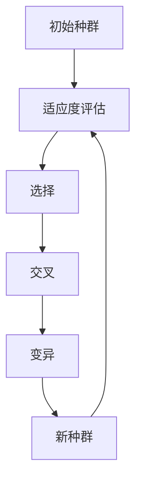
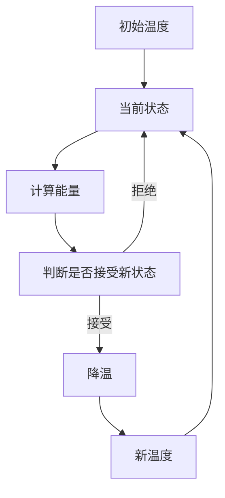
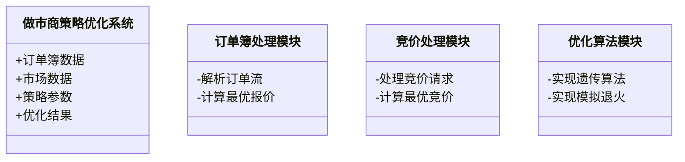
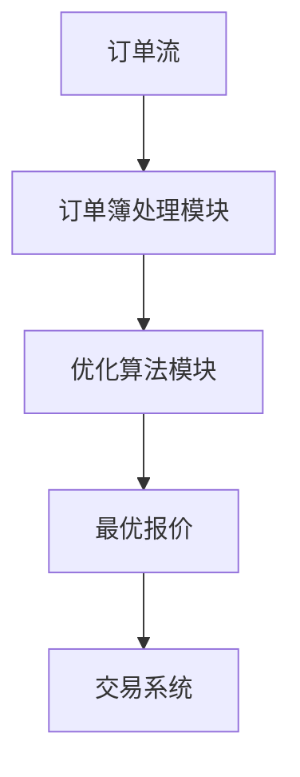
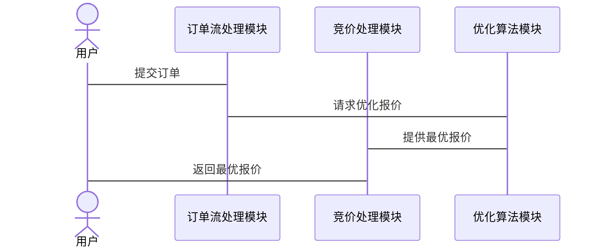

                 


# 《金融市场做市商策略优化》

> 关键词：金融市场，做市商，策略优化，算法交易，风险控制，订单簿模型

> 摘要：本文深入探讨了金融市场中做市商策略优化的核心概念、算法原理、系统架构以及实际应用。通过详细分析订单簿模型、竞价模型等核心概念，结合遗传算法、模拟退火等优化算法，系统地展示了如何构建高效的做市商策略优化模型。本文还提供了实际案例分析和代码实现，帮助读者全面理解和掌握做市商策略优化的方法和技巧。

---

## 第二部分: 做市商策略优化的核心概念与算法原理

# 第2章: 做市商策略优化的核心概念

## 2.1 策略优化的基本原则

### 2.1.1 做市商策略的核心目标

- **最优报价计算**：通过订单簿数据，确定最优买卖价差，最大化收益同时最小化市场风险。
- **风险控制机制**：在极端市场条件下，确保做市商的资本充足性和流动性。
- **市场微观结构分析**：理解订单簿的动态变化，捕捉市场机会。

### 2.1.2 策略优化的关键属性

- **实时性**：优化算法需要快速响应市场变化。
- **鲁棒性**：在复杂市场环境中保持稳定性。
- **可扩展性**：适用于不同市场和资产类别。

## 2.2 做市商策略优化的核心要素

### 2.2.1 订单簿模型

- **订单簿的构成**：包括买价、卖价、订单数量等关键要素。
- **订单流分析**：通过分析订单流的动态，预测市场趋势。
- **最优报价模型**：基于订单簿数据，计算最优买卖价差。

### 2.2.2 竞价模型

- **竞价机制**：包括拍卖、撮合交易等。
- **竞价策略**：在竞价阶段，确定最优报价和交易量。
- **竞价风险控制**：在竞价过程中，避免因价格波动带来的损失。

### 2.2.3 高频交易与统计套利

- **高频交易策略**：利用算法快速捕捉市场机会。
- **统计套利策略**：通过统计套利模型，寻找市场中的套利机会。
- **高频交易与套利的结合**：通过高频交易执行统计套利策略。

## 2.3 做市商策略优化的数学模型

### 2.3.1 基于订单簿的优化模型

$$ \text{最优价差} = \text{min} \left( \frac{\text{买价} + \text{卖价}}{2} \right) $$

### 2.3.2 基于竞价的优化模型

$$ \text{最优竞价} = \text{max} \left( \text{预测价格} - \text{交易成本} \right) $$

---

# 第3章: 做市商策略优化的算法原理

## 3.1 遗传算法

### 3.1.1 遗传算法的基本原理

- **编码**：将策略参数编码为基因序列。
- **选择**：基于适应度函数选择最优解。
- **交叉**：通过交叉操作生成新的基因组合。
- **变异**：随机改变基因序列，增加多样性。

### 3.1.2 遗传算法的优化流程



### 3.1.3 遗传算法的Python实现

```python
import random

def fitness(individual):
    # 计算个体的适应度
    return sum(individual)

def evolve_population(population, fitness_func):
    # 选择
    population_sorted = sorted(population, key=lambda x: fitness_func(x), reverse=True)
    elite = population_sorted[:int(len(population)*0.2)]
    non_elite = population_sorted[int(len(population)*0.2):]
    
    # 交叉
    new_population = []
    while len(new_population) < len(population):
        parent1 = random.choice(non_elite)
        parent2 = random.choice(non_elite)
        child = [p1 if i%2 ==0 else p2 for i, (p1, p2) in enumerate(zip(parent1, parent2))]
        new_population.append(child)
    
    # 变异
    for i in range(len(new_population)):
        if random.random() < 0.1:
            idx = random.randint(0, len(new_population[i])-1)
            new_population[i][idx] = 1 - new_population[i][idx]
    
    return new_population
```

## 3.2 模拟退火算法

### 3.2.1 模拟退火的基本原理

- **初始状态**：随机选择一个初始解。
- **降温过程**：逐步降低温度，减少随机游走的幅度。
- **状态转移**：通过概率接受更差的解，避免陷入局部最优。

### 3.2.2 模拟退火的优化流程



### 3.2.3 模拟退火的Python实现

```python
import random

def simulated_annealing(initial_state, cost_func, temp_func):
    current = initial_state
    current_cost = cost_func(current)
    while temp_func() > 0:
        neighbor = random_neighbor(current)
        neighbor_cost = cost_func(neighbor)
        if neighbor_cost < current_cost:
            current = neighbor
            current_cost = neighbor_cost
        elif random.random() < temp_func():
            current = neighbor
            current_cost = neighbor_cost
    return current
```

---

# 第4章: 做市商策略优化的数学模型与公式

## 4.1 基于订单簿的优化模型

### 4.1.1 订单簿模型的数学表达

$$ \text{最优买价} = \min(\text{买价列表}) $$

$$ \text{最优卖价} = \max(\text{卖价列表}) $$

### 4.1.2 做市商报价模型

$$ \text{报价} = \text{最优买价} + \text{买卖价差} $$

### 4.1.3 做市商收益模型

$$ \text{收益} = (\text{卖价} - \text{买价}) \times \text{交易量} $$

## 4.2 基于竞价的优化模型

### 4.2.1 竞价模型的数学表达

$$ \text{预测价格} = \text{历史价格} + \text{市场情绪} \times \text{波动率} $$

### 4.2.2 竞价策略的优化公式

$$ \text{最优竞价} = \text{预测价格} \pm \text{竞价价差} $$

## 4.3 做市商策略优化的风险控制模型

### 4.3.1 风险评估公式

$$ \text{风险值} = \sqrt{\text{收益方差}} $$

### 4.3.2 风险控制策略

$$ \text{安全边际} = \text{资本金} \times \text{风险承受能力} $$

---

# 第五部分: 做市商策略优化的系统分析与架构设计

## 第5章: 系统分析与架构设计

### 5.1 项目背景

- 做市商策略优化系统是为了在金融市场中提供高效的做市服务，确保市场流动性，同时实现做市商的收益最大化。

### 5.2 系统功能设计



### 5.3 系统架构设计



### 5.4 系统接口设计

- **输入接口**：接收订单流数据和市场数据。
- **输出接口**：输出最优报价和交易信号。
- **API接口**：提供给交易系统调用的API。

### 5.5 系统交互流程



---

# 第六部分: 做市商策略优化的项目实战

## 第6章: 项目实战

### 6.1 环境安装与配置

- **Python环境**：安装Python 3.x及以上版本。
- **依赖库安装**：安装numpy、pandas、scipy等库。

### 6.2 系统核心实现

```python
import numpy as np
import pandas as pd

def optimize_quotes(order_book, algorithm='遗传算法'):
    if algorithm == '遗传算法':
        # 实现遗传算法优化报价
        pass
    elif algorithm == '模拟退火':
        # 实现模拟退火优化报价
        pass
    return optimized_quotes
```

### 6.3 实际案例分析

- **案例1**：某股票的订单簿数据优化。
- **案例2**：某期货合约的竞价策略优化。

### 6.4 代码实现与分析

```python
import matplotlib.pyplot as plt

def plot_optimized_quotes(optimized_quotes):
    plt.plot(optimized_quotes['时间'], optimized_quotes['最优买价'], label='最优买价')
    plt.plot(optimized_quotes['时间'], optimized_quotes['最优卖价'], label='最优卖价')
    plt.xlabel('时间')
    plt.ylabel('价格')
    plt.legend()
    plt.show()
```

---

# 第七部分: 做市商策略优化的最佳实践与总结

## 第7章: 最佳实践与总结

### 7.1 小结

- 做市商策略优化是金融市场中重要的研究方向。
- 通过算法优化和系统设计，可以实现高效的做市服务。

### 7.2 注意事项

- 需要注意市场风险的控制。
- 算法需要实时性和鲁棒性。
- 系统设计需要考虑可扩展性。

### 7.3 拓展阅读

- 推荐阅读《金融市场中的算法交易》。
- 推荐学习相关数学模型和优化算法。

---

作者：AI天才研究院/AI Genius Institute & 禅与计算机程序设计艺术/Zen And The Art of Computer Programming

