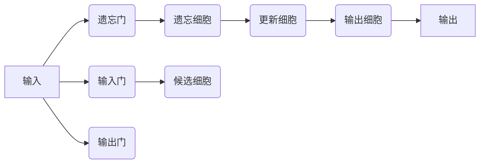

                 


# 金融市场分析的AI Agent决策支持

> 关键词：人工智能，金融分析，AI Agent，决策支持，金融市场

> 摘要：本文探讨了AI Agent在金融市场分析中的应用，从理论基础到实际案例，详细分析了AI技术如何助力金融决策支持。通过系统架构设计和项目实战，展示了AI Agent在金融市场中的潜力与优势。

---

# 第1章: 金融市场分析的背景与挑战

## 1.1 金融市场的基本概念

### 1.1.1 金融市场的定义与分类
金融市场是指资金的融通场所，可以分为货币市场、资本市场、外汇市场、衍生品市场等。每个市场都有其独特的运作机制和参与者。

### 1.1.2 金融市场的主要参与者
- **机构投资者**：如基金、保险公司等。
- **个人投资者**：如散户投资者。
- **经纪商**：提供交易服务的中介。
- **监管机构**：如证监会、银保监会等。

### 1.1.3 金融市场的功能与作用
金融市场是资金流动的枢纽，具有资源配置、价格发现和风险管理的功能。

## 1.2 金融数据分析的复杂性

### 1.2.1 数据的多样性与不完整性
金融市场数据包括价格、成交量、新闻、社交媒体等多种类型，且常常存在缺失或噪声。

### 1.2.2 市场波动的不确定性
金融市场的波动性高，受到多种因素影响，如经济政策、市场情绪等。

### 1.2.3 金融风险的复杂性
金融风险包括市场风险、信用风险、流动性风险等，且这些风险往往相互关联。

## 1.3 AI技术在金融领域的应用前景

### 1.3.1 AI在金融分析中的优势
- 数据处理能力强。
- 能够发现非线性关系。
- 可以实时分析市场动态。

### 1.3.2 AI在金融决策中的潜力
- 提高投资决策的准确性。
- 实现自动化交易。
- 优化风险管理策略。

### 1.3.3 当前AI在金融领域的应用现状
AI已经在金融数据挖掘、智能投顾、量化交易等领域取得了显著进展。

## 1.4 本章小结
金融市场分析的复杂性为AI技术的应用提供了广阔的空间，而AI技术的优势也为金融市场的分析与决策提供了新的可能性。

---

# 第2章: AI Agent的基本概念与核心原理

## 2.1 AI Agent的定义与分类

### 2.1.1 AI Agent的定义
AI Agent是一种智能体，能够感知环境、做出决策并采取行动，以实现特定目标。

### 2.1.2 AI Agent的分类
- **简单反射Agent**：基于当前感知直接行动。
- **基于模型的反射Agent**：利用内部模型进行决策。
- **目标驱动的Agent**：以目标为导向采取行动。
- **效用驱动的Agent**：通过最大化效用来做出决策。

### 2.1.3 AI Agent与传统算法的区别
AI Agent具有自主性、反应性、目标导向性和社会性，能够适应复杂环境并做出决策。

## 2.2 AI Agent的核心原理

### 2.2.1 感知机制
AI Agent通过传感器或数据源获取环境信息，如市场数据、用户输入等。

### 2.2.2 决策机制
AI Agent基于感知信息，利用算法或模型做出决策，如分类、回归或强化学习。

### 2.2.3 执行机制
AI Agent根据决策结果采取行动，如发出交易指令、生成报告等。

## 2.3 AI Agent在金融决策中的应用

### 2.3.1 金融数据的感知与处理
AI Agent能够实时感知市场数据，并通过数据清洗、特征提取等方法进行处理。

### 2.3.2 金融决策的模型构建
利用机器学习、强化学习等技术构建决策模型，如预测股票价格、优化投资组合。

### 2.3.3 决策结果的执行与反馈
AI Agent根据决策结果采取行动，并通过反馈机制不断优化决策模型。

## 2.4 本章小结
AI Agent的核心原理为金融市场分析提供了新的思路，其感知、决策和执行机制能够有效应对金融市场的复杂性。

---

# 第3章: 金融市场分析的数学模型与算法原理

## 3.1 金融时间序列分析的数学模型

### 3.1.1 时间序列的基本概念
时间序列是指按时间顺序排列的数据，常用于预测未来趋势。

### 3.1.2 ARIMA模型
ARIMA（自回归积分滑动平均）模型适用于线性时间序列预测。

公式：
$$ARIMA(p, d, q)$$

其中，$p$ 是自回归阶数，$d$ 是差分阶数，$q$ 是滑动平均阶数。

### 3.1.3 LSTM模型
LSTM（长短期记忆网络）适用于捕捉时间序列中的长期依赖关系。

图：LSTM结构



## 3.2 机器学习在金融中的应用

### 3.2.1 监督学习与非监督学习
- **监督学习**：如回归、分类。
- **非监督学习**：如聚类、降维。

### 3.2.2 分类与回归算法
- **分类**：如逻辑回归、支持向量机（SVM）。
- **回归**：如线性回归、随机森林。

### 3.2.3 聚类分析
聚类分析用于将相似的金融数据分成若干类别，如客户分群。

## 3.3 加强学习在金融决策中的应用

### 3.3.1 加强学习的基本原理
强化学习通过试错机制，学习最优策略以最大化累积奖励。

### 3.3.2 Q-Learning算法
Q-Learning通过更新Q值表，学习最优动作策略。

公式：
$$Q(s, a) = Q(s, a) + \alpha [r + \gamma \max Q(s', a') - Q(s, a)]$$

### 3.3.3 Deep Q-Networks (DQN)
DQN结合深度神经网络和强化学习，用于复杂环境下的决策。

## 3.4 本章小结
金融时间序列分析和机器学习算法为AI Agent提供了丰富的工具箱，强化学习在金融决策中具有独特优势。

---

# 第4章: AI Agent决策支持的系统架构与设计

## 4.1 系统架构设计

### 4.1.1 分层架构
系统分为数据层、算法层、应用层，每一层负责不同的功能。

### 4.1.2 微服务架构
系统模块化设计，每个服务独立运行，便于扩展和维护。

### 4.1.3 混合架构
结合分层架构和微服务架构，兼顾灵活性和可扩展性。

## 4.2 系统功能设计

### 4.2.1 数据采集模块
负责从多种数据源采集金融数据，如API接口、数据库等。

### 4.2.2 数据处理模块
对采集到的数据进行清洗、特征提取和数据转换。

### 4.2.3 模型训练模块
利用机器学习、深度学习等技术训练AI Agent的决策模型。

### 4.2.4 决策支持模块
根据训练好的模型生成决策建议或自动化交易指令。

## 4.3 系统接口设计

### 4.3.1 数据接口
定义数据格式和通信协议，确保数据的准确传输。

### 4.3.2 模型接口
定义模型输入输出接口，方便不同模块之间的调用。

### 4.3.3 用户接口
提供友好的用户界面，方便用户与AI Agent进行交互。

## 4.4 系统交互流程

### 4.4.1 数据采集与预处理
- 数据采集：从股票交易所API获取实时数据。
- 数据清洗：处理缺失值、异常值。
- 特征提取：提取技术指标、市场情绪等特征。

### 4.4.2 模型训练与优化
- 模型选择：根据任务选择合适的算法。
- 参数调优：通过交叉验证优化模型参数。
- 模型评估：使用回测、风险指标等方法评估模型性能。

### 4.4.3 决策支持与反馈
- 决策生成：基于模型预测生成交易信号。
- 决策执行：通过交易系统执行交易指令。
- 反馈优化：根据市场反馈优化模型。

## 4.5 本章小结
系统的架构设计和功能模块为AI Agent的实现提供了理论基础，系统的交互流程确保了从数据到决策的高效执行。

---

# 第5章: 项目实战——基于AI Agent的智能投顾系统

## 5.1 项目背景
智能投顾是一种利用AI技术为投资者提供个性化的投资建议的服务。

## 5.2 项目目标
构建一个基于AI Agent的智能投顾系统，实现客户画像、资产配置、风险评估等功能。

## 5.3 项目实现

### 5.3.1 环境安装
安装必要的Python库，如Pandas、NumPy、Scikit-learn、TensorFlow等。

```bash
pip install pandas numpy scikit-learn tensorflow
```

### 5.3.2 数据加载与预处理
加载股票数据并进行特征工程。

```python
import pandas as pd
import numpy as np

# 加载数据
data = pd.read_csv('stock_data.csv')

# 数据预处理
data['return'] = data['close'].pct_change()
data['moving_avg'] = data['close'].rolling(10).mean()
```

### 5.3.3 模型训练
使用随机森林模型进行资产配置。

```python
from sklearn.ensemble import RandomForestRegressor
from sklearn.model_selection import train_test_split

# 数据分割
X = data[['return', 'moving_avg']]
y = data['volume']

X_train, X_test, y_train, y_test = train_test_split(X, y, test_size=0.2)

# 模型训练
model = RandomForestRegressor()
model.fit(X_train, y_train)

# 模型预测
y_pred = model.predict(X_test)
```

### 5.3.4 决策支持
根据模型预测生成投资建议。

```python
# 根据模型预测生成交易信号
signal = model.predict([[0.02, 75.3]])  # 示例输入
```

### 5.3.5 结果分析
分析模型的准确性和稳定性，优化参数。

## 5.4 项目小结
通过项目实战，展示了AI Agent在智能投顾中的应用，验证了系统的可行性和有效性。

---

# 作者：AI天才研究院（AI Genius Institute） & 禅与计算机程序设计艺术（Zen And The Art of Computer Programming）

---

这篇文章系统地介绍了AI Agent在金融市场分析中的应用，从理论基础到实际案例，详细分析了AI技术如何助力金融决策支持。通过项目实战，展示了AI Agent在智能投顾中的具体实现，为读者提供了深入的理解和实践指导。

