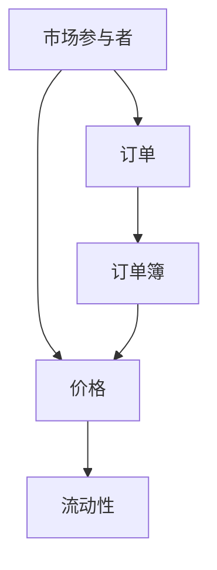
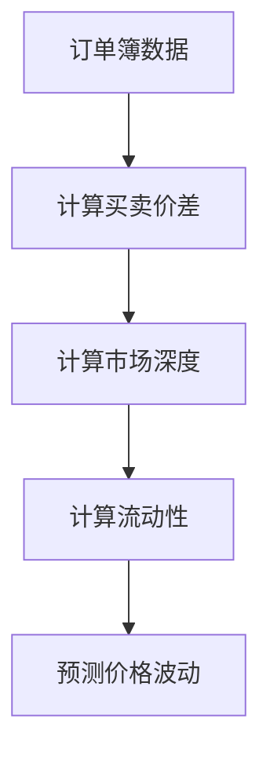
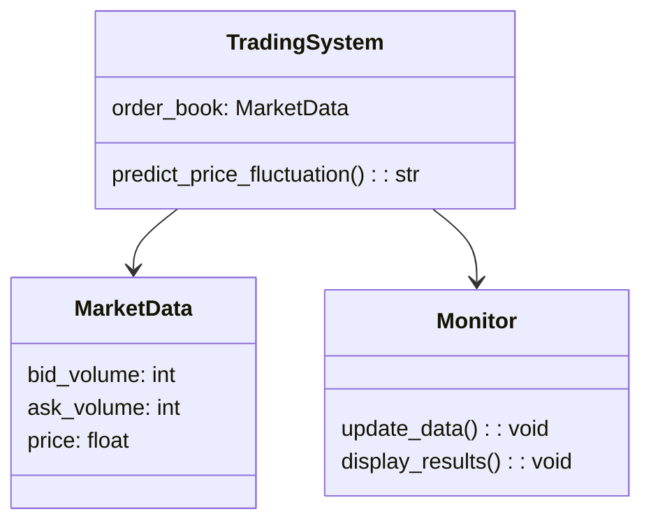
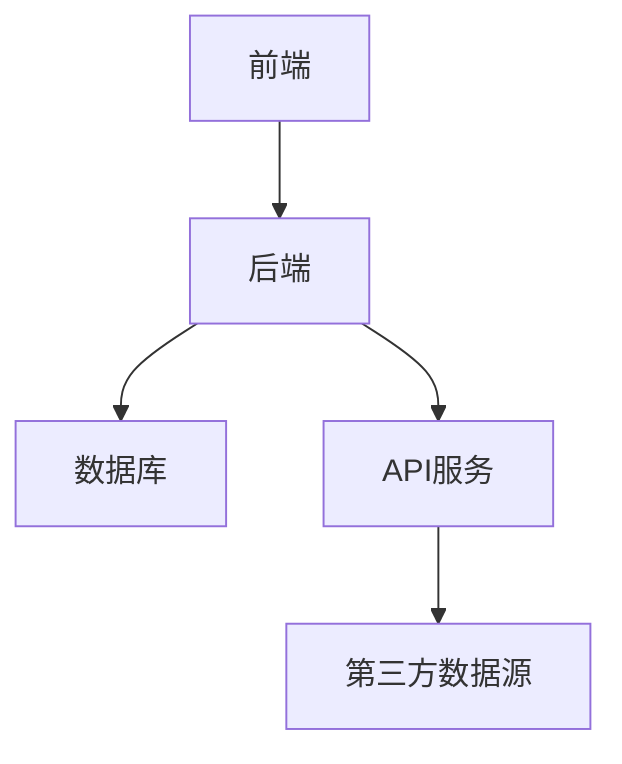

                 


# 金融市场微观结构变化对价格影响分析

> 关键词：金融市场，微观结构，价格影响，订单簿，流动性，高频交易，信息不对称

> 摘要：本文通过分析金融市场微观结构的变化对资产价格的影响，探讨订单簿、市场深度、流动性等核心要素在价格形成中的作用。结合统计套利、高频交易等算法，揭示微观结构变化对价格波动的路径与机制。本文旨在为金融市场研究者和从业者提供理论支持与实践指导。

---

# 第一部分：金融市场微观结构变化对价格影响分析

## 第1章：金融市场概述

### 1.1 金融市场基本概念

#### 1.1.1 金融市场的定义与分类
- 金融市场是资金供需双方进行交易的场所，包括股票市场、债券市场、外汇市场等。
- 分类：按交易对象分为货币市场和资本市场；按交易方式分为一级市场和二级市场。

#### 1.1.2 金融市场的参与者与功能
- 参与者：投资者、金融机构、上市公司、监管机构。
- 功能：资金配置、价格发现、风险管理。

#### 1.1.3 金融市场与价格的关系
- 价格是市场供需关系的体现，反映了市场的信息和预期。

### 1.2 微观结构分析的背景

#### 1.2.1 微观结构的定义与特点
- 微观结构：市场中交易活动的具体表现形式，包括订单、交易行为、市场参与者等。
- 特点：实时性、动态性、复杂性。

#### 1.2.2 微观结构分析的重要性
- 揭示价格波动的根源，帮助投资者制定策略。

#### 1.2.3 价格形成机制的复杂性
- 多因素影响：供需、信息、交易成本等。

### 1.3 本章小结
- 金融市场是一个复杂的系统，微观结构分析是理解价格波动的关键。

---

## 第2章：金融市场微观结构的核心概念

### 2.1 订单簿与市场深度

#### 2.1.1 订单簿的基本结构
- 买方订单（BID）：买入价格和数量。
- 卖方订单（ASK）：卖出价格和数量。

#### 2.1.2 市场深度的定义与作用
- 市场深度：在特定价格水平上的订单总量。
- 作用：衡量市场的流动性。

#### 2.1.3 订单簿与价格波动的关系
- 厚订单簿：价格稳定；薄订单簿：价格波动大。

### 2.2 市场流动性与价格影响

#### 2.2.1 流动性的定义与测量
- 流动性：资产快速变现而不影响价格的能力。
- 测量：买卖价差、成交量、市场深度。

#### 2.2.2 流动性与价格波动的关系
- 高流动性：价格波动小；低流动性：价格波动大。

#### 2.2.3 市场深度与流动性的相互作用
- 市场深度越大，流动性越高。

### 2.3 市场参与者行为分析

#### 2.3.1 市场参与者的类型
- 投机者：追求价格波动。
- 投资者：追求长期收益。
- 做市商：提供流动性。

#### 2.3.2 不同参与者的行为特征
- 投机者：高频交易，套利。
- 投资者：长期持有，价值投资。
- 做市商：维持市场深度。

#### 2.3.3 行为对价格的影响
- 投机者：加剧波动；投资者：稳定价格；做市商：提供流动性。

### 2.4 核心概念关系图

#### 2.4.1 核心概念属性特征对比表

| 概念   | 定义                          | 影响价格的方式           |
|--------|-------------------------------|--------------------------|
| 订单簿  | 记录买方和卖方订单的结构       | 影响买卖价差和市场深度     |
| 市场深度 | 特定价格水平上的订单总量     | 影响流动性               |
| 流动性  | 资产快速变现的能力           | 影响价格波动             |

#### 2.4.2 ER实体关系图（Mermaid流程图）



---

## 第3章：价格形成机制与微观结构变化

### 3.1 价格形成的多因素模型

#### 3.1.1 市场供需模型
- 价格由供需平衡决定。
- 需求增加：价格上涨；供给增加：价格下降。

#### 3.1.2 交易成本与价格的关系
- 交易成本：影响价格的买卖价差。
- 成本增加：价差扩大。

#### 3.1.3 市场结构对价格的影响
- 竞争市场：价格反映真实价值。
- 垄断市场：价格由垄断者控制。

### 3.2 微观结构变化对价格的影响路径

#### 3.2.1 信息不对称与价格波动
- 信息不对称：部分参与者掌握更多信息。
- 影响：价格波动加剧。

#### 3.2.2 市场深度变化与价格波动
- 市场深度增加：价格波动减小。
- 市场深度减少：价格波动加剧。

#### 3.2.3 市场流动性变化与价格波动
- 流动性增加：价格波动减小。
- 流动性减少：价格波动加剧。

### 3.3 数学模型与公式

#### 3.3.1 价格波动的统计模型
$$ P_{t} = \alpha + \beta P_{t-1} + \epsilon_{t} $$
其中，$\epsilon_{t}$为随机误差项。

#### 3.3.2 微观结构变化的数学表达
$$ \Delta P = f(\text{市场深度}, \text{流动性}, \text{信息不对称}) $$

#### 3.3.3 示例分析与解释
- 假设市场深度增加，流动性提高，信息不对称减少，价格波动会减小。

---

## 第4章：金融市场微观结构的算法

### 4.1 统计套利与高频交易

#### 4.1.1 统计套利的定义与原理
- 统计套利：利用资产价格的统计规律进行套利。
- 原理：寻找资产价格的协整关系。

#### 4.1.2 高频交易的定义与策略
- 高频交易：利用高速交易系统在短时间内进行大量交易。
- 策略：套利、统计套利、算法交易。

### 4.2 算法原理与实现

#### 4.2.1 算法流程图（Mermaid）



#### 4.2.2 算法实现代码示例

```python
import pandas as pd
import numpy as np

def calculate_market_depth(order_book):
    bid_volume = order_book['BID'].sum()
    ask_volume = order_book['ASK'].sum()
    return bid_volume, ask_volume

def predict_price_fluctuation(bid_volume, ask_volume, liquidity):
    market_depth_ratio = bid_volume / ask_volume
    if market_depth_ratio > 1.5:
        return "价格下跌"
    elif market_depth_ratio < 0.5:
        return "价格上涨"
    else:
        return "价格稳定"

# 示例数据
order_book = pd.DataFrame({
    'BID': [100, 200, 300],
    'ASK': [90, 180, 270]
})

bid_volume, ask_volume = calculate_market_depth(order_book)
liquidity = bid_volume + ask_volume
result = predict_price_fluctuation(bid_volume, ask_volume, liquidity)
print(result)
```

---

## 第5章：系统分析与架构设计

### 5.1 问题场景介绍

#### 5.1.1 问题背景
- 分析金融市场微观结构变化对价格的影响，需要实时监控市场数据。

#### 5.1.2 项目介绍
- 开发一个实时监控系统，分析订单流和价格变化。

### 5.2 系统功能设计

#### 5.2.1 领域模型（Mermaid类图）



#### 5.2.2 系统架构设计（Mermaid架构图）



---

## 第6章：项目实战

### 6.1 环境安装

#### 6.1.1 安装依赖
- Python：3.8+
- Pandas、NumPy、Matplotlib

### 6.2 核心实现源代码

#### 6.2.1 订单簿处理代码

```python
import pandas as pd

def process_order_book(order_book):
    bid_volume = order_book['BID'].sum()
    ask_volume = order_book['ASK'].sum()
    return bid_volume, ask_volume

# 示例数据
order_book = pd.DataFrame({
    'BID': [100, 200, 300],
    'ASK': [90, 180, 270]
})

bid_vol, ask_vol = process_order_book(order_book)
print(f"BID Volume: {bid_vol}, ASK Volume: {ask_vol}")
```

#### 6.2.2 价格预测代码

```python
import numpy as np

def predict_price(bid_vol, ask_vol):
    ratio = bid_vol / ask_vol
    if ratio > 1.5:
        return "价格下跌"
    elif ratio < 0.5:
        return "价格上涨"
    else:
        return "价格稳定"

result = predict_price(bid_vol, ask_vol)
print(f"预测结果: {result}")
```

### 6.3 案例分析与解读

#### 6.3.1 数据分析
- 数据来源：某股票的订单簿数据。
- 数据处理：计算买卖成交量、市场深度、流动性。

#### 6.3.2 结果分析
- 市场深度增加，流动性提高，预测价格稳定。

### 6.4 项目小结
- 实现了一个实时监控系统，能够分析订单流和价格变化，为投资决策提供支持。

---

## 第7章：总结与展望

### 7.1 本章总结
- 本文分析了金融市场微观结构的变化对价格的影响，探讨了订单簿、市场深度、流动性等核心要素的作用。
- 结合统计套利和高频交易等算法，揭示了微观结构变化对价格波动的路径与机制。

### 7.2 研究的局限性
- 数据获取困难：实时订单簿数据难以获取。
- 模型简化：忽略了某些复杂因素。

### 7.3 未来研究方向
- 引入机器学习模型：提高预测准确性。
- 结合大数据技术：分析更多市场参与者行为。

---

作者：AI天才研究院/AI Genius Institute & 禅与计算机程序设计艺术 /Zen And The Art of Computer Programming

---

感谢您的阅读！如需进一步讨论或合作，请随时联系。

