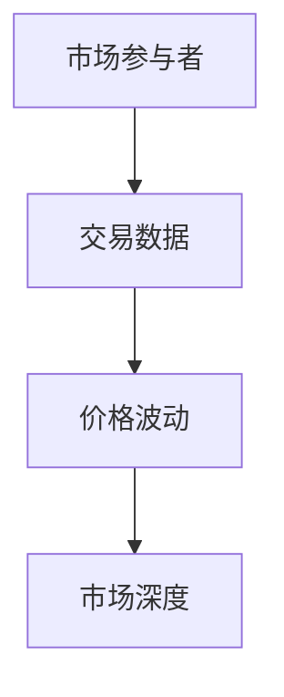
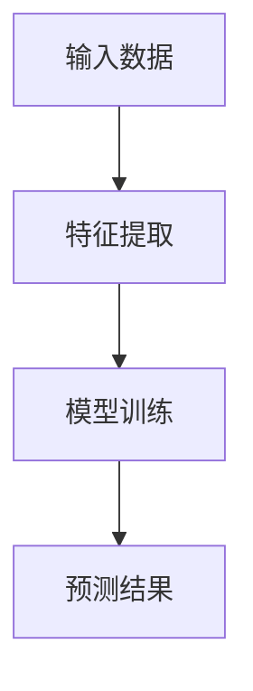
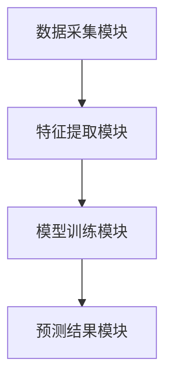
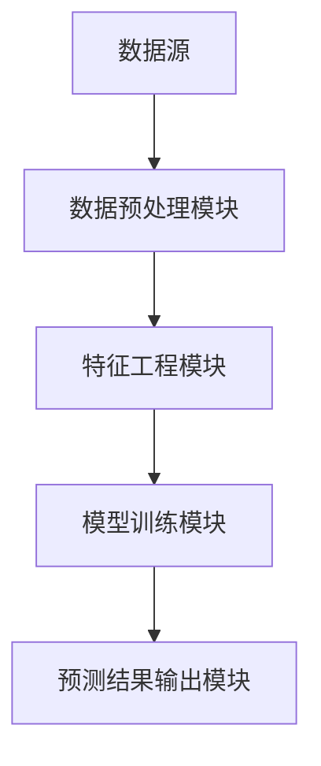
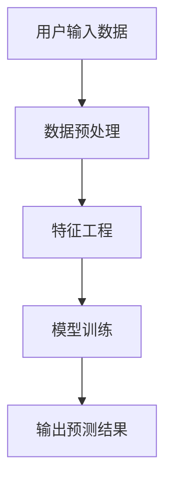

                 


# 金融市场微观结构变化预测模型

## 关键词：
- 金融市场、微观结构、变化预测、算法模型、数据驱动

## 摘要：
本文系统地探讨了金融市场微观结构变化的预测方法，结合时间序列分析和机器学习模型，通过实际案例分析和系统架构设计，为读者提供深入的理论指导和实践参考。

---

# 第一部分：金融市场微观结构概述

## 第1章：金融市场微观结构的定义与特征

### 1.1 金融市场微观结构的定义
- **1.1.1 市场参与者的角色**
  - 机构投资者、散户、做市商等市场参与者的定义与作用。
- **1.1.2 交易数据的特征**
  - 买卖价差、订单簿深度、成交量等关键指标的解释。
- **1.1.3 微观结构的核心要素**
  - 流动性、波动性、市场深度的定义与度量方法。

### 1.2 微观结构变化的意义
- **1.2.1 市场参与者行为分析**
  - 不同参与者的行为模式对市场的影响。
- **1.2.2 市场波动预测的实用性**
  - 如何通过预测微观结构变化优化投资策略。
- **1.2.3 对投资策略优化的作用**
  - 微观结构预测在量化投资中的应用。

## 第2章：金融市场微观结构的核心概念与联系

### 2.1 核心概念的对比分析
- **2.1.1 市场参与者的策略调整**
  - 短线交易、长期投资等策略对市场的影响。
- **2.1.2 信息传播的影响**
  - 新闻事件、市场谣言对价格波动的作用。
- **2.1.3 市场环境的变化**
  - 宏观经济指标、政策变化对微观结构的影响。

### 2.2 核心概念的联系
- **2.2.1 ER实体关系图架构**
  - 用mermaid图展示市场参与者、交易数据、价格波动之间的关系。



---

# 第二部分：市场微观结构变化预测的算法原理

## 第3章：时间序列分析方法

### 3.1 ARIMA模型的原理
- **3.1.1 ARIMA模型的结构**
  - 自回归（AR）、差分（I）、移动平均（MA）的定义与作用。
- **3.1.2 ARIMA模型的数学公式**
  $$ ARIMA(p, d, q) $$
  $$ y_t = \phi_1 y_{t-1} + \dots + \phi_p y_{t-p} + \theta_1 \epsilon_{t-1} + \dots + \theta_q \epsilon_{t-q} + \epsilon_t $$
- **3.1.3 ARIMA模型的实现步骤**
  - 数据预处理、模型参数选择、模型训练与验证。

### 3.2 GARCH模型的应用
- **3.2.1 GARCH模型的原理**
  - 广义自回归条件异方差模型的定义与作用。
- **3.2.2 GARCH模型的数学公式**
  $$ GARCH(p, q) $$
  $$ \sigma_t^2 = \alpha_0 + \alpha_1 r_{t-1}^2 + \dots + \alpha_q r_{t-q}^2 $$
- **3.2.3 GARCH模型的优缺点**
  - 优点：适合处理金融数据的波动性；缺点：参数过多，易过拟合。

## 第4章：机器学习方法

### 4.1 支持向量机（SVM）的应用
- **4.1.1 SVM的基本原理**
  - 支持向量机的分类与回归功能。
- **4.1.2 SVM的数学模型**
  $$ \text{目标函数} = \min_{w,b,\xi} \frac{1}{2}||w||^2 + C\sum_{i=1}^n \xi_i $$
  $$ \text{约束条件} = y_i(w \cdot x_i + b) - \xi_i \geq 0, \xi_i \geq 0 $$
- **4.1.3 SVM的优缺点**
  - 优点：适合小样本数据；缺点：难以处理高维数据。

### 4.2 随机森林（Random Forest）的原理
- **4.2.1 随机森林的基本原理**
  - 集成学习、袋装法、特征随机性的概念。
- **4.2.2 随机森林的数学模型**
  - 每棵树的决策规则及其组合方式。
- **4.2.3 随机森林的优缺点**
  - 优点：抗噪声能力强；缺点：解释性较差。

### 4.3 神经网络模型（如LSTM）的实现
- **4.3.1 LSTM的结构**
  - 长短期记忆网络的门控机制。
- **4.3.2 LSTM的数学模型**
  $$ \text{输入门} = \sigma(W_i x + U_i h + b_i) $$
  $$ \text{遗忘门} = \sigma(W_f x + U_f h + b_f) $$
  $$ \text{输出门} = \sigma(W_o x + U_o h + b_o) $$
- **4.3.3 LSTM的优缺点**
  - 优点：适合处理时间序列数据；缺点：训练时间较长。



---

# 第三部分：系统分析与架构设计

## 第5章：系统功能设计

### 5.1 领域模型类图
- **5.1.1 领域模型类图**
  - 用mermaid图展示系统中的各个模块及其关系。



### 5.2 系统架构设计
- **5.2.1 系统架构图**
  - 用mermaid图展示系统的整体架构。



### 5.3 接口设计与交互
- **5.3.1 接口设计**
  - 数据输入接口、模型训练接口、结果输出接口的设计。
- **5.3.2 交互流程**
  - 用mermaid图展示系统交互流程。



---

# 第四部分：项目实战

## 第6章：环境安装与代码实现

### 6.1 环境安装
- **6.1.1 安装Python环境**
  - 使用Anaconda或virtualenv创建虚拟环境。
- **6.1.2 安装必要的库**
  - 如pandas、numpy、scikit-learn、keras等。

### 6.2 核心代码实现
- **6.2.1 数据预处理代码**
  ```python
  import pandas as pd
  import numpy as np

  # 读取数据
  df = pd.read_csv('market_data.csv')
  # 数据清洗
  df.dropna(inplace=True)
  ```

- **6.2.2 特征工程代码**
  ```python
  from sklearn.preprocessing import StandardScaler

  scaler = StandardScaler()
  features = df[['volume', 'price_diff']]
  features_scaled = scaler.fit_transform(features)
  ```

- **6.2.3 模型训练代码**
  ```python
  from sklearn.ensemble import RandomForestRegressor

  model = RandomForestRegressor(n_estimators=100, random_state=42)
  model.fit(features_scaled, df['target'])
  ```

### 6.3 实际案例分析
- **6.3.1 数据来源**
  - 使用真实金融数据集进行分析。
- **6.3.2 模型评估**
  - 使用均方误差（MSE）和R平方值评估模型性能。
- **6.3.3 结果解读**
  - 分析模型预测结果与实际值的差异，总结可能的原因。

---

# 第五部分：最佳实践与总结

## 第7章：最佳实践

### 7.1 小结
- **7.1.1 本书的主要内容**
  - 从理论到实践，系统地讲解了金融市场微观结构变化的预测方法。
- **7.1.2 知识点回顾**
  - 时间序列分析、机器学习模型、系统架构设计等核心内容。

### 7.2 注意事项
- **7.2.1 数据质量的重要性**
  - 数据清洗、特征工程对模型性能的影响。
- **7.2.2 模型选择的策略**
  - 根据数据特征选择合适的模型。
- **7.2.3 模型的可解释性**
  - 在金融领域，模型的可解释性至关重要。

### 7.3 拓展阅读
- **7.3.1 推荐书籍**
  - 《金融市场的数据分析与建模》、《机器学习在金融中的应用》。
- **7.3.2 在线资源**
  - Kaggle上的金融数据分析项目、GitHub上的相关开源代码。

---

# 作者：AI天才研究院/AI Genius Institute & 禅与计算机程序设计艺术 /Zen And The Art of Computer Programming

