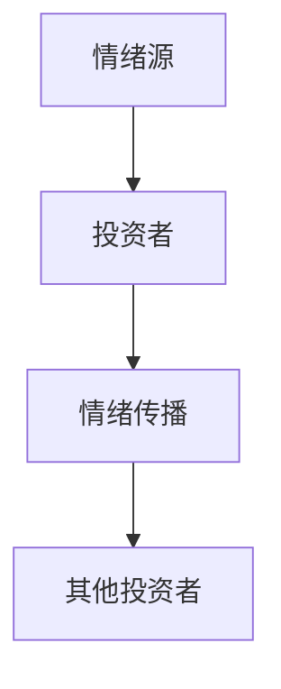
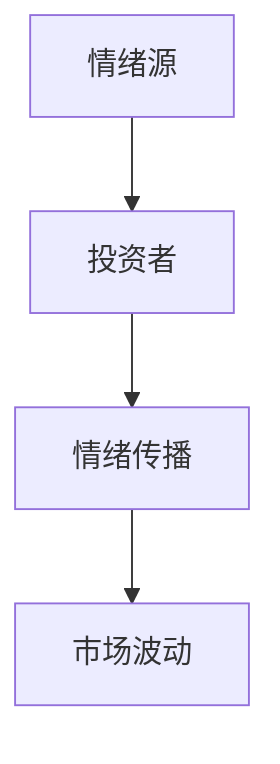
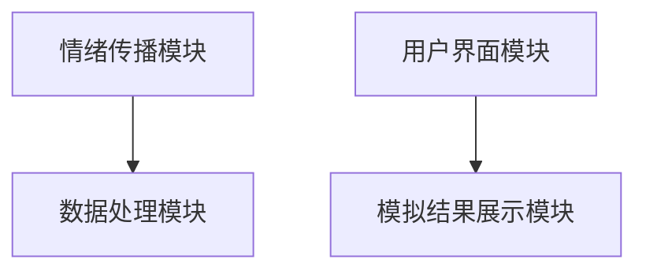

                 


# 金融市场情绪传染效应模拟系统

> **关键词**：金融市场、情绪传染效应、模拟系统、行为金融学、系统架构、算法实现  
> 
> **摘要**：金融市场中的情绪传染效应是一种复杂的社会现象，其本质是投资者之间的情绪相互影响并最终传递到市场行为的过程。本文旨在通过系统化的建模与模拟，深入分析情绪传染效应的传播机制，并结合实际金融市场数据，构建一个能够模拟情绪传染效应的系统。本文将从理论基础、模型构建、算法实现、系统设计等方面展开，结合实际案例，详细阐述情绪传染效应模拟系统的构建过程。

---

# 第一部分: 金融市场情绪传染效应概述

## 第1章: 金融市场情绪传染效应的定义与背景

### 1.1 情绪传染效应的定义

#### 1.1.1 情绪传染效应的定义
情绪传染效应是指投资者在金融市场中通过信息交流和互动，将情绪状态传递给其他投资者的现象。这种情绪的传播会直接影响投资者的决策行为，从而进一步影响金融市场的波动。

#### 1.1.2 情绪传染效应的核心要素
- **情绪源**：情绪的起点，可能是市场新闻、政策变化或个别投资者的行为。
- **情绪传播路径**：情绪从一个投资者传递到另一个投资者的过程，可能通过社交媒体、市场传闻或直接交流实现。
- **情绪接收者**：接收情绪的投资者，其行为会受到情绪源的影响。

#### 1.1.3 情绪传染效应的边界与外延
- **边界**：情绪传染效应仅在投资者之间发生，且需要一定的信息传播渠道。
- **外延**：情绪传染效应不仅影响个体投资者，还可能通过连锁反应影响整个金融市场。

### 1.2 金融市场中的情绪传染效应

#### 1.2.1 金融市场的基本概念
- **金融市场**：指资金、证券等金融资产交易的场所，包括股票市场、债券市场、外汇市场等。
- **投资者行为**：投资者在金融市场中的决策行为，包括买卖决策、资产配置等。

#### 1.2.2 情绪传染效应在金融市场的表现形式
- **个体层面**：投资者受到情绪影响，做出非理性决策。
- **群体层面**：情绪在投资者群体中传播，形成市场恐慌或乐观情绪。
- **市场层面**：情绪传染效应导致市场波动加剧。

#### 1.2.3 情绪传染效应的传播路径
- **直接传播**：投资者之间直接交流，情绪直接传递。
- **间接传播**：通过媒体、社交媒体等间接渠道传播情绪。

### 1.3 情绪传染效应的研究意义

#### 1.3.1 研究情绪传染效应的重要性
- **理解市场波动**：情绪传染效应是金融市场波动的重要原因之一。
- **制定投资策略**：通过预测情绪传染效应，投资者可以制定更科学的投资策略。
- **风险管理**：情绪传染效应可能导致市场崩盘，因此研究其规律有助于风险管理。

#### 1.3.2 情绪传染效应对金融市场的实际影响
- **市场波动加剧**：情绪传染效应会放大市场的波动性。
- **羊群效应**：投资者盲目跟随市场情绪，可能导致非理性决策。

#### 1.3.3 情绪传染效应的理论价值
- **行为金融学**：情绪传染效应是行为金融学的重要研究内容。
- **复杂系统理论**：情绪传染效应反映了复杂系统的非线性特征。

---

## 第2章: 情绪传染效应的核心概念与联系

### 2.1 情绪传染效应的核心概念

#### 2.1.1 情绪传染效应的定义与属性
- **定义**：情绪传染效应是投资者之间情绪相互影响的过程。
- **属性**：情绪传染效应具有传染性、扩散性和非线性特征。

#### 2.1.2 情绪传染效应的关键特征对比
| 特征 | 描述 |
|------|------|
| 传染性 | 情绪可以被传播 |
| 扩散性 | 情绪可以在投资者群体中扩散 |
| 非线性 | 情绪传染效应与市场行为之间的关系是非线性的 |

#### 2.1.3 情绪传染效应的核心要素组成
- **情绪源**：情绪传播的起点。
- **传播路径**：情绪从情绪源传递到其他投资者的过程。
- **情绪接收者**：接收情绪的投资者。

### 2.2 情绪传染效应的ER实体关系图



### 2.3 情绪传染效应的系统架构



---

## 第3章: 情绪传染效应的理论基础

### 3.1 情绪传染效应的理论模型

#### 3.1.1 情绪传染效应的系统动力学模型
- **基本思想**：情绪在投资者群体中传播，形成复杂的动态系统。
- **数学模型**：
$$ S(t) = S(t-1) + \alpha \cdot S(t-1) \cdot (1 - S(t-1)) $$
其中，$S(t)$ 表示第 $t$ 时刻的情绪强度，$\alpha$ 是情绪传播系数。

#### 3.1.2 情绪传染效应的社会网络模型
- **基本思想**：情绪通过社会网络传播，网络结构影响情绪传播速度和范围。
- **数学模型**：
$$ I(t) = I(t-1) + \beta \cdot (N - I(t-1)) \cdot I(t-1) $$
其中，$I(t)$ 表示第 $t$ 时刻被感染的投资者数量，$\beta$ 是感染概率，$N$ 是投资者总数。

#### 3.1.3 情绪传染效应的博弈论模型
- **基本思想**：投资者在情绪传播过程中进行博弈，情绪传播结果取决于投资者的策略选择。
- **数学模型**：
$$ U(i) = \sum_{j \in N(i)} \omega_{ij} \cdot S(j) $$
其中，$U(i)$ 表示投资者 $i$ 的效用，$N(i)$ 是投资者 $i$ 的邻居集合，$\omega_{ij}$ 是投资者 $i$ 和 $j$ 之间的权重，$S(j)$ 是投资者 $j$ 的情绪强度。

---

### 3.2 情绪传染效应的数学模型

#### 3.2.1 情绪传染效应的基本方程
$$ S(t) = S(t-1) + \alpha \cdot S(t-1) \cdot (1 - S(t-1)) $$
其中，$S(t)$ 表示第 $t$ 时刻的情绪强度，$\alpha$ 是情绪传播系数。

---

# 第四部分: 算法实现

## 第4章: 情绪传染效应模拟系统的算法实现

### 4.1 数据采集与特征提取

#### 4.1.1 数据来源
- **股票价格数据**：来源于股票交易所的公开数据。
- **投资者情绪数据**：来源于社交媒体、新闻媒体等。

#### 4.1.2 特征提取
- **情绪强度**：通过文本分析技术提取投资者情绪强度。
- **情绪传播路径**：通过社交网络分析技术提取情绪传播路径。

### 4.2 算法选择与实现

#### 4.2.1 情绪传播算法
- **基本思想**：通过网络模型模拟情绪传播过程。
- **实现步骤**：
  1. 构建投资者社会网络。
  2. 初始化情绪源。
  3. 模拟情绪传播过程。
  4. 记录每一步的情绪传播结果。

#### 4.2.2 算法实现代码
```python
import networkx as nx
import numpy as np

def simulate_emotion_spread(network, initial_infected, max_steps=100):
    infected = initial_infected.copy()
    for t in range(max_steps):
        new_infected = []
        for node in network.nodes():
            if node not in infected and node in infected:
                neighbors = network.neighbors(node)
                for neighbor in neighbors:
                    if neighbor not in infected:
                        new_infected.append(neighbor)
        infected.update(new_infected)
    return infected
```

---

## 第5章: 情绪传染效应模拟系统的系统设计

### 5.1 系统架构设计



### 5.2 系统功能设计

#### 5.2.1 系统功能模块
- **数据输入模块**：输入投资者社会网络数据和情绪初始状态。
- **模拟模块**：模拟情绪传播过程。
- **结果输出模块**：输出模拟结果。

---

## 第6章: 情绪传染效应模拟系统的项目实战

### 6.1 项目环境搭建

#### 6.1.1 环境要求
- **操作系统**：Windows/Mac/Linux。
- **编程语言**：Python 3.8+。
- **依赖库**：networkx, numpy, matplotlib。

### 6.2 项目核心实现

#### 6.2.1 核心代码实现
```python
import networkx as nx
import matplotlib.pyplot as plt

def plot_network(network, infected):
    nx.draw(network, node_color=['red' if node in infected else 'blue' for node in network.nodes()], 
            edge_color='gray', with_labels=True)
    plt.show()
```

#### 6.2.2 代码解读
- **功能**：绘制投资者社会网络，并用不同颜色标记情绪传播情况。
- **输入**：社会网络图和感染节点集合。
- **输出**：可视化结果图。

---

## 第7章: 总结与展望

### 7.1 总结

#### 7.1.1 核心内容回顾
- 情绪传染效应的定义与背景。
- 情绪传染效应的理论基础。
- 情绪传染效应的模拟系统实现。

#### 7.1.2 研究成果
- 构建了一个能够模拟情绪传染效应的系统。
- 提出了情绪传染效应的数学模型和算法实现。

### 7.2 展望

#### 7.2.1 研究展望
- **模型优化**：进一步优化情绪传播模型，提高模拟精度。
- **实际应用**：将情绪传染效应模拟系统应用于实际金融市场分析。

#### 7.2.2 技术发展
- **大数据分析**：结合大数据技术，提高情绪传染效应的预测能力。
- **人工智能**：引入机器学习算法，进一步提高情绪预测的准确性。

---

**作者**：AI天才研究院/AI Genius Institute & 禅与计算机程序设计艺术/Zen And The Art of Computer Programming

