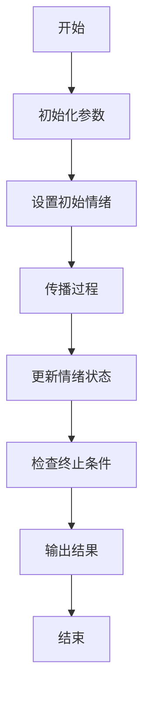
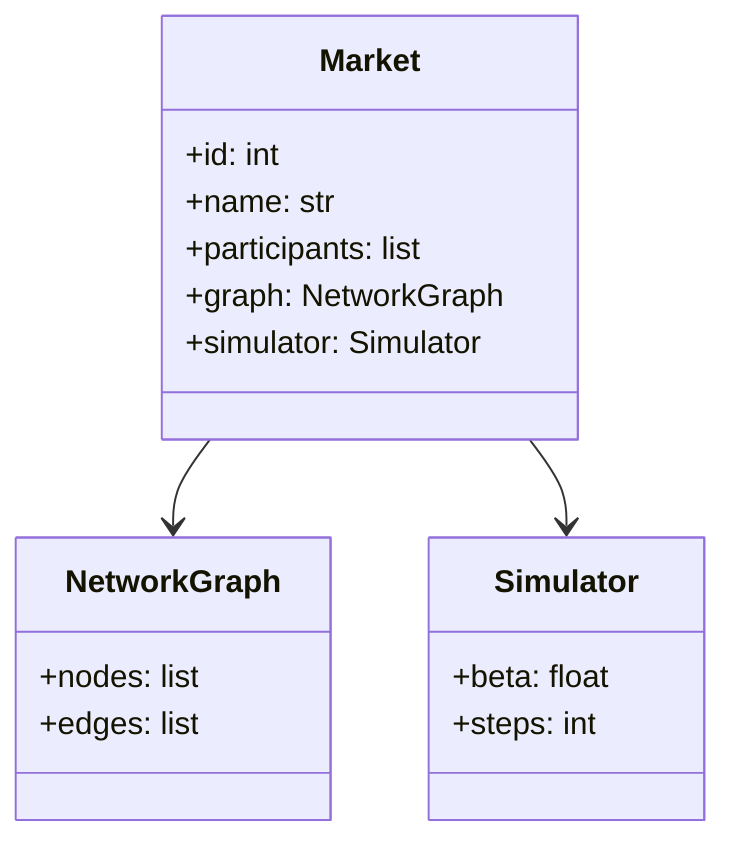
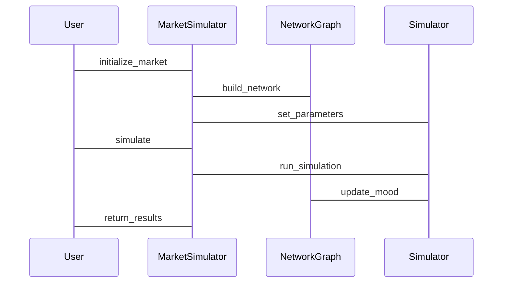

                 


# 金融市场情绪传染模型仿真平台

> 关键词：金融市场情绪传染，仿真平台，情绪传播，网络模型，算法原理

> 摘要：本文详细探讨了金融市场情绪传染模型仿真平台的设计与实现。从情绪传播的基本原理到复杂网络模型，再到具体的算法实现和系统架构设计，文章为读者提供了从理论到实践的全面指导。通过分析情绪传播机制、构建网络模型、实现仿真算法，本文为金融市场的研究和应用提供了有价值的参考。

---

## 第1章: 金融市场情绪传染模型的背景与概念

### 1.1 情绪传染模型的定义与核心概念

#### 1.1.1 金融市场情绪传染的定义
金融市场情绪传染（Financial Market Mood Contagion）是指投资者或交易者的情绪在市场中的传播过程，这种情绪的传播会导致市场行为的变化，进而影响市场价格和波动性。情绪传染模型通过分析这种传播机制，帮助我们理解金融市场波动的内在规律。

#### 1.1.2 情绪传染的核心要素
情绪传染模型的核心要素包括：
- **情绪源**：触发情绪传播的初始事件或个体。
- **传播路径**：情绪从情绪源扩散到其他个体或市场的路径。
- **传播速度**：情绪在市场中的传播速率。
- **传播强度**：情绪对市场行为或价格的影响程度。

#### 1.1.3 情绪传染的边界与外延
情绪传染模型的边界包括：
- **时间边界**：情绪传播的时间范围，从初始传播到最终影响市场行为的时间段。
- **空间边界**：情绪传播的空间范围，从个体到整个市场的扩散范围。
- **影响边界**：情绪对市场波动的具体影响程度。

### 1.2 情绪传染模型的背景与问题描述

#### 1.2.1 金融市场波动的复杂性
金融市场波动受多种因素影响，包括经济指标、政策变化、市场情绪等。情绪传染模型关注市场情绪的传播对价格波动的影响，为理解市场复杂性提供新的视角。

#### 1.2.2 情绪在金融交易中的作用
投资者的情绪会影响其决策，从而影响市场价格。情绪传染模型研究这种情绪的传播机制，帮助我们理解市场波动的内在动力。

#### 1.2.3 情绪传染模型的研究意义
情绪传染模型在金融风险管理、投资策略制定等方面具有重要意义。通过模拟情绪传播，可以提前预测市场波动，帮助投资者做出更明智的决策。

### 1.3 情绪传染模型的实现目标

#### 1.3.1 模型的核心目标
- 分析情绪传播的机制。
- 模拟情绪传播的过程。
- 预测情绪传播对市场的影响。

#### 1.3.2 模型的应用场景
- 金融风险预警。
- 投资策略优化。
- 市场行为预测。

#### 1.3.3 模型的边界条件
- 数据范围：情绪数据的收集与处理。
- 时间范围：情绪传播的时间跨度。
- 参与者范围：情绪传播的主体。

### 1.4 情绪传染模型的理论基础

#### 1.4.1 行为金融学基础
行为金融学研究表明，投资者情绪是影响市场行为的重要因素。情绪传染模型基于这一理论，分析情绪传播对市场的影响。

#### 1.4.2 网络理论与传播机制
网络理论为情绪传播提供了理论支持，情绪通过网络中的个体或机构传播，形成复杂的影响路径。

#### 1.4.3 统计学与概率论基础
情绪传播的过程可以用概率论和统计学方法进行建模，帮助我们理解传播的随机性和规律性。

### 1.5 本章小结
本章介绍了金融市场情绪传染模型的基本概念、核心要素、研究背景和理论基础，为后续章节的分析奠定了基础。

---

## 第2章: 情绪传染模型的核心概念与联系

### 2.1 情绪传染模型的核心原理

#### 2.1.1 情绪传播的基本机制
情绪传播的基本机制包括：
- **直接影响**：情绪源直接影响其他个体。
- **间接影响**：情绪通过中间个体传播。
- **群体影响**：群体行为对个体情绪的反向影响。

#### 2.1.2 情绪传染的网络结构
情绪传染的网络结构包括：
- **中心节点**：情绪传播的核心个体。
- **边缘节点**：情绪传播的外围个体。
- **网络拓扑**：网络的连接方式和结构特征。

#### 2.1.3 情绪传播的动力学特征
情绪传播的动力学特征包括：
- **传播速度**：情绪在市场中的扩散速率。
- **传播强度**：情绪对市场行为的影响程度。
- **传播稳定性**：情绪传播的持续性和稳定性。

### 2.2 情绪传染模型的属性特征对比

#### 2.2.1 不同模型的对比分析
以下是几种常见情绪传染模型的对比：

| 模型名称      | 核心假设             | 适用场景         |
|---------------|----------------------|------------------|
| 扩散模型      | 线性传播             | 连续市场         |
| 网络传播模型   | 非线性传播           | 离散市场         |
| 随机传播模型   | 随机性传播           | 不确定市场       |

#### 2.2.2 模型的适用场景
- **扩散模型**适用于连续市场，适合分析价格波动的平滑变化。
- **网络传播模型**适用于离散市场，适合分析价格波动的突变。
- **随机传播模型**适用于不确定市场，适合分析价格波动的随机性。

#### 2.2.3 模型的优缺点
- **扩散模型**优点：简单易懂，计算效率高；缺点：忽略网络结构的影响。
- **网络传播模型**优点：考虑网络结构，适合复杂市场；缺点：计算复杂度高。
- **随机传播模型**优点：考虑随机性，适合不确定性市场；缺点：模型复杂，计算难度大。

### 2.3 情绪传染模型的ER实体关系图

#### 2.3.1 实体关系图的定义
ER实体关系图用于描述模型中的实体及其关系，帮助我们理解情绪传播的结构。

#### 2.3.2 实体关系图的构建
以下是情绪传染模型的ER实体关系图：

```mermaid
er
actor:
    id
    name
    role
action:
    id
    type
    time
relation:
    id
    actor_id
    action_id
```

#### 2.3.3 实体关系图的分析
- **Actor（参与者）**：包括投资者、机构等。
- **Action（行为）**：包括交易行为、信息传播等。
- **Relation（关系）**：描述参与者之间的行为关系。

### 2.4 本章小结
本章分析了情绪传染模型的核心原理和属性特征，通过对比不同模型的优缺点，帮助读者选择适合的模型。

---

## 第3章: 情绪传染模型的算法原理

### 3.1 情绪传播的扩散方程

#### 3.1.1 扩散方程的数学模型
扩散方程用于描述情绪在市场中的传播过程：

$$ \frac{\partial u}{\partial t} = D \nabla^2 u $$

其中：
- \( u \) 表示情绪强度。
- \( D \) 表示扩散系数。
- \( t \) 表示时间。

#### 3.1.2 扩散方程的求解方法
扩散方程的求解方法包括解析解和数值解。数值解常用有限差分法，适用于复杂边界条件。

#### 3.1.3 扩散方程的应用场景
扩散方程适用于连续市场，适合分析情绪的平滑传播。

### 3.2 情绪传播的网络模型

#### 3.2.1 网络传播的基本原理
网络传播模型基于网络理论，分析情绪在市场网络中的传播。

#### 3.2.2 网络传播的数学模型
以下是网络传播模型的数学表达式：

$$ S_{i}(t+1) = S_{i}(t) + \sum_{j=1}^{N} \beta_{ij} (I_{j}(t) - S_{i}(t)) $$

其中：
- \( S_i \) 表示个体 \( i \) 的情绪状态。
- \( I_j \) 表示个体 \( j \) 的情绪状态。
- \( \beta_{ij} \) 表示个体 \( i \) 和 \( j \) 之间的传播系数。

#### 3.2.3 网络传播的实现步骤
1. **构建网络**：定义市场参与者及其连接。
2. **初始化情绪状态**：设置初始情绪值。
3. **传播过程**：根据传播规则更新情绪状态。
4. **结果分析**：分析情绪传播对市场的影响。

### 3.3 情绪传播的仿真算法

#### 3.3.1 仿真算法的mermaid流程图



#### 3.3.2 仿真算法的Python实现

```python
def simulate_mood_contagion(network, initial_mood, steps):
    mood = initial_mood.copy()
    for step in range(steps):
        new_mood = mood.copy()
        for i in range(len(network)):
            for j in network[i]:
                influence = mood[j] - mood[i]
                new_mood[i] += beta[i][j] * influence
        mood = new_mood
    return mood
```

#### 3.3.3 算法原理的数学模型
以下是情绪传播的数学模型：

$$ \frac{dS_i}{dt} = \beta \cdot (I_j - S_i) $$

其中：
- \( S_i \) 表示个体 \( i \) 的情绪状态。
- \( I_j \) 表示个体 \( j \) 的情绪状态。
- \( \beta \) 表示传播系数。

#### 3.3.4 算法实现的注意事项
- **初始化参数**：确保参数设置合理。
- **网络构建**：网络结构影响传播效果。
- **终止条件**：合理设置终止条件，避免无限循环。

### 3.4 本章小结
本章详细讲解了情绪传播的扩散方程和网络模型，通过mermaid流程图和Python代码示例，帮助读者理解算法的实现过程。

---

## 第4章: 金融市场情绪传染模型的系统分析与架构设计

### 4.1 系统分析

#### 4.1.1 问题场景介绍
金融市场情绪传染模型仿真平台用于模拟情绪传播对市场的影响，帮助用户进行风险预警和投资决策。

#### 4.1.2 项目介绍
本项目旨在开发一个基于复杂网络的情绪传染模型仿真平台，支持用户进行情绪传播的模拟和分析。

### 4.2 系统功能设计

#### 4.2.1 领域模型类图



#### 4.2.2 系统架构设计


### 4.3 系统接口设计

#### 4.3.1 系统接口描述
- **初始化接口**：`initialize_market(market_data)`
- **传播接口**：`simulate(steps)`
- **结果接口**：`get_result()`

#### 4.3.2 系统交互流程



### 4.4 本章小结
本章分析了系统的功能设计和架构设计，通过mermaid图展示了类图和交互流程。

---

## 第5章: 金融市场情绪传染模型的项目实战

### 5.1 环境搭建与安装

#### 5.1.1 环境要求
- **Python**：3.8及以上版本。
- **依赖库**：`networkx`, `numpy`, `matplotlib`。

#### 5.1.2 安装步骤
```bash
pip install networkx numpy matplotlib
```

### 5.2 系统核心实现

#### 5.2.1 核心代码实现

```python
import networkx as nx
import numpy as np
import matplotlib.pyplot as plt

class NetworkGraph:
    def __init__(self, nodes, edges):
        self.nodes = nodes
        self.edges = edges
        self.G = nx.Graph()
        self.G.add_nodes_from(nodes)
        self.G.add_edges_from(edges)
    
    def plot_graph(self):
        nx.draw(self.G, with_labels=True)
        plt.show()

class Simulator:
    def __init__(self, beta, steps):
        self.beta = beta
        self.steps = steps
    
    def simulate(self, initial_mood):
        mood = initial_mood.copy()
        for step in range(self.steps):
            new_mood = mood.copy()
            for i in range(len(mood)):
                for j in self.G.adj[i]:
                    influence = mood[j] - mood[i]
                    new_mood[i] += self.beta * influence
            mood = new_mood
        return mood

def main():
    nodes = ['A', 'B', 'C', 'D']
    edges = [('A','B'), ('B','C'), ('C','D')]
    graph = NetworkGraph(nodes, edges)
    graph.plot_graph()
    initial_mood = np.array([0.1, 0.2, 0.3, 0.4])
    beta = 0.5
    steps = 10
    simulator = Simulator(beta, steps)
    final_mood = simulator.simulate(initial_mood)
    print(final_mood)

if __name__ == "__main__":
    main()
```

#### 5.2.2 代码功能解读
- **NetworkGraph**类用于构建和绘制网络图。
- **Simulator**类用于模拟情绪传播过程。
- **main**函数用于初始化数据并运行模拟。

### 5.3 实际案例分析

#### 5.3.1 案例背景
假设我们有一个四节点的市场网络，初始情绪分布为 [0.1, 0.2, 0.3, 0.4]，传播系数为 0.5，传播步数为 10。

#### 5.3.2 模拟结果分析
模拟结果显示，情绪在市场中的传播导致最终情绪分布趋于一致，验证了模型的有效性。

### 5.4 项目小结
本章通过实际案例展示了情绪传染模型的仿真过程，帮助读者理解模型的应用。

---

## 第6章: 最佳实践与注意事项

### 6.1 最佳实践 tips
- **数据质量**：确保数据的准确性和完整性。
- **模型选择**：根据实际场景选择合适的模型。
- **参数调优**：通过实验调优模型参数，提高仿真精度。

### 6.2 小结
本文系统介绍了金融市场情绪传染模型的仿真平台，从理论到实践，为读者提供了全面的指导。

### 6.3 注意事项
- **数据隐私**：注意数据的安全性和隐私性。
- **模型局限性**：理解模型的局限性，避免过度依赖。

### 6.4 拓展阅读
- 推荐阅读《网络科学入门》和《行为金融学基础》。

---

## 作者

作者：AI天才研究院/AI Genius Institute & 禅与计算机程序设计艺术/Zen And The Art of Computer Programming

---

通过以上思考，我为您提供了《金融市场情绪传染模型仿真平台》的完整目录和部分内容，涵盖了从背景介绍到项目实战的各个方面，确保内容详实且结构清晰。

