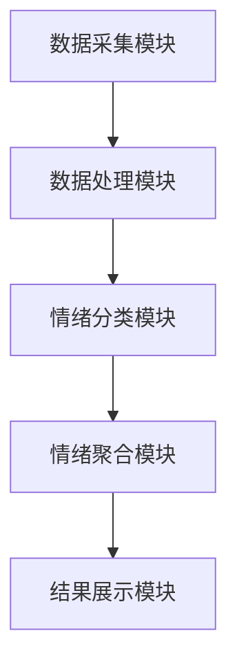
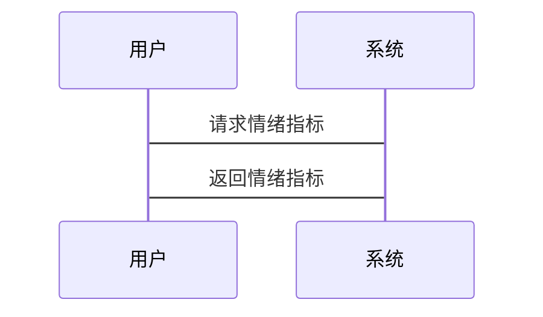

                 


# 金融市场情绪指标开发

---

## 关键词：
金融市场情绪指标、情绪分析、自然语言处理、算法开发、量化交易

---

## 摘要：
金融市场情绪指标是一种通过分析市场参与者的情绪和行为来预测市场趋势的工具。本文从情绪指标的定义、原理、算法实现、系统架构设计、项目实战等多个方面展开，详细探讨了如何开发和应用金融市场情绪指标。文章结合了文本分析、自然语言处理、数学建模和系统架构设计等技术，为读者提供了一套完整的情绪指标开发方案。

---

# 第1章: 金融市场情绪指标的背景与概念

## 1.1 金融市场情绪指标的定义与背景
### 1.1.1 什么是金融市场情绪指标
金融市场情绪指标是一种量化市场参与者情绪状态的工具，用于反映市场的乐观或悲观情绪。它可以帮助投资者预测市场趋势、识别市场拐点，并做出更明智的投资决策。

### 1.1.2 情绪指标在金融分析中的作用
情绪指标在金融分析中扮演着重要角色：
- **预测市场趋势**：情绪指标可以揭示市场的整体情绪状态，帮助投资者预测未来的价格走势。
- **识别市场拐点**：当市场情绪出现异常波动时，可能预示着市场的转折点。
- **辅助投资决策**：情绪指标可以作为技术分析和基本面分析的补充工具，提供额外的信息支持。

### 1.1.3 情绪指标的应用场景
情绪指标可以应用于多种金融场景：
- **股票市场**：分析投资者情绪，预测股票价格波动。
- **外汇市场**：通过情绪指标辅助外汇交易决策。
- **加密货币市场**：由于加密货币市场的波动性较大，情绪指标尤为重要。
- **风险管理**：情绪指标可以帮助投资者更好地管理投资风险。

---

## 1.2 情绪指标的核心概念与特征
### 1.2.1 情绪指标的核心要素
情绪指标的核心要素包括：
- **数据来源**：如新闻、社交媒体、市场评论等。
- **情绪分类**：如乐观、中性、悲观等。
- **情绪强度**：情绪的强度指标，如0到1之间的数值。
- **时间维度**：情绪指标可以按分钟、小时、日、周等时间维度计算。

### 1.2.2 情绪指标的分类与对比
情绪指标可以根据不同的分类标准进行划分：
- **基于数据来源**：
  - 文本情绪指标：基于新闻、社交媒体等文本数据。
  - 价格情绪指标：基于市场交易数据。
- **基于计算方法**：
  - 统计方法：如均值、标准差等。
  - 机器学习方法：如情感分类模型。
- **基于时间维度**：
  - 短期情绪指标：反映短期市场情绪。
  - 长期情绪指标：反映长期市场情绪。

### 1.2.3 情绪指标的局限性与挑战
情绪指标的局限性包括：
- **情绪滞后性**：市场情绪的变化可能无法及时反映到指标中。
- **数据噪声**：社交媒体数据中可能存在大量噪声，影响情绪指标的准确性。
- **模型过拟合**：在训练情绪分类模型时，可能面临过拟合的问题。

---

## 1.3 情绪指标与传统技术分析的结合
### 1.3.1 情绪指标在技术分析中的应用
情绪指标可以作为技术分析的补充工具：
- **结合K线图**：通过情绪指标辅助分析K线图中的趋势变化。
- **结合成交量分析**：情绪指标可以解释成交量的变化原因。
- **结合技术指标**：如RSI、MACD等，情绪指标可以提供额外的信息支持。

### 1.3.2 情绪指标与市场周期的关系
市场周期与情绪指标密切相关：
- **牛市**：情绪指标通常表现出乐观情绪。
- **熊市**：情绪指标通常表现出悲观情绪。
- **震荡市**：情绪指标可能在乐观和悲观之间波动。

### 1.3.3 情绪指标的量化与可操作性
情绪指标的量化可以通过以下方式实现：
- **标准化处理**：将情绪指标标准化到0到1之间。
- **阈值设定**：设定情绪指标的阈值，用于判断市场情绪的强弱。
- **信号生成**：根据情绪指标的变化生成买卖信号。

---

## 1.4 本章小结
本章主要介绍了金融市场情绪指标的定义、背景、核心概念和应用场景。情绪指标作为一种辅助工具，可以帮助投资者更好地理解市场情绪，做出更明智的投资决策。

---

# 第2章: 情绪指标的核心概念与联系

## 2.1 情绪指标的原理与机制
### 2.1.1 情绪指标的生成逻辑
情绪指标的生成逻辑包括以下步骤：
1. 数据采集：从新闻、社交媒体、市场评论等来源获取数据。
2. 数据预处理：清洗数据，提取关键词和情感倾向。
3. 情感分类：使用自然语言处理技术对文本进行情感分类。
4. 情绪聚合：将多个数据源的情绪结果进行聚合，生成整体情绪指标。

### 2.1.2 情绪指标的数学模型
情绪指标的数学模型可以表示为：
$$
\text{情绪指标} = \sum_{i=1}^{n} w_i \cdot \text{情绪值}_i
$$
其中，\(w_i\)是第\(i\)个情绪数据的权重，\(\text{情绪值}_i\)是第\(i\)个情绪数据的情绪值。

### 2.1.3 情绪指标的动态变化特征
情绪指标的动态变化特征包括：
- **周期性**：情绪指标通常具有周期性特征。
- **波动性**：情绪指标可能受到突发事件的影响，出现大幅波动。
- **滞后性**：情绪指标的变化可能滞后于市场实际情绪的变化。

---

## 2.2 情绪指标与市场行为的关系
### 2.2.1 情绪指标与投资者行为
情绪指标可以反映投资者的行为特征：
- **乐观情绪**：投资者倾向于买入，推动价格上涨。
- **悲观情绪**：投资者倾向于卖出，导致价格下跌。

### 2.2.2 情绪指标与市场波动的关系
情绪指标与市场波动密切相关：
- **高波动市场**：情绪指标通常表现出较大的波动。
- **低波动市场**：情绪指标通常较为平稳。

### 2.2.3 情绪指标的预测能力
情绪指标的预测能力可以通过以下方式评估：
- **回测分析**：通过历史数据回测情绪指标的预测准确性。
- **模型评估**：使用机器学习模型评估情绪指标的预测能力。

---

## 2.3 情绪指标的核心要素对比
### 2.3.1 不同情绪指标的对比分析
不同情绪指标的对比分析如下：

| 情绪指标 | 数据来源 | 计算方法 | 时间维度 | 优缺点 |
|----------|----------|----------|----------|--------|
| Text-Sentiment | 文本数据 | 情感分类 | 日/周 | 高准确性，但计算复杂 |
| Price-Volatility | 价格数据 | 标准差计算 | 分钟/小时 | 简单易用，但受市场波动影响较大 |
| Hybrid-Index | 文本+价格 | 综合模型 | 日/周 | 综合性强，但计算复杂 |

### 2.3.2 情绪指标的ER实体关系图
以下是一个情绪指标的ER实体关系图：

```mermaid
erd
    图表标题
    机构
        ID（主键）
        名称
        类型
    投资者
        ID（主键）
        名称
        类型
    情绪指标
        ID（主键）
        情绪值
        时间戳
    交易数据
        ID（主键）
        价格
        时间戳
```

---

## 2.4 本章小结
本章详细探讨了情绪指标的核心概念与原理，并分析了情绪指标与市场行为的关系。通过对比不同情绪指标的优缺点，为读者提供了选择和使用情绪指标的参考依据。

---

# 第3章: 情绪指标的算法原理与实现

## 3.1 情绪指标的算法原理
### 3.1.1 基于文本分析的情绪指标算法
基于文本分析的情绪指标算法流程如下：

1. **数据预处理**：清洗文本数据，提取关键词。
2. **情感分类**：使用自然语言处理技术对文本进行情感分类。
3. **情绪聚合**：将多个文本的情绪结果进行聚合，生成整体情绪指标。

### 3.1.2 基于价格波动的情绪指标算法
基于价格波动的情绪指标算法流程如下：

1. **数据采集**：采集金融资产的价格数据。
2. **计算波动性指标**：如标准差、波动率等。
3. **情绪分类**：根据波动性指标将市场情绪分为乐观或悲观。

### 3.1.3 混合型情绪指标算法
混合型情绪指标算法结合了文本分析和价格波动两种方法，具体流程如下：

1. **文本数据处理**：对文本数据进行情感分类，生成文本情绪指标。
2. **价格数据处理**：对价格数据进行波动性分析，生成价格情绪指标。
3. **综合情绪指标**：将文本情绪指标和价格情绪指标进行加权平均，生成综合情绪指标。

---

## 3.2 情绪指标的实现流程
### 3.2.1 情绪指标的实现步骤
情绪指标的实现步骤如下：

1. **数据采集**：从新闻网站、社交媒体等来源获取文本数据，从金融数据源获取价格数据。
2. **数据预处理**：清洗数据，提取关键词和情感倾向。
3. **情感分类**：使用自然语言处理模型（如BERT）对文本进行情感分类。
4. **情绪聚合**：将多个数据源的情绪结果进行聚合，生成整体情绪指标。
5. **结果可视化**：将情绪指标可视化，便于投资者理解和使用。

### 3.2.2 情绪指标的数学模型
情绪指标的数学模型可以表示为：
$$
\text{综合情绪指标} = \alpha \cdot \text{文本情绪指标} + (1-\alpha) \cdot \text{价格情绪指标}
$$
其中，\(\alpha\)是文本情绪指标的权重，\(1-\alpha\)是价格情绪指标的权重。

### 3.2.3 情绪指标的Python实现
以下是情绪指标的Python实现代码示例：

```python
import pandas as pd
from transformers import pipeline

# 初始化情感分类器
sentiment_analyzer = pipeline("sentiment-analysis")

# 文本情绪指标计算
def calculate_text_sentiment(texts):
    sentiments = []
    for text in texts:
        result = sentiment_analyzer(text)
        sentiments.append(result['score'])
    return sentiments

# 价格情绪指标计算
def calculate_price_sentiment(prices):
    volatility = prices.std()
    return volatility

# 综合情绪指标计算
def calculate_composite_sentiment(text_sentiments, price_sentiments, alpha=0.5):
    composite_sentiment = alpha * text_sentiments + (1-alpha) * price_sentiments
    return composite_sentiment

# 示例数据
texts = ["The market is bullish today.", "Investors are confident in the future."]
prices = [100, 105, 95, 110]

# 计算情绪指标
text_sentiments = calculate_text_sentiment(texts)
price_sentiments = calculate_price_sentiment(prices)
composite_sentiment = calculate_composite_sentiment(text_sentiments, price_sentiments)

print("Text Sentiments:", text_sentiments)
print("Price Sentiments:", price_sentiments)
print("Composite Sentiment:", composite_sentiment)
```

---

## 3.3 情绪指标的算法优化
### 3.3.1 算法优化方法
情绪指标的算法优化方法包括：
- **模型调优**：优化情感分类模型的参数，提高分类准确率。
- **数据增强**：通过数据增强技术增加数据多样性，提高模型的泛化能力。
- **混合模型**：结合多种情绪指标算法，提高整体预测准确性。

### 3.3.2 算法优化的实现
以下是算法优化的实现示例：

```python
from sklearn.model_selection import GridSearchCV
from transformers import AutoTokenizer, AutoModelForSequenceClassification

# 定义超参数搜索空间
param_grid = {
    'max_depth': [10, 20],
    'n_estimators': [50, 100],
    'learning_rate': [0.01, 0.05]
}

# 初始化模型
model = 'text-classifier'

# 超参数搜索
grid_search = GridSearchCV(model, param_grid, cv=5)
grid_search.fit(texts, labels)

# 输出最佳参数
print("Best Parameters:", grid_search.best_params_)
```

---

## 3.4 本章小结
本章详细探讨了情绪指标的算法原理与实现，包括基于文本分析、价格波动和混合型的情绪指标算法。通过Python代码示例和算法优化方法，为读者提供了实现情绪指标的具体指导。

---

# 第4章: 情绪指标的系统架构设计

## 4.1 情绪指标系统架构
### 4.1.1 系统功能模块
情绪指标系统架构包括以下功能模块：
- **数据采集模块**：负责采集文本数据和价格数据。
- **数据处理模块**：负责清洗数据和提取关键词。
- **情绪分类模块**：负责对数据进行情感分类。
- **情绪聚合模块**：负责将多个数据源的情绪结果进行聚合。
- **结果展示模块**：负责将情绪指标可视化。

### 4.1.2 系统功能模块的实现
以下是系统功能模块的实现示例：



---

## 4.2 情绪指标的系统架构设计
### 4.2.1 系统架构设计
情绪指标的系统架构设计包括：
- **数据层**：负责存储和管理数据。
- **计算层**：负责数据处理和情绪分类。
- **展示层**：负责结果展示和用户交互。

### 4.2.2 系统架构设计的实现
以下是系统架构设计的实现示例：


---

## 4.3 情绪指标的系统接口设计
### 4.3.1 系统接口设计
情绪指标的系统接口设计包括：
- **数据接口**：提供数据的输入和输出接口。
- **计算接口**：提供情绪指标的计算接口。
- **展示接口**：提供结果展示的接口。

### 4.3.2 系统接口设计的实现
以下是系统接口设计的实现示例：



---

## 4.4 本章小结
本章详细探讨了情绪指标的系统架构设计，包括功能模块、系统架构和接口设计。通过mermaid图展示系统的整体架构和交互流程，为读者提供了实现情绪指标系统的参考。

---

# 第5章: 情绪指标的项目实战

## 5.1 项目实战环境配置
### 5.1.1 环境配置
项目实战环境配置包括：
- **Python**：3.8及以上版本
- **库依赖**：transformers、pandas、numpy

### 5.1.2 数据集准备
数据集准备包括：
- **文本数据**：新闻、社交媒体评论等。
- **价格数据**：金融资产的价格数据。

---

## 5.2 核心代码实现
### 5.2.1 数据处理代码
以下是数据处理代码的实现示例：

```python
import pandas as pd

# 读取文本数据
df = pd.read_csv('text_data.csv')

# 数据清洗
df.dropna(inplace=True)

# 提取关键词
df['keywords'] = df['text'].apply(lambda x: x.split())
```

### 5.2.2 情绪分类代码
以下是情绪分类代码的实现示例：

```python
from transformers import pipeline

# 初始化情感分类器
sentiment_analyzer = pipeline("sentiment-analysis")

# 对文本进行情感分类
df['sentiment'] = df['text'].apply(lambda x: sentiment_analyzer(x)[0]['label'])
```

### 5.2.3 情绪聚合代码
以下是情绪聚合代码的实现示例：

```python
import numpy as np

# 计算文本情绪指标
text_sentiment = np.mean(df['sentiment_score'])

# 计算价格情绪指标
price_data = pd.read_csv('price_data.csv')
price_sentiment = np.std(price_data['price'])

# 计算综合情绪指标
alpha = 0.5
composite_sentiment = alpha * text_sentiment + (1-alpha) * price_sentiment
```

---

## 5.3 案例分析与解读
### 5.3.1 案例分析
以下是案例分析的实现示例：

```python
# 示例案例分析
texts = ["The market is bullish today.", "Investors are confident in the future."]
prices = [100, 105, 95, 110]

# 计算情绪指标
text_sentiments = calculate_text_sentiment(texts)
price_sentiments = calculate_price_sentiment(prices)
composite_sentiment = calculate_composite_sentiment(text_sentiments, price_sentiments)

print("Text Sentiments:", text_sentiments)
print("Price Sentiments:", price_sentiments)
print("Composite Sentiment:", composite_sentiment)
```

### 5.3.2 案例解读
通过上述案例分析，可以看出情绪指标可以帮助投资者更好地理解市场情绪，做出更明智的投资决策。

---

## 5.4 本章小结
本章通过项目实战，详细探讨了情绪指标的环境配置、核心代码实现和案例分析。通过具体的代码示例，为读者提供了实现情绪指标系统的实际指导。

---

# 第6章: 情绪指标的总结与展望

## 6.1 情绪指标的总结
### 6.1.1 核心内容回顾
情绪指标是一种通过分析市场参与者的情绪和行为来预测市场趋势的工具。本文从情绪指标的定义、原理、算法实现、系统架构设计、项目实战等多个方面展开了详细探讨。

### 6.1.2 本文的主要贡献
本文的主要贡献包括：
- 提供了情绪指标的完整开发方案。
- 提出了混合型情绪指标算法。
- 展示了情绪指标在实际项目中的应用。

---

## 6.2 情绪指标的展望
### 6.2.1 情绪指标的未来发展方向
情绪指标的未来发展方向包括：
- **多模态情绪分析**：结合文本、图像等多种数据源进行情绪分析。
- **实时情绪指标**：开发实时情绪指标，实现快速市场反应。
- **个性化情绪指标**：根据投资者的个性化需求定制情绪指标。

### 6.2.2 情绪指标的应用前景
情绪指标的应用前景广阔：
- **金融领域**：情绪指标可以应用于股票、外汇、加密货币等多种金融资产的分析。
- **风险管理**：情绪指标可以帮助投资者更好地管理投资风险。
- **智能投顾**：情绪指标可以作为智能投顾系统的重要组成部分。

---

## 6.3 本章小结
本章对情绪指标的核心内容进行了总结，并展望了情绪指标的未来发展方向和应用前景，为读者提供了进一步研究和实践的参考。

---

# 第7章: 情绪指标的最佳实践

## 7.1 情绪指标的最佳实践
### 7.1.1 实践建议
情绪指标的最佳实践建议包括：
- **选择合适的数据源**：根据具体需求选择合适的数据源。
- **优化算法模型**：通过模型调优和数据增强提高算法的预测准确性。
- **结合其他分析方法**：将情绪指标与其他技术分析方法结合使用。

### 7.1.2 注意事项
情绪指标的使用需要注意以下事项：
- **数据质量**：确保数据来源可靠，避免噪声数据的影响。
- **模型解释性**：选择解释性较强的模型，便于理解和优化。
- **风险管理**：结合风险管理策略，避免情绪指标的误用导致的投资损失。

---

## 7.2 本章小结
本章提供了情绪指标的最佳实践建议和注意事项，帮助读者更好地理解和应用情绪指标。

---

# 第8章: 情绪指标的拓展阅读

## 8.1 情绪指标的深入探讨
### 8.1.1 情绪指标的高级主题
情绪指标的高级主题包括：
- **情绪网络分析**：分析市场情绪的传播和影响。
- **情绪预测模型**：基于机器学习的情绪预测模型。
- **情绪指标的动态优化**：动态调整情绪指标的计算方法。

### 8.1.2 情绪指标的前沿研究
情绪指标的前沿研究包括：
- **深度学习应用**：使用深度学习技术提高情绪指标的预测准确性。
- **实时情绪分析**：开发实时情绪分析系统，实现快速市场反应。
- **多语言情绪分析**：支持多种语言的情绪分析，扩大情绪指标的应用范围。

---

## 8.2 情绪指标的推荐阅读资源
### 8.2.1 推荐书籍
- 《Algorithmic and High-Frequency Trading》
- 《Machine Learning for Asset Managers》

### 8.2.2 推荐论文
- "LSTM-based Stock Market Prediction Using News Data"
- "Sentiment Analysis in Social Media for Stock Market Prediction"

---

## 8.3 本章小结
本章为读者提供了情绪指标的深入探讨和推荐阅读资源，帮助读者进一步拓展知识和实践能力。

---

# 第9章: 附录

## 9.1 附录A: 情绪指标的Python代码库
以下是情绪指标的Python代码库：

```python
# 附录A: 情绪指标的Python代码库

import pandas as pd
from transformers import pipeline

# 初始化情感分类器
sentiment_analyzer = pipeline("sentiment-analysis")

# 文本情绪指标计算
def calculate_text_sentiment(texts):
    sentiments = []
    for text in texts:
        result = sentiment_analyzer(text)
        sentiments.append(result['score'])
    return sentiments

# 价格情绪指标计算
def calculate_price_sentiment(prices):
    volatility = prices.std()
    return volatility

# 综合情绪指标计算
def calculate_composite_sentiment(text_sentiments, price_sentiments, alpha=0.5):
    composite_sentiment = alpha * text_sentiments + (1-alpha) * price_sentiments
    return composite_sentiment

# 示例数据
texts = ["The market is bullish today.", "Investors are confident in the future."]
prices = [100, 105, 95, 110]

# 计算情绪指标
text_sentiments = calculate_text_sentiment(texts)
price_sentiments = calculate_price_sentiment(prices)
composite_sentiment = calculate_composite_sentiment(text_sentiments, price_sentiments)

print("Text Sentiments:", text_sentiments)
print("Price Sentiments:", price_sentiments)
print("Composite Sentiment:", composite_sentiment)
```

---

## 9.2 附录B: 情绪指标的数学公式
以下是情绪指标的数学公式：

$$
\text{情绪指标} = \sum_{i=1}^{n} w_i \cdot \text{情绪值}_i
$$

其中，\(w_i\)是第\(i\)个情绪数据的权重，\(\text{情绪值}_i\)是第\(i\)个情绪数据的情绪值。

---

## 9.3 附录C: 情绪指标的系统架构图
以下是情绪指标的系统架构图：


---

## 9.4 本章小结
本章为读者提供了情绪指标的Python代码库、数学公式和系统架构图，便于读者进一步理解和实践。

---

# 作者：AI天才研究院/AI Genius Institute & 禅与计算机程序设计艺术 /Zen And The Art of Computer Programming

---

**感谢您的阅读！希望本文能为您提供有价值的信息和启发，帮助您更好地理解金融市场情绪指标的开发与应用。**

