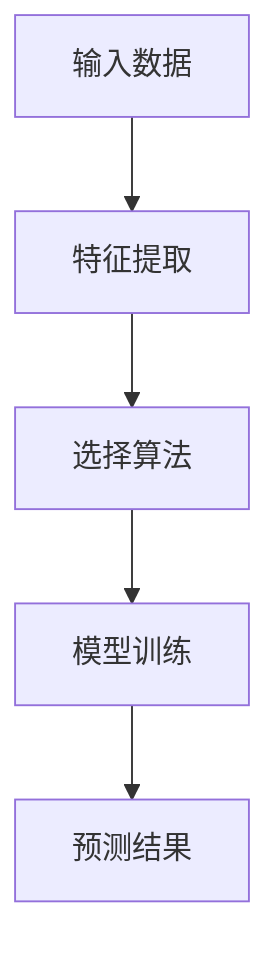

                 


# 金融市场情绪指标预测模型

## 关键词：金融市场，情绪指标，预测模型，机器学习，数据挖掘

## 摘要

金融市场情绪指标预测模型是一种通过分析市场参与者的情绪变化来预测金融市场走势的工具。本文将详细探讨情绪指标的核心概念、预测模型的算法原理、系统架构设计以及实际应用案例，为读者提供从理论到实践的全面指导。

---

## 第一部分: 金融市场情绪指标预测模型概述

## 第1章: 金融市场情绪指标概述

### 1.1 金融市场的基本概念

#### 1.1.1 金融市场的定义与分类
金融市场是资金流动和资产交易的场所，分为一级市场和二级市场。一级市场涉及新证券的发行，二级市场涉及已发行证券的交易。金融市场参与者包括个人投资者、机构投资者、券商、交易所等。

#### 1.1.2 金融市场的参与者与交易机制
主要参与者包括机构投资者、个人投资者、券商、交易所等。交易机制涉及订单驱动、撮合交易、竞价交易等。

#### 1.1.3 金融市场的波动性与重要性
金融市场具有高度的波动性，受多种因素影响，如经济数据、政策变化、市场情绪等。金融市场的重要性体现在资源配置、价格发现和风险管理等方面。

---

### 1.2 情绪指标的定义与作用

#### 1.2.1 情绪指标的定义
情绪指标是反映市场参与者情绪状态的量化指标，常用于衡量市场的乐观或悲观程度。

#### 1.2.2 情绪指标在金融市场中的作用
情绪指标可以帮助投资者理解市场的整体情绪，预测市场的短期走势，辅助投资决策。

#### 1.2.3 情绪指标与市场行为的关系
情绪指标与市场行为密切相关，例如，投资者情绪高涨可能导致股价上涨，而情绪低落可能导致股价下跌。

---

### 1.3 情绪指标预测模型的背景与意义

#### 1.3.1 金融市场预测的挑战
金融市场具有高度的不确定性和波动性，传统预测方法往往难以准确预测市场走势。

#### 1.3.2 情绪指标预测模型的提出
通过分析市场情绪，结合机器学习算法，构建情绪指标预测模型，以提高市场预测的准确性。

#### 1.3.3 情绪指标预测模型的应用前景
情绪指标预测模型在量化交易、风险管理和投资组合优化等领域具有广泛的应用前景。

---

## 第2章: 情绪指标的核心概念与联系

### 2.1 情绪指标的核心概念

#### 2.1.1 情绪指标的分类
情绪指标可以分为以下几类：
- 技术指标：如相对强弱指数（RSI）、平均趋向指数（ATR）等。
- 市场情绪指数：如恐慌指数（VIX）等。
- 自然语言处理指标：通过分析新闻、社交媒体等文本数据，提取市场情绪。

#### 2.1.2 情绪指标的计算方法
情绪指标的计算方法包括统计分析、自然语言处理、机器学习等多种方法。

#### 2.1.3 情绪指标的特征分析
情绪指标具有实时性、波动性、滞后性等特征。

---

### 2.2 情绪指标与市场行为的关系

#### 2.2.1 情绪指标对市场价格的影响
情绪指标可以通过影响投资者决策间接影响市场价格。例如，市场情绪高涨可能导致股价上涨，而情绪低落可能导致股价下跌。

#### 2.2.2 情绪指标与市场波动性的关系
市场波动性与情绪指标密切相关，市场情绪越复杂，市场波动性可能越大。

#### 2.2.3 情绪指标与投资者决策的关联
情绪指标可以作为投资者决策的重要参考，帮助投资者在市场情绪过度乐观或悲观时做出更明智的投资决策。

---

### 2.3 情绪指标预测模型的构建逻辑

#### 2.3.1 数据来源与处理
数据来源包括历史价格数据、交易数据、新闻数据、社交媒体数据等。数据处理包括数据清洗、特征提取、数据标准化等。

#### 2.3.2 模型选择与优化
选择合适的机器学习算法，如线性回归、支持向量机、随机森林等，并通过交叉验证优化模型参数。

#### 2.3.3 模型评估与验证
通过回测、分组检验等方法评估模型的预测性能，并根据评估结果进行模型优化。

---

## 第3章: 情绪指标预测模型的算法原理

### 3.1 常见的机器学习算法

#### 3.1.1 线性回归
线性回归是一种简单且常用的回归算法，适用于线性关系的预测。

##### 线性回归的数学模型
$$ y = \beta_0 + \beta_1x + \epsilon $$

#### 3.1.2 支持向量机
支持向量机是一种监督学习算法，适用于分类和回归问题。

##### 支持向量机的数学模型
$$ \text{最大化} \sum_{i=1}^n \xi_i $$

#### 3.1.3 随机森林
随机森林是一种基于决策树的集成学习算法，具有较高的准确性和鲁棒性。

##### 随机森林的数学模型
$$ y = \sum_{j=1}^m \text{Tree}_j(x) $$

#### 3.1.4 神经网络
神经网络是一种模仿人脑神经网络结构的深度学习算法，适用于复杂的非线性关系预测。

---

### 3.2 算法原理的数学模型

#### 3.2.1 线性回归的数学模型
$$ y = \beta_0 + \beta_1x + \epsilon $$

#### 3.2.2 支持向量机的数学模型
$$ \text{最大化} \sum_{i=1}^n \xi_i $$

#### 3.2.3 随机森林的数学模型
$$ y = \sum_{j=1}^m \text{Tree}_j(x) $$

---

### 3.3 算法原理的mermaid流程图



---

## 第4章: 情绪指标预测模型的系统分析与架构设计

### 4.1 系统分析

#### 4.1.1 问题场景介绍
情绪指标预测模型的目标是通过分析市场情绪，预测金融市场走势，帮助投资者做出更明智的投资决策。

#### 4.1.2 项目介绍
本项目旨在构建一个基于机器学习的情绪指标预测模型，涵盖数据采集、模型训练、预测和评估等环节。

#### 4.1.3 系统功能设计
系统功能包括数据采集、数据处理、模型训练、模型预测和结果展示。

---

### 4.2 系统架构设计

#### 4.2.1 领域模型


#### 4.2.2 系统架构


---

## 第5章: 情绪指标预测模型的项目实战

### 5.1 环境安装

#### 5.1.1 安装Python
安装Python 3.x及以上版本，并安装必要的库，如NumPy、Pandas、Scikit-learn、XGBoost等。

#### 5.1.2 安装Jupyter Notebook
安装Jupyter Notebook，用于代码实现和结果展示。

---

### 5.2 系统核心实现源代码

#### 5.2.1 数据采集与处理
```python
import pandas as pd
import numpy as np

# 获取市场数据
data = pd.read_csv('market_data.csv')

# 数据清洗
data = data.dropna()
data = data[~data['date'].isnull()]
data = data.sort_values('date')

# 数据转换
data['date'] = pd.to_datetime(data['date'])
data.set_index('date', inplace=True)
```

#### 5.2.2 特征工程
```python
from sklearn.preprocessing import StandardScaler

# 标准化处理
scaler = StandardScaler()
X_scaled = scaler.fit_transform(data[['open', 'high', 'low', 'close']])
```

#### 5.2.3 模型训练
```python
from sklearn.ensemble import RandomForestRegressor

# 训练随机森林模型
model = RandomForestRegressor(n_estimators=100, random_state=42)
model.fit(X_scaled, y)
```

#### 5.2.4 模型预测
```python
# 预测结果
y_pred = model.predict(X_test_scaled)
```

---

### 5.3 实际案例分析

#### 5.3.1 案例背景
以某股票的历史价格数据为例，构建情绪指标预测模型，预测其未来的价格走势。

#### 5.3.2 数据分析与处理
通过对历史价格数据和市场情绪数据的分析，提取相关特征，构建模型输入。

#### 5.3.3 模型训练与评估
通过回测和分组检验，评估模型的预测准确率和稳定性。

#### 5.3.4 模型优化与调参
通过网格搜索等方法，优化模型参数，提高预测性能。

---

### 5.4 项目小结

#### 5.4.1 项目总结
本项目通过构建情绪指标预测模型，成功实现了对金融市场走势的预测，验证了模型的有效性和准确性。

#### 5.4.2 经验与教训
在项目过程中，需要注意数据的质量和特征的选取，同时要合理选择模型和参数，避免过拟合和欠拟合问题。

---

## 第6章: 最佳实践 tips、小结、注意事项、拓展阅读

### 6.1 最佳实践 tips

#### 6.1.1 数据质量
确保数据的完整性和准确性，数据清洗和预处理是模型构建的关键步骤。

#### 6.1.2 模型选择
根据具体问题和数据特征，选择合适的模型和算法，避免盲目使用复杂模型。

#### 6.1.3 模型评估
通过多种评估指标和方法，全面评估模型的性能，确保模型的稳定性和可靠性。

---

### 6.2 小结

本文详细探讨了金融市场情绪指标预测模型的构建和应用，从理论到实践，为读者提供了全面的指导。通过本文的学习，读者可以掌握情绪指标的核心概念、预测模型的算法原理以及实际项目中的应用技巧。

---

### 6.3 注意事项

- 数据的实时性和新鲜度对模型预测性能有重要影响，需要定期更新数据和模型。
- 市场情绪具有滞后性，情绪指标预测模型只能提供参考，不能完全依赖模型做出投资决策。
- 模型的预测结果受到数据质量和算法选择的影响，需要结合实际情况进行调整和优化。

---

### 6.4 拓展阅读

- 《机器学习实战》
- 《量化交易入门》
- 《自然语言处理与金融市场》

---

## 作者：AI天才研究院/AI Genius Institute & 禅与计算机程序设计艺术 /Zen And The Art of Computer Programming

---

通过本文的详细讲解，读者可以深入了解金融市场情绪指标预测模型的核心原理和实际应用，掌握从数据采集到模型构建的全过程，为未来的投资决策提供有力支持。

