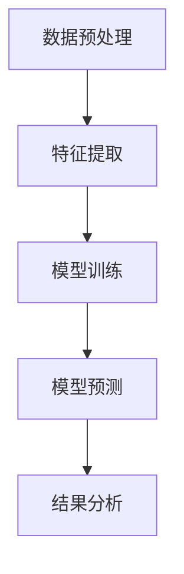
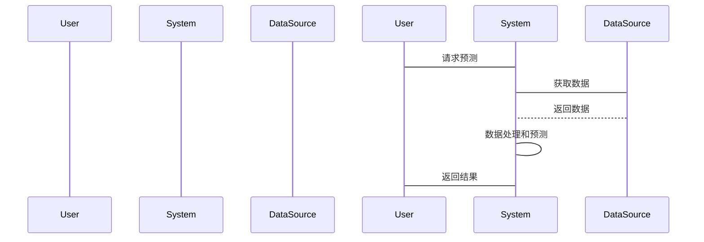

                 


# 金融市场流动性供给预测模型

## 关键词：金融市场，流动性，预测模型，机器学习，深度学习，时间序列分析

## 摘要

金融市场流动性供给预测模型旨在通过分析市场数据和交易行为，预测未来市场流动性供给的变化。本文从金融市场的基本概念出发，详细探讨流动性供给预测模型的构建与实现，包括模型的核心概念、算法原理、系统架构设计和项目实战等内容。通过理论分析与实践结合，本文为金融市场参与者提供了有效的流动性管理工具。

---

## 第1章 金融市场流动性概述

### 1.1 金融市场的基本概念

金融市场是资金流动和资产交易的场所，参与者包括投资者、机构和监管机构。流动性指资产在市场中的交易能力，直接影响市场稳定性和交易成本。

### 1.2 流动性的定义与特征

流动性供给是指市场上可交易的资产数量和价格稳定性。高流动性市场成交快，价格波动小；低流动性市场成交难，价格波动大。

### 1.3 流动性在金融市场中的重要性

流动性是市场功能正常运转的基础，影响资产定价、市场深度和参与者信心。良好的流动性管理有助于降低交易成本和风险。

---

## 第2章 流动性供给预测模型的背景与目标

### 2.1 流动性供给预测的背景

金融市场波动性增加，机构需要准确预测流动性供给以优化交易策略和风险管理。

### 2.2 流动性供给预测的目标

模型目标包括短期和中长期预测，帮助机构及时调整头寸，应对市场变化。

### 2.3 流动性供给预测的边界与外延

流动性供给预测的边界是特定市场和时间段，外延涉及宏观经济和市场行为分析。

---

## 第3章 流动性供给预测模型的核心概念与联系

### 3.1 流动性供给预测的核心概念

模型需要处理市场数据和参与者行为，分析影响流动性供给的因素。

### 3.2 流动性供给预测模型的属性特征对比

时间序列属性关注历史数据，空间分布属性分析市场结构，市场参与者行为属性考虑交易策略。

### 3.3 流动性供给预测模型的ER实体关系图

```mermaid
er
actor: 流动性供给预测模型
end-user: 金融机构
market: 金融市场
```

---

## 第4章 流动性供给预测模型的算法原理

### 4.1 时间序列分析算法

ARIMA模型适合平稳序列，GARCH模型处理波动性，LSTM模型捕捉长期依赖关系。

### 4.2 机器学习算法

线性回归和随机森林用于特征重要性分析，支持向量回归处理非线性关系。

### 4.3 深度学习模型

CNN提取局部特征，RNN处理序列数据，Transformer模型捕捉全局依赖。

### 4.4 算法流程图



### 4.5 算法实现代码示例

```python
import pandas as pd
from sklearn.ensemble import RandomForestRegressor

# 数据预处理
data = pd.read_csv('market_data.csv')
features = data[['volume', 'open', 'high', 'low']]
target = data['流动性供给']

# 特征工程
features_encoded = pd.get_dummies(features)

# 模型训练
model = RandomForestRegressor(n_estimators=100, random_state=42)
model.fit(features_encoded, target)

# 预测
new_data = pd.DataFrame({'volume': [1000], 'open': [90], 'high': [95], 'low': [85]})
new_data_encoded = pd.get_dummies(new_data)
prediction = model.predict(new_data_encoded)
print(f"预测流动性供给: {prediction[0]}")
```

---

## 第5章 数学模型与公式

### 5.1 时间序列模型公式

ARIMA(p, d, q)的数学表达式：

$$ y_t = \phi_1 y_{t-1} + \phi_2 y_{t-2} + \theta_1 \epsilon_{t-1} + \epsilon_t $$

### 5.2 LSTM模型结构

LSTM通过 gates（输入门、遗忘门、输出门）更新细胞状态和隐藏状态：

$$ f_t = \sigma(W_f \cdot [h_{t-1}, x_t] + b_f) $$
$$ i_t = \sigma(W_i \cdot [h_{t-1}, x_t] + b_i) $$
$$ o_t = \sigma(W_o \cdot [h_{t-1}, x_t] + b_o) $$
$$ c_t = f_t \cdot c_{t-1} + i_t \cdot tanh(W_c \cdot [h_{t-1}, x_t] + b_c) $$
$$ h_t = o_t \cdot tanh(c_t) $$

---

## 第6章 系统分析与架构设计

### 6.1 系统架构设计

分层架构：数据获取层、处理层、预测层、结果层。使用微服务架构，确保各模块独立。

### 6.2 接口设计

API接口定义：输入市场数据，输出流动性预测结果，使用JSON格式传递数据。

### 6.3 交互流程图



---

## 第7章 项目实战

### 7.1 环境安装

安装Python、Pandas、Scikit-learn、Keras等库，配置Jupyter Notebook环境。

### 7.2 数据获取与预处理

使用Yahoo Finance获取数据，处理缺失值和标准化数据。

### 7.3 特征工程

提取技术指标和市场情绪指标，进行独热编码。

### 7.4 模型实现与训练

使用随机森林模型训练，调整超参数优化性能。

### 7.5 结果分析

对比实际值和预测值，计算误差指标，评估模型性能。

---

## 第8章 总结与展望

### 8.1 模型总结

流动性供给预测模型为金融市场参与者提供了有效的工具，帮助优化交易策略和风险管理。

### 8.2 应用案例

银行使用模型优化流动性管理，降低风险和成本。

### 8.3 未来研究方向

结合宏观经济数据，研究多市场和多资产的流动性预测模型。

### 8.4 注意事项

确保数据质量和模型鲁棒性，及时更新模型参数，应对市场变化。

---

## 作者：AI天才研究院 & 禅与计算机程序设计艺术

本文由AI天才研究院与禅与计算机程序设计艺术团队合作完成，转载请注明出处。

