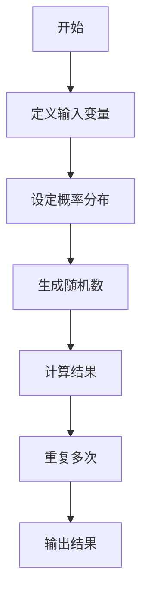
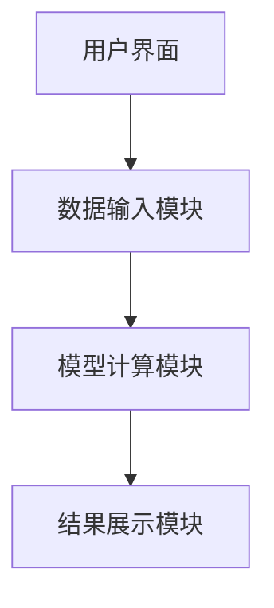

                 


# 金融市场流动性压力测试模型

> 关键词：金融市场，流动性压力测试，风险管理，VaR模型，蒙特卡洛模拟

> 摘要：本文详细探讨了金融市场流动性压力测试模型的核心概念、算法原理、系统架构以及实际应用。通过分析流动性风险的定义、特征以及压力测试的重要性，结合具体案例和数学模型，为金融机构和监管机构提供理论支持和实践指导，帮助其更好地应对金融市场中的流动性风险。

---

## 第1章: 金融市场流动性压力测试的背景与意义

### 1.1 金融市场流动性风险的定义与特征

#### 1.1.1 流动性风险的定义
流动性风险是指金融机构在面对市场波动或突发情况时，无法及时以合理价格变现资产或获得所需资金的风险。这种风险可能影响金融机构的正常运作，甚至引发系统性金融危机。

#### 1.1.2 流动性风险的特征
- **突发性**：流动性风险往往在市场剧烈波动时突然出现。
- **传染性**：流动性风险可能在金融机构之间迅速蔓延，引发连锁反应。
- **放大性**：市场的负面信息可能导致投资者恐慌性抛售，进一步加剧流动性风险。

#### 1.1.3 流动性风险的分类
- **资产流动性风险**：由于资产无法快速变现而导致的流动性风险。
- **负债流动性风险**：由于负债无法及时偿还而导致的流动性风险。
- **市场流动性风险**：由于市场整体流动性不足而导致的流动性风险。

### 1.2 流动性压力测试的定义与作用

#### 1.2.1 流动性压力测试的定义
流动性压力测试是一种评估金融机构在极端市场条件下应对流动性风险的能力的方法。通过模拟不同压力情景，测试金融机构在资金短缺或市场流动性枯竭情况下的应对能力。

#### 1.2.2 流动性压力测试的作用
- **风险评估**：帮助金融机构识别潜在的流动性风险点。
- **制定应对策略**：通过压力测试结果，制定有效的流动性风险管理策略。
- **监管合规**：满足金融监管机构对金融机构流动性管理的要求。

#### 1.2.3 流动性压力测试的实施流程
1. **定义压力情景**：选择可能引发流动性风险的极端市场情景。
2. **数据收集与准备**：收集金融机构的资产负债数据、市场数据等。
3. **模型选择与构建**：选择合适的流动性压力测试模型。
4. **测试与分析**：模拟压力情景，分析测试结果。
5. **制定应对措施**：根据测试结果，制定相应的风险管理措施。

### 1.3 金融市场流动性压力测试的重要性

#### 1.3.1 金融机构的合规要求
许多国家的金融监管机构要求金融机构定期进行流动性压力测试，以确保其具备应对流动性危机的能力。

#### 1.3.2 金融监管的需要
流动性压力测试是金融监管的重要工具之一，有助于监管机构评估金融机构的抗风险能力，维护金融系统的稳定性。

#### 1.3.3 金融危机的防范与预警
通过流动性压力测试，金融机构可以提前识别潜在的流动性风险，采取措施加以防范，避免危机的发生。

---

## 第2章: 流动性压力测试模型的核心概念与联系

### 2.1 流动性压力测试模型的原理

#### 2.1.1 流动性压力测试的基本原理
流动性压力测试通过模拟极端市场情景，评估金融机构在不同压力条件下的流动性状况。其核心在于通过模型模拟市场波动，分析金融机构的现金流、资产变现能力以及负债偿还能力。

#### 2.1.2 流动性压力测试的关键假设
- 市场波动是随机的，且服从一定的概率分布。
- 金融机构的资产负债结构在测试期间保持不变。
- 压力情景的选择能够反映实际市场中的极端情况。

#### 2.1.3 流动性压力测试的核心步骤
1. **数据收集**：收集金融机构的资产负债数据、市场数据等。
2. **情景定义**：定义极端市场情景，例如市场崩盘、大规模赎回等。
3. **模型构建**：选择合适的流动性压力测试模型。
4. **测试实施**：模拟压力情景，计算流动性指标。
5. **结果分析**：根据测试结果，评估金融机构的流动性风险。

### 2.2 流动性压力测试模型的属性特征对比

#### 2.2.1 不同流动性压力测试模型的对比
| 模型名称         | 基础原理                   | 适用场景                     |
|------------------|---------------------------|-----------------------------|
| 蒙特卡洛模拟     | 基于随机变量的模拟         | 适用于复杂非线性问题         |
| VaR方法         | 基于统计分布的分位数计算   | 适用于风险度量               |
| 情景分析法       | 基于假设情景的分析         | 适用于明确的情景假设         |

#### 2.2.2 模型的适用场景与局限性
- **蒙特卡洛模拟**：适用于复杂系统的模拟，但计算成本较高。
- **VaR方法**：计算简单，但无法完全捕捉尾部风险。
- **情景分析法**：适用于明确情景的假设，但缺乏对随机波动的模拟。

#### 2.2.3 模型的优缺点分析
- **蒙特卡洛模拟**：优点是能够模拟复杂系统，缺点是计算时间较长。
- **VaR方法**：优点是计算简单，缺点是无法完全反映极端风险。
- **情景分析法**：优点是情景明确，缺点是假设的情景可能不完全准确。

### 2.3 流动性压力测试模型的ER实体关系图

```mermaid
erDiagram
    actor 流动性压力测试模型
    actor 流动性风险
    actor 金融机构
    actor 监管机构
    金融机构 --> 流动性压力测试模型: 提供数据
    监管机构 --> 流动性压力测试模型: 提供监管要求
    流动性压力测试模型 --> 流动性风险: 评估风险
```

---

## 第3章: 流动性压力测试模型的算法原理

### 3.1 流动性压力测试的常用算法

#### 3.1.1 蒙特卡洛模拟
蒙特卡洛模拟是一种基于随机数的模拟方法，通过多次模拟不同的市场情景，计算金融机构在极端情况下的流动性状况。

#### 3.1.2 Value at Risk (VaR) 方法
VaR方法通过统计方法计算金融机构在一定置信水平下的最大可能损失，帮助金融机构评估流动性风险。

#### 3.1.3 情景分析法
情景分析法通过假设不同的市场情景，分析金融机构在不同情景下的流动性状况。

### 3.2 蒙特卡洛模拟的实现步骤



### 3.3 VaR方法的数学模型

#### 3.3.1 VaR的定义
VaR是指在给定置信水平下，金融机构在一定时间内的最大可能损失。

#### 3.3.2 VaR的计算公式
$$ VaR = \mu + z \cdot \sigma $$
其中，$\mu$ 是平均值，$z$ 是标准正态分布的分位数，$\sigma$ 是标准差。

---

## 第4章: 流动性压力测试模型的系统分析与架构设计

### 4.1 系统功能设计

#### 4.1.1 数据输入模块
数据输入模块负责接收金融机构的资产负债数据、市场数据等。

#### 4.1.2 模型计算模块
模型计算模块根据输入数据和选择的模型，计算金融机构的流动性状况。

#### 4.1.3 结果展示模块
结果展示模块将计算结果以图表或报告的形式展示给用户。

### 4.2 系统架构设计



### 4.3 系统接口设计

#### 4.3.1 数据接口
金融机构提供资产负债数据和市场数据。

#### 4.3.2 计算接口
模型计算模块接收数据并进行计算。

#### 4.3.3 结果接口
结果展示模块接收计算结果并展示给用户。

---

## 第5章: 流动性压力测试模型的项目实战

### 5.1 环境安装
需要安装Python、NumPy、Pandas、Matplotlib等库。

### 5.2 系统核心实现源代码

```python
import numpy as np
import pandas as pd
import matplotlib.pyplot as plt

def monte_carlo_simulation(data, iterations=1000):
    # 生成随机数
    np.random.seed(42)
    simulations = np.random.multivariate_normal(data.mean(), data.cov(), iterations)
    # 计算VaR
    var = np.percentile(simulations, 5, axis=0)
    return var

# 示例数据
data = pd.Series([1, 2, 3, 4, 5])
var_result = monte_carlo_simulation(data)
print(f"VaR: {var_result}")
```

### 5.3 代码应用解读与分析
上述代码实现了一个简单的蒙特卡洛模拟，计算了资产的VaR值。通过多次模拟，可以帮助金融机构评估其在极端市场情景下的流动性状况。

### 5.4 实际案例分析
以某银行为例，假设其资产负债数据如下：

| 资产     | 负债     |
|----------|----------|
| 100亿     | 80亿     |
| 120亿     | 90亿     |
| 110亿     | 85亿     |

通过流动性压力测试模型，可以评估该银行在极端市场情景下的流动性状况。

### 5.5 项目小结
通过实际案例分析，可以看出流动性压力测试模型在金融机构风险管理中的重要作用。

---

## 第6章: 最佳实践、小结与注意事项

### 6.1 最佳实践
- 定期进行流动性压力测试，确保模型的有效性。
- 结合实际市场情况，选择合适的压力测试模型。
- 建立健全的流动性风险管理机制。

### 6.2 小结
本文详细介绍了金融市场流动性压力测试模型的核心概念、算法原理、系统架构以及实际应用。通过理论与实践相结合，为金融机构和监管机构提供了有效的风险管理工具。

### 6.3 注意事项
- 压力测试模型的选择应结合实际市场情况。
- 数据的准确性和完整性对测试结果影响重大。
- 结果的解读应结合机构的实际情况。

---

## 作者：AI天才研究院/AI Genius Institute & 禅与计算机程序设计艺术 /Zen And The Art of Computer Programming

---

以上是《金融市场流动性压力测试模型》的技术博客文章的完整内容，涵盖从理论到实践的各个方面，帮助读者全面理解并掌握流动性压力测试模型的核心思想和应用场景。

