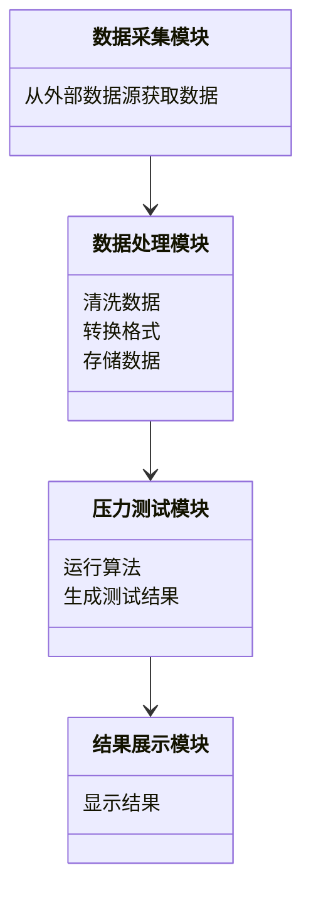
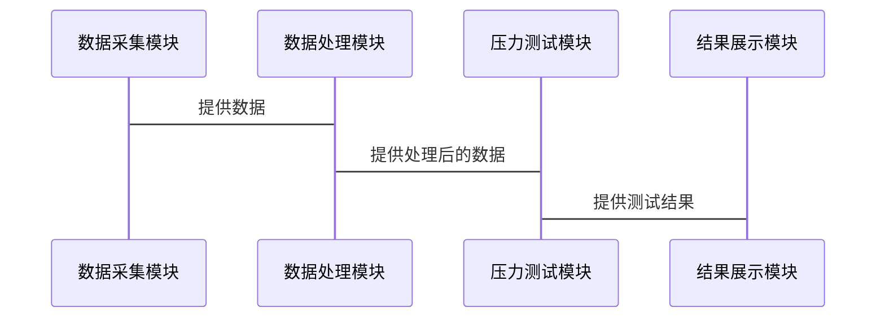

                 


# 金融市场流动性压力测试自动化平台

## 关键词：金融市场，流动性压力测试，自动化平台，算法原理，系统架构

## 摘要：本文介绍了一种金融市场流动性压力测试的自动化平台，详细讲解了压力测试的核心概念、算法原理、系统架构设计及其实现。通过系统化的分析和实际案例，展示了如何利用技术手段提升金融市场的风险评估能力。

---

## 第一部分: 金融市场流动性压力测试概述

### 第1章: 金融市场与流动性风险

#### 1.1 金融市场的基本概念
- 1.1.1 金融市场的定义与分类
  - 金融市场是资金流动和交易的场所，分为货币市场、资本市场和衍生品市场。
- 1.1.2 金融市场的功能与作用
  - 资源配置、价格发现和风险管理。
- 1.1.3 金融市场的参与者
  - 包括银行、投资者、企业等。

#### 1.2 流动性风险的定义与特征
- 1.2.1 流动性风险的定义
  - 无法及时以合理价格变现资产的风险。
- 1.2.2 流动性风险的来源
  - 市场波动、资产配置不当等。
- 1.2.3 流动性风险的特征
  - 时间性、波动性、传染性。

#### 1.3 压力测试的定义与意义
- 1.3.1 压力测试的定义
  - 在极端市场条件下评估资产或机构承受能力的测试。
- 1.3.2 压力测试的目的
  - 评估在极端情况下的流动性状况，确保机构稳健运行。
- 1.3.3 压力测试的意义
  - 提前识别风险，制定应对策略，增强市场信心。

#### 1.4 本章小结
- 1.4.1 本章内容总结
  - 介绍了金融市场、流动性风险及压力测试的基本概念。
- 1.4.2 下章内容预告
  - 接下来将详细讲解压力测试的核心概念与方法。

---

## 第二部分: 流动性压力测试的核心概念

### 第2章: 压力测试的类型与方法

#### 2.1 压力测试的主要类型
- 2.1.1 正常压力测试
  - 在正常市场条件下测试资产的流动性。
- 2.1.2 极端压力测试
  - 在极端市场条件下测试资产的抗压能力。
- 2.1.3 情景压力测试
  - 针对特定市场情景进行测试，如经济衰退、市场崩盘等。

#### 2.2 压力测试的主要方法
- 2.2.1 涵盖法
  - 通过覆盖所有可能的市场情况来评估流动性。
- 2.2.2 流动性缺口分析法
  - 计算未来一定时间内资产和负债的缺口，评估流动性压力。
- 2.2.3 现金流分析法
  - 分析未来现金流的流入和流出，评估流动性状况。

#### 2.3 压力测试的关键指标
- 2.3.1 流动性覆盖率（LCR）
  - 准备金与短期负债的比例，衡量短期流动性风险。
- 2.3.2 流动性比率
  - 流动资产与流动负债的比率，反映短期偿债能力。
- 2.3.3 净现金流缺口
  - 未来一定时间内现金流的净流出或流入情况。

#### 2.4 本章小结
- 2.4.1 核心概念总结
  - 压力测试的类型与方法及其关键指标。
- 2.4.2 下章内容预告
  - 下一章将讲解压力测试的算法原理。

---

## 第三部分: 压力测试的算法原理

### 第3章: 压力测试算法概述

#### 3.1 蒙特卡洛模拟
- 3.1.1 蒙特卡洛模拟的基本原理
  - 通过随机抽样和多次模拟，估计系统的概率分布。
- 3.1.2 蒙特卡洛模拟的实现步骤
  - 确定变量分布、生成随机数、计算结果、统计分析。
- 3.1.3 蒙特卡洛模拟的应用
  - 用于情景压力测试，模拟极端市场情况下的流动性状况。

#### 3.2 时间序列分析
- 3.2.1 时间序列分析的基本原理
  - 通过历史数据预测未来趋势，识别周期性、趋势性等特征。
- 3.2.2 时间序列分析的实现步骤
  - 数据预处理、模型选择、参数估计、预测与验证。
- 3.2.3 时间序列分析的应用
  - 用于现金流预测，评估流动性压力。

#### 3.3 机器学习模型
- 3.3.1 机器学习模型的基本原理
  - 通过训练数据，模型学习输入与输出的关系，进行预测或分类。
- 3.3.2 常用机器学习算法
  - 线性回归、支持向量机、随机森林、神经网络等。
- 3.3.3 机器学习模型的应用
  - 用于预测市场波动，评估流动性风险。

#### 3.4 算法对比与选择
- 3.4.1 算法对比表格
  | 算法类型 | 优点 | 缺点 | 适用场景 |
  |----------|------|------|----------|
  | 蒙特卡洛 | 高度灵活，能处理复杂问题 | 计算量大，结果依赖假设 | 情景压力测试 |
  | 时间序列 | 基于历史数据，预测能力强 | 对未来变化适应性差 | 现金流预测 |
  | 机器学习 | 高精度预测，非线性能力强 | 需大量数据，解释性差 | 市场波动预测 |

- 3.4.2 算法选择的建议
  - 根据具体需求选择算法，蒙特卡洛适合极端情景，时间序列适合趋势预测，机器学习适合复杂模式识别。

#### 3.5 本章小结
- 3.5.1 算法原理总结
  - 蒙特卡洛模拟、时间序列分析和机器学习模型的原理及其应用。
- 3.5.2 下章内容预告
  - 下一章将介绍系统架构设计。

---

## 第四部分: 金融市场流动性压力测试平台的系统架构设计

### 第4章: 平台架构设计

#### 4.1 问题场景介绍
- 金融市场中，机构需要快速、准确地进行流动性压力测试，以便及时应对潜在风险。

#### 4.2 项目介绍
- 开发一个自动化平台，利用算法对金融市场数据进行分析，评估流动性压力。

#### 4.3 系统功能设计
- 4.3.1 系统功能模块划分
  - 数据采集模块：收集金融市场数据。
  - 数据处理模块：清洗、转换和存储数据。
  - 压力测试模块：运行算法，生成测试结果。
  - 结果展示模块：以图表形式展示测试结果。

- 4.3.2 领域模型设计（Mermaid类图）


#### 4.4 系统架构设计
- 4.4.1 系统架构图（Mermaid架构图）


#### 4.5 系统接口设计
- 4.5.1 接口描述
  - 数据采集模块提供数据接口，接收外部数据。
  - 数据处理模块提供API，供压力测试模块调用。
  - 结果展示模块提供用户界面，显示测试结果。

- 4.5.2 接口交互流程（Mermaid序列图）


#### 4.6 本章小结
- 4.6.1 架构设计总结
  - 介绍了系统的功能模块、架构图和接口设计。
- 4.6.2 下章内容预告
  - 下一章将介绍项目实战，包括环境安装和代码实现。

---

## 第五部分: 项目实战

### 第5章: 项目实战

#### 5.1 环境安装
- 5.1.1 安装Python
  - 下载并安装Python 3.x，确保版本兼容。
- 5.1.2 安装依赖库
  - 使用pip安装numpy、pandas、matplotlib、scikit-learn等库。

#### 5.2 核心代码实现
- 5.2.1 数据采集模块
```python
import pandas as pd
import requests

def fetch_data(url):
    response = requests.get(url)
    data = response.json()
    df = pd.DataFrame(data['data'])
    return df
```

- 5.2.2 数据处理模块
```python
def process_data(df):
    df = df.dropna()
    df['date'] = pd.to_datetime(df['date'])
    return df
```

- 5.2.3 压力测试模块
```python
from sklearn.ensemble import RandomForestRegressor

def run_pressure_test(df, target_column):
    model = RandomForestRegressor()
    model.fit(df[['feature1', 'feature2']], df[target_column])
    return model.predict(new_data)
```

- 5.2.4 结果展示模块
```python
import matplotlib.pyplot as plt

def display_results(results):
    plt.plot(results)
    plt.title('Pressure Test Results')
    plt.xlabel('Time')
    plt.ylabel('Result')
    plt.show()
```

#### 5.3 案例分析
- 5.3.1 数据来源
  - 使用真实市场数据进行测试，确保数据的代表性和准确性。
- 5.3.2 测试过程
  - 运行上述代码，对市场数据进行压力测试，生成结果。
- 5.3.3 结果解读
  - 分析结果，判断在极端市场条件下机构的流动性状况。

#### 5.4 本章小结
- 5.4.1 实战总结
  - 介绍了如何在实际项目中应用前面的算法和系统架构。
- 5.4.2 下章内容预告
  - 下一章将介绍高级应用与最佳实践。

---

## 第六部分: 高级应用与最佳实践

### 第6章: 高级应用与最佳实践

#### 6.1 高级算法应用
- 6.1.1 深度学习模型
  - 使用LSTM进行时间序列预测，提升预测精度。
- 6.1.2 结合实时数据流
  - 实时分析市场数据，动态调整压力测试模型。

#### 6.2 最佳实践
- 6.2.1 数据质量的重要性
  - 确保数据的准确性和完整性，避免测试结果偏差。
- 6.2.2 模型的可解释性
  - 选择可解释的模型，便于分析和调整。
- 6.2.3 结果的可视化
  - 使用多种图表展示结果，便于理解和决策。

#### 6.3 本章小结
- 6.3.1 高级应用总结
  - 介绍了深度学习模型和实时数据流在压力测试中的应用。
- 6.3.2 最佳实践总结
  - 强调数据质量、模型可解释性和结果可视化的 importance。

---

## 附录: 参考文献与工具安装

### 附录A: 数据来源与工具安装
- 附录A.1 数据来源
  - 列出常用的金融市场数据源，如Yahoo Finance、Quandl等。
- 附录A.2 工具安装
  - 提供详细的Python环境配置步骤，包括安装Python、安装依赖库等。

### 附录B: 代码示例
- 提供完整的代码示例，包括数据采集、处理、测试和展示的全过程。

---

## 作者信息

作者：AI天才研究院/AI Genius Institute & 禅与计算机程序设计艺术 /Zen And The Art of Computer Programming

---

这篇文章系统地介绍了金融市场流动性压力测试的自动化平台，从理论到实践，从基础到高级应用，为读者提供了全面的知识和指导。希望本文能帮助读者更好地理解和应用这些技术手段，提升金融市场的风险管理能力。

