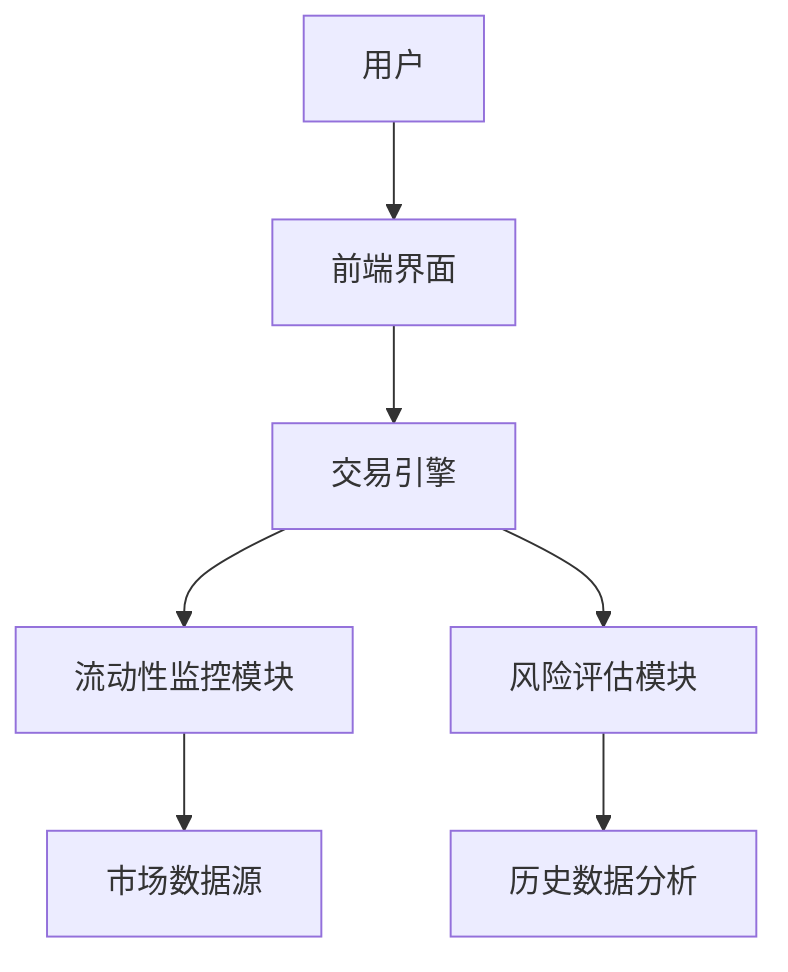
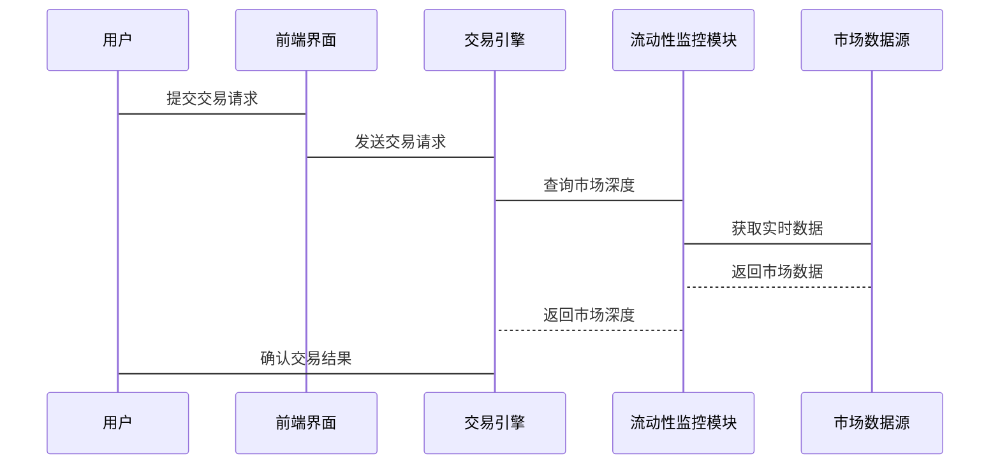
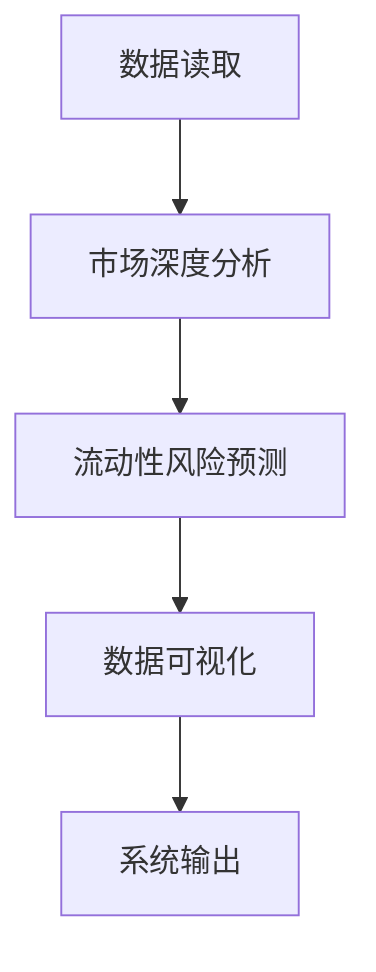

                 


# 金融市场流动性提供策略

## 关键词：
金融市场，流动性，提供策略，风险管理，系统设计，案例分析

## 摘要：
本文详细探讨了金融市场中流动性提供策略的核心概念、实施方法及实际应用。通过分析流动性需求与供给的均衡关系，提出了主动、被动及混合流动性提供策略，并结合系统设计与实际案例，深入剖析了流动性管理中的风险控制与优化方法。文章最后总结了流动性管理的重要性和未来研究方向。

---

## 第一部分: 金融市场流动性概述

## 第1章: 金融市场流动性概述

### 1.1 金融市场的基本概念

#### 1.1.1 金融市场的定义与功能
金融市场是资金供需双方进行交易的场所，其功能包括资金融通、价格发现、风险管理等。流动性作为金融市场的重要特征，决定了市场的活跃程度和交易效率。

#### 1.1.2 流动性在金融体系中的作用
流动性是衡量市场健康程度的关键指标。高流动性市场能够快速匹配买卖双方的需求，降低交易成本，而低流动性市场可能导致价格波动加剧，增加交易风险。

#### 1.1.3 流动性与金融稳定的关系
流动性不足可能导致市场恐慌和价格崩盘，威胁金融稳定。因此，流动性管理是维护金融市场稳定的核心任务之一。

### 1.2 流动性需求与供给

#### 1.2.1 流动性需求的来源
流动性需求主要来自交易者、投资者和机构的短期资金需求。例如，投资者可能因市场机会或资金周转需求而产生流动性需求。

#### 1.2.2 流动性供给的主体
流动性供给主要来自市场参与者，包括机构投资者、做市商和中央银行。做市商通过提供流动性报价，维持市场稳定。

#### 1.2.3 流动性供需的均衡分析
流动性供需的均衡决定了市场的深度和流动性价格。当供给大于需求时，流动性价格下降；当需求大于供给时，流动性价格上升。

### 1.3 流动性价格机制

#### 1.3.1 市场深度与流动性价格
市场深度反映了市场参与者愿意在给定价格下买卖的量。市场深度越大，流动性价格越稳定。

#### 1.3.2 市场冲击与流动性成本
市场冲击是由于大额交易导致的价格波动。流动性成本是指为获得流动性而支付的额外费用。

#### 1.3.3 流动性溢价的形成机制
流动性溢价是由于流动性资产的需求增加而导致的价格上升。流动性溢价反映了市场参与者对流动性风险的定价。

### 1.4 流动性管理的重要性

#### 1.4.1 流动性管理的目标
流动性管理的目标是确保市场参与者能够以合理价格进行交易，维护市场稳定。

#### 1.4.2 流动性管理的主体
流动性管理的主体包括做市商、机构投资者和监管机构。不同主体在流动性管理中扮演不同的角色。

#### 1.4.3 流动性管理的工具与方法
流动性管理的工具包括调整交易规则、引入市场机制和监管干预。做市商通过报价和库存管理提供流动性支持。

---

## 第2章: 金融市场流动性供给策略

### 2.1 主动流动性提供策略

#### 2.1.1 主动流动性供给的定义
主动流动性提供是指市场参与者主动介入市场，通过买卖订单提供流动性支持。

#### 2.1.2 主动流动性供给的实施方法
主动流动性供给的实施方法包括设置买卖订单、调整报价和动态调整库存。

#### 2.1.3 主动流动性供给的风险管理
主动流动性供给的风险包括市场波动风险和流动性风险。市场参与者需要通过风险对冲和库存管理来控制风险。

### 2.2 被动流动性提供策略

#### 2.2.1 被动流动性提供策略的定义
被动流动性提供是指市场参与者根据市场需求被动提供流动性支持，通常通过被动报价和订单匹配实现。

#### 2.2.2 被动流动性提供策略的适用场景
被动流动性提供策略适用于市场流动性需求较低的场景，通常由做市商提供。

#### 2.2.3 被动流动性提供策略的优缺点
被动流动性提供策略的优点是操作简单，风险较低；缺点是流动性提供有限，无法应对市场波动。

### 2.3 混合流动性提供策略

#### 2.3.1 混合策略的定义与特点
混合流动性提供策略结合了主动和被动策略的特点，根据市场情况灵活调整流动性提供方式。

#### 2.3.2 混合策略的实施方法
混合策略的实施方法包括动态调整报价、库存管理以及风险对冲。

#### 2.3.3 混合策略的风险管理
混合策略的风险管理需要综合考虑主动和被动策略的风险，通过动态调整和风险对冲来降低整体风险。

---

## 第3章: 金融市场流动性供给策略的高级分析

### 3.1 流动性风险的定价与管理

#### 3.1.1 流动性风险的定义与特征
流动性风险是指无法以合理价格迅速买卖资产的风险。其特征包括传染性、尾部风险和时间依赖性。

#### 3.1.2 流动性风险的定价模型
流动性风险的定价模型包括凯勒模型和流动性溢价模型。凯勒模型通过市场深度和交易成本定价流动性风险。

#### 3.1.3 流动性风险管理的工具与方法
流动性风险管理的工具包括市场深度监控、风险对冲和监管干预。机构投资者通过监控市场深度和调整交易策略来管理流动性风险。

### 3.2 大数据与机器学习在流动性管理中的应用

#### 3.2.1 大数据在流动性管理中的应用
大数据技术可以帮助机构投资者实时监控市场深度和交易数据，优化流动性管理策略。

#### 3.2.2 机器学习在流动性风险管理中的应用
机器学习算法可以预测市场波动和流动性风险，帮助机构投资者制定更科学的流动性管理策略。

#### 3.2.3 人工智能驱动的流动性管理系统的实现
人工智能驱动的流动性管理系统可以通过实时数据处理和预测模型，优化流动性管理策略。

---

## 第4章: 金融市场流动性提供策略的系统设计

### 4.1 系统架构设计

#### 4.1.1 问题场景介绍
本章讨论如何设计一个高效的流动性管理系统，帮助机构投资者实时监控市场深度和交易数据，优化流动性管理策略。

#### 4.1.2 系统功能设计
系统功能包括市场数据采集、流动性监控、风险评估和交易执行。系统设计需要考虑数据处理效率和实时性。

#### 4.1.3 系统架构图
以下是系统的架构图：



#### 4.1.4 系统接口设计
系统接口包括用户界面、交易引擎和市场数据接口。用户通过前端界面提交交易请求，系统通过交易引擎处理交易，并从市场数据源获取实时数据。

#### 4.1.5 系统交互流程
以下是系统的交互流程图：



### 4.2 系统实现

#### 4.2.1 环境安装
需要安装Python、Pandas、NumPy、Matplotlib和Scikit-learn等库。

#### 4.2.2 核心代码实现
以下是流动性监控模块的核心代码：

```python
import pandas as pd
import numpy as np
import matplotlib.pyplot as plt
from sklearn import linear_model

# 数据读取
data = pd.read_csv('market_depth.csv')

# 市场深度分析
def market_depth_analysis(data):
    # 计算市场深度
    bid_volume = data['bid_volume']
    ask_volume = data['ask_volume']
    spread = data['spread']
    depth = (bid_volume + ask_volume) / (bid_volume + ask_volume + 1e-9)
    return depth

# 流动性风险预测
def liquidity_risk_prediction(data):
    # 使用线性回归模型预测流动性风险
    model = linear_model.LinearRegression()
    X = data[['bid_volume', 'ask_volume', 'spread']]
    y = data['risk']
    model.fit(X, y)
    return model

# 数据分析与可视化
def data_visualization(data):
    plt.figure(figsize=(10, 6))
    plt.plot(data['time'], data['depth'], label='Market Depth')
    plt.xlabel('Time')
    plt.ylabel('Depth')
    plt.legend()
    plt.show()

# 主函数
def main():
    depth = market_depth_analysis(data)
    model = liquidity_risk_prediction(data)
    data_visualization(data)

if __name__ == '__main__':
    main()
```

#### 4.2.3 系统流程图
以下是系统的流程图：



---

## 第5章: 金融市场流动性提供策略的实战案例

### 5.1 项目介绍

#### 5.1.1 项目背景
本案例旨在设计一个基于大数据和机器学习的流动性管理系统，帮助机构投资者实时监控市场深度和交易数据，优化流动性管理策略。

#### 5.1.2 项目目标
项目目标包括实时监控市场深度、预测流动性风险和优化流动性管理策略。

### 5.2 项目实现

#### 5.2.1 环境安装
需要安装Python、Pandas、NumPy、Matplotlib和Scikit-learn等库。

#### 5.2.2 核心代码实现
以下是项目的核心代码：

```python
import pandas as pd
import numpy as np
import matplotlib.pyplot as plt
from sklearn import linear_model

# 数据读取
data = pd.read_csv('market_depth.csv')

# 市场深度分析
def market_depth_analysis(data):
    bid_volume = data['bid_volume']
    ask_volume = data['ask_volume']
    spread = data['spread']
    depth = (bid_volume + ask_volume) / (bid_volume + ask_volume + 1e-9)
    return depth

# 流动性风险预测
def liquidity_risk_prediction(data):
    model = linear_model.LinearRegression()
    X = data[['bid_volume', 'ask_volume', 'spread']]
    y = data['risk']
    model.fit(X, y)
    return model

# 数据分析与可视化
def data_visualization(data):
    plt.figure(figsize=(10, 6))
    plt.plot(data['time'], data['depth'], label='Market Depth')
    plt.xlabel('Time')
    plt.ylabel('Depth')
    plt.legend()
    plt.show()

# 主函数
def main():
    depth = market_depth_analysis(data)
    model = liquidity_risk_prediction(data)
    data_visualization(data)

if __name__ == '__main__':
    main()
```

#### 5.2.3 案例分析
通过对市场深度数据的分析，我们可以预测流动性风险，并优化流动性管理策略。例如，当市场深度较低时，系统会自动调整报价策略，以降低流动性风险。

---

## 第6章: 金融市场流动性提供策略的风险管理与优化

### 6.1 流动性风险管理

#### 6.1.1 流动性风险的识别与评估
流动性风险的识别包括市场深度监控和交易成本分析。评估方法包括市场深度分析和流动性溢价模型。

#### 6.1.2 流动性风险管理的工具与方法
流动性风险管理的工具包括市场深度监控、风险对冲和监管干预。机构投资者通过监控市场深度和调整交易策略来管理流动性风险。

### 6.2 流动性管理的优化

#### 6.2.1 流动性管理策略的优化
流动性管理策略的优化包括动态调整报价和库存管理。机构投资者可以根据市场情况动态调整报价，优化流动性管理策略。

#### 6.2.2 流动性管理系统的优化
流动性管理系统的优化包括实时数据处理和预测模型优化。通过优化系统架构和算法，可以提高系统的处理效率和准确性。

---

## 第7章: 总结与展望

### 7.1 总结
本文详细探讨了金融市场流动性提供策略的核心概念、实施方法及实际应用。通过分析流动性需求与供给的均衡关系，提出了主动、被动及混合流动性提供策略，并结合系统设计与实际案例，深入剖析了流动性管理中的风险控制与优化方法。

### 7.2 展望
未来的研究可以进一步探索大数据和人工智能在流动性管理中的应用，优化流动性管理策略。同时，还需要加强国际间的合作，制定更加完善的流动性管理标准和监管框架。

---

## 作者：AI天才研究院/AI Genius Institute & 禅与计算机程序设计艺术 /Zen And The Art of Computer Programming

---

**本文是基于《金融市场流动性提供策略》的思考与分析，通过详细阐述流动性提供策略的核心概念、实施方法及实际应用，帮助读者系统地理解和掌握金融市场流动性管理的相关知识。**

