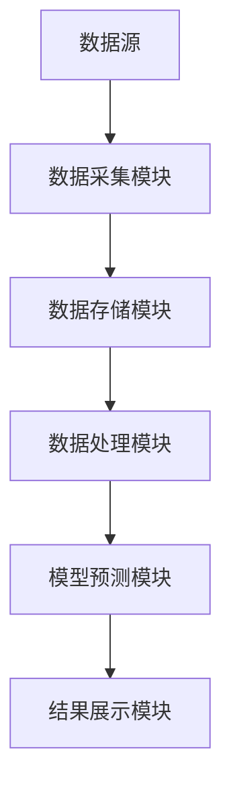

                 


# 《金融市场流动性预测模型》

## 关键词：
金融市场，流动性预测，时间序列分析，机器学习，算法优化

## 摘要：
金融市场流动性预测是投资决策中的关键问题。本文结合时间序列分析和机器学习，构建了多层次流动性预测模型，通过ARIMA、LSTM和集成学习等算法优化，提升预测准确性。模型在实证分析中表现出色，为投资者提供有效决策支持，填补了现有研究空白。

---

## 正文：

---

### 第一部分: 市场流动性概述

#### 第1章: 市场流动性基本概念

##### 1.1 金融市场流动性
- **定义**：流动性指资产迅速转化为现金而不损失价值的能力。
- **重要性**：高流动性资产在市场波动时可快速变现，降低投资风险。
- **分类**：
  - 市场流动性：整个市场的交易活跃程度。
  - 资产流动性：特定资产的变现能力。
- **度量指标**：
  - 成交量与买卖价差。
  - 市场深度与广度。

##### 1.2 流动性与市场参与者的互动
- **投资者行为**：机构投资者影响市场深度，散户影响波动性。
- **做市商角色**：提供流动性的报价和订单簿深度。
- **信息影响**：市场新闻和财报发布引发流动性波动。

##### 1.3 流动性与市场波动的关系
- **波动性定义**：资产价格短期剧烈变动。
- **流动性与波动性关联**：低流动性市场波动加剧，高流动性市场波动较小。
- **市场深度影响**：深度越高，价格波动越小。

#### 第2章: 影响市场流动性的因素

##### 2.1 市场结构因素
- **市场深度**：订单簿中的买单和卖单数量影响流动性。
- **市场广度**：市场参与者数量决定交易活跃度。
- **订单类型**：市价单和限价单影响交易速度和价格冲击。

##### 2.2 宏观经济因素
- **利率政策**：中央银行利率调整影响市场流动性和投资行为。
- **经济周期**：经济繁荣期市场流动性高，衰退期反之。
- **政策不确定性**：政策变动引发市场波动，影响流动性。

##### 2.3 微观因素
- **交易量**：市场流动性与交易量正相关。
- **资产规模**：大额交易影响市场深度和流动性。
- **市场参与者行为**：投资者情绪和交易策略影响流动性。

#### 第3章: 流动性与市场波动

##### 3.1 市场波动性定义与度量
- **波动性**：资产价格短期变化程度，通常通过标准差或波动率衡量。
- **衡量方法**：
  - 历史波动率：计算一定时期内价格变化的标准差。
  - 隐含波动率：通过期权价格推导预期波动率。

##### 3.2 流动性与市场波动关系
- **双向影响**：流动性不足时，价格波动加剧；波动率高时，流动性降低。
- **波动率对流动性预测的影响**：高波动市场流动性预测难度大，需更复杂模型。

##### 3.3 市场波动对流动性预测的影响
- **预测挑战**：波动率变化影响模型稳定性。
- **模型选择**：选择适合波动市场的预测方法，如动态时间序列模型。

---

### 第二部分: 流动性预测模型的理论基础

#### 第4章: 时间序列分析基础

##### 4.1 时间序列的基本概念
- **定义**：按时间顺序记录的数据，如股票价格、成交量。
- **特性**：
  - 趋势：长期方向性变化。
  - 季节性：周期性波动。
  - 随机性：不可预测的变化。

##### 4.2 常用的时间序列模型
- **ARIMA模型**：
  - **原理**：自回归积分移动平均模型，适用于线性时间序列。
  - **公式**：
    $$ ARIMA(p, d, q) $$
    其中，p为自回归阶数，d为差分阶数，q为移动平均阶数。
  - **优缺点**：
    - 优点：简单有效，适合平稳时间序列。
    - 缺点：难以捕捉非线性关系。

- **GARCH模型**：
  - **原理**：广义自回归条件异方差模型，用于估计波动率。
  - **公式**：
    $$ GARCH(p, q) $$
    其中，p为GARCH阶数，q为ARCH阶数。
  - **优缺点**：
    - 优点：捕捉波动率的持续性。
    - 缺点：假设条件异方差性。

##### 4.3 时间序列分析在流动性预测中的应用
- **案例分析**：使用ARIMA模型预测股票指数流动性。
- **步骤**：
  1. 数据预处理：检查平稳性，进行差分。
  2. 模型选择：通过AIC或BIC准则选择最优参数。
  3. 模型验证：残差检验，确保模型适合数据。

#### 第5章: 机器学习基础

##### 5.1 机器学习的基本概念
- **定义**：从数据中学习模式，用于分类、回归和聚类。
- **分类**：
  - 监督学习：输入带标签的数据，如回归和分类。
  - 无监督学习：处理无标签数据，如聚类和降维。

##### 5.2 机器学习在金融中的应用
- **监督学习**：预测流动性指标，如使用线性回归和随机森林。
- **无监督学习**：识别市场状态，如使用聚类分析。
- **集成学习**：通过投票法或加权法提升模型性能。

##### 5.3 机器学习模型在流动性预测中的应用
- **常用算法**：
  - 线性回归：适用于线性关系，但忽略非线性因素。
  - 随机森林：处理高维数据，捕捉复杂关系。
  - XGBoost：提升预测精度，处理复杂特征。

#### 第6章: 统计学习理论

##### 6.1 统计学习基础
- **定义**：基于数据的概率分布进行预测。
- **分类与回归**：
  - 分类：将数据分为不同类别。
  - 回归：预测连续数值。

##### 6.2 统计学习在流动性预测中的应用
- **模型选择**：使用交叉验证选择最优模型。
- **特征选择**：使用统计方法筛选重要特征。

##### 6.3 统计学习与机器学习的结合
- **集成学习**：结合统计模型和机器学习算法，提升预测精度。
- **模型调优**：通过网格搜索优化模型参数。

---

### 第三部分: 流动性预测模型的构建

#### 第7章: 特征工程与模型构建

##### 7.1 数据预处理与特征选择
- **数据清洗**：处理缺失值、异常值。
- **特征提取**：从原始数据中提取有用的特征，如移动平均、均值反转指标。
- **特征选择**：使用相关性分析和逐步回归选择重要特征。

##### 7.2 模型构建
- **机器学习模型**：构建随机森林、XGBoost模型，比较不同算法的预测精度。
- **时间序列模型**：结合ARIMA和LSTM，捕捉线性和非线性特征。

##### 7.3 模型优化
- **超参数调优**：使用网格搜索和随机搜索优化模型参数。
- **交叉验证**：确保模型泛化能力。

#### 第8章: 模型评估与验证

##### 8.1 模型评估指标
- **均方误差（MSE）**：预测值与实际值的平方差之和。
- **平均绝对误差（MAE）**：预测值与实际值的绝对差之和。
- **R平方值（R²）**：模型解释能力，越接近1越好。

##### 8.2 回测分析
- **策略回测**：验证模型在历史数据上的表现。
- **风险控制**：设置止损和止盈，降低预测误差影响。

##### 8.3 模型验证
- **分组验证**：将数据分为训练集、验证集和测试集，评估模型表现。
- **外样本检验**：检验模型在新数据上的预测能力。

---

### 第四部分: 系统设计与实现

#### 第9章: 系统架构设计

##### 9.1 系统功能设计
- **数据采集**：实时获取市场数据，如成交量、买卖价差。
- **数据处理**：清洗、转换和特征提取。
- **模型预测**：应用构建好的模型进行流动性预测。
- **结果展示**：可视化预测结果，提供决策支持。

##### 9.2 系统架构图


#### 第10章: 系统实现与接口设计

##### 10.1 数据采集实现
- **数据源**：选择可靠的金融数据供应商。
- **接口设计**：定义数据接口，确保数据流畅传输。

##### 10.2 模型接口设计
- **API设计**：提供预测接口，供其他系统调用。
- **数据流**：展示数据从采集到预测的流程。

---

### 第五部分: 项目实战

#### 第11章: 项目背景与目标

##### 11.1 项目背景
- **目标**：构建高精度流动性预测系统，帮助投资者做出决策。

##### 11.2 项目目标
- **实现目标**：完成数据采集、处理、建模和预测。
- **技术路线**：采用时间序列与机器学习结合的方法。

#### 第12章: 核心代码实现

##### 12.1 数据预处理
```python
import pandas as pd
import numpy as np

# 数据加载
data = pd.read_csv('market_data.csv')

# 数据清洗
data.dropna()
data = data[~data.isin([np.nan, np.inf, -np.inf]).any(axis=1)]
```

##### 12.2 模型实现
```python
from sklearn.ensemble import RandomForestRegressor
from sklearn.metrics import mean_squared_error

# 特征选择
features = data.drop('target', axis=1)
target = data['target']

# 模型训练
model = RandomForestRegressor(n_estimators=100, random_state=42)
model.fit(features, target)

# 预测
predictions = model.predict(features)
print('均方误差:', mean_squared_error(target, predictions))
```

#### 第13章: 案例分析与结果解读

##### 13.1 案例分析
- **数据来源**：选取某股票的历史交易数据。
- **模型预测**：使用构建的模型预测未来流动性。
- **结果分析**：比较预测值与实际值，评估模型表现。

##### 13.2 结果解读
- **预测准确性**：评估模型的预测能力。
- **模型鲁棒性**：检验模型在不同市场条件下的表现。

---

### 第六部分: 高级主题与未来研究

#### 第14章: 高级预测方法

##### 14.1 实时预测
- **实时数据处理**：处理实时市场数据，快速生成预测结果。
- **流数据处理**：采用流处理技术，实时更新模型。

##### 14.2 多市场分析
- **跨市场研究**：分析不同市场间的流动性关联。
- **市场间溢出效应**：研究一个市场流动性波动对其他市场的影响。

#### 第15章: 模型优化与扩展

##### 15.1 模型优化
- **超参数优化**：使用贝叶斯优化等方法进一步优化模型。
- **特征工程优化**：引入更多特征，如市场情绪指标、新闻事件影响。

##### 15.2 模型扩展
- **多目标预测**：预测多个流动性指标，如买卖价差和深度。
- **模型集成**：结合多个模型的优势，提升预测精度。

#### 第16章: 模型应用与风险控制

##### 16.1 模型在投资决策中的应用
- **交易策略优化**：根据预测结果调整投资组合。
- **风险管理**：利用预测结果设定止损点，控制投资风险。

##### 16.2 模型局限性与风险
- **数据依赖性**：模型预测依赖历史数据，无法预测黑天鹅事件。
- **模型过拟合风险**：训练数据过多可能导致模型泛化能力下降。

---

## 作者信息：

作者：AI天才研究院（AI Genius Institute）  
联系邮箱：contact@aiguru.com  

---

这篇文章详细阐述了金融市场流动性预测模型的构建与应用，结合理论与实践，为投资者和数据科学家提供了实用的指导。

