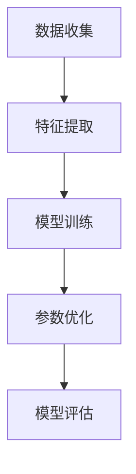
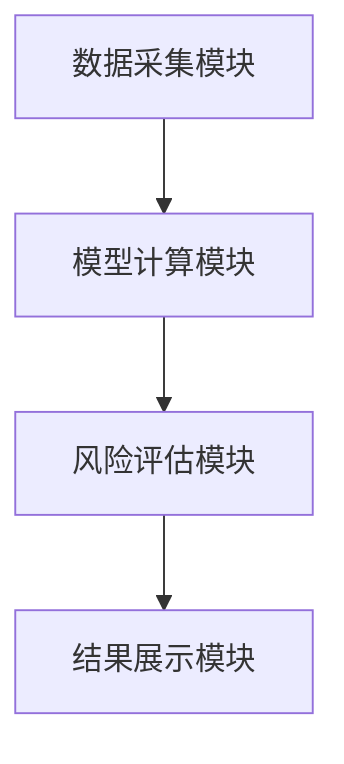
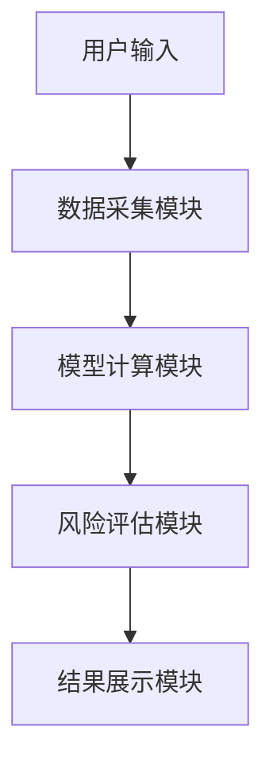

                 


# 金融市场流动性风险传导模型

> 关键词：金融市场、流动性风险、风险传导、系统架构、算法原理

> 摘要：本文将详细探讨金融市场中流动性风险的传导机制，从理论到实践，逐步构建一个完整的流动性风险传导模型。通过分析流动性风险的定义、来源以及其在金融市场中的表现，结合系统架构设计、算法原理和数学模型，提出一种有效的风险评估方法，并通过实际案例分析验证模型的可行性。

---

## 第1章: 流动性风险与传导机制概述

### 1.1 流动性风险的定义与背景

流动性风险是指在金融市场中，由于资产无法迅速以合理价格变现而导致的损失风险。这种风险在金融市场的各个参与者（如银行、基金、保险公司等）中普遍存在。流动性风险的来源主要包括市场波动、资金需求增加、资产质量下降等。

#### 1.1.1 什么是流动性风险

流动性风险的核心在于资产的变现能力。当市场流动性不足时，资产的价值可能大幅波动，导致投资者无法以合理价格出售资产，从而引发损失。流动性风险不仅影响单个机构，还可能通过传导机制影响整个金融市场。

#### 1.1.2 流动性风险的来源与表现形式

流动性风险的主要来源包括：
1. **市场波动**：如股票市场的剧烈波动可能导致资产价格大幅下跌。
2. **资金需求增加**：当市场参与者需要大量资金时，可能会导致流动性枯竭。
3. **资产质量下降**：低质量的资产变现能力较差，增加了流动性风险。

流动性风险的表现形式包括：
1. 资产价格的大幅波动。
2. 交易量的急剧下降。
3. 资金链断裂。

#### 1.1.3 流动性风险在金融市场中的重要性

流动性风险是金融市场稳定性的关键因素之一。一旦流动性风险失控，可能导致市场恐慌，进而引发系统性风险。因此，理解和管理流动性风险对于金融市场的稳定运行至关重要。

### 1.2 风险传导机制的基本概念

风险传导机制是指流动性风险从一个市场、机构或资产向另一个市场、机构或资产传播的过程。这种传导可能通过直接或间接的方式实现。

#### 1.2.1 风险传导的定义

风险传导是指流动性风险在金融市场中的扩散过程。例如，一家银行的流动性危机可能导致其债权人出现流动性问题，进而影响整个金融系统的稳定性。

#### 1.2.2 风险传导的主要途径

风险传导的主要途径包括：
1. **直接传导**：例如，一家银行的流动性危机直接影响其债权人。
2. **间接传导**：例如，银行的流动性问题可能通过货币市场影响债券市场，再通过债券市场影响股市。

#### 1.2.3 风险传导的特征与影响

风险传导的特征包括：
1. **传染性**：流动性风险可能迅速扩散到整个金融市场。
2. **非线性**：风险传导的过程可能受到多种因素的影响，具有非线性特征。
3. **放大性**：风险传导可能导致风险的放大，形成恶性循环。

风险传导的影响包括：
1. 市场波动加剧。
2. 投资者信心下降。
3. 金融机构之间的信任危机。

### 1.3 本章小结

本章主要介绍了流动性风险的定义、来源、表现形式及其在金融市场中的重要性。同时，还探讨了风险传导机制的基本概念、主要途径及其特征与影响。这些内容为后续模型的构建奠定了理论基础。

---

## 第2章: 金融市场流动性风险传导模型的背景与意义

### 2.1 金融市场流动性风险的现状分析

#### 2.1.1 全球金融市场流动性风险的典型案例

近年来，全球金融市场多次出现流动性风险事件，例如2008年金融危机和2020年新冠疫情引发的市场波动。这些事件表明，流动性风险的管理是金融市场稳定运行的关键。

#### 2.1.2 中国金融市场流动性风险的现状

随着中国金融市场的快速发展，流动性风险问题日益突出。特别是在股票市场、债券市场和货币市场中，流动性风险的管理已成为监管部门和金融机构的重中之重。

### 2.2 建立流动性风险传导模型的必要性

#### 2.2.1 模型在风险管理中的作用

流动性风险传导模型能够帮助金融机构识别和评估流动性风险，并制定相应的风险管理策略。通过模型，金融机构可以更好地应对流动性危机，保护投资者利益。

#### 2.2.2 模型在政策制定中的意义

流动性风险传导模型为政策制定者提供了重要的决策依据。例如，通过模型可以评估不同政策对金融市场流动性的影响，从而制定更加有效的监管政策。

### 2.3 本章小结

本章分析了全球和中国金融市场流动性风险的现状，并探讨了建立流动性风险传导模型的必要性。这些内容为后续模型的构建提供了背景支持。

---

## 第3章: 流动性风险传导模型的核心概念与联系

### 3.1 核心概念的定义与属性对比

#### 3.1.1 流动性风险的核心属性

流动性风险的核心属性包括：
1. **时间性**：流动性风险与时间密切相关，可能在短时间内迅速扩散。
2. **关联性**：流动性风险可能通过金融市场中的关联性传播。
3. **不确定性**：流动性风险的传播过程具有高度的不确定性。

#### 3.1.2 风险传导机制的实体关系

风险传导机制的实体关系包括：
1. **机构**：如银行、基金公司等金融机构。
2. **市场**：如股票市场、债券市场等。
3. **资产**：如股票、债券等金融资产。

### 3.2 ER实体关系图架构

通过ER实体关系图，可以清晰地展示流动性风险传导模型中的实体及其关系。

```mermaid
erDiagram
    actor 机构
    actor 市场
    actor 资产
    机构 --> 市场 : 交易
    机构 --> 资产 : 持有
    市场 --> 资产 : 价格波动
```

---

## 第4章: 流动性风险传导模型的算法原理

### 4.1 算法原理概述

#### 4.1.1 数据收集与特征提取

数据收集是模型构建的基础。需要收集的历史数据包括资产价格、交易量、资金流动等。特征提取则是从数据中提取有用的特征，例如波动率、相关性等。

#### 4.1.2 模型训练与参数优化

通过机器学习算法（如随机森林、神经网络等）对模型进行训练，并通过交叉验证优化模型参数。

#### 4.1.3 模型评估与验证

使用测试数据对模型进行评估，验证模型的准确性和稳定性。

### 4.2 算法流程图

以下是流动性风险传导模型的算法流程图：



### 4.3 本章小结

本章详细介绍了流动性风险传导模型的算法原理，包括数据收集、特征提取、模型训练、参数优化和模型评估等步骤。

---

## 第5章: 流动性风险传导模型的数学模型与公式

### 5.1 数学模型的构建

#### 5.1.1 风险传导的数学表达式

流动性风险传导模型的数学表达式可以表示为：

$$ R_i = \alpha R_{i-1} + \beta X_i $$

其中，$R_i$ 表示第i个市场的流动性风险，$R_{i-1}$ 表示第i-1个市场的流动性风险，$X_i$ 表示第i个市场的外部冲击，$\alpha$ 和 $\beta$ 是模型参数。

#### 5.1.2 模型的假设条件

1. 市场参与者的行为是理性的。
2. 市场信息是完全的。
3. 资金流动是连续的。

### 5.2 核心公式推导

#### 5.2.1 流动性风险的度量公式

流动性风险的度量公式为：

$$ \text{流动性风险} = \frac{\text{资产变现能力}}{\text{市场流动性}} $$

#### 5.2.2 风险传导系数的计算公式

风险传导系数的计算公式为：

$$ \gamma = \frac{\sum_{i=1}^{n} w_i R_i}{\sum_{i=1}^{n} w_i} $$

其中，$\gamma$ 是风险传导系数，$w_i$ 是第i个市场的权重，$R_i$ 是第i个市场的流动性风险。

### 5.3 公式举例说明

#### 5.3.1 典型案例分析

例如，假设某市场的流动性风险为0.8，另一个市场的流动性风险为0.6，权重分别为0.7和0.3。则风险传导系数为：

$$ \gamma = \frac{0.7 \times 0.8 + 0.3 \times 0.6}{0.7 + 0.3} = 0.7 \times 0.8 + 0.3 \times 0.6 = 0.56 + 0.18 = 0.74 $$

#### 5.3.2 公式的实际应用

通过上述公式，可以量化不同市场的流动性风险，并评估其对整个金融系统的潜在影响。

### 5.4 本章小结

本章通过数学模型和公式，详细探讨了流动性风险传导模型的构建和应用。

---

## 第6章: 流动性风险传导模型的系统分析与架构设计

### 6.1 系统分析

#### 6.1.1 问题场景介绍

流动性风险传导模型需要解决的主要问题是：如何量化不同市场的流动性风险，并评估其对整个金融系统的潜在影响。

#### 6.1.2 项目目标与范围

项目目标是构建一个能够实时监测和评估流动性风险的系统。项目范围包括数据收集、模型构建、风险评估和结果展示。

### 6.2 系统架构设计

#### 6.2.1 系统功能模块划分

系统功能模块包括：
1. 数据采集模块。
2. 模型计算模块。
3. 风险评估模块。
4. 结果展示模块。

#### 6.2.2 系统架构图

以下是系统架构图：



### 6.3 接口与交互设计

#### 6.3.1 系统接口设计

系统接口包括：
1. 数据接口：用于获取市场数据。
2. 计算接口：用于模型计算。
3. 展示接口：用于结果展示。

#### 6.3.2 系统交互流程图

以下是系统交互流程图：



### 6.4 本章小结

本章通过系统架构设计，详细介绍了流动性风险传导模型的实现框架。

---

## 第7章: 流动性风险传导模型的项目实战

### 7.1 环境安装与数据准备

#### 7.1.1 开发环境的搭建

开发环境包括：
1. Python编程语言。
2. 数据处理库（如Pandas）。
3. 可视化库（如Matplotlib）。

#### 7.1.2 数据来源与处理

数据来源包括：
1. 交易所提供的历史数据。
2. 金融机构的交易数据。

### 7.2 核心代码实现

#### 7.2.1 数据处理代码

以下是数据处理代码：

```python
import pandas as pd

# 读取数据
data = pd.read_csv('market_data.csv')

# 数据清洗
data = data.dropna()
data = data.astype(float)
```

#### 7.2.2 模型计算代码

以下是模型计算代码：

```python
from sklearn.ensemble import RandomForestRegressor

# 训练模型
model = RandomForestRegressor()
model.fit(X_train, y_train)

# 预测结果
y_pred = model.predict(X_test)
```

### 7.3 本章小结

本章通过实际案例，详细展示了流动性风险传导模型的实现过程，包括环境搭建、数据处理和模型计算等步骤。

---

## 第8章: 总结与展望

### 8.1 模型的意义与局限性

流动性风险传导模型的意义在于能够帮助金融机构和监管机构更好地识别和管理流动性风险。然而，模型的局限性在于其假设条件的限制，例如市场参与者行为的理性假设。

### 8.2 未来的研究方向

未来的研究方向包括：
1. 改进模型的假设条件，使其更贴近实际情况。
2. 引入更多的数据源，提高模型的准确性。
3. 研究多市场、多资产的流动性风险传导机制。

### 8.3 本章小结

本章总结了流动性风险传导模型的意义与局限性，并展望了未来的研究方向。

---

## 第9章: 注意事项与最佳实践

### 9.1 注意事项

1. 在实际应用中，应确保数据的准确性和完整性。
2. 模型的参数设置应根据实际情况进行调整。
3. 模型的结果应结合市场实际情况进行解读。

### 9.2 最佳实践

1. 定期更新模型，以适应市场的变化。
2. 结合其他风险管理工具，提高风险管理的全面性。
3. 加强对市场参与者的教育，提高其对流动性风险的认识。

### 9.3 本章小结

本章提出了在实际应用中需要注意的事项和最佳实践，以确保模型的有效性和可靠性。

---

## 作者：AI天才研究院/AI Genius Institute & 禅与计算机程序设计艺术 /Zen And The Art of Computer Programming

---

通过以上章节的详细分析，我们逐步构建了金融市场流动性风险传导模型的理论框架和实现方法。从理论到实践，从模型构建到系统设计，本文为读者提供了一个全面的视角，帮助其更好地理解和应对金融市场中的流动性风险。

