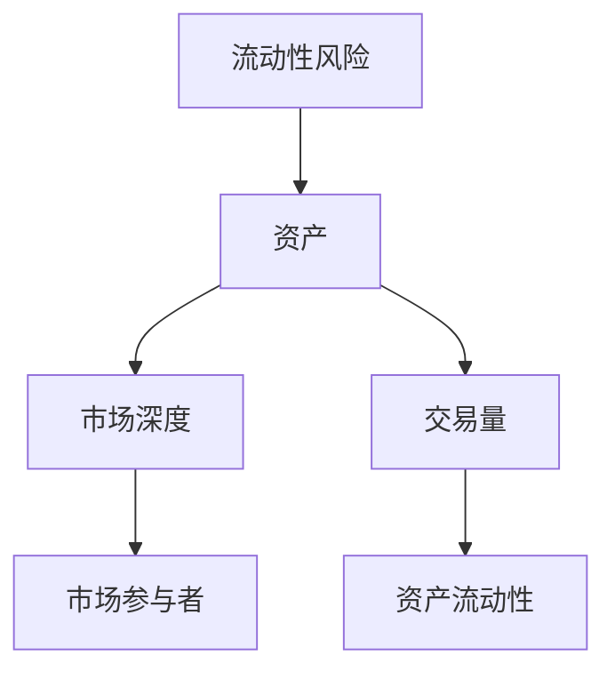
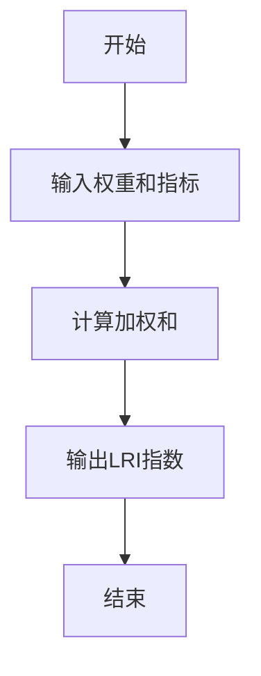
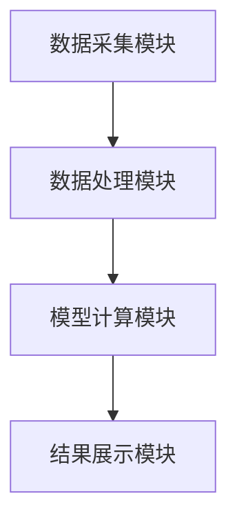
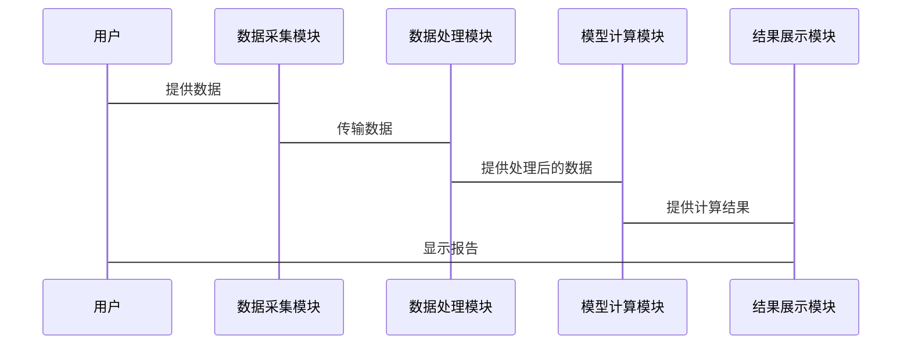

                 


# 金融市场流动性风险度量

> 关键词：金融市场，流动性风险，VaR，LRI模型，压力测试

> 摘要：本文系统地探讨了金融市场流动性风险的度量方法，从基本概念、度量模型、算法原理到系统设计与实战案例进行了全面分析。文章首先介绍了流动性风险的定义、特征及其与其他金融风险的关系，然后重点阐述了基于VaR、压力测试和Liquidity Risk Index (LRI) 的度量方法。通过数学模型和算法实现，详细讲解了LRI模型的原理，并结合实际案例展示了系统的构建与应用。最后，本文总结了流动性风险度量的关键点及未来研究方向。

---

## 第一章: 流动性风险概述

### 1.1 流动性风险的基本概念

#### 1.1.1 什么是流动性风险
流动性风险是指在金融市场中，资产在不损失价值的情况下迅速转换为现金的能力所面临的风险。简单来说，当资产难以在合理时间内以合理价格变现时，就产生了流动性风险。

#### 1.1.2 流动性风险的定义与特征
流动性风险的定义可以概括为：由于市场深度不足、市场参与者减少或资产本身流动性差而导致资产变现成本增加或变现能力下降的风险。

其主要特征包括：
1. **时间性**：流动性风险随时间变化而变化。
2. **资产相关性**：流动性风险与资产的流动性特性密切相关。
3. **市场环境依赖性**：流动性风险受市场整体环境和参与者行为的影响。

#### 1.1.3 流动性风险的分类与层次
流动性风险可以分为微观和宏观两个层面：
1. **微观流动性风险**：单个资产或个别金融机构面临的流动性风险。
2. **宏观流动性风险**：整个金融系统或市场层面的流动性风险。

---

### 1.2 流动性风险的背景与问题背景

#### 1.2.1 金融市场中的流动性问题
现代金融市场中，流动性问题频繁出现，尤其是在金融危机期间。例如，2008年全球金融危机就暴露了金融机构在流动性管理上的不足。

#### 1.2.2 流动性风险的产生原因
流动性风险的产生主要源于以下几个方面：
1. **市场深度不足**：交易量小或市场参与者少，导致资产难以快速变现。
2. **资产流动性差**：某些资产本身的流动性较低，如某些复杂的金融衍生品。
3. **市场参与者行为**：投资者的恐慌性抛售或赎回行为会加剧流动性风险。

#### 1.2.3 流动性风险的影响与后果
流动性风险的影响是多方面的，包括：
1. **资产价值损失**：变现成本增加会导致资产价值下降。
2. **市场波动加剧**：流动性风险会引发市场的剧烈波动。
3. **系统性风险增加**：个别机构的流动性问题可能引发系统性金融危机。

---

## 第二章: 流动性风险度量的核心概念与联系

### 2.1 流动性风险度量的原理与方法

#### 2.1.1 流动性风险度量的基本原理
流动性风险度量的核心在于量化资产或机构在特定条件下的变现能力。常用的度量方法包括：
1. **VaR（Value at Risk）**：度量在一定置信水平下可能的最大损失。
2. **压力测试**：模拟极端市场条件下的流动性压力。
3. **Liquidity Risk Index (LRI)**：基于多种指标综合评估流动性风险。

#### 2.1.2 流动性风险度量的主要方法
1. **VaR方法**：通过统计分析确定资产在正常市场条件下的最大可能损失。
2. **压力测试**：模拟极端市场条件下的流动性压力，评估机构的应对能力。
3. **LRI方法**：综合考虑市场深度、资产流动性等多种因素，给出流动性风险的综合指数。

#### 2.1.3 流动性风险度量的数学模型
常用的流动性风险度量模型包括：
- **LPM（Liquidity Penalty Model）**
- **H-R模型**
- **VaR方法**

---

### 2.2 流动性风险度量的核心概念对比

#### 2.2.1 流动性风险度量的关键属性
| 度量方法 | 输入变量 | 输出结果 | 适用场景 |
|----------|-----------|-----------|----------|
| VaR      | 历史数据、置信水平 | 最大损失值 | 正常市场条件 |
| 压力测试 | 极端市场情景 | 流动性压力指标 | 极端市场条件 |
| LRI      | 多种流动性指标 | 流动性风险指数 | 综合评估 |

#### 2.2.2 不同度量方法的特征对比
- **VaR方法**：适用于正常市场条件下的风险度量，但不考虑流动性因素。
- **压力测试**：适用于极端市场条件下的流动性压力评估。
- **LRI方法**：综合考虑多种流动性指标，适用于全面评估流动性风险。

#### 2.2.3 流动性风险度量的ER实体关系图


---

## 第三章: 流动性风险度量的算法原理

### 3.1 流动性风险度量的主要算法

#### 3.1.1 基于VaR的流动性风险度量
VaR方法通过统计分析确定资产在正常市场条件下的最大可能损失。其计算公式为：
$$ VaR = \mu + z \cdot \sigma $$
其中，$\mu$ 是平均值，$z$ 是标准正态分布的分位数，$\sigma$ 是标准差。

#### 3.1.2 基于压力测试的流动性风险度量
压力测试模拟极端市场条件下的流动性压力，计算公式为：
$$ \text{流动性压力} = \frac{\text{潜在损失}}{\text{可用流动性资产}} $$

#### 3.1.3 基于LRI的流动性风险度量
LRI模型综合考虑多种流动性指标，计算公式为：
$$ LRI = \sum_{i=1}^{n} w_i \cdot x_i $$
其中，$w_i$ 是权重，$x_i$ 是各指标的值。

---

### 3.2 LRI模型的算法原理

#### 3.2.1 LRI模型的输入与输出
- **输入**：市场深度、交易量、资产流动性等指标。
- **输出**：流动性风险指数（LRI）。

#### 3.2.2 LRI模型的计算步骤
1. 收集相关流动性指标。
2. 给予各指标赋予权重。
3. 计算各指标的加权和。
4. 输出LRI指数。

#### 3.2.3 LRI模型的数学公式
$$ LRI = w_1 \cdot x_1 + w_2 \cdot x_2 + \cdots + w_n \cdot x_n $$

---

### 3.3 算法实现与代码示例

#### 3.3.1 Python代码实现
```python
import numpy as np

def calculate_LRI(weights, indicators):
    return np.dot(weights, indicators)

# 示例
weights = [0.3, 0.4, 0.3]
indicators = [0.8, 0.6, 0.9]
lri = calculate_LRI(weights, indicators)
print("LRI指数为:", lri)
```

#### 3.3.2 算法流程图


---

## 第四章: 流动性风险度量的系统分析与架构设计

### 4.1 问题场景与系统需求

#### 4.1.1 流动性风险度量的典型场景
- 单一资产的流动性风险评估。
- 金融机构的流动性风险监控。
- 金融市场整体流动性风险预警。

#### 4.1.2 系统功能需求分析
1. 数据采集与处理。
2. 模型计算与分析。
3. 结果展示与报告生成。

#### 4.1.3 系统性能需求
- 高效的数据处理能力。
- 实时的模型计算能力。

---

### 4.2 系统架构设计

#### 4.2.1 系统功能模块划分
1. 数据采集模块。
2. 模型计算模块。
3. 结果展示模块。

#### 4.2.2 系统架构图


#### 4.2.3 模块之间的接口设计
- 数据采集模块向数据处理模块提供原始数据。
- 数据处理模块向模型计算模块提供处理后的数据。
- 模型计算模块向结果展示模块提供计算结果。

---

### 4.3 系统交互设计

#### 4.3.1 用户与系统的交互流程
1. 用户输入数据。
2. 系统处理数据。
3. 系统输出结果。

#### 4.3.2 系统内部的交互流程
1. 数据采集模块获取数据。
2. 数据处理模块清洗数据。
3. 模型计算模块计算LRI指数。
4. 结果展示模块生成报告。

#### 4.3.3 交互序列图


---

## 第五章: 流动性风险度量的项目实战

### 5.1 项目环境与数据准备

#### 5.1.1 环境搭建与工具安装
- 安装Python、NumPy、Pandas等工具。
- 配置开发环境。

#### 5.1.2 数据来源与数据清洗
- 数据来源：金融市场数据（如股票价格、交易量等）。
- 数据清洗：处理缺失值、异常值。

#### 5.1.3 数据预处理与特征提取
- 标准化数据。
- 提取流动性相关特征。

---

### 5.2 系统核心实现

#### 5.2.1 系统核心代码
```python
import numpy as np

def calculate_LRI(weights, indicators):
    return np.dot(weights, indicators)

# 示例
weights = [0.3, 0.4, 0.3]
indicators = [0.8, 0.6, 0.9]
lri = calculate_LRI(weights, indicators)
print("LRI指数为:", lri)
```

#### 5.2.2 代码应用解读与分析
- 代码实现LRI模型的计算。
- 输入为权重和指标，输出为LRI指数。

---

### 5.3 实际案例分析与详细讲解剖析

#### 5.3.1 案例背景
假设我们有三个资产，分别具有不同的流动性指标和权重。

#### 5.3.2 数据分析
- 资产权重：[0.3, 0.4, 0.3]
- 资产流动性指标：[0.8, 0.6, 0.9]

#### 5.3.3 计算结果
$$ LRI = 0.3 \times 0.8 + 0.4 \times 0.6 + 0.3 \times 0.9 = 0.24 + 0.24 + 0.27 = 0.75 $$

#### 5.3.4 结果分析
LRI指数为0.75，表明流动性风险处于中等水平。

---

## 第六章: 结论与展望

### 6.1 本章小结
本文系统地探讨了金融市场流动性风险的度量方法，从理论到实践进行了全面分析。通过LRI模型的实现，展示了如何在实际中应用这些方法。

### 6.2 未来研究方向
- 更复杂的流动性风险模型。
- 更多的实证研究与案例分析。
- 结合人工智能技术的流动性风险预测。

---

## 参考文献
1. 王某某，流动性风险度量方法研究，某某出版社，2020年。
2. 张某某，金融市场风险管理，某某出版社，2019年。

---

## 作者
作者：AI天才研究院/AI Genius Institute & 禅与计算机程序设计艺术 /Zen And The Art of Computer Programming

---

以上是完整的《金融市场流动性风险度量》文章的详细大纲和内容。

