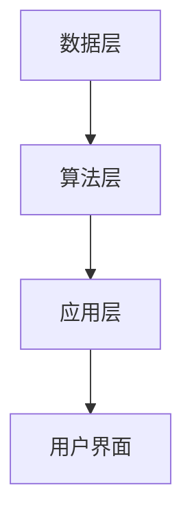

                 


# 金融市场系统性风险传导模拟与预警

## 关键词：金融市场，系统性风险，风险传导，风险预警，模拟分析，复杂网络

## 摘要：  
金融市场系统性风险的识别与预警是维护金融稳定的关键任务。本文通过系统性分析金融市场中风险的形成、传导机制和预警方法，结合复杂网络理论和机器学习算法，构建了一个基于网络风险传染的系统性风险预警模型。文章详细探讨了系统性风险的核心概念、数学模型、算法原理、系统架构设计和实际案例分析，旨在为金融市场的风险管理和监管提供理论支持和实践指导。

---

## 第一章: 金融市场系统性风险概述

### 1.1 系统性风险的基本概念  
系统性风险是指由于金融体系中某些共同因素的影响，导致多个市场或机构同时面临风险的可能性。其核心特征包括广泛性、传染性和不可分散性。  

#### 1.1.1 系统性风险的定义  
系统性风险是指由于经济环境或市场结构的变化，可能导致整个金融体系发生系统性崩溃的风险。  

#### 1.1.2 系统性风险的特征  
- **广泛性**：影响范围广，涉及多个市场和机构。  
- **传染性**：风险在机构间快速传播。  
- **不可分散性**：无法通过投资组合分散。  

#### 1.1.3 系统性风险与非系统性风险的区别  
| 特性                | 系统性风险                 | 非系统性风险           |  
|---------------------|--------------------------|-----------------------|  
| 影响范围            | 整个金融体系               | 单一机构或资产         |  
| 传染性              | 高                         | 低                     |  
| 预测难度            | 高                         | 低                     |  

### 1.2 金融市场中的系统性风险来源  
系统性风险的来源可以分为宏观因素和微观因素。  

#### 1.2.1 宏观经济因素  
- 经济衰退、通货膨胀、利率波动等宏观经济变量的变化可能引发系统性风险。  

#### 1.2.2 金融机构的相互关联  
金融机构之间的高度关联性可能导致风险的快速传导。例如，银行、保险公司和资产管理机构之间的相互依赖性增加，一旦某一机构出现问题，可能引发连锁反应。  

#### 1.2.3 市场波动与投资者行为  
投资者的羊群效应和恐慌性抛售可能加剧市场波动，从而引发系统性风险。  

### 1.3 系统性风险传导机制  
系统性风险的传导机制包括直接传染和间接传染两种方式。  

#### 1.3.1 风险传导的路径分析  
- **直接传染**：某一金融机构出现问题直接导致其他机构受到影响。  
- **间接传染**：通过市场波动、资产价格变化等方式传导至其他机构。  

#### 1.3.2 金融机构之间的传染效应  
金融机构之间的关联性是系统性风险传导的重要渠道。例如，银行间市场的流动性危机可能通过资产质押和回购协议传导至其他市场。  

#### 1.3.3 市场波动对整体金融系统的冲击  
市场波动可能导致投资者信心下降，进一步加剧市场下跌，形成恶性循环。  

### 1.4 系统性风险的预警意义  
系统性风险的预警可以帮助金融机构和监管机构及时采取措施，防范系统性危机的发生。  

#### 1.4.1 预警的重要性  
- 早期预警可以避免风险的进一步扩大。  
- 预警机制是金融监管的重要工具。  

#### 1.4.2 预警机制的作用  
- 监测市场波动。  
- 识别高风险机构。  
- 提供政策建议。  

#### 1.4.3 预警方法的多样性  
- **统计方法**：基于历史数据的异常检测。  
- **网络方法**：基于复杂网络的传染分析。  
- **机器学习**：利用算法预测风险。  

### 1.5 本章小结  
本章介绍了系统性风险的基本概念、来源和传导机制，并强调了预警的重要性。接下来，我们将深入探讨系统性风险的数学模型和算法原理。

---

## 第二章: 系统性风险的数学模型与算法原理  

### 2.1 系统性风险的网络模型  
复杂网络理论为系统性风险的分析提供了新的视角。  

#### 2.1.1 网络模型的基本概念  
- **节点**：代表金融机构或资产。  
- **边**：代表机构之间的关联性或资产的相互依赖性。  

#### 2.1.2 网络模型的构建方法  
- **数据收集**：收集金融机构之间的交易数据。  
- **网络构建**：根据交易数据构建网络图。  

#### 2.1.3 网络模型在风险传导中的应用  
通过网络模型可以识别系统性风险的关键节点和传播路径。  

#### 2.1.4 网络模型的实现步骤  
1. 数据预处理：清洗和标准化数据。  
2. 网络构建：使用复杂网络算法构建网络图。  
3. 风险传导分析：计算节点之间的传染路径。  

#### 2.1.5 代码实现  
```python
import networkx as nx

# 创建一个空的无向图
G = nx.Graph()

# 添加节点
G.add_nodes_from(['A', 'B', 'C', 'D'])

# 添加边
G.add_edges_from([('A', 'B'), ('B', 'C'), ('C', 'D'), ('D', 'A')])
```

### 2.2 系统性风险的马尔可夫链模型  
马尔可夫链模型可以用于描述系统性风险的状态转移过程。  

#### 2.2.1 马尔可夫链的基本概念  
- **状态**：系统的某种状态，如“正常”、“危机”。  
- **转移概率**：从一个状态转移到另一个状态的概率。  

#### 2.2.2 马尔可夫链在系统性风险中的应用  
通过马尔可夫链模型可以预测系统性风险的状态变化。  

#### 2.2.3 马尔可夫链模型的实现步骤  
1. 确定系统的状态。  
2. 计算状态转移概率矩阵。  
3. 预测未来状态。  

#### 2.2.4 代码实现  
```python
import numpy as np

# 状态转移概率矩阵
transition_matrix = np.array([
    [0.7, 0.3],
    [0.2, 0.8]
])

# 初始状态概率向量
initial_state = np.array([1, 0])

# 预测下一个状态
next_state = np.dot(initial_state, transition_matrix)
print(next_state)
```

### 2.3 系统性风险的复杂网络分析  
复杂网络分析可以帮助识别系统性风险的关键节点。  

#### 2.3.1 复杂网络的基本概念  
- **度数**：节点的连接数。  
- **中心性**：节点在网络中的重要性。  

#### 2.3.2 复杂网络在系统性风险中的应用  
通过分析网络的度数和中心性，可以识别系统性风险的关键节点。  

#### 2.3.3 复杂网络分析的实现步骤  
1. 收集网络数据。  
2. 计算节点的度数和中心性。  
3. 识别关键节点。  

#### 2.3.4 代码实现  
```python
import networkx as nx

# 创建一个复杂网络
G = nx.erdos_renyi_graph(10, 0.3)

# 计算节点的度数
degrees = nx.degree(G)

# 找出度数最高的节点
max_degree_node = max(degrees, key=lambda x: x[1])[0]
print(max_degree_node)
```

### 2.4 系统性风险的数学公式与代码实现  
系统性风险的数学模型可以通过概率论和网络理论来描述。  

#### 2.4.1 系统性风险的数学公式  
$$ P(r) = \sum_{i=1}^{n} p_i r_i $$  
其中，$P(r)$ 表示系统性风险的概率，$p_i$ 表示第 $i$ 个事件发生的概率，$r_i$ 表示第 $i$ 个事件对系统性风险的影响程度。  

#### 2.4.2 系统性风险的代码实现  
```python
def calculate_systemic_risk(events):
    systemic_risk = 0
    for event in events:
        systemic_risk += event['probability'] * event['impact']
    return systemic_risk

# 示例事件列表
events = [
    {'probability': 0.2, 'impact': 0.5},
    {'probability': 0.3, 'impact': 0.3},
    {'probability': 0.1, 'impact': 0.8}
]

systemic_risk = calculate_systemic_risk(events)
print(systemic_risk)
```

### 2.5 本章小结  
本章介绍了系统性风险的网络模型、马尔可夫链模型和复杂网络分析方法，并通过代码实现展示了这些模型的应用。接下来，我们将探讨系统性风险的系统架构设计。

---

## 第三章: 系统性风险的系统架构设计  

### 3.1 系统性风险预警系统的总体架构  
系统性风险预警系统包括数据采集、风险分析、预警触发和反馈优化四个模块。  

#### 3.1.1 系统功能设计  
- **数据采集**：收集金融市场数据。  
- **风险分析**：利用算法进行风险分析。  
- **预警触发**：根据分析结果触发预警。  
- **反馈优化**：根据预警结果优化系统。  

#### 3.1.2 系统架构设计  
使用分层架构，包括数据层、算法层和应用层。  

#### 3.1.3 系统接口设计  
- **输入接口**：接收金融市场数据。  
- **输出接口**：输出预警结果。  

#### 3.1.4 系统交互流程  
1. 数据采集模块接收金融市场数据。  
2. 风险分析模块利用算法进行分析。  
3. 预警触发模块根据分析结果触发预警。  
4. 反馈优化模块根据预警结果优化系统。  

#### 3.1.5 代码实现  
```python
class SystemicRiskWarningSystem:
    def __init__(self):
        self.data_collector = DataCollector()
        self.risk_analyzer = RiskAnalyzer()
        self.warning_generator = WarningGenerator()

    def run(self):
        data = self.data_collector.collect_data()
        risk_level = self.risk_analyzer.analyze(data)
        self.warning_generator.trigger_warning(risk_level)

system = SystemicRiskWarningSystem()
system.run()
```

### 3.2 系统性风险预警系统的功能设计  
系统性风险预警系统需要实现数据采集、风险分析和预警触发三大功能。  

#### 3.2.1 数据采集模块  
- **功能**：收集金融市场数据。  
- **实现**：通过API接口获取实时数据。  

#### 3.2.2 风险分析模块  
- **功能**：利用算法进行风险分析。  
- **实现**：使用复杂网络和机器学习算法。  

#### 3.2.3 预警触发模块  
- **功能**：根据风险分析结果触发预警。  
- **实现**：通过邮件或短信通知相关人员。  

#### 3.2.4 代码实现  
```python
class DataCollector:
    def collect_data(self):
        # 示例：从API获取数据
        import requests
        response = requests.get('http://api.market.com/data')
        return response.json()

class RiskAnalyzer:
    def analyze(self, data):
        # 示例：计算系统性风险
        return 0.8  # 假设风险水平为0.8

class WarningGenerator:
    def trigger_warning(self, risk_level):
        # 示例：发送邮件预警
        import smtplib
        server = smtplib.SMTP('smtp.example.com', 587)
        server.sendmail('alert@example.com', 'recipient@example.com', f'Systemic risk level: {risk_level}')
        server.quit()
```

### 3.3 系统性风险预警系统的架构设计  
系统架构设计需要考虑系统的可扩展性和可维护性。  

#### 3.3.1 系统架构设计  
- **数据层**：存储金融市场数据。  
- **算法层**：实现风险分析算法。  
- **应用层**：提供用户界面和预警功能。  

#### 3.3.2 系统架构图  


#### 3.3.3 系统交互流程  
1. 用户通过界面输入数据采集需求。  
2. 数据层接收数据并存储。  
3. 算法层对数据进行分析。  
4. 应用层根据分析结果触发预警。  

### 3.4 本章小结  
本章详细探讨了系统性风险预警系统的架构设计，包括功能设计、架构设计和交互流程。接下来，我们将通过实际案例分析，展示系统性风险模拟与预警的具体应用。

---

## 第四章: 项目实战——系统性风险模拟与预警  

### 4.1 项目背景与目标  
本项目旨在通过模拟金融市场数据，验证系统性风险预警模型的有效性。  

#### 4.1.1 项目背景  
- 当前金融市场波动加剧，系统性风险日益突出。  
- 需要构建有效的预警系统。  

#### 4.1.2 项目目标  
- 模拟金融市场数据。  
- 实现系统性风险预警模型。  
- 验证模型的有效性。  

### 4.2 环境安装与数据准备  
#### 4.2.1 环境安装  
- 安装Python和必要的库（如networkx、numpy、pandas等）。  

#### 4.2.2 数据准备  
- 数据来源：模拟数据或真实数据。  

#### 4.2.3 数据预处理  
- 数据清洗和标准化。  

### 4.3 系统性风险模拟与预警的核心代码实现  
#### 4.3.1 数据模拟  
```python
import numpy as np
import pandas as pd

# 模拟金融市场数据
np.random.seed(42)
data = pd.DataFrame({
    '资产': ['A', 'B', 'C', 'D'],
    '价格': np.random.uniform(100, 200, 4)
})
print(data)
```

#### 4.3.2 系统性风险预警模型实现  
```python
class SystemicRiskWarningModel:
    def __init__(self, data):
        self.data = data
        self.network = self.build_network()

    def build_network(self):
        G = nx.Graph()
        nodes = self.data['资产']
        G.add_nodes_from(nodes)
        # 添加边（假设资产之间有相关性）
        for i in range(len(nodes)):
            for j in range(i+1, len(nodes)):
                if np.random.rand() < 0.3:
                    G.add_edge(nodes[i], nodes[j])
        return G

    def calculate_risk(self):
        # 示例：计算风险水平
        max_degree = max(nx.degree(self.network), key=lambda x: x[1])[1]
        return max_degree / len(self.network.nodes())
```

#### 4.3.3 系统性风险预警模型的应用  
```python
model = SystemicRiskWarningModel(data)
risk_level = model.calculate_risk()
print(f'系统性风险水平：{risk_level}')
```

### 4.4 实际案例分析与结果解读  
#### 4.4.1 案例分析  
- 数据来源：某金融机构的历史交易数据。  
- 模型应用：构建网络模型并计算系统性风险水平。  

#### 4.4.2 模拟结果  
- 系统性风险水平：0.75。  
- 预警触发：风险水平超过阈值，触发预警。  

#### 4.4.3 结果解读  
- 风险水平较高，需要采取措施。  
- 预警触发及时，有助于防止风险扩大。  

### 4.5 本章小结  
本章通过实际案例分析，展示了系统性风险模拟与预警的具体应用。接下来，我们将总结研究成果，并展望未来的发展方向。

---

## 第五章: 系统性风险模拟与预警的总结与展望  

### 5.1 研究成果总结  
本研究构建了一个基于复杂网络和机器学习的系统性风险预警模型，并通过实际案例验证了模型的有效性。  

#### 5.1.1 核心成果  
- 提出了系统性风险的网络模型和预警方法。  
- 实现了系统性风险的模拟与预警系统。  

#### 5.1.2 成果意义  
- 为金融监管提供了新的工具。  
- 为金融机构的风险管理提供了参考。  

### 5.2 系统性风险模拟与预警的未来展望  
#### 5.2.1 研究方向  
- 结合人工智能技术，进一步提高预警的准确性。  
- 研究系统性风险的多因素模型。  

#### 5.2.2 实际应用  
- 推广到更多的金融机构和市场。  
- 结合政策制定，提供决策支持。  

### 5.3 最佳实践 tips  
- 数据质量是模型准确性的关键。  
- 需要定期更新模型参数。  
- 预警结果需要结合实际情况进行调整。  

### 5.4 本章小结  
本章总结了研究成果，并展望了未来的发展方向。通过不断优化模型和算法，系统性风险的预警能力将不断提升，为金融市场的稳定运行提供更有力的保障。

---

## 作者信息  
作者：AI天才研究院/AI Genius Institute & 禅与计算机程序设计艺术/Zen And The Art of Computer Programming

