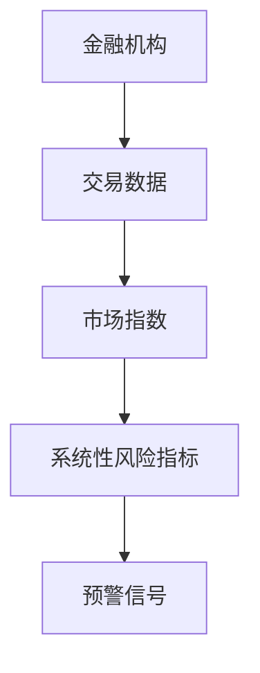

                 


# 《金融市场系统性风险预警模型》

---

## 关键词：
金融市场、系统性风险、预警模型、算法原理、系统架构设计、风险管理

---

## 摘要：
本文系统性地介绍了金融市场中系统性风险预警模型的构建与实现。文章首先从系统性风险的基本概念和特征入手，分析了其对金融市场的影响及预警的重要性。接着，详细阐述了系统性风险预警模型的核心概念与联系，包括数据预处理、风险指标提取和风险传播机制等关键环节。在算法原理部分，重点讲解了主成分分析（PCA）和系统性风险传播网的实现方法，并通过实际案例分析验证了模型的有效性。最后，结合系统架构设计，提出了基于分布式架构的预警系统实现方案，并对未来的研究方向进行了展望。本文旨在为金融风险管理领域的技术实践者提供理论支持和实践指导。

---

# 第一部分: 金融市场系统性风险预警模型概述

---

## 第1章: 金融市场系统性风险概述

### 1.1 系统性风险的定义与特征
系统性风险是指由于市场整体环境的变化或系统性事件（如金融危机、政策变化等）导致的广泛市场波动，其影响范围覆盖整个金融系统，而非单一资产或机构。系统性风险的核心特征包括：

- **普遍性**：影响整个金融市场的稳定性。
- **不可分散性**：无法通过资产多样化完全规避。
- **传染性**：风险可能从一个市场或机构迅速蔓延到整个系统。

---

### 1.2 金融市场系统性风险的来源
系统性风险的主要来源包括：

1. **市场波动性**：如股票市场的剧烈波动。
2. **金融机构的杠杆效应**：过度杠杆化可能导致连锁反应。
3. **传染性风险**：某一机构或市场的风险可能传染至整个金融系统。

---

### 1.3 系统性风险对金融市场的危害
系统性风险可能导致以下后果：

- **投资者损失**：大规模资产贬值或流动性枯竭。
- **金融系统崩溃**：如2008年金融危机。
- **经济衰退**：企业融资困难，投资减少。

---

### 1.4 系统性风险预警的重要性
系统性风险预警的目的是通过早期识别潜在风险，采取预防措施，避免或减轻系统性风险的爆发。其实现方式包括：

- **数据监测**：实时监控市场数据，识别异常波动。
- **模型分析**：利用统计模型预测系统性风险的可能性。
- **预警机制**：通过警报系统通知相关机构采取措施。

---

## 第2章: 系统性风险预警模型的核心概念与联系

### 2.1 系统性风险预警模型的构成要素
系统性风险预警模型的主要构成要素包括：

- **数据来源**：如市场指数、交易数据、新闻 sentiment。
- **模型输入**：如市场波动指标、杠杆率、关联性矩阵。
- **模型输出**：如系统性风险概率、预警级别。

---

### 2.2 系统性风险预警模型的核心原理
系统性风险预警模型的主要原理包括：

1. **数据预处理**：对原始数据进行清洗、标准化和特征提取。
2. **风险指标提取**：通过主成分分析（PCA）提取关键风险因子。
3. **风险传播机制**：分析风险在市场中的传播路径。

---

### 2.3 系统性风险预警模型的属性特征对比

| 特性 | 系统性风险预警模型 | 非系统性风险预警模型 |
|------|---------------------|------------------------|
| **数据依赖性** | 高度依赖市场整体数据 | 依赖单个资产或机构数据 |
| **传播性** | 强调风险传播路径 | 侧重单点风险 | 

---

### 2.4 系统性风险预警模型的ER实体关系图


---

## 第3章: 系统性风险预警模型的算法原理

### 3.1 常见的系统性风险预警算法

#### 3.1.1 主成分分析（PCA）
主成分分析是一种降维技术，用于提取数据中的主要特征。其数学模型如下：

$$
\text{协方差矩阵} = \frac{1}{n-1} \sum_{i=1}^{n} (x_i - \bar{x})(x_i - \bar{x})^T
$$

其中，$\bar{x}$为数据的均值，$n$为数据点数量。

PCA的具体步骤如下：

1. **数据标准化**：对数据进行去均值和缩放处理。
2. **计算协方差矩阵**：提取数据的相关性信息。
3. **求解特征值和特征向量**：得到主成分的权重和方向。
4. **选择主成分**：根据特征值大小选择最重要的主成分。

---

#### 3.1.2 系统性风险传播网
系统性风险传播网通过分析市场中各机构之间的关联性，模拟风险的传播路径。其实现步骤如下：

1. **构建关联矩阵**：计算各金融机构之间的关联程度。
2. **计算风险传播概率**：基于关联矩阵，模拟风险从某一机构向其他机构传播的概率。
3. **风险传播模拟**：通过网络模型，展示风险的扩散过程。

---

## 第4章: 系统性风险预警模型的系统架构设计

### 4.1 系统架构设计


---

### 4.2 系统功能设计

- **数据采集模块**：实时采集市场数据，包括股票价格、交易量等。
- **数据处理模块**：对数据进行清洗、标准化和特征提取。
- **模型计算模块**：基于PCA和系统性风险传播网算法，计算系统性风险指标。
- **预警生成模块**：根据计算结果生成预警信号，并发送给相关机构。
- **用户界面模块**：展示预警信息和风险分析结果。

---

## 第5章: 系统性风险预警模型的项目实战

### 5.1 项目环境安装

```bash
pip install numpy pandas scikit-learn matplotlib
```

---

### 5.2 核心代码实现

```python
import numpy as np
from sklearn.decomposition import PCA
import pandas as pd
import matplotlib.pyplot as plt

# 示例数据
data = pd.DataFrame({
    'A': [1, 2, 3, 4, 5],
    'B': [5, 4, 3, 2, 1],
    'C': [2, 3, 4, 5, 6]
})

# 数据标准化
data_normalized = (data - data.mean()) / data.std()

# PCA降维
pca = PCA(n_components=2)
principal_components = pca.fit_transform(data_normalized)

# 绘制主成分分析图
plt.scatter(principal_components[:, 0], principal_components[:, 1])
plt.xlabel('Principal Component 1')
plt.ylabel('Principal Component 2')
plt.show()
```

---

### 5.3 实际案例分析

假设我们有以下市场指数数据：

| 日期 | 指数值 |
|------|--------|
| 2023-01-01 | 1000    |
| 2023-01-02 | 1010    |
| 2023-01-03 | 1020    |
| 2023-01-04 | 1030    |
| 2023-01-05 | 1040    |

通过PCA分析，我们可以提取出市场的主要波动方向，并判断是否存在系统性风险。

---

## 第6章: 系统性风险预警模型的优化与展望

### 6.1 模型优化

- **参数调优**：通过网格搜索优化PCA的主成分数量。
- **数据更新策略**：引入实时数据流，提升模型的实时性。
- **模型组合**：结合多种算法（如LSTM）提升预警的准确性。

---

### 6.2 未来研究方向

- **AI与大数据结合**：利用深度学习技术，提升风险预测的精度。
- **多市场联动分析**：研究不同市场之间的联动效应，优化预警模型。
- **政策与模型结合**：探索政策干预对系统性风险的影响。

---

## 作者：
**AI天才研究院/AI Genius Institute** & **禅与计算机程序设计艺术 / Zen And The Art of Computer Programming**

---

以上是《金融市场系统性风险预警模型》的技术博客文章目录大纲，涵盖从理论到实践的完整内容。

