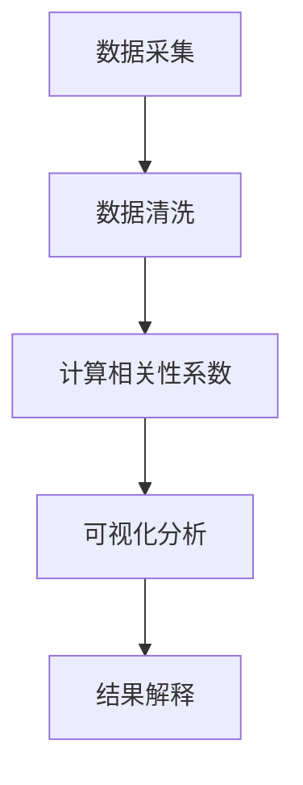
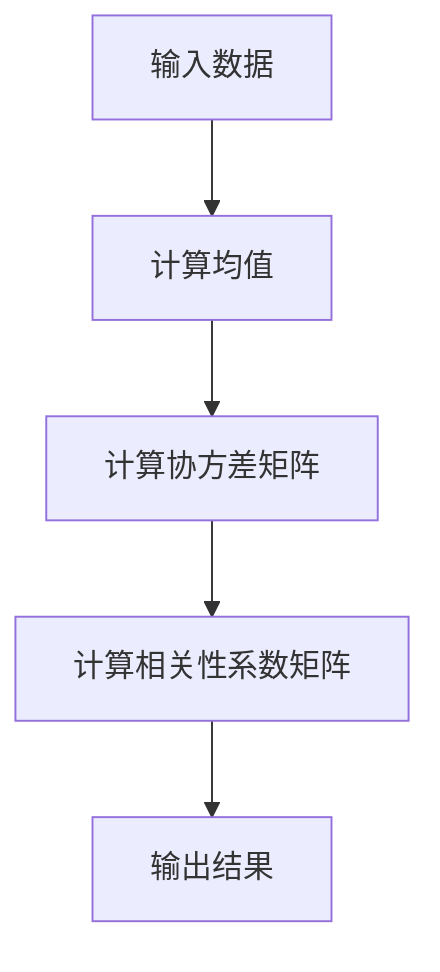
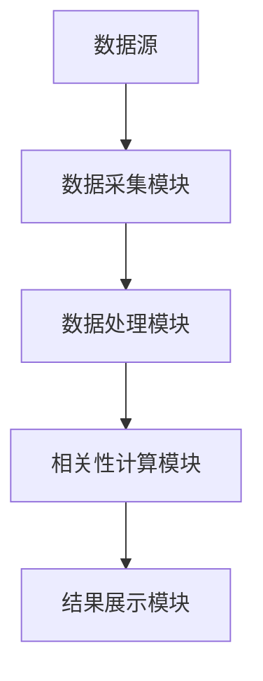
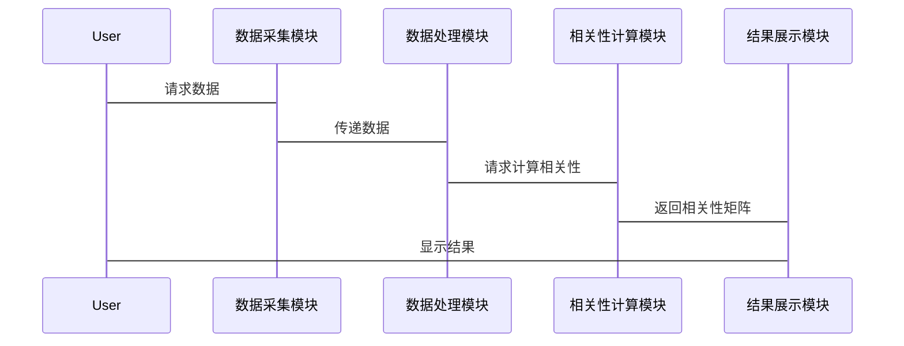

                 


# 金融市场跨资产相关性分析工具

> 关键词：金融市场，资产相关性，数据分析，Python，统计学，机器学习

> 摘要：金融市场跨资产相关性分析是理解不同资产之间相互作用的重要工具。本文将详细介绍相关性分析的核心概念、数学原理、算法实现、系统架构以及实际应用。通过深入探讨这些内容，我们能够更好地理解如何利用跨资产相关性分析来优化投资组合和风险管理。

---

## 第1章: 金融市场与跨资产相关性分析概述

### 1.1 金融市场的基本概念

#### 1.1.1 金融市场的定义与分类
金融市场的定义是：金融资产交易的场所，包括股票、债券、商品、外汇等。金融市场可以分为场内市场和场外市场，也可以按照资产类型分为股票市场、债券市场、外汇市场等。

#### 1.1.2 资产的定义与类型
资产是指具有价值的所有权利、所有权和控制权的总和。在金融市场中，资产主要包括以下几类：
- **股票**：代表企业所有权的凭证。
- **债券**：债务工具，承诺按期支付利息和本金。
- **外汇**：不同国家货币之间的兑换。
- **商品**：黄金、原油等实物资产。
- **衍生品**：基于其他资产的金融工具，如期权和期货。

#### 1.1.3 金融市场的重要性与功能
金融市场是现代经济体系的核心，具有以下功能：
- **价格发现**：通过市场交易确定资产的公允价值。
- **风险管理**：通过分散投资降低风险。
- **流动性提供**：允许投资者快速买卖资产。
- **资源配置**：引导资金流向高效率的经济活动。

### 1.2 跨资产相关性分析的定义与背景

#### 1.2.1 跨资产相关性的定义
跨资产相关性分析是指研究不同资产之间价格变动的相关性，从而理解它们之间的相互影响。例如，股票和债券的相关性可能在特定市场条件下发生变化。

#### 1.2.2 跨资产相关性分析的背景与意义
随着金融市场的发展，投资者越来越关注跨资产的相关性。例如，股票和债券的相关性可能在市场波动时上升，而商品价格可能与股市波动相关。理解这些相关性有助于投资者优化投资组合，降低风险。

#### 1.2.3 跨资产相关性分析的应用场景
- **投资组合优化**：通过降低相关性来分散风险。
- **风险对冲**：利用相关性低的资产进行对冲。
- **资产配置**：根据相关性调整资产配置比例。

### 1.3 跨资产相关性分析的核心概念

#### 1.3.1 相关性的数学定义
相关性系数是衡量两个变量之间线性关系的指标，范围在-1到+1之间。正相关表示两者价格变动方向相同，负相关表示方向相反。

#### 1.3.2 跨资产相关性的特点
- **时间依赖性**：相关性可能随时间变化。
- **非线性**：相关性可能不是线性的。
- **市场条件影响**：市场波动可能影响相关性。

#### 1.3.3 跨资产相关性的边界与外延
- **边界**：相关性系数的范围是-1到+1。
- **外延**：相关性分析可以扩展到多资产组合和复杂模型。

## 第2章: 跨资产相关性分析的核心概念与联系

### 2.1 跨资产相关性的核心原理

#### 2.1.1 协方差与相关性系数的计算公式
协方差的计算公式：
$$ \text{协方差}(X,Y) = \frac{1}{n-1} \sum_{i=1}^{n} (X_i - \bar{X})(Y_i - \bar{Y}) $$

相关性系数的计算公式：
$$ \text{相关性系数}(X,Y) = \frac{\text{协方差}(X,Y)}{\sigma_X \sigma_Y} $$

其中，$\sigma_X$和$\sigma_Y$分别是X和Y的标准差。

#### 2.1.2 跨资产相关性的数学模型
跨资产相关性分析的数学模型可以表示为：
$$ r_{xy} = \frac{\sum (x_i - \bar{x})(y_i - \bar{y})}{\sqrt{\sum (x_i - \bar{x})^2} \sqrt{\sum (y_i - \bar{y})^2}} $$

#### 2.1.3 跨资产相关性属性特征对比表格

| 属性           | 定义与特点                          |
|----------------|-----------------------------------|
| 相关性系数     | 衡量两个资产价格变动的线性关系    |
| 协方差         | 衡量两个资产价格变动的共同方向和程度 |
| 标准差         | 衡量单一资产价格的波动程度          |

### 2.2 跨资产相关性分析的ER实体关系图
```mermaid
er
    entity 资产 {
        key 资产ID
        attribute 名称, 类型, 市场
    }
    entity 相关性 {
        key 相关性ID
        attribute 相关性系数, 时间范围
    }
    资产 --N 资产: 相关性关系
```

### 2.3 跨资产相关性分析的流程图


## 第3章: 跨资产相关性分析的算法原理

### 3.1 协方差与相关性系数的计算

#### 3.1.1 协方差的定义与公式
协方差的计算公式：
$$ \text{协方差}(X,Y) = E[(X - E[X])(Y - E[Y])] $$

#### 3.1.2 相关性系数的定义与公式
相关性系数的计算公式：
$$ \text{相关性系数}(X,Y) = \frac{\text{协方差}(X,Y)}{\sigma_X \sigma_Y} $$

### 3.2 跨资产相关性分析的算法实现

#### 3.2.1 算法流程图


#### 3.2.2 Python 实现

```python
import numpy as np

def calculate_correlation_matrix(data):
    # 计算数据的均值
    mean = np.mean(data, axis=0)
    # 计算数据与均值的差
    data_deviations = data - mean
    # 计算协方差矩阵
    covariance_matrix = np.cov(data_deviations, rowvar=False)
    # 计算相关性矩阵
    correlation_matrix = np.zeros_like(covariance_matrix)
    for i in range(covariance_matrix.shape[0]):
        for j in range(covariance_matrix.shape[1]):
            if i != j:
                correlation_matrix[i, j] = covariance_matrix[i, j] / (np.std(data[:, i]) * np.std(data[:, j]))
    return correlation_matrix
```

#### 3.2.3 算法实现的详细步骤
1. **数据输入**：获取多个资产的历史价格数据。
2. **计算均值**：计算每个资产的平均价格。
3. **计算协方差矩阵**：衡量每个资产价格与自身及其他资产价格变动的共同方向和程度。
4. **计算相关性矩阵**：将协方差矩阵标准化，得到相关性系数矩阵。

### 3.3 跨资产相关性分析的数学模型
跨资产相关性分析的数学模型可以表示为：
$$ r_{xy} = \frac{\sum (x_i - \bar{x})(y_i - \bar{y})}{\sqrt{\sum (x_i - \bar{x})^2} \sqrt{\sum (y_i - \bar{y})^2}} $$

### 3.4 算法实现的注意事项
- 数据的缺失值处理。
- 数据的标准化处理。
- 相关性矩阵的解释和可视化。

---

## 第4章: 跨资产相关性分析的系统架构与实现

### 4.1 系统功能设计

#### 4.1.1 系统功能模块
- **数据采集模块**：从数据源获取资产价格数据。
- **数据处理模块**：清洗和预处理数据。
- **相关性计算模块**：计算资产之间的相关性系数。
- **结果展示模块**：可视化相关性矩阵。

#### 4.1.2 系统功能流程图


### 4.2 系统架构设计

#### 4.2.1 系统架构图


#### 4.2.2 系统接口设计
- 数据采集模块接口：从数据库或API获取资产价格数据。
- 数据处理模块接口：接收原始数据，返回清洗后的数据。
- 相关性计算模块接口：接收清洗后的数据，返回相关性矩阵。
- 结果展示模块接口：接收相关性矩阵，展示可视化结果。

### 4.3 系统交互设计

#### 4.3.1 系统交互流程图


---

## 第5章: 跨资产相关性分析的项目实战

### 5.1 项目环境安装

#### 5.1.1 安装Python环境
- 安装Python 3.x。
- 安装必要的库：numpy、pandas、matplotlib。

#### 5.1.2 数据源获取
- 从Yahoo Finance获取股票数据。
- 使用pandas数据清洗和预处理。

### 5.2 核心代码实现

#### 5.2.1 数据清洗代码
```python
import pandas as pd

# 从Yahoo Finance获取数据
def get_data(tickers, start_date, end_date):
    data = pd.DataFrame()
    for ticker in tickers:
        df = pd.read_csv(f'https://query1.finance.yahoo.com/d/1.0/{ticker}/ histórico.csv?period1=...'， parse_dates=['Date'], index_col='Date')
        data[ticker] = df['Close']
    return data
```

#### 5.2.2 相关性计算代码
```python
import numpy as np
import matplotlib.pyplot as plt

def plot_correlation_matrix(correlation_matrix, tickers):
    plt.figure(figsize=(10, 8))
    heatmap = plt.pcolor(correlation_matrix, cmap='coolwarm')
    plt.xticks(range(len(tickers)), tickers, rotation=45)
    plt.yticks(range(len(tickers)), tickers)
    plt.colorbar(heatmap)
    plt.title('Asset Correlation Matrix')
    plt.show()
```

### 5.3 案例分析与详细解读

#### 5.3.1 数据清洗与预处理
- 删除缺失值。
- 标准化数据。

#### 5.3.2 相关性计算与可视化
- 使用Python代码计算相关性矩阵。
- 使用matplotlib绘制热力图，分析相关性分布。

#### 5.3.3 结果分析
- 分析相关性系数的分布。
- 找出相关性较高的资产组合。

---

## 第6章: 跨资产相关性分析的总结与展望

### 6.1 本章小结
跨资产相关性分析是理解金融市场的重要工具。本文详细介绍了相关性分析的核心概念、算法原理和系统架构，并通过实际案例展示了如何利用Python实现相关性分析。

### 6.2 最佳实践 tips
- 数据清洗和预处理是相关性分析的关键步骤。
- 选择合适的相关性计算方法。
- 可视化是解释相关性结果的重要手段。

### 6.3 注意事项
- 数据的样本选择会影响相关性分析的结果。
- 相关性分析不能完全预测未来的价格变动。
- 需要结合其他分析方法进行综合判断。

### 6.4 拓展阅读
- 《金融数据分析与机器学习》
- 《Python金融数据分析实战》
- 《统计学习与金融市场》

---

## 作者：AI天才研究院/AI Genius Institute & 禅与计算机程序设计艺术 /Zen And The Art of Computer Programming

