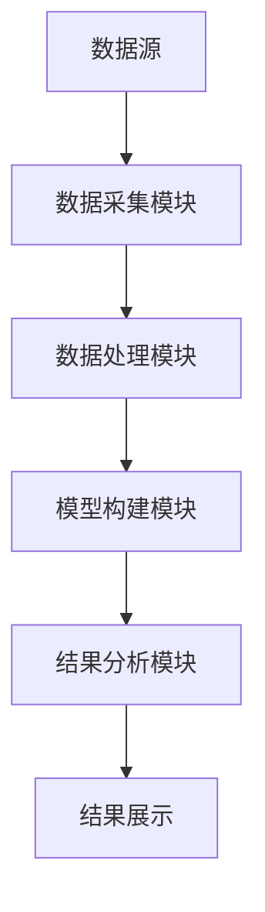

                 


```markdown
# 金融市场风险因子分解与敏感性分析

> 关键词：金融市场风险因子分解、敏感性分析、因子分解模型、风险评估、金融市场分析

> 摘要：金融市场风险因子分解与敏感性分析是金融领域的重要研究方向，旨在通过分解和分析影响金融市场波动的核心因子，评估各个因子对市场风险的敏感程度，从而为风险管理和投资决策提供科学依据。本文从风险因子分解和敏感性分析的基本概念出发，详细探讨了其方法论、数学模型、算法实现、系统设计以及实际案例分析，为读者提供全面的理论和实践指导。

---

## 目录

1. [金融市场风险概述](#金融市场风险概述)
   1.1 风险的定义与分类
   1.2 风险的来源与特征
   1.3 风险管理的重要性

2. [风险因子分解方法论](#风险因子分解方法论)
   2.1 风险因子分解的基本原理
   2.2 主成分分析（PCA）与因子分析模型
   2.3 风险因子分解的数学模型

3. [敏感性分析方法论](#敏感性分析方法论)
   3.1 敏感性分析的基本原理
   3.2 常见的敏感性分析方法
   3.3 敏感性分析的数学模型

4. [风险因子分解与敏感性分析的数学模型](#风险因子分解与敏感性分析的数学模型)
   4.1 风险因子分解的数学表达
   4.2 敏感性分析的数学表达
   4.3 两者的关联与区别

5. [算法实现](#算法实现)
   5.1 风险因子分解的Python实现
   5.2 敏感性分析的Python实现
   5.3 算法实现的优化与注意事项

6. [系统设计与架构](#系统设计与架构)
   6.1 系统功能模块划分
   6.2 系统架构设计
   6.3 系统接口设计

7. [项目实战：基于因子分解与敏感性分析的金融市场风险评估系统](#项目实战基于因子分解与敏感性分析的金融市场风险评估系统)
   7.1 项目背景与目标
   7.2 数据收集与预处理
   7.3 系统实现与结果分析

8. [最佳实践、小结与注意事项](#最佳实践小结与注意事项)
   8.1 最佳实践
   8.2 小结
   8.3 注意事项

---

## 1. 金融市场风险概述

### 1.1 风险的定义与分类

#### 1.1.1 风险的定义
风险是指在金融市场中，由于各种不确定性因素的影响，导致资产价格波动或投资收益偏离预期的可能性。风险的核心在于其不确定性，投资者需要通过分析和评估风险，制定合理的投资策略。

#### 1.1.2 风险的来源与分类
风险的来源可以分为系统性风险和非系统性风险。系统性风险是影响整个市场的风险，如经济衰退、政策变化等；非系统性风险是影响单个资产或行业的风险，如公司经营状况、行业竞争等。

#### 1.1.3 风险管理的重要性
风险管理是投资者在金融市场中保护资产免受损失的重要手段。通过有效的风险管理，投资者可以降低损失，提高投资回报率。

---

## 2. 风险因子分解方法论

### 2.1 风险因子分解的基本原理

风险因子分解是一种通过分解资产价格波动，识别影响市场的主要风险因子的方法。其核心思想是将复杂的市场波动简化为几个主要因子的线性组合。

### 2.2 常见的风险因子分解方法

#### 2.2.1 主成分分析（PCA）

主成分分析是一种统计方法，通过降维技术提取数据的主要成分，用于解释数据的大部分方差。在金融市场中，PCA常用于识别影响资产价格的主要因子。

#### 2.2.2 因子分析模型

因子分析模型是一种统计模型，用于解释观测变量之间的相关性。在金融市场中，因子分析模型常用于识别影响资产价格的隐含因子。

### 2.3 风险因子分解的数学模型

#### 2.3.1 风险因子分解的数学表达
$$ Y = B \beta + \epsilon $$
其中，$Y$是观测变量，$B$是因子载荷矩阵，$\beta$是因子得分，$\epsilon$是误差项。

---

## 3. 敏感性分析方法论

### 3.1 敏感性分析的基本原理

敏感性分析是一种通过分析输入变量的变化对输出结果的影响程度，评估模型的鲁棒性。在金融市场中，敏感性分析常用于评估不同因子对资产价格波动的影响程度。

### 3.2 常见的敏感性分析方法

#### 3.2.1 回归分析法

通过建立回归模型，分析各个因子对资产价格的敏感程度。

#### 3.2.2 方差分解法

方差分解法通过分解资产价格波动的方差，评估各个因子对资产价格波动的贡献程度。

### 3.3 敏感性分析的数学模型

#### 3.3.1 方差分解法的数学表达
$$ \text{方差}(Y) = \sum_{i=1}^{n} \text{方差}(X_i) \cdot \beta_i^2 $$

---

## 4. 风险因子分解与敏感性分析的数学模型

### 4.1 风险因子分解的数学表达
$$ Y = F \beta + \epsilon $$
其中，$F$是因子载荷矩阵，$\beta$是因子得分，$\epsilon$是误差项。

### 4.2 敏感性分析的数学表达
$$ \text{敏感性指标} = \frac{\partial Y}{\partial X_i} $$

---

## 5. 算法实现

### 5.1 风险因子分解的Python实现

#### 代码实现
```python
import numpy as np

def pca(X, n_components):
    # 标准化数据
    X_mean = X - np.mean(X, axis=0)
    # 计算协方差矩阵
    cov = np.cov(X_mean, rowvar=False)
    # 计算特征值和特征向量
    eigenvalues, eigenvectors = np.linalg.eigh(cov)
    # 选择前n_components个主成分
    eigenvectors = eigenvectors[:, -1:-1-n_components:-1]
    return eigenvectors.T.dot(X_mean.T).T

# 示例数据
X = np.array([[2.5, 2.4],
              [4.7, 3.6],
              [3.6, 3.8],
              [3.0, 4.0],
              [2.6, 5.2]])
pca_result = pca(X, 2)
print("主成分结果：\n", pca_result)
```

### 5.2 敏感性分析的Python实现

#### 代码实现
```python
import numpy as np

def sensitivity_analysis(X, y):
    # 线性回归模型
    model = np.linalg.lstsq(X, y, rcond=None)
    coefficients = model[0]
    return coefficients

# 示例数据
X = np.array([[1, 2],
              [2, 3],
              [3, 4],
              [4, 5]])
y = np.array([6, 7, 8, 9])
sensitivity_result = sensitivity_analysis(X, y)
print("敏感性系数：\n", sensitivity_result)
```

---

## 6. 系统设计与架构

### 6.1 系统功能模块划分
- 数据采集模块：负责采集金融市场数据
- 数据处理模块：负责数据清洗和预处理
- 模型构建模块：负责构建风险因子分解和敏感性分析模型
- 结果分析模块：负责分析和展示结果

### 6.2 系统架构设计


---

## 7. 项目实战：基于因子分解与敏感性分析的金融市场风险评估系统

### 7.1 项目背景与目标
本项目旨在通过风险因子分解和敏感性分析，评估不同因子对金融市场风险的影响程度，帮助投资者制定合理的投资策略。

### 7.2 数据收集与预处理
- 数据来源：股票价格、宏观经济指标等
- 数据清洗：处理缺失值、异常值等

### 7.3 系统实现与结果分析
- 实现风险因子分解模型
- 实现敏感性分析模型
- 分析并展示结果

---

## 8. 最佳实践、小结与注意事项

### 8.1 最佳实践
- 数据预处理是关键，确保数据的准确性和完整性
- 选择合适的模型和方法，根据实际需求调整参数
- 结果分析时，结合实际市场情况进行解释

### 8.2 小结
本文详细介绍了金融市场风险因子分解与敏感性分析的方法论、数学模型、算法实现和系统设计，并通过实际案例分析展示了其应用。通过本文的学习，读者可以掌握金融市场风险评估的核心技术，并能够将其应用于实际投资决策中。

### 8.3 注意事项
- 数据来源和质量对结果影响重大，需谨慎选择和处理
- 模型选择需结合实际问题，避免盲目使用
- 结果解释需结合市场实际情况，避免片面结论

---

## 作者信息

作者：AI天才研究院/AI Genius Institute & 禅与计算机程序设计艺术 /Zen And The Art of Computer Programming

---

感谢您的阅读！如需进一步了解或应用，请随时联系！
```

