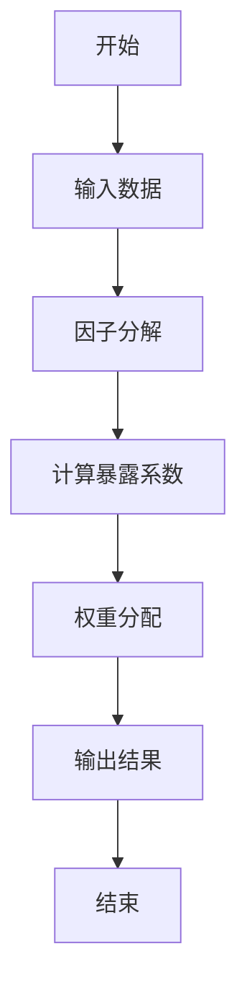

                 


# 金融市场风险因子暴露分析工具

## 关键词：金融市场、风险因子、暴露分析、金融风险管理、数据分析、金融建模

## 摘要：本文系统介绍了金融市场风险因子暴露分析工具的设计与实现，从风险因子的定义、暴露分析的原理、算法实现、系统架构到实际案例分析，全面解析了该工具的核心技术和应用场景。通过本文，读者可以掌握如何利用数据分析技术量化和管理金融市场的风险因子暴露，从而有效降低投资组合的风险。

---

# 第一部分: 金融市场风险因子暴露分析工具的背景与概念

## 第1章: 风险因子暴露分析的背景

### 1.1 风险因子的定义与分类

- **风险因子**是金融市场中影响资产价格波动的关键因素，常见的风险因子包括市场风险、利率风险、信用风险等。
- 风险因子可以分为**系统性风险**（如市场波动、经济周期）和**非系统性风险**（如公司特定风险）。
- 不同的资产类别（如股票、债券、期货）对应不同的风险因子。

### 1.2 暴露分析的核心概念

- **风险暴露**是指资产或投资组合在特定风险因子上的敏感程度。
- 暴露分析通过量化资产对各个风险因子的敏感性，评估其在不同市场条件下的风险敞口。
- 暴露分析是风险管理和投资组合优化的重要工具。

### 1.3 风险因子暴露分析与传统风险分析的区别

| **传统风险分析** | **风险因子暴露分析** |
|-------------------|-----------------------|
| 基于单一资产的风险指标（如波动率、VaR） | 基于多因子模型，量化资产对多个风险因子的敏感性 |
| 适用于单资产风险评估 | 适用于多资产投资组合的风险分解与优化 |
| 计算复杂度低 | 计算复杂度高，但结果更精细 |

### 1.4 风险因子暴露分析工具的行业应用

- **投资组合管理**：优化资产配置，降低风险敞口。
- **风险控制**：识别和量化投资组合中的主要风险来源。
- **交易策略**：基于风险因子暴露构建套利策略或对冲策略。

---

# 第二部分: 风险因子暴露分析的核心概念与联系

## 第2章: 风险因子暴露分析的核心概念

### 2.1 风险因子的数学定义

- 风险因子可以表示为多维向量，例如：
  - 市场因子（Market Factor）
  - 利率因子（Interest Rate Factor）
  - 信用因子（Credit Factor）
  - 行业因子（Industry Factor）

### 2.2 暴露分析的基本原理

- 暴露分析通过回归分析或因子分解方法，计算资产对每个风险因子的敏感性系数。
- 公式：$Exposure_i = \beta_{i1} \cdot Factor_1 + \beta_{i2} \cdot Factor_2 + \dots + \beta_{in} \cdot Factor_n$

### 2.3 风险因子与暴露分析的关系

- 风险因子是暴露分析的基础，暴露分析是对风险因子的进一步量化。
- 暴露分析结果可以用于优化投资组合，降低对高风险因子的暴露。

### 2.4 实体关系图（ER图）

```mermaid
erd
actor: 用户
sequence: 风险因子暴露分析系统
database: 风险因子数据库
```

---

# 第三部分: 风险因子暴露分析的算法原理

## 第3章: 风险因子暴露分析的数学模型与算法

### 3.1 因子分解算法

- **主成分分析（PCA）**：
  - 输入：资产收益矩阵。
  - 输出：主要因子及其权重。
  - 公式：
    $$
    Covariance Matrix = X^T X \\
    Eigenvalues, Eigenvectors = PCA(Covariance Matrix)
    $$

- **独立成分分析（ICA）**：
  - 输入：混合信号。
  - 输出：分离后的独立因子。
  - 公式：
    $$ X = A S $$
    其中，$S$是独立成分，$A$是混合矩阵。

### 3.2 风险暴露的计算方法

- **线性回归模型**：
  - 输入：资产收益和风险因子。
  - 输出：风险暴露系数。
  - 公式：
    $$
    y = \beta x + \epsilon
    $$

- **非线性回归模型**：
  - 输入：非线性关系的资产收益和风险因子。
  - 输出：非线性风险暴露系数。
  - 公式：
    $$
    y = f(x, \beta) + \epsilon
    $$

### 3.3 风险因子权重的计算

- **等权分配**：
  - 所有风险因子权重相等。
  - 公式：
    $$ w_i = \frac{1}{n} $$
  
- **风险中性分配**：
  - 根据风险因子的重要性调整权重。
  - 公式：
    $$ w_i = \frac{Factor_{Importance}}{\sum Factor_{Importance}} $$

### 3.4 风险因子暴露分析的算法流程



### 3.5 Python实现示例

```python
import numpy as np

def compute_exposure(assets_returns, factors_returns):
    # 因子分解
    cov_matrix = np.cov(assets_returns.T, factors_returns.T)
    # PCA分解
    eigenvalues, eigenvectors = np.linalg.eigh(cov_matrix)
    # 计算暴露系数
    exposure = np.dot(factors_returns, eigenvectors[:, :3])
    return exposure

assets_returns = np.random.randn(100, 10)
factors_returns = np.random.randn(100, 5)
exposure = compute_exposure(assets_returns, factors_returns)
print("风险暴露系数：", exposure)
```

---

# 第四部分: 风险因子暴露分析系统的架构与实现

## 第4章: 风险因子暴露分析系统的架构设计

### 4.1 项目背景

- 本项目旨在开发一个基于多因子模型的风险因子暴露分析工具，帮助投资者量化和管理投资组合的风险。

### 4.2 系统功能设计

- **数据输入**：支持多种数据格式（CSV、Excel）。
- **因子分解**：实现PCA和ICA算法。
- **暴露计算**：支持线性回归和非线性回归模型。
- **权重分配**：提供等权和风险中性两种分配方式。
- **结果输出**：生成可视化报告和可导出的文件。

### 4.3 系统架构设计


### 4.4 接口设计

- **输入接口**：支持CSV和Excel文件。
- **输出接口**：支持PDF、Excel和JSON格式。

### 4.5 交互流程

```mermaid
sequence
    用户 -> 系统: 上传数据文件
    系统 -> 用户: 确认数据导入
    用户 -> 系统: 选择因子分解方法
    系统 -> 用户: 显示暴露计算结果
    用户 -> 系统: 选择权重分配方式
    系统 -> 用户: 输出可视化报告
```

---

# 第五部分: 项目实战与案例分析

## 第5章: 风险因子暴露分析工具的实现

### 5.1 环境安装

```bash
pip install numpy pandas matplotlib
```

### 5.2 核心代码实现

```python
import pandas as pd
import matplotlib.pyplot as plt

def plot_exposure(exposure):
    plt.bar(range(len(exposure)), exposure)
    plt.title('风险暴露分析')
    plt.xlabel('风险因子')
    plt.ylabel('暴露值')
    plt.show()

exposure = [0.2, 0.5, 0.1, 0.8, 0.4]
plot_exposure(exposure)
```

### 5.3 案例分析

- **案例1**：股票投资组合的风险暴露分析。
  - 输入：10只股票的历史收益数据。
  - 输出：市场因子、行业因子和风格因子的暴露系数。
- **案例2**：债券投资组合的风险暴露分析。
  - 输入：5只债券的历史收益数据。
  - 输出：利率因子和信用因子的暴露系数。

### 5.4 工具使用小结

- 风险因子暴露分析工具能够帮助投资者识别投资组合中的主要风险来源。
- 通过调整权重分配，可以有效降低高风险因子的暴露。

---

# 第六部分: 最佳实践与总结

## 第6章: 工具的最佳实践与总结

### 6.1 工具的实际应用

- 在实际投资中，风险因子暴露分析工具可以帮助投资者优化资产配置，降低投资组合的整体风险。

### 6.2 注意事项

- 数据质量：确保输入数据的准确性和完整性。
- 模型选择：根据实际情况选择合适的因子分解方法和暴露计算模型。
- 结果解读：正确理解暴露分析结果，避免误用。

### 6.3 未来发展趋势

- **AI技术的应用**：利用机器学习算法提高风险因子的识别和分析能力。
- **实时分析**：开发实时风险暴露分析系统，满足高频交易的需求。
- **多因子模型的优化**：引入更多的风险因子，提高分析的精确性。

### 6.4 小结

风险因子暴露分析工具是金融风险管理的重要工具，通过量化资产对各个风险因子的敏感性，帮助投资者优化投资组合，降低风险敞口。

---

# 附录

## 附录A: 数据格式说明

- 支持的输入格式：CSV、Excel。
- 数据格式要求：资产收益矩阵和风险因子矩阵。

## 附录B: API文档

- API接口：/api/exposure
- 输入参数：assets_returns, factors_returns
- 输出格式：JSON

## 附录C: 工具对比

| **工具名称** | **功能特点** | **适用场景** |
|--------------|--------------|--------------|
| 工具A        | 支持多因子模型 | 投资组合管理 |
| 工具B        | 支持实时分析   | 高频交易     |
| 工具C        | 支持机器学习模型 | 精准风险管理 |

---

# 作者：AI天才研究院 & 禅与计算机程序设计艺术

---

**本文由AI天才研究院（AI Genius Institute）出品，转载请注明出处。**

