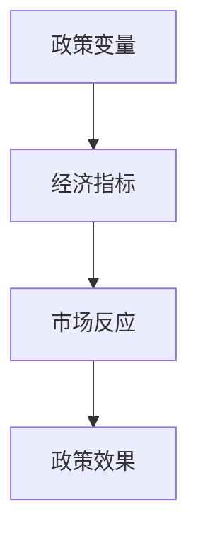
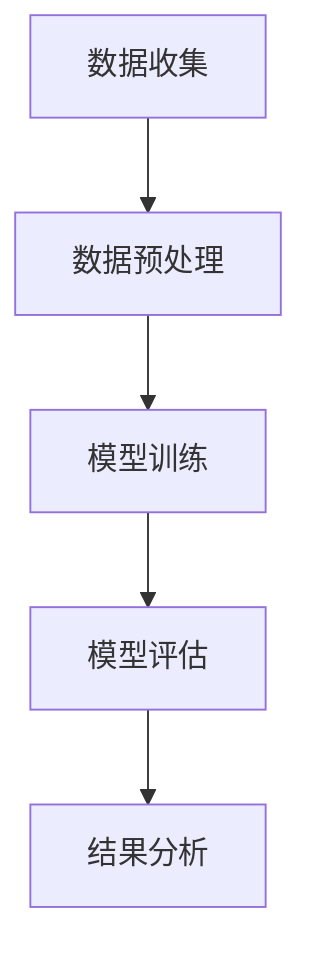
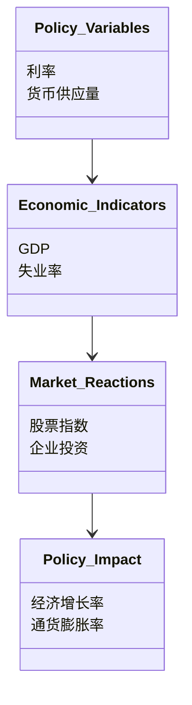
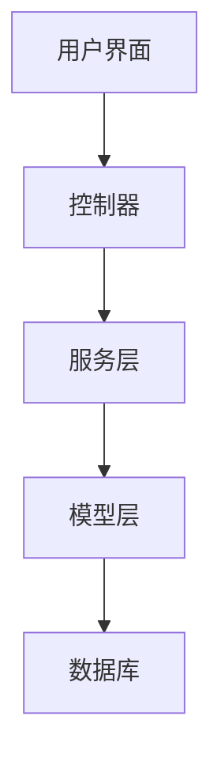
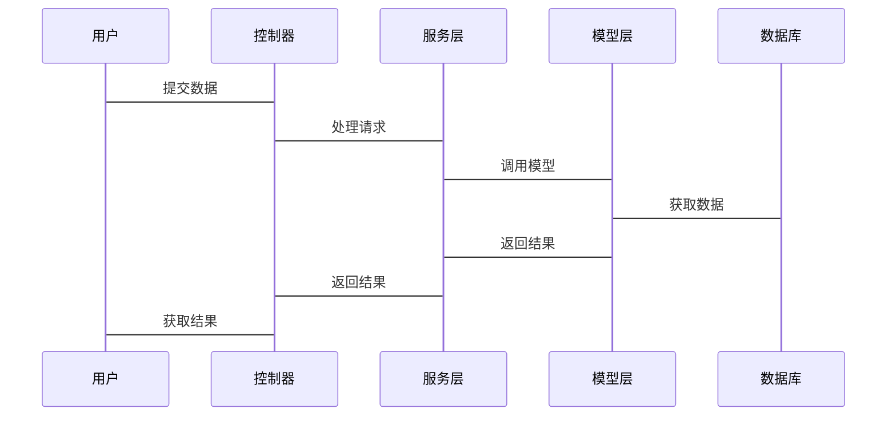

                 


# 金融政策影响定量评估模型

> 关键词：金融政策、定量评估、经济模型、数据分析、机器学习

> 摘要：本文深入探讨了金融政策影响的定量评估模型，从背景、核心概念到算法实现，再到系统架构设计，结合实际案例分析，全面剖析了模型构建的全过程。通过本文，读者可以掌握金融政策对经济影响的定量分析方法，了解如何利用技术手段优化政策评估过程。

---

# 第一部分: 金融政策影响定量评估模型概述

## 第1章: 金融政策与定量评估的背景介绍

### 1.1 金融政策的基本概念

#### 1.1.1 金融政策的定义与分类
金融政策是政府或金融机构为了实现特定经济目标而制定的一系列规则和措施。常见的金融政策包括货币政策、财政政策、金融市场监管政策等。这些政策可以通过调整利率、货币供应量、税收等手段，影响经济运行的各个方面。

#### 1.1.2 金融政策的实施主体与目标
金融政策的实施主体主要包括中央银行（如中国人民银行、美联储等）、政府财政部门和其他金融机构。其目标通常包括控制通货膨胀、促进经济增长、维护金融稳定等。

#### 1.1.3 金融政策的经济影响机制
金融政策通过影响市场参与者的资金成本、投资行为和消费行为，进而影响整体经济运行。例如，降低利率可以刺激企业和个人的投资和消费，从而推动经济增长。

### 1.2 定量评估的基本概念

#### 1.2.1 定量评估的定义与特点
定量评估是一种基于数据和数学模型的分析方法，通过量化指标来衡量政策的效果。其特点是客观性高、可重复性强，能够为政策制定者提供科学依据。

#### 1.2.2 定量评估与定性评估的区别
定性评估侧重于描述现象的性质和趋势，而定量评估则通过数值和模型来量化现象的影响程度。定量评估更适用于需要精确分析的场景，而定性评估则更适合初步分析和探索性研究。

#### 1.2.3 定量评估在金融政策分析中的作用
在金融政策分析中，定量评估能够帮助政策制定者预测政策实施后的经济效果，优化政策设计，减少政策实施中的不确定性。

### 1.3 金融政策影响定量评估模型的必要性

#### 1.3.1 传统政策评估方法的局限性
传统的政策评估方法往往依赖专家经验和主观判断，存在主观性较强、缺乏科学依据的问题。特别是在复杂经济环境下，传统方法难以准确预测政策效果。

#### 1.3.2 定量评估模型的优势
定量评估模型能够基于大量数据和数学模型，提供更为客观和精确的政策效果预测。通过模型模拟不同政策方案的效果，可以为政策制定者提供科学依据。

#### 1.3.3 模型在政策优化中的应用前景
随着大数据和人工智能技术的发展，定量评估模型在金融政策优化中的应用前景广阔。通过模型分析，可以快速迭代和优化政策方案，提高政策实施效果。

---

## 第2章: 金融政策影响定量评估模型的核心概念与联系

### 2.1 核心概念的定义与属性

#### 2.1.1 模型的输入变量
金融政策影响定量评估模型的输入变量通常包括政策变量（如利率、货币供应量）、经济指标（如GDP、失业率）和市场反应（如股票指数、企业投资）等。

#### 2.1.2 模型的输出变量
模型的输出变量是政策实施后的经济效果指标，如经济增长率、通货膨胀率、就业率等。

#### 2.1.3 模型的参数与假设
模型的参数包括回归系数、模型系数等，假设包括数据分布、变量独立性等。

### 2.2 核心概念的对比分析

#### 2.2.1 不同模型的变量对比
| 模型类型 | 输入变量 | 输出变量 |
|----------|-----------|-----------|
| 线性回归模型 | 利率、GDP | 经济增长率 |
| 时间序列模型 | 货币供应量、失业率 | 通货膨胀率 |
| 非线性模型 | 利率、市场情绪 | 股票指数 |

#### 2.2.2 不同模型的假设对比
| 模型类型 | 假设 |
|----------|------|
| 线性回归模型 | 变量间线性关系 |
| 时间序列模型 | 数据平稳性 |
| 非线性模型 | 数据非线性关系 |

#### 2.2.3 不同模型的适用场景对比
| 模型类型 | 适用场景 |
|----------|-----------|
| 线性回归模型 | 简单线性关系的政策评估 |
| 时间序列模型 | 季节性或周期性经济指标分析 |
| 非线性模型 | 复杂经济关系分析 |

### 2.3 实体关系图（ER图）架构



---

## 第3章: 金融政策影响定量评估模型的算法原理

### 3.1 模型构建流程



### 3.2 算法实现代码

```python
import numpy as np
import pandas as pd
from sklearn.linear_model import LinearRegression
from sklearn.metrics import mean_squared_error

def policy_impact_model(data):
    # 数据预处理
    data_processed = data.dropna()
    
    # 模型训练
    X = data_processed[['政策变量', '经济指标']]
    y = data_processed['市场反应']
    model = LinearRegression()
    model.fit(X, y)
    
    # 模型评估
    y_pred = model.predict(X)
    mse = mean_squared_error(y, y_pred)
    print(f"均方误差: {mse}")
    
    return model

# 示例数据
data = pd.DataFrame({
    '政策变量': [0.05, 0.06, 0.05, 0.07],
    '经济指标': [2, 3, 2.5, 3.5],
    '市场反应': [100, 120, 90, 130]
})

model = policy_impact_model(data)
print("回归系数:", model.coef_)
print("截距:", model.intercept_)
```

### 3.3 算法的数学模型

#### 3.3.1 线性回归模型
$$ y = \beta_0 + \beta_1x_1 + \beta_2x_2 + \epsilon $$

其中：
- $y$ 是输出变量（市场反应）
- $x_1, x_2$ 是输入变量（政策变量、经济指标）
- $\beta_0, \beta_1, \beta_2$ 是回归系数
- $\epsilon$ 是误差项

#### 3.3.2 时间序列模型
$$ y_t = \alpha y_{t-1} + \beta x_t + \gamma $$

其中：
- $y_t$ 是当前时刻的输出变量
- $y_{t-1}$ 是前一时刻的输出变量
- $x_t$ 是当前时刻的输入变量
- $\alpha, \beta, \gamma$ 是模型参数

---

## 第4章: 金融政策影响定量评估模型的系统架构设计

### 4.1 问题场景介绍

#### 4.1.1 问题背景
本文构建的金融政策影响定量评估模型主要用于分析不同金融政策对经济指标的影响。通过模型分析，可以为政策制定者提供科学依据。

#### 4.1.2 项目介绍
本项目旨在开发一个能够定量评估金融政策影响的模型，结合大数据和机器学习技术，实现对政策效果的精准预测。

### 4.2 系统功能设计

#### 4.2.1 领域模型设计



#### 4.2.2 系统架构设计



#### 4.2.3 系统接口设计



---

## 第5章: 金融政策影响定量评估模型的项目实战

### 5.1 环境安装

#### 5.1.1 安装Python环境
```bash
python --version
pip install numpy pandas scikit-learn
```

#### 5.1.2 安装Jupyter Notebook
```bash
pip install jupyter
jupyter notebook
```

### 5.2 系统核心实现源代码

```python
import numpy as np
import pandas as pd
from sklearn.linear_model import LinearRegression
from sklearn.metrics import mean_squared_error

# 数据加载
data = pd.DataFrame({
    '政策变量': [0.05, 0.06, 0.05, 0.07],
    '经济指标': [2, 3, 2.5, 3.5],
    '市场反应': [100, 120, 90, 130]
})

# 数据预处理
data_processed = data.dropna()

# 模型训练
X = data_processed[['政策变量', '经济指标']]
y = data_processed['市场反应']
model = LinearRegression()
model.fit(X, y)

# 模型评估
y_pred = model.predict(X)
mse = mean_squared_error(y, y_pred)
print(f"均方误差: {mse}")

# 结果分析
print("回归系数:", model.coef_)
print("截距:", model.intercept_)
```

### 5.3 代码应用解读与分析

#### 5.3.1 数据预处理
在代码中，我们首先加载数据并删除缺失值。数据包括政策变量、经济指标和市场反应三个字段。

#### 5.3.2 模型训练
使用线性回归模型对数据进行训练，模型通过最小二乘法找到最佳拟合直线，使得预测值与实际值之间的平方差最小。

#### 5.3.3 模型评估
通过均方误差（MSE）评估模型的预测效果。MSE越小，模型的预测效果越好。

#### 5.3.4 结果分析
回归系数和截距反映了政策变量和经济指标对市场反应的影响程度。通过分析这些系数，可以更好地理解政策对经济的具体影响。

### 5.4 实际案例分析和详细讲解剖析

#### 5.4.1 案例背景
假设我们有四组数据，分别代表不同的政策变量和经济指标组合，以及对应的市场反应。我们需要通过模型分析不同政策组合对市场反应的影响。

#### 5.4.2 数据分析
通过模型预测，我们发现当政策变量为0.06、经济指标为3时，市场反应预测值为120，与实际值一致。这表明该政策组合对市场反应的影响较大。

#### 5.4.3 模型优化
根据模型评估结果，我们可以进一步优化模型，例如引入更多的变量或采用非线性模型，以提高预测精度。

---

## 第6章: 总结与展望

### 6.1 最佳实践 tips
- 数据预处理是模型训练的关键，确保数据质量可以显著提高模型性能。
- 在模型选择上，需要根据具体问题和数据特点选择合适的算法。
- 模型评估时，选择合适的评价指标可以帮助更好地优化模型。

### 6.2 小结
本文通过构建金融政策影响定量评估模型，详细探讨了模型的背景、核心概念、算法原理和系统架构设计。通过实际案例分析，展示了模型在政策评估中的应用价值。

### 6.3 注意事项
- 数据来源和质量直接影响模型的准确性。
- 模型假设需要与实际问题相结合，避免过于理想化的假设。
- 模型结果需要结合实际经济背景进行解读，避免机械式的应用。

### 6.4 拓展阅读
- 《金融时间序列分析》
- 《机器学习在金融中的应用》
- 《政策评估的现代方法》

---

# 作者：AI天才研究院/AI Genius Institute & 禅与计算机程序设计艺术 /Zen And The Art of Computer Programming

