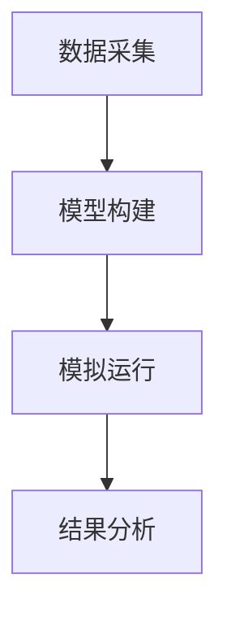
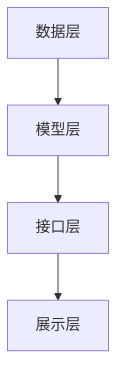

                 


# 《金融政策影响模拟系统》

> 关键词：金融政策，模拟系统，算法，系统架构，金融建模

> 摘要：本文详细介绍了金融政策影响模拟系统的设计与实现，从背景概述、核心概念到算法原理、系统架构，再到项目实战和最佳实践，全面解析了该系统的构建过程。通过本篇文章，读者将能够理解金融政策模拟的核心原理，并掌握如何利用技术手段进行金融政策的模拟与分析。

---

## 第一部分：金融政策影响模拟系统概述

### 第1章：金融政策影响模拟系统背景与概述

#### 1.1 金融政策的基本概念

- **金融政策的定义与分类**
  - 金融政策是指政府或金融机构为了实现特定的经济目标而制定的规则和措施。
  - 分为货币政策、财政政策和监管政策等类别。

- **金融政策的核心要素与作用机制**
  - 核心要素包括利率、货币供应量、税收政策等。
  - 作用机制通过市场调节、资源配置和风险控制实现经济目标。

- **金融政策的制定与实施过程**
  - 制定：基于经济目标和数据分析，制定相关政策。
  - 实施：通过央行或其他金融机构执行政策。

#### 1.2 金融政策影响模拟的背景与意义

- **当前金融环境的复杂性与不确定性**
  - 全球化和数字化导致金融市场的复杂性增加。
  - 经济波动和政策变化对企业和个人的影响日益显著。

- **金融政策对经济和社会的影响**
  - 正面影响：促进经济增长、稳定金融市场。
  - 负面影响：可能导致市场波动或企业负担加重。

- **模拟系统在政策评估中的作用**
  - 通过模拟系统可以预测政策效果，优化决策。

#### 1.3 金融政策影响模拟系统的定义与目标

- **系统的定义与核心目标**
  - 定义：利用技术手段模拟金融政策实施后的经济效果。
  - 目标：评估政策效果，辅助决策。

- **系统的边界与外延**
  - 边界：限定在金融政策对经济的影响范围内。
  - 外延：可扩展到其他领域如社会学和环境影响。

- **系统的核心功能与应用场景**
  - 核心功能：数据处理、模型构建、模拟分析。
  - 应用场景：政策制定、风险评估、经济预测。

#### 1.4 本章小结

本章介绍了金融政策的基本概念、模拟系统的背景意义及其定义目标，为后续分析奠定了基础。

---

## 第二部分：金融政策影响模拟系统的核心概念与联系

### 第2章：核心概念与系统架构

#### 2.1 金融政策影响模拟系统的原理

- **系统输入与输出的关系**
  - 输入：政策参数、经济指标。
  - 输出：预测结果、模拟报告。

- **金融政策变量与经济指标的关联**
  - 利率调整影响投资和消费。
  - 财政政策影响政府支出和税收。

- **模拟模型的构建逻辑**
  - 数据收集、模型选择、参数设定、模拟运行。

#### 2.2 核心概念对比与ER实体关系图

- **核心概念对比表**

| 对比维度 | 金融政策变量 | 经济指标 |
|----------|---------------|----------|
| 示例     | 利率          | GD P     |

- **ER实体关系图**

```mermaid
erd
actor: Actor
actormeta: "User"
group: Group
groupmeta: "Admin"
start
transition: "开始"
end
```

#### 2.3 系统架构与模块划分

- **系统功能模块划分**
  - 数据采集、模型构建、模拟运行、结果分析。

- **模块之间的关系与数据流**



#### 2.4 本章小结

本章分析了系统的原理和核心概念，并通过图表展示了系统架构，为后续实现提供了框架。

---

## 第三部分：金融政策影响模拟系统的算法原理

### 第3章：算法原理与实现

#### 3.1 算法选择与原理

- **算法选择的依据与标准**
  - 简单性、高效性、准确性。

- **算法的数学模型与实现逻辑**
  - 蒙特卡洛模拟：通过随机采样预测政策效果。

- **算法的优缺点分析**
  - 优点：考虑多种可能性，结果全面。
  - 缺点：计算量大，需大量数据支持。

#### 3.2 算法实现的Python代码示例

```python
import random

def simulate_policy(n_simulations):
    results = []
    for _ in range(n_simulations):
        # 模拟过程，假设利率变化影响GDP
        initial_gdp = 100
        interest_rate = random.uniform(0.01, 0.05)
        gdp_change = initial_gdp * (1 + interest_rate)
        results.append(gdp_change)
    return results

# 示例运行
sim_results = simulate_policy(1000)
print("模拟结果：", sim_results)
```

#### 3.3 算法的数学模型和公式

- **蒙特卡洛模拟的数学模型**

$$
\text{GDP}_{t+1} = \text{GDP}_t + \text{GDP}_t \times r
$$

其中，\( r \) 是随机选取的利率变化。

#### 3.4 本章小结

本章通过蒙特卡洛模拟介绍了算法原理，并展示了Python实现，为系统构建提供了技术基础。

---

## 第四部分：系统分析与架构设计

### 第4章：系统分析与架构设计

#### 4.1 系统功能设计（领域模型）

- **领域模型的构建**


#### 4.2 系统架构设计

- **系统架构**



#### 4.3 系统接口设计与交互流程

- **接口设计**

```mermaid
sequenceDiagram
actor: 用户
system: 金融政策影响模拟系统
actor -> system: 提交政策参数
system -> actor: 返回模拟结果
```

#### 4.4 本章小结

本章详细设计了系统架构，并通过图表展示了系统结构和交互流程。

---

## 第五部分：项目实战

### 第5章：项目实战与分析

#### 5.1 项目环境搭建

- **工具与库**
  - Python、NumPy、Matplotlib、Scikit-learn。

#### 5.2 核心代码实现

```python
import numpy as np
import matplotlib.pyplot as plt

def main():
    n_simulations = 1000
    results = []
    for _ in range(n_simulations):
        # 政策参数，假设改变税收政策
        tax_rate = np.random.uniform(0.1, 0.3)
        # 经济指标，如GDP变化
        gdp_change = np.random.normal(1.0, 0.1) * (1 - tax_rate)
        results.append(gdp_change)
    plt.hist(results, bins=50)
    plt.xlabel('GDP Change')
    plt.ylabel('Frequency')
    plt.show()

if __name__ == "__main__":
    main()
```

#### 5.3 案例分析与结果解读

- **案例分析**
  - 模拟结果显示税收政策变化对GDP的影响。

#### 5.4 本章小结

本章通过实际案例展示了系统的实现，并分析了模拟结果，帮助读者理解系统的应用价值。

---

## 第六部分：最佳实践

### 第6章：最佳实践与总结

#### 6.1 项目总结

- 系统实现了金融政策的模拟，提供了决策支持工具。

#### 6.2 注意事项与建议

- 数据的准确性和完整性至关重要。
- 模型的选择需结合实际情况。

#### 6.3 未来展望

- 结合大数据和AI优化系统。
- 扩展到更多金融政策领域。

#### 6.4 拓展阅读

- 推荐书籍：《金融建模与风险管理》。

#### 6.5 本章小结

本章总结了项目的成果，并提出了改进建议和未来方向。

---

## 作者信息

作者：AI天才研究院/AI Genius Institute & 禅与计算机程序设计艺术/Zen And The Art of Computer Programming

---

这篇文章通过详细阐述金融政策影响模拟系统的构建过程，帮助读者理解其技术实现和应用场景，同时提供丰富的代码示例和图表，便于读者实际操作和深入研究。

