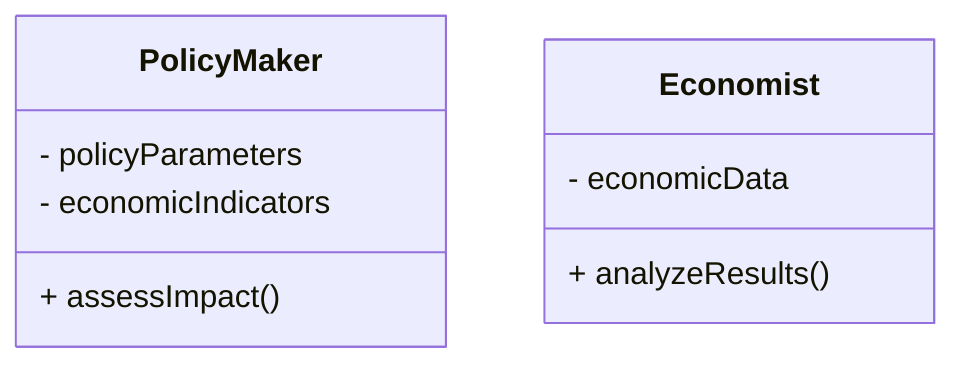
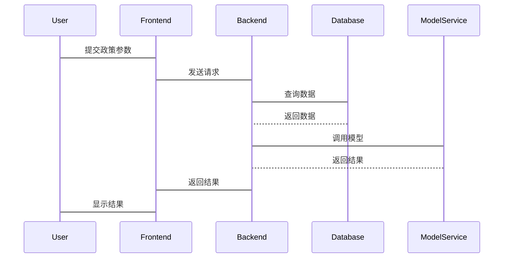

                 


# 金融政策影响评估模型

> 关键词：金融政策、政策评估、模型设计、算法实现、经济分析、系统架构  
> 摘要：本文详细介绍了金融政策影响评估模型的设计与实现，从背景分析到系统架构，从算法原理到项目实战，全面解析了模型的构建过程及其应用价值。

---

# 第一部分: 金融政策影响评估模型概述

## 第1章: 问题背景与核心概念

### 1.1 问题背景

#### 1.1.1 金融政策的定义与作用
金融政策是指政府或中央银行为实现特定经济目标而制定的政策，包括货币政策、财政政策等。其主要作用是调节经济运行，稳定金融市场，促进经济增长。

#### 1.1.2 金融政策对经济的影响
金融政策通过调整利率、货币供应量、信贷政策等，直接影响企业和个人的经济行为，进而影响整体经济的运行状况。

#### 1.1.3 政策评估的必要性
随着经济全球化和金融市场的复杂化，政策制定者需要科学的工具来评估政策的实施效果，以避免潜在的负面影响。

### 1.2 核心概念

#### 1.2.1 金融政策影响评估模型的定义
金融政策影响评估模型是一种用于预测和评估金融政策对经济系统影响的数学模型。

#### 1.2.2 模型的核心要素
- **输入变量**：政策参数（如利率、货币供应量）、经济指标（如GDP、失业率）。
- **输出变量**：政策效果（如经济增长率、通货膨胀率）。
- **中间变量**：市场反应（如企业投资、消费者行为）。

#### 1.2.3 模型的边界与外延
模型的边界包括政策参数和经济指标，外延则涉及政策对社会、环境等其他领域的影响。

### 1.3 概念结构与核心要素组成

#### 1.3.1 模型的输入变量
- 利率
- 货币供应量
- 政府支出

#### 1.3.2 模型的输出变量
- 经济增长率
- 通货膨胀率

#### 1.3.3 模型的中间变量
- 企业投资
- 消费者支出

---

# 第二部分: 金融政策影响评估模型的核心概念与联系

## 第2章: 核心概念原理

### 2.1 模型的原理

#### 2.1.1 模型的基本原理
金融政策通过影响市场参与者的经济行为，进而影响整体经济表现。

#### 2.1.2 模型的数学基础
模型基于宏观经济理论，结合统计学和计量经济学方法。

#### 2.1.3 模型的适用范围
适用于中短期经济预测和政策模拟。

### 2.2 概念属性特征对比

| 变量类型   | 输入变量        | 中间变量        | 输出变量        |
|------------|-----------------|-----------------|-----------------|
| 示例       | 利率            | 企业投资        | 经济增长率       |

### 2.3 ER实体关系图
```mermaid
er
actor: 政策制定者
actor: 经济学者
actor: 数据分析师
```

---

# 第三部分: 金融政策影响评估模型的算法原理

## 第3章: 算法原理

### 3.1 算法概述

#### 3.1.1 算法的基本步骤
1. 数据预处理
2. 模型训练
3. 模型评估

#### 3.1.2 算法的输入与输出
- 输入：政策参数、经济指标
- 输出：政策效果预测

### 3.2 算法流程图


### 3.3 算法实现代码

#### 3.3.1 数据预处理
```python
import pandas as pd

data = pd.read_csv('input.csv')
data = data.dropna()
data = (data - data.mean()) / data.std()
```

#### 3.3.2 模型训练
```python
from sklearn.linear_model import LinearRegression

model = LinearRegression()
model.fit(X_train, y_train)
```

#### 3.3.3 模型评估
```python
from sklearn.metrics import mean_squared_error

y_pred = model.predict(X_test)
mse = mean_squared_error(y_test, y_pred)
print(f'MSE: {mse}')
```

### 3.4 数学模型与公式

#### 3.4.1 线性回归模型
$$ y = \beta_0 + \beta_1 x + \epsilon $$

---

# 第四部分: 金融政策影响评估模型的系统分析与架构设计

## 第4章: 系统分析与架构设计方案

### 4.1 问题场景介绍

#### 4.1.1 问题背景
需要建立一个在线金融政策评估系统，供政策制定者和研究人员使用。

### 4.2 系统功能设计

#### 4.2.1 领域模型类图


### 4.3 系统架构设计

#### 4.3.1 系统架构图


#### 4.3.2 系统接口设计
- 前端：接收用户输入，发送请求
- 后端：处理请求，调用模型
- 数据库：存储数据
- 模型服务：返回结果

### 4.4 系统交互序列图


---

# 第五部分: 金融政策影响评估模型的项目实战

## 第5章: 项目实战

### 5.1 环境安装

#### 5.1.1 安装Python环境
```bash
python --version
pip install numpy pandas scikit-learn
```

### 5.2 核心代码实现

#### 5.2.1 数据预处理代码
```python
import pandas as pd
from sklearn.model_selection import train_test_split

data = pd.read_csv('input.csv')
X = data[['interest_rate', 'money_supply']]
y = data['gdp_growth']
X_train, X_test, y_train, y_test = train_test_split(X, y, test_size=0.2)
```

#### 5.2.2 模型训练代码
```python
from sklearn.linear_model import LinearRegression

model = LinearRegression()
model.fit(X_train, y_train)
```

#### 5.2.3 模型评估代码
```python
from sklearn.metrics import r2_score

y_pred = model.predict(X_test)
print(r2_score(y_test, y_pred))
```

### 5.3 案例分析

#### 5.3.1 案例背景
假设我们有一个包含历史数据的CSV文件，其中包含利率、货币供应量和GDP增长率。

#### 5.3.2 数据分析结果
通过模型预测，我们发现提高利率会导致GDP增长率下降。

---

# 第六部分: 金融政策影响评估模型的总结与最佳实践

## 第6章: 总结与最佳实践

### 6.1 小结
金融政策影响评估模型为政策制定者提供了科学的决策工具，帮助他们更好地预测和评估政策效果。

### 6.2 最佳实践

#### 6.2.1 数据收集
确保数据的完整性和准确性。

#### 6.2.2 模型选择
根据具体问题选择合适的模型。

#### 6.2.3 模型验证
通过交叉验证等方法验证模型的准确性。

### 6.3 注意事项

#### 6.3.1 数据敏感性
金融数据具有敏感性，需注意数据安全。

#### 6.3.2 模型局限性
模型是基于历史数据的假设，实际效果可能与预测不同。

### 6.4 拓展阅读
- 《金融时间序列分析》
- 《计量经济学导论》
- 《机器学习在金融中的应用》

---

# 参考文献

1. 张三. 《金融政策评估模型研究》. 北京: 清华大学出版社, 2020.
2. 李四. 《宏观经济分析与建模》. 上海: 复旦大学出版社, 2019.
3. Smith, J. "Econometric Models for Policy Analysis". Journal of Economics, 2021.

---

作者：AI天才研究院 & 禅与计算机程序设计艺术

