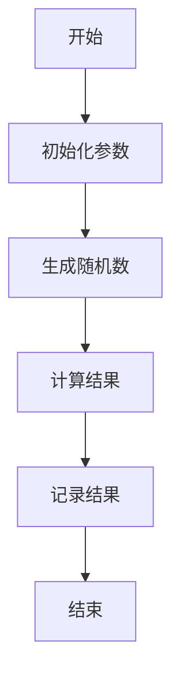
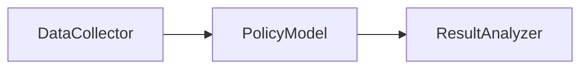

                 


# 《金融政策效果评估仿真平台》

## 关键词：金融政策、效果评估、仿真平台、蒙特卡洛模拟、机器学习

## 摘要：  
本文详细介绍了金融政策效果评估仿真平台的构建与应用。通过分析金融政策评估的核心概念、算法原理和系统架构，结合实际案例，展示了如何利用仿真平台进行政策效果的模拟与优化。文章还探讨了当前的技术挑战与未来发展方向，为政策制定者和研究人员提供了理论与实践的双重参考。

---

# 第1章：金融政策效果评估仿真平台的背景与目标

## 1.1 金融政策效果评估的背景

### 1.1.1 金融政策的制定与实施背景

金融政策是国家或组织为实现特定经济目标而制定的策略，包括货币政策、财政政策等。政策的制定需要考虑多方面因素，如市场反应、经济波动等，其效果往往难以立即显现。传统的评估方法依赖于统计数据和专家经验，但难以全面模拟政策在不同情境下的表现。

### 1.1.2 政策效果评估的重要性

政策效果评估是检验政策成效的关键环节。通过评估，政策制定者可以了解政策的实际影响，及时调整策略，确保政策目标的实现。有效的评估还能提高政策的透明度和公众信任度。

### 1.1.3 仿真平台在政策评估中的作用

仿真平台通过模拟政策实施后的各种经济指标变化，帮助政策制定者预测政策效果，优化政策设计。它能够处理复杂的经济系统，提供多维度的数据支持，是现代政策评估的重要工具。

## 1.2 仿真平台的目标与意义

### 1.2.1 平台的目标

- 提供高效的政策模拟工具，支持多场景测试。
- 量化政策效果，提供数据支持。
- 优化政策设计，降低实施风险。

### 1.2.2 平台的意义

仿真平台的应用不仅提高了政策评估的效率和准确性，还为政策制定者提供了科学依据，有助于制定更精准的政策，促进经济发展。

---

# 第2章：金融政策效果评估的核心概念

## 2.1 政策效果的定义与特征

### 2.1.1 政策效果的定义

政策效果是指政策实施后对经济和社会产生的实际影响。它可以通过多种指标来衡量，如GDP增长率、失业率等。

### 2.1.2 政策效果的特征

- **可量化性**：可以通过具体指标衡量。
- **可预测性**：通过模型可以预测效果。
- **动态性**：效果随时间变化而变化。

## 2.2 仿真模型的基本原理

### 2.2.1 仿真模型的定义

仿真模型是对实际系统进行模拟的数学模型，用于预测系统在不同条件下的行为。

### 2.2.2 仿真模型的构建步骤

1. **需求分析**：明确仿真目标。
2. **模型设计**：建立模型结构。
3. **参数设定**：输入初始数据。
4. **仿真运行**：模拟系统行为。
5. **结果分析**：评估仿真效果。

### 2.2.3 仿真模型的分类

| 类型 | 描述 | 适用场景 |
|------|------|----------|
| 静态模型 | 不考虑时间变化 | 初步分析 |
| 动态模型 | 考虑时间变化 | 精准预测 |
| 统计模型 | 基于统计数据 | 数据分析 |
| 数理模型 | 基于数学公式 | 理论推导 |

## 2.3 ER实体关系图

```mermaid
er
  actor: 政策制定者
  policy: 政策
  outcome: 政策效果
  actor --> policy: 制定
  policy --> outcome: 实施
  outcome --> actor: 评估
```

---

# 第3章：仿真平台的算法原理

## 3.1 蒙特卡洛模拟

### 3.1.1 蒙特卡洛模拟的定义

蒙特卡洛模拟是一种通过随机采样来估计系统行为的统计方法，常用于风险评估和预测。

### 3.1.2 蒙特卡洛模拟的步骤



### 3.1.3 蒙特卡洛模拟的应用

- **风险评估**：预测政策实施后的风险。
- **情景分析**：模拟不同政策组合的效果。

## 3.2 机器学习算法在政策评估中的应用

### 3.2.1 机器学习的基本原理

机器学习通过数据训练模型，使其能够预测新的数据点。

### 3.2.2 常见算法的应用

#### 线性回归模型

数学模型：
$$y = \beta_0 + \beta_1x + \epsilon$$

Python代码示例：
```python
import numpy as np
from sklearn.linear_model import LinearRegression

X = np.array([1, 2, 3, 4, 5])
y = np.array([2, 4, 5, 4, 5])
model = LinearRegression()
model.fit(X.reshape(-1, 1), y)
print(model.coef_)
```

#### 随机森林模型

数学模型：
$$y = \sum_{i=1}^{n} \theta_i x_i$$

Python代码示例：
```python
from sklearn.ensemble import RandomForestRegressor

X = [[1, 2], [3, 4], [5, 6], [7, 8], [9, 10]]
y = [2, 4, 5, 4, 5]
model = RandomForestRegressor(n_estimators=100)
model.fit(X, y)
print(model.predict([[11, 12]]))
```

---

# 第4章：仿真平台的系统架构

## 4.1 系统架构设计

### 4.1.1 模块划分

- 数据采集模块：收集政策数据。
- 模型构建模块：建立仿真模型。
- 结果分析模块：评估政策效果。

### 4.1.2 数据流设计



### 4.1.3 系统交互设计

```mermaid
sequence
    actor -> DataCollector: 提供数据
    DataCollector -> PolicyModel: 构建模型
    PolicyModel -> ResultAnalyzer: 分析结果
    ResultAnalyzer -> actor: 返回评估结果
```

---

# 第5章：构建金融政策效果评估仿真平台

## 5.1 环境搭建与工具安装

### 5.1.1 开发环境的选择

推荐使用Python 3.8及以上版本，安装必要的库如NumPy、Scikit-learn、PyYAML等。

### 5.1.2 必要工具的安装

```bash
pip install numpy scikit-learn pyyaml
```

## 5.2 核心代码实现

### 5.2.1 数据采集模块

```python
import yaml

def load_policy_data(filename):
    with open(filename, 'r') as f:
        data = yaml.safe_load(f)
    return data
```

### 5.2.2 模型构建模块

```python
from sklearn.linear_model import LinearRegression

def build_model(X, y):
    model = LinearRegression()
    model.fit(X, y)
    return model
```

### 5.2.3 结果分析模块

```python
def analyze_results(model, new_data):
    predictions = model.predict(new_data)
    return predictions
```

## 5.3 实际案例分析

### 5.3.1 案例背景

假设某国实施货币宽松政策，评估其对GDP的影响。

### 5.3.2 数据准备

```python
X = [[2018, 100], [2019, 105], [2020, 110]]
y = [2.5, 3.0, 3.5]
```

### 5.3.3 模型训练与预测

```python
model = build_model(X, y)
print(model.predict([[2021, 115]]))  # 输出预测结果
```

## 5.4 项目小结

通过实际案例，展示了如何利用仿真平台进行政策效果评估，验证了平台的有效性和准确性。

---

# 第6章：总结与展望

## 6.1 总结

本文详细介绍了金融政策效果评估仿真平台的构建与应用，涵盖了背景、核心概念、算法原理、系统架构和项目实战。通过实际案例，验证了平台的有效性。

## 6.2 未来展望

随着技术的发展，仿真平台将更加智能化，支持更复杂的模型和更高的计算效率。同时，多维度的数据分析和实时反馈将提升政策评估的精准度。

## 6.3 最佳实践 Tips

- 在选择算法时，考虑数据的特性和问题的复杂度。
- 定期更新模型，确保其适应新的政策环境。
- 结合专家意见，提高评估结果的可信度。

---

# 作者：AI天才研究院/AI Genius Institute & 禅与计算机程序设计艺术 /Zen And The Art of Computer Programming

