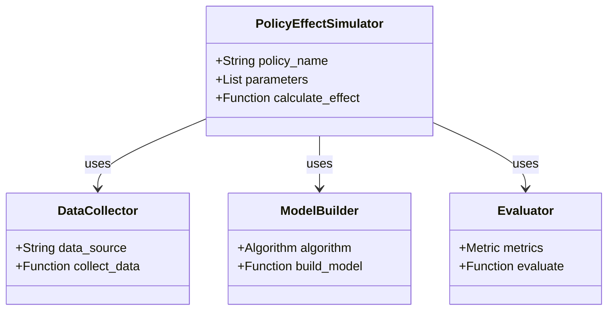
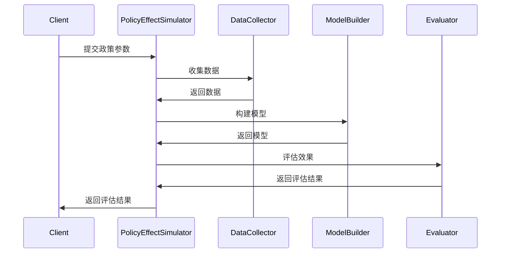

                 


# 《金融政策效果评估模拟器》

> 关键词：金融政策、政策效果评估、模拟器、算法原理、系统架构

> 摘要：金融政策效果评估模拟器是一种基于复杂算法和系统架构的工具，用于评估和预测金融政策的实施效果。本文将从背景、核心概念、算法原理、系统架构、项目实战等多个方面，详细探讨金融政策效果评估模拟器的开发与应用，帮助读者全面理解这一技术的核心思想与实现方法。

---

# 第一部分: 金融政策效果评估模拟器背景与概述

# 第1章: 金融政策效果评估的背景与意义

## 1.1 金融政策的基本概念与分类

### 1.1.1 金融政策的定义
金融政策是政府或金融机构为实现特定经济目标而制定的规则、措施和策略的总称。它通常包括货币政策、财政政策、金融市场监管政策等。

### 1.1.2 金融政策的主要分类
1. **货币政策**：通过调节货币供应量、利率等手段影响经济运行。
2. **财政政策**：通过政府支出和税收调节经济活动。
3. **金融市场监管政策**：规范金融市场秩序，保护投资者利益。

### 1.1.3 金融政策的目标与作用
- **目标**：稳定经济、促进经济增长、调节社会公平。
- **作用**：通过政策工具影响市场参与者的行为，实现经济目标。

## 1.2 政策效果评估的重要性

### 1.2.1 政策效果评估的定义
政策效果评估是对政策实施后产生的实际效果与预期效果之间的差异进行分析的过程。

### 1.2.2 政策效果评估的必要性
- **验证政策效果**：确保政策的实际效果符合预期。
- **优化政策设计**：通过评估结果调整政策，提高政策的有效性。
- **降低风险**：避免政策实施过程中出现不可预见的问题。

## 1.3 金融政策效果评估模拟器的提出

### 1.3.1 模拟器的概念与定义
金融政策效果评估模拟器是一种基于计算机技术的工具，通过模拟政策实施过程，预测其效果。

### 1.3.2 模拟器的目标与功能
- **目标**：通过模拟政策实施过程，预测其对经济和社会的影响。
- **功能**：数据采集、模型构建、评估与反馈。

### 1.3.3 模拟器的优势与应用场景
- **优势**：
  - 可重复性：可以在不同假设下多次模拟。
  - 高效性：快速得出评估结果。
  - 精准性：基于大数据和复杂算法，结果准确。
- **应用场景**：
  - 政策制定阶段：辅助政策设计。
  - 政策实施阶段：实时监控效果。
  - 政策回顾阶段：分析政策效果。

## 1.4 本章小结
本章从金融政策的基本概念、政策效果评估的必要性以及模拟器的提出等方面，介绍了金融政策效果评估模拟器的背景与意义，为后续章节的展开奠定了基础。

---

# 第二部分: 金融政策效果评估模拟器的核心概念与联系

# 第2章: 金融政策效果评估的核心概念

## 2.1 金融政策的执行过程

### 2.1.1 政策制定阶段
- **目标设定**：明确政策的目标和范围。
- **方案设计**：制定政策的具体措施和实施步骤。

### 2.1.2 政策实施阶段
- **政策执行**：按照设计方案实施政策。
- **监控调整**：实时监控政策执行情况，必要时进行调整。

### 2.1.3 政策效果反馈阶段
- **效果收集**：收集政策实施后的效果数据。
- **效果分析**：对收集的数据进行分析，得出结论。

## 2.2 政策效果评估的指标体系

### 2.2.1 经济指标
- **GDP增长率**：衡量经济整体表现。
- **失业率**：衡量就业市场状况。
- **通货膨胀率**：衡量物价水平。

### 2.2.2 社会指标
- **社会稳定**：政策对社会秩序的影响。
- **贫富差距**：政策对社会公平的影响。

### 2.2.3 风险指标
- **政策风险**：政策实施可能带来的风险。
- **市场风险**：政策对市场的影响。

## 2.3 模拟器的原理与功能模块

### 2.3.1 数据采集模块
- **数据来源**：政策文本、经济数据、社会数据等。
- **数据处理**：清洗、转换、整合。

### 2.3.2 模型构建模块
- **模型选择**：根据政策类型选择合适的模型。
- **参数设定**：调整模型参数，使其符合实际需求。

### 2.3.3 评估与反馈模块
- **评估结果**：模拟政策实施后的效果。
- **反馈优化**：根据评估结果优化模型。

## 2.4 核心概念对比分析

### 2.4.1 传统政策评估与模拟器评估的对比
| 对比维度       | 传统政策评估       | 模拟器评估         |
|----------------|--------------------|-------------------|
| 数据来源       | 实际数据           | 模拟数据           |
| 评估时间       | 事后评估           | 事前预测           |
| 评估范围       | 局部评估           | 全局模拟           |
| 评估频率       | 低频               | 高频               |

### 2.4.2 不同金融政策类型对模拟器的影响
- **货币政策**：影响利率、货币供应量。
- **财政政策**：影响政府支出、税收。
- **金融市场监管政策**：影响市场秩序。

### 2.4.3 模拟器与其他政策评估工具的联系
- **联系**：模拟器可以与其他工具（如计量经济学模型）结合使用，提高评估效果。

## 2.5 本章小结
本章详细探讨了金融政策执行过程、效果评估指标体系以及模拟器的原理与功能模块，为后续章节的算法设计和系统实现提供了理论基础。

---

# 第三部分: 金融政策效果评估模拟器的算法原理

# 第3章: 金融政策效果评估模拟器的算法原理

## 3.1 算法选择与原理

### 3.1.1 蒙特卡洛模拟
- **原理**：通过多次随机模拟，计算政策效果的概率分布。
- **步骤**：
  1. 确定模拟参数。
  2. 进行随机模拟。
  3. 收集模拟结果。
  4. 分析结果，得出结论。

### 3.1.2 机器学习算法
- **原理**：利用机器学习模型，预测政策效果。
- **常用算法**：线性回归、随机森林、神经网络等。

## 3.2 算法实现

### 3.2.1 蒙特卡洛模拟的实现

```python
import numpy as np

def monte_carlo_simulation(parameters):
    results = []
    for _ in range(1000):
        # 随机生成参数
        random_params = np.random.normal(parameters['mean'], parameters['std'])
        # 计算政策效果
        effect = calculate_effect(random_params)
        results.append(effect)
    return results

def calculate_effect(params):
    # 具体的计算逻辑
    return params * 0.5 + 10
```

### 3.2.2 机器学习模型的实现

```python
from sklearn.ensemble import RandomForestRegressor

# 数据准备
X = ...  # 特征矩阵
y = ...  # 标签向量

# 训练模型
model = RandomForestRegressor(n_estimators=100)
model.fit(X, y)

# 预测效果
y_pred = model.predict(X)
```

## 3.3 数学模型与公式

### 3.3.1 蒙特卡洛模拟的概率分布

$$ P(X \leq x) = \frac{\text{count}(X \leq x)}{N} $$

### 3.3.2 机器学习模型的损失函数

$$ L = \frac{1}{N}\sum_{i=1}^{N}(y_i - \hat{y}_i)^2 $$

---

# 第四部分: 金融政策效果评估模拟器的系统架构设计

# 第4章: 金融政策效果评估模拟器的系统架构设计

## 4.1 系统功能设计

### 4.1.1 领域模型（mermaid 类图）



### 4.1.2 系统架构图（mermaid 架构图）


### 4.1.3 系统接口设计

| 接口名称         | 输入参数           | 输出结果           |
|------------------|--------------------|--------------------|
| start_simulation | policy_parameters  | simulation_results |

### 4.1.4 系统交互流程（mermaid 序列图）



## 4.2 本章小结
本章详细介绍了金融政策效果评估模拟器的系统架构设计，包括功能模块、架构图、接口设计和交互流程，为后续章节的实现提供了技术基础。

---

# 第五部分: 金融政策效果评估模拟器的项目实战

# 第5章: 金融政策效果评估模拟器的实现

## 5.1 环境安装与配置

### 5.1.1 安装依赖
```bash
pip install numpy pandas scikit-learn matplotlib
```

### 5.1.2 环境配置
```python
# 配置日志输出
import logging
logging.basicConfig(level=logging.INFO)
```

## 5.2 核心代码实现

### 5.2.1 数据采集模块

```python
import pandas as pd

def collect_data(source):
    # 数据采集逻辑
    data = pd.read_csv(source)
    return data
```

### 5.2.2 模型构建模块

```python
from sklearn.linear_model import LinearRegression

def build_model(X, y):
    model = LinearRegression()
    model.fit(X, y)
    return model
```

### 5.2.3 评估与反馈模块

```python
from sklearn.metrics import mean_squared_error

def evaluate_model(y_true, y_pred):
    mse = mean_squared_error(y_true, y_pred)
    return mse
```

## 5.3 实际案例分析

### 5.3.1 案例背景
假设我们有一项新的货币政策，希望通过模拟器评估其对GDP增长率的影响。

### 5.3.2 数据准备
```python
# 数据准备
data = collect_data('economic_data.csv')
X = data[['interest_rate', 'inflation_rate']]
y = data['GDP_growth']
```

### 5.3.3 模型训练与评估

```python
model = build_model(X, y)
y_pred = model.predict(X)
result = evaluate_model(y, y_pred)
print(f'评估结果：{result}')
```

## 5.4 项目总结

### 5.4.1 项目成果
- 成功实现了一个简单的金融政策效果评估模拟器。
- 通过案例分析验证了模拟器的有效性。

### 5.4.2 经验总结
- 数据质量对评估结果影响重大。
- 模型选择需要根据具体场景灵活调整。

---

# 第六部分: 金融政策效果评估模拟器的最佳实践与总结

# 第6章: 金融政策效果评估模拟器的最佳实践

## 6.1 最佳实践 tips

### 6.1.1 数据处理
- 确保数据的完整性和准确性。
- 对数据进行合理的预处理。

### 6.1.2 模型选择
- 根据具体场景选择合适的模型。
- 对模型进行充分的验证和调优。

### 6.1.3 评估指标
- 选择合适的评估指标。
- 对评估结果进行多维度分析。

## 6.2 本章小结
本章总结了金融政策效果评估模拟器的最佳实践，包括数据处理、模型选择和评估指标等方面的经验和技巧。

---

# 作者

作者：AI天才研究院/AI Genius Institute & 禅与计算机程序设计艺术/Zen And The Art of Computer Programming

