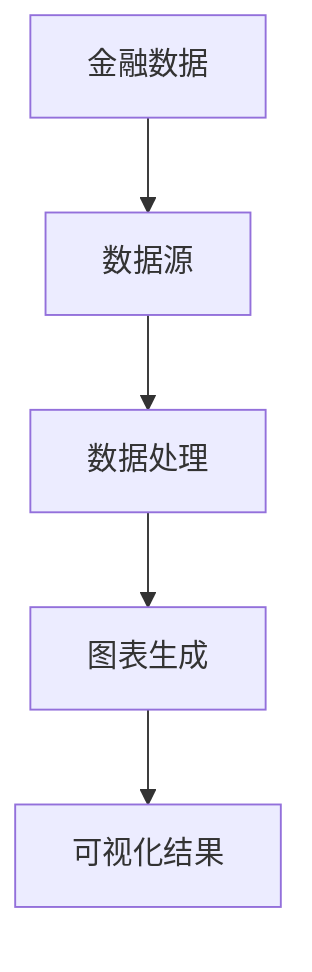
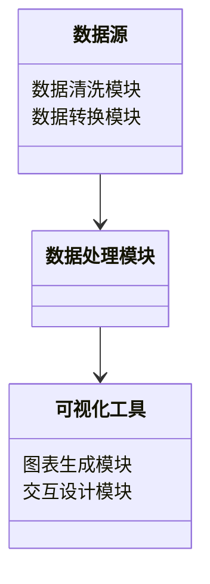
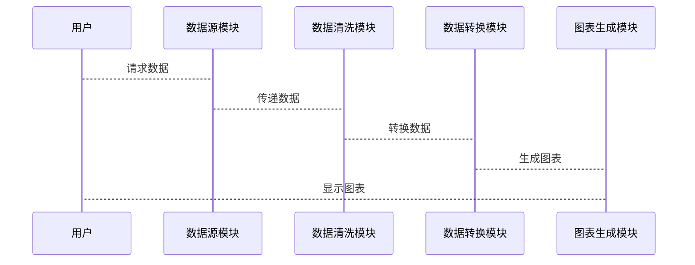

                 


# 《金融数据可视化技术应用》

## 关键词：金融数据可视化、数据处理、图表设计、交互设计、系统架构、项目实战

## 摘要：本书系统地介绍金融数据可视化的核心概念、算法原理、系统架构和实际应用。通过详细讲解数据处理、图表选择、交互设计等关键环节，结合实际案例和系统设计，帮助读者掌握金融数据可视化的技术与应用。

---

# 第一部分：金融数据可视化概述

## 第1章：金融数据可视化概述

### 1.1 问题背景与重要性

#### 1.1.1 金融数据可视化的基本概念
金融数据可视化是将复杂的金融数据通过图形化的方式展示，以便更好地理解和分析。金融数据通常包括股票价格、市场趋势、交易数据等，这些数据的复杂性和多样性使得可视化成为必要工具。

#### 1.1.2 金融数据可视化的必要性
- 数据量大：金融市场数据通常涉及大量的历史数据和实时数据，需要高效的方式进行分析。
- 数据复杂性：金融数据包含多种类型，如时间序列数据、分类数据等，可视化可以帮助简化复杂性。
- 决策支持：通过可视化，投资者和分析师可以快速识别趋势和模式，做出更明智的决策。

#### 1.1.3 金融数据可视化的核心目标
- 提供直观的洞察：通过图表展示数据，帮助用户快速理解数据。
- 支持决策：提供数据驱动的决策支持，帮助用户识别投资机会和风险。
- 优化分析效率：通过自动化和交互式可视化工具，提高数据分析的效率。

### 1.2 问题描述与解决方法

#### 1.2.1 金融数据的特点与挑战
- **时间序列数据**：金融数据通常是时间序列数据，如股票价格、指数等，需要处理时间相关的趋势和周期性。
- **数据波动性**：金融市场数据波动性大，需要高精度的分析工具。
- **数据多样性**：涉及多种数据类型，如文本、数值、图像等。

#### 1.2.2 数据可视化在金融分析中的作用
- **数据探索**：通过可视化发现数据中的模式和异常。
- **风险评估**：使用可视化工具评估投资组合的风险。
- **实时监控**：实时可视化市场动态，帮助交易员做出快速决策。

#### 1.2.3 可视化技术如何解决金融问题
- **数据清洗**：处理缺失值、异常值等。
- **数据转换**：将原始数据转换为适合可视化的形式。
- **图表选择**：根据数据类型选择合适的图表，如折线图、柱状图等。

### 1.3 核心概念与边界

#### 1.3.1 金融数据可视化的概念结构
- 数据源：原始金融数据，如股票价格、交易记录等。
- 数据处理：清洗、转换和预处理数据。
- 可视化工具：用于生成图表的工具，如Matplotlib、Plotly等。
- 可视化结果：最终生成的图表和报告。

#### 1.3.2 核心要素与组成
- 数据源：金融数据的来源，如数据库、API等。
- 数据处理：数据清洗、转换和标准化。
- 可视化工具：用于生成图表的工具和技术。
- 可视化结果：图表和报告，展示数据的洞察。

#### 1.3.3 边界与外延
- 数据范围：仅限于金融数据，不涉及其他领域的数据。
- 工具范围：专注于数据可视化的工具和技术，不涉及其他数据分析工具。

---

## 第2章：金融数据可视化的核心概念与联系

### 2.1 核心概念原理

#### 2.1.1 数据处理与转换
- 数据清洗：处理缺失值、异常值等。
- 数据转换：将数据转换为适合可视化的形式，如归一化、标准化等。
- 数据聚合：将数据按时间、类别等进行聚合，生成更高层次的指标。

#### 2.1.2 图表选择与设计
- 图表类型：根据数据类型选择合适的图表，如线图、柱状图、散点图等。
- 图表设计：包括颜色、样式、布局等，确保图表的可读性和美观性。
- 图表交互：支持用户交互，如缩放、筛选、钻取等。

#### 2.1.3 交互设计与用户体验
- 用户需求：根据用户需求设计交互功能，如筛选、排序等。
- 用户体验：确保交互设计直观、易用，提升用户体验。
- 用户反馈：通过用户反馈不断优化交互设计。

### 2.2 概念属性对比表

| 数据类型       | 适用图表类型          | 数据处理方式           | 优缺点                     |
|----------------|-----------------------|-----------------------|---------------------------|
| 时间序列数据   | 折线图、柱状图         | 数据清洗、聚合         | 显示趋势和周期性           |
| 分类数据       | 饼图、条形图           | 数据清洗、分组         | 显示比例和分布             |
| 数值数据       | 点图、散点图           | 数据清洗、标准化       | 显示分布和关系             |
| 文本数据       | 词云图、情感分析图     | 数据清洗、文本挖掘     | 显示文本主题和情感         |

### 2.3 ER实体关系图



---

## 第3章：金融数据可视化算法原理

### 3.1 数据预处理算法

#### 3.1.1 数据清洗与标准化
- 数据清洗：处理缺失值、异常值等。
- 数据标准化：将数据归一化到同一范围，如0-1标准化。

#### 3.1.2 时间序列数据处理
- 数据平滑：使用移动平均法、指数平滑法等。
- 时间序列分解：将数据分解为趋势、季节性、噪声等部分。

#### 3.1.3 数据转换与特征提取
- 数据转换：将数据转换为适合模型的格式，如对数变换、差分等。
- 特征提取：从数据中提取有用的特征，如均值、方差等。

### 3.2 图表生成算法

#### 3.2.1 线性回归分析
- 数据点拟合直线，预测未来趋势。
- 公式：$y = a + bx + \epsilon$

#### 3.2.2 聚类分析
- 将数据分成若干类，发现数据中的群体。
- 使用K-means算法，计算距离和质心。

#### 3.2.3 基于深度学习的图表生成
- 使用生成对抗网络（GAN）生成图表。
- 公式：$D(x) = \log(P(x))$，$G(z) = f(z)$

### 3.3 数据分布与趋势分析

#### 3.3.1 数据分布的数学模型
- 正态分布：$P(x) = \frac{1}{\sqrt{2\pi\sigma^2}} e^{-\frac{(x-\mu)^2}{2\sigma^2}}$
- 偏态分布：左偏或右偏分布。

#### 3.3.2 趋势分析
- 使用移动平均法或指数平滑法预测未来趋势。

#### 3.3.3 时间序列预测
- 使用ARIMA模型进行预测。
- 公式：$\phi(\mathbb{B})(1 - \mathbb{B})^d X_t = \theta(\mathbb{B})\epsilon_t$

---

## 第4章：金融数据可视化系统分析与架构设计

### 4.1 系统功能设计

#### 4.1.1 领域模型设计


#### 4.1.2 系统架构设计


### 4.2 系统接口设计

#### 4.2.1 数据接口
- 数据输入接口：接收股票数据。
- 数据输出接口：输出清洗后的数据。

#### 4.2.2 图表接口
- 图表生成接口：生成折线图、柱状图等。
- 图表交互接口：支持缩放、筛选等交互操作。

### 4.3 系统交互设计

#### 4.3.1 用户交互流程


---

## 第5章：金融数据可视化项目实战

### 5.1 项目环境安装

#### 5.1.1 安装Python
```bash
python --version
pip install numpy matplotlib pandas
```

#### 5.1.2 安装可视化库
```bash
pip install plotly
pip install seaborn
```

### 5.2 系统核心实现

#### 5.2.1 数据获取模块
```python
import pandas as pd
data = pd.read_csv('stock_data.csv')
print(data.head())
```

#### 5.2.2 数据处理模块
```python
import numpy as np
data_clean = data.dropna()
data_normalized = (data_clean - data_clean.mean()) / data_clean.std()
```

#### 5.2.3 图表生成模块
```python
import matplotlib.pyplot as plt
plt.plot(data_normalized)
plt.title('Normalized Stock Data')
plt.xlabel('Time')
plt.ylabel('Value')
plt.show()
```

### 5.3 项目小结

通过实际案例，我们学习了如何从数据获取、数据处理到图表生成的整个过程。在实际项目中，需要注意数据的清洗和转换，选择合适的图表类型，并设计良好的交互界面。

---

## 第6章：金融数据可视化最佳实践

### 6.1 关键点

- 数据质量：确保数据准确、完整。
- 工具选择：根据需求选择合适的可视化工具。
- 交互设计：提升用户体验，支持交互操作。

### 6.2 小结

金融数据可视化是金融分析的重要工具，通过合理的选择和设计，可以帮助用户更好地理解和分析数据。

---

作者：AI天才研究院/AI Genius Institute & 禅与计算机程序设计艺术 /Zen And The Art of Computer Programming

