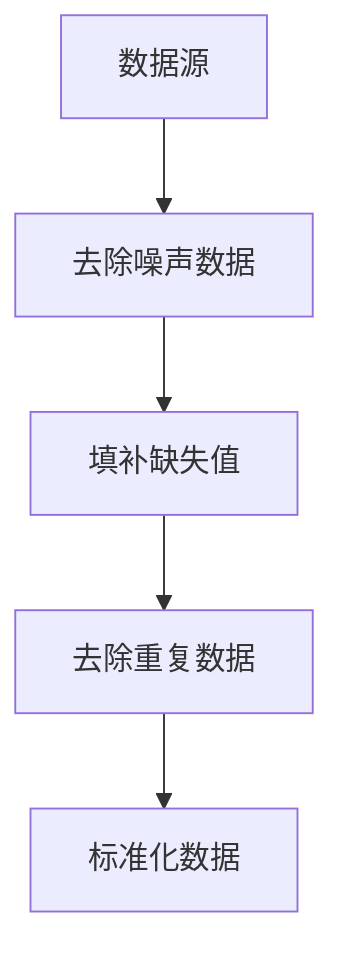
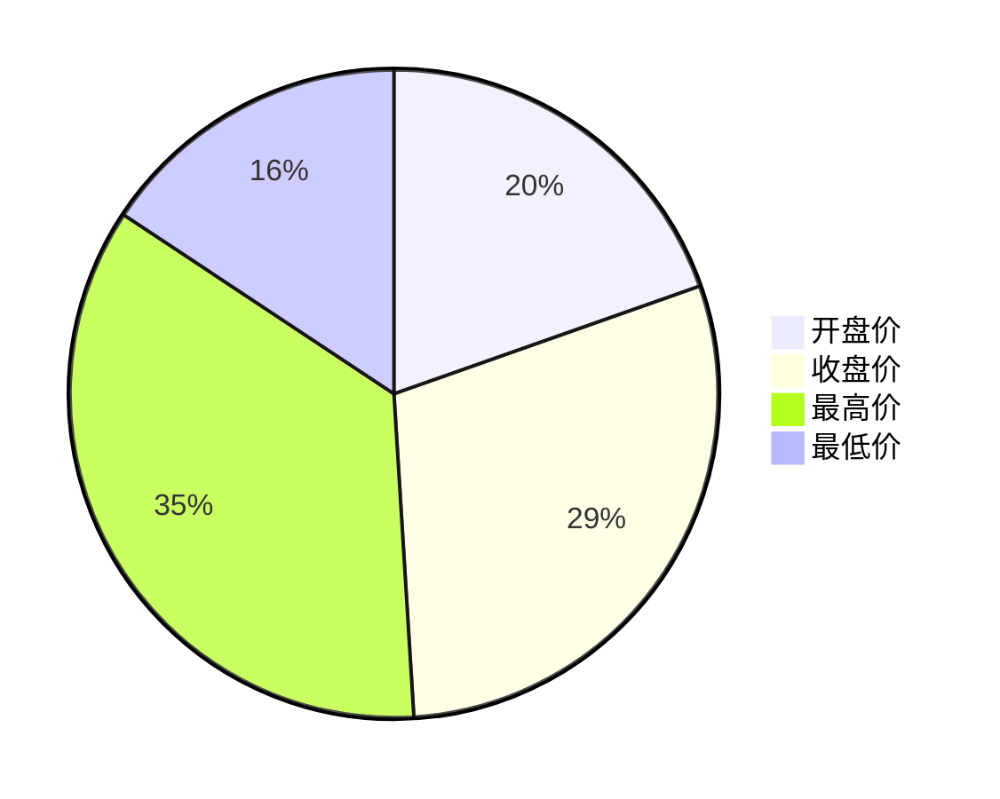
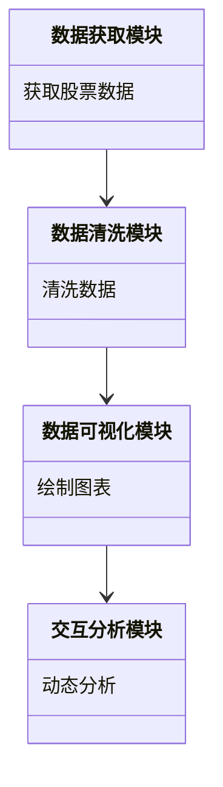

                 


# 《金融数据可视化：技术与最佳实践》

> 关键词：金融数据，数据可视化，数据预处理，可视化图表，机器学习，深度学习

> 摘要：本文将详细探讨金融数据可视化的核心技术与最佳实践。首先，我们介绍了金融数据可视化的背景与意义，分析了其核心概念与技术现状。接着，我们深入讲解了数据预处理与清洗的技术细节，包括数据格式转换与数据增强的方法。随后，我们探讨了金融数据可视化中的算法原理，重点分析了数据清洗与降维算法。最后，我们通过一个具体的金融数据分析与可视化的项目案例，详细展示了系统设计与实现过程，并总结了最佳实践与注意事项。

---

## 正文

### 第1章 金融数据可视化概述

#### 1.1 金融数据可视化的背景与意义

金融数据可视化是将复杂的金融数据转化为直观的图表形式，以便更好地理解和分析市场趋势、投资机会和风险因素。随着金融市场的快速发展，数据的多样性和复杂性不断增加，传统的文本报告和表格已经难以满足分析师的需求。通过可视化技术，可以快速提取关键信息，辅助决策。

#### 1.2 金融数据可视化的核心概念

金融数据可视化涉及多个核心概念，包括数据预处理、可视化图表设计和交互式分析。数据预处理是确保数据质量的关键步骤，包括数据清洗、标准化和转换。可视化图表设计需要根据数据类型和分析目标选择合适的图表形式，如K线图、折线图和热力图。交互式分析则允许用户动态调整视图，深入探索数据。

### 第2章 数据预处理与清洗

#### 2.1 数据清洗的重要性

数据清洗是数据预处理的核心步骤，旨在去除噪声数据、填补缺失值和消除重复数据。我们可以通过数据清洗流程图（见图1）来理解其步骤。数据清洗不仅提高了数据的质量，还为后续的分析提供了可靠的基础。

图1：数据清洗流程图  


#### 2.2 数据增强技术

数据增强技术通过变换数据来扩展数据集，提高模型的泛化能力。例如，我们可以对金融时间序列数据进行平移、缩放和反转等操作。这些技术在处理金融数据时尤为重要，因为金融数据通常具有复杂的变化趋势。

### 第3章 可视化图表的选择与设计

#### 3.1 常见金融数据可视化图表

在金融数据可视化中，不同的图表适用于不同的场景。例如，K线图适用于股票价格分析，折线图适用于趋势分析，热力图适用于多维度数据的展示。选择合适的图表可以显著提高分析效率。

图2：K线图示例  


### 第4章 数据清洗算法原理

#### 4.1 数据清洗的数学模型

数据清洗的数学模型可以通过以下公式表示：

$$
\text{清洗后数据} = f(\text{原始数据})
$$

其中，$f$ 表示数据清洗的函数，具体实现取决于数据类型和清洗目标。例如，对于缺失值的处理，我们可以使用均值填充：

$$
\text{填充值} = \frac{\sum x_i}{n}
$$

其中，$x_i$ 是非缺失值，$n$ 是非缺失值的数量。

### 第5章 项目实战：金融数据分析与可视化

#### 5.1 环境配置

在进行项目实战之前，我们需要配置开发环境。以下是Python环境的配置步骤：

1. 安装必要的库：Pandas、Matplotlib、Seaborn。
2. 下载金融数据：从金融数据源获取股票价格数据。

#### 5.2 数据获取与处理

假设我们从Yahoo Finance获取股票数据，代码如下：

```python
import pandas as pd
import yfinance as yf

# 下载数据
data = yf.download('AAPL', start='2020-01-01', end='2023-01-01')

# 查看数据
print(data.head())
```

#### 5.3 数据清洗与预处理

在获取数据后，我们需要进行数据清洗：

```python
# 去除缺失值
data = data.dropna()

# 标准化处理
from sklearn.preprocessing import StandardScaler
scaler = StandardScaler()
scaled_data = scaler.fit_transform(data[['Open', 'High', 'Low', 'Close']])
```

#### 5.4 数据可视化实现

使用Matplotlib和Seaborn进行可视化：

```python
import matplotlib.pyplot as plt
import seaborn as sns

# 绘制K线图
plt.figure(figsize=(10, 6))
sns.lineplot(x=data.index, y=data['Close'], label='收盘价')
sns.lineplot(x=data.index, y=data['Open'], label='开盘价')
plt.title('股票价格走势')
plt.xlabel('日期')
plt.ylabel('价格')
plt.legend()
plt.show()
```

### 第6章 系统分析与架构设计

#### 6.1 系统功能设计

金融数据可视化系统的功能模块包括数据获取、数据清洗、数据可视化和交互分析。以下是系统功能的领域模型类图：

图3：领域模型类图  


### 第7章 最佳实践与小结

#### 7.1 最佳实践

在金融数据可视化中，我们需要注意数据的实时性、交互性和动态性。选择合适的工具和算法可以显著提高分析效率。

#### 7.2 小结

本文详细探讨了金融数据可视化的核心技术与最佳实践。通过数据预处理、算法优化和系统设计，我们可以有效地管理和分析金融数据，支持决策制定。

---

作者：AI天才研究院 & 禅与计算机程序设计艺术

