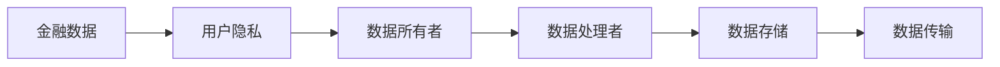
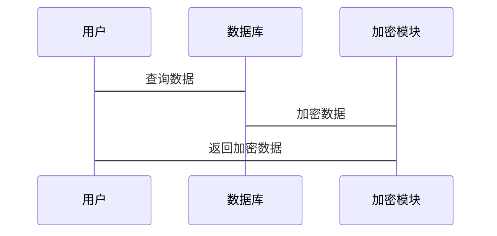

                 


# 《金融数据安全与隐私保护框架》

## 关键词：
- 金融数据安全
- 隐私保护
- 数据分类
- 安全框架
- 数据加密

## 摘要：
本文详细探讨了金融数据安全与隐私保护的重要性，并提出了一套系统化的框架。通过分析金融数据的特点和安全需求，本文介绍了核心概念、技术原理和系统架构，结合实际案例和代码实现，展示了如何在金融行业中有效保护数据隐私和安全。文章还总结了最佳实践和未来研究方向。

---

# 第1章 金融数据安全与隐私保护的背景与概述

## 1.1 金融数据的重要性与安全需求

### 1.1.1 金融数据的定义与分类
金融数据是指与金融交易、客户信息、市场数据等相关的信息，包括但不限于账户信息、交易记录、信用评分等。这些数据通常分为敏感数据（如账户密码、身份证号）和非敏感数据（如交易时间）。

### 1.1.2 金融数据安全的重要性
金融数据的安全性直接关系到金融机构的信誉和客户的信任。数据泄露可能导致经济损失、法律纠纷，甚至影响金融系统的稳定性。

### 1.1.3 隐私保护在金融领域的特殊性
金融数据往往包含个人隐私信息，保护这些数据不仅需要技术手段，还需要符合严格的法律法规，如《通用数据保护条例》（GDPR）和《个人隐私保护法》。

## 1.2 当前金融数据安全面临的挑战

### 1.2.1 数据泄露事件的频发
近年来，多起金融数据泄露事件暴露了现有安全措施的不足，如2021年的某银行客户数据泄露事件，导致 millions of records compromised.

### 1.2.2 数据滥用与隐私侵犯问题
金融机构内部人员或外部黑客可能滥用数据，进行欺诈、身份盗窃等违法行为。

### 1.2.3 金融行业监管的严格性与复杂性
金融行业的数据安全监管要求日益严格，金融机构需要满足多国法律法规，增加了数据管理的复杂性。

## 1.3 金融数据安全与隐私保护框架的意义

### 1.3.1 框架的目标与作用
提出一个统一的框架，帮助金融机构系统性地保护数据安全和隐私，降低数据泄露风险。

### 1.3.2 框架的核心原则与特点
框架应具备数据分类、权限管理、加密传输等核心原则，确保数据在全生命周期中的安全。

### 1.3.3 框架在金融行业的应用前景
通过框架的应用，金融机构可以提高数据管理效率，降低合规成本，增强客户信任。

## 1.4 本章小结
本章从金融数据的重要性入手，分析了当前面临的安全挑战，并提出了构建安全与隐私保护框架的必要性。

---

# 第2章 核心概念与框架体系

## 2.1 数据安全与隐私保护的核心概念

### 2.1.1 数据安全的定义与属性
数据安全是指通过技术手段保护数据的机密性、完整性、可用性。数据安全的三要素：Confidentiality（机密性）、Integrity（完整性）、Availability（可用性）。

### 2.1.2 隐私保护的定义与技术手段
隐私保护旨在防止未经授权的个人或组织访问个人数据。常用技术包括数据加密、匿名化、访问控制等。

### 2.1.3 数据安全与隐私保护的关系
数据安全是隐私保护的基础，隐私保护是数据安全的重要组成部分。两者相辅相成，共同保障数据的保护。

## 2.2 金融数据安全框架的组成与结构

### 2.2.1 数据分类与分级
将数据按敏感程度分类，敏感数据（如身份证号）需要更高强度的保护。

### 2.2.2 安全策略与权限管理
基于角色的访问控制（RBAC）是常用策略，确保只有授权人员可以访问特定数据。

### 2.2.3 数据存储与传输安全
使用加密技术保护数据在存储和传输过程中的安全，如AES加密算法用于数据存储，SSL/TLS用于数据传输。

## 2.3 数据安全框架的实体关系图



## 2.4 本章小结
本章详细介绍了数据安全和隐私保护的核心概念，并通过实体关系图展示了金融数据安全框架的组成。

---

# 第3章 隐私保护技术与实现方法

## 3.1 数据加密技术

### 3.1.1 对称加密与非对称加密
对称加密（如AES）速度快，适用于大量数据加密；非对称加密（如RSA）适合数字签名和公钥交换。

### 3.1.2 哈希函数与数字签名
哈希函数（如SHA-256）用于数据完整性验证，数字签名结合哈希函数和非对称加密，确保数据来源和完整性。

### 3.1.3 加密算法的优缺点对比

| 技术 | 优点 | 缺点 |
|------|------|------|
| 对称加密 | 高效，适合大文件加密 | 密钥管理复杂 |
| 非对称加密 | 安全性高，适合公钥分发 | 速度慢 |

## 3.2 数据匿名化技术

### 3.2.1 数据脱敏技术
通过替换、加密或删除敏感信息，使数据无法还原到原始状态，如将身份证号的中间部分替换为星号。

### 3.2.2 数据匿名化方法
使用K-anonymity等技术，确保数据无法被唯一识别。

## 3.3 本章小结
本章介绍了数据加密和匿名化技术，并通过对比分析，帮助读者选择合适的隐私保护技术。

---

# 第4章 安全框架设计

## 4.1 数据分类与分级

### 4.1.1 数据分类标准
根据数据类型（如客户信息、交易记录）和敏感程度进行分类。

### 4.1.2 分级保护策略
不同级别的数据采取不同的保护措施，如敏感数据需要双重加密和严格访问控制。

## 4.2 安全策略与权限管理

### 4.2.1 基于角色的访问控制（RBAC）
定义角色和权限，确保用户只能访问其角色允许的数据。

### 4.2.2 最小权限原则
授予用户最小的权限，减少数据泄露风险。

## 4.3 数据存储与传输安全

### 4.3.1 数据存储安全
使用加密数据库和安全存储服务（如AWS S3）。

### 4.3.2 数据传输安全
通过SSL/TLS加密协议确保数据在传输过程中的安全。

## 4.4 本章小结
本章详细讨论了数据分类、安全策略和传输安全，构建了一个全面的安全框架。

---

# 第5章 系统实现

## 5.1 环境搭建

### 5.1.1 开发环境
使用Python 3.8+，安装必要的库如pandas、cryptography。

### 5.1.2 数据库选择
使用MySQL或PostgreSQL存储金融数据。

## 5.2 核心代码实现

### 5.2.1 数据加密模块

```python
import cryptography
from cryptography.fernet import Fernet

# 生成密钥
key = Fernet.generate_key()
cipher = Fernet(key)

# 加密数据
encrypted_data = cipher.encrypt(b"Sensitive Financial Data")
```

### 5.2.2 数据脱敏模块

```python
def mask_credit_card(card_number):
    return f"{card_number[:4]}****{card_number[-4:]}"

masked_card = mask_credit_card("4111-1111-1111-1111")  # 输出：4111****1111
```

## 5.3 系统交互设计

### 5.3.1 系统交互图



## 5.4 本章小结
本章通过具体代码和系统交互图展示了如何实现数据加密和脱敏功能。

---

# 第6章 案例分析

## 6.1 案例背景
某银行希望通过构建安全框架保护客户数据，防止数据泄露。

## 6.2 案例实施

### 6.2.1 数据分类
客户信息（高敏感）、交易记录（中敏感）、日志数据（低敏感）。

### 6.2.2 安全策略
基于角色的访问控制，确保只有授权人员可以访问敏感数据。

## 6.3 实施效果
数据泄露事件减少，客户信任度提高，符合监管要求。

## 6.4 本章小结
通过实际案例展示了安全框架的应用效果和实施步骤。

---

# 第7章 最佳实践与未来展望

## 7.1 最佳实践

### 7.1.1 定期安全审计
定期检查系统漏洞，确保安全措施的有效性。

### 7.1.2 培训与意识提升
加强对员工的数据安全培训，提高全员安全意识。

## 7.2 未来展望

### 7.2.1 新技术应用
如零知识证明、联邦学习等新技术的应用将提升隐私保护水平。

### 7.2.2 标准化与国际合作
推动数据安全的国际标准制定，加强国际合作。

## 7.3 本章小结
本章总结了实施框架的最佳实践，并展望了未来的技术发展和国际合作。

---

# 作者：AI天才研究院 & 禅与计算机程序设计艺术

---

以上是《金融数据安全与隐私保护框架》的完整内容，希望对读者有所帮助。

