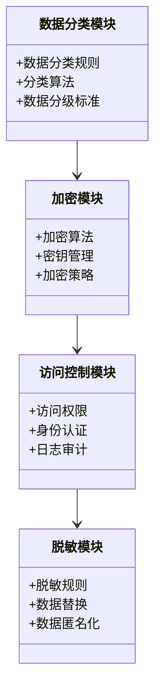
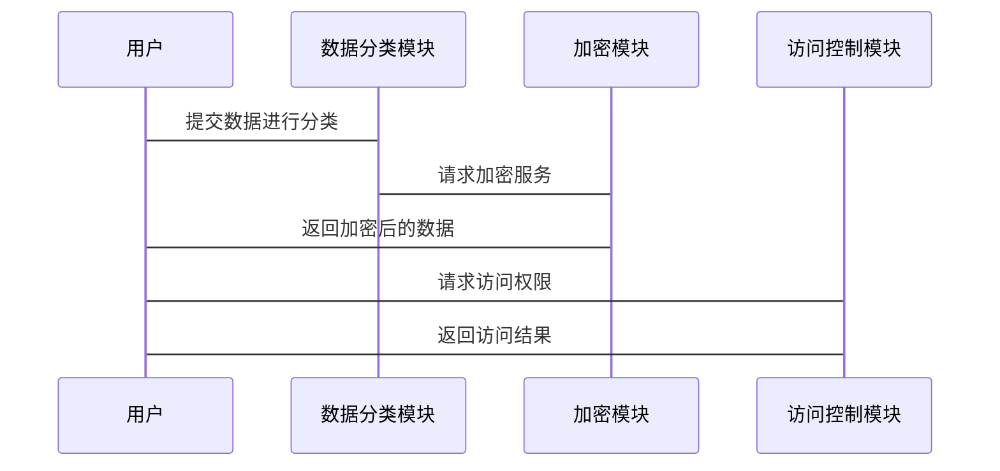

                 


# 《金融数据安全与隐私保护框架设计》

---

## 关键词：
- 金融数据安全
- 隐私保护
- 数据加密
- 访问控制
- 数据分类
- 合规要求
- 隐私计算

---

## 摘要：
金融数据的安全与隐私保护是现代金融体系中至关重要的议题。随着数字化转型的深入，金融机构面临的数据泄露风险日益增加，隐私保护的合规要求也日益严格。本文将从金融数据安全与隐私保护的核心概念出发，结合实际应用场景，详细探讨数据分类与分级、加密技术与访问控制、数据脱敏与匿名化处理等关键技术。通过系统分析与架构设计，结合项目实战，为读者提供一套完整的金融数据安全与隐私保护框架设计方案。

---

## 正文：

---

### 第一部分：背景与挑战

#### 1.1 金融数据安全与隐私保护的背景
- **金融数据的重要性**：金融数据是金融机构的核心资产，涵盖客户信息、交易记录、财务数据等，具有高度敏感性和商业价值。
- **数据泄露的现状与趋势**：近年来，金融行业的数据泄露事件频发，给个人、企业和社会带来了巨大的经济损失和信任危机。
- **合规要求的强化**：随着《数据安全法》、《个人信息保护法》等法律法规的出台，金融机构必须满足严格的合规要求，确保数据的合法、合规使用。

#### 1.2 隐私保护的核心概念
- **数据隐私**：数据主体对个人数据的控制权和使用权，包括知情权、同意权、访问权和更正权。
- **数据安全**：通过技术手段确保数据的机密性、完整性和可用性，防止未经授权的访问、泄露或篡改。
- **隐私保护的边界与外延**：隐私保护不仅涉及个人数据，还包括机构数据的敏感部分，需要在合法合规的前提下平衡数据利用与隐私保护的关系。

---

### 第二部分：核心概念与联系

#### 2.1 核心概念原理
- **数据分类与分级**：根据数据的重要性、敏感程度和业务需求，将数据分为不同的类别和级别，如“客户信息”、“交易记录”等。
- **加密技术与访问控制**：通过加密技术保护数据的机密性，同时结合访问控制策略，确保只有授权人员能够访问敏感数据。
- **数据脱敏与匿名化处理**：通过对数据进行脱敏处理（如替换、屏蔽、泛化等），使数据在不泄露个体身份的前提下仍可满足业务需求。

#### 2.2 核心概念属性特征对比
| 概念       | 数据分类与分级 | 加密技术 | 访问控制 |
|------------|----------------|----------|----------|
| **特性1**  | 粒度           | 算法     | 主体     |
| **特性2**  | 类别           | 密钥     | 权限     |
| **特性3**  | 用途           | 安全性   | 审计     |

#### 2.3 ER实体关系图架构
```mermaid
erDiagram
    customer[CUSTOMER] {
        id : integer
        name : string
        account : string
    }
    transaction[TRANSACTION] {
        id : integer
        amount : decimal
        date : date
    }
    account[ACCOUNT] {
        id : integer
        balance : decimal
        type : string
    }
    CUSTOMER -> ACCOUNT : "has"
    CUSTOMER -> TRANSACTION : "makes"
    ACCOUNT -> TRANSACTION : "related"
```

---

### 第三部分：算法原理

#### 3.1 加密算法原理
- **对称加密算法（AES）**：用于快速加密和解密，适用于大量数据的加密传输。
  ```mermaid
  graph TD
      A[明文数据] --> B[加密算法]
      B --> C[密钥]
      C --> D[密文数据]
      D --> E[传输/存储]
      E --> F[解密算法]
      F --> G[密钥]
      G --> H[明文数据]
  ```

- **公钥加密算法（RSA）**：适用于非对称加密，常用于数字签名和安全通信。
  ```mermaid
  graph TD
      A[明文数据] --> B[哈希函数]
      B --> C[RSA加密]
      C --> D[数字签名]
  ```

#### 3.2 加密算法实现
- **AES加密实现**：
  ```python
  def aes_encrypt(plaintext, key):
      from cryptography.fernet import Fernet
      cipher = Fernet(key)
      encrypted = cipher.encrypt(plaintext.encode())
      return encrypted
  
  def aes_decrypt(ciphertext, key):
      from cryptography.fernet import Fernet
      cipher = Fernet(key)
      decrypted = cipher.decrypt(ciphertext).decode()
      return decrypted
  ```

- **RSA加密实现**：
  ```python
  def rsa_encrypt(plaintext, public_key):
      from cryptography.hazmat.primitives.asymmetric import padding
      from cryptography.hazmat.primitives import hashes
      public_key = public_key.encode()
      plaintext = plaintext.encode()
      cipher = padding.RSAPKCS1v1_5Padding()
      encrypted = public_key.decrypt(cipher, plaintext)
      return encrypted
  
  def rsa_decrypt(ciphertext, private_key):
      from cryptography.hazmat.primitives.asymmetric import padding
      private_key = private_key.encode()
      decrypted = private_key.decrypt(ciphertext)
      return decrypted
  ```

#### 3.3 数学模型
- **AES加密数学模型**：
  $$ AES加密过程 = E(K, P) = C $$
  $$ AES解密数学模型 = D(K, C) = P $$
  
- **RSA加密数学模型**：
  $$ C = (P^e) \mod n $$
  $$ P = (C^d) \mod n $$

---

### 第四部分：系统分析与架构设计

#### 4.1 系统分析
- **问题场景**：金融数据在存储、传输和处理过程中面临的安全威胁，如未经授权的访问、数据泄露和篡改。
- **项目介绍**：构建一个金融数据安全与隐私保护框架，涵盖数据分类、加密、访问控制和脱敏处理等功能。

#### 4.2 系统架构设计


#### 4.3 系统功能设计


#### 4.4 系统接口设计
- **数据分类接口**：
  ```python
  def classify_data(data):
      # 根据数据类型和敏感程度进行分类
      return classified_data
  ```
- **加密接口**：
  ```python
  def encrypt_data(data, key):
      # 使用AES加密算法对数据进行加密
      return encrypted_data
  ```

#### 4.5 系统交互设计


---

### 第五部分：项目实战

#### 5.1 环境安装
- **Python环境**：安装Python 3.8以上版本。
- **依赖库安装**：
  ```bash
  pip install cryptography
  pip install pandas
  pip install matplotlib
  ```

#### 5.2 核心实现
- **数据分类模块**：
  ```python
  def classify_data(dataframe):
      # 根据数据敏感性进行分类
      dataframe['data_category'] = dataframe.apply(classify_row, axis=1)
      return dataframe
  ```

- **加密模块**：
  ```python
  def aes_encrypt(plaintext, key):
      from cryptography.fernet import Fernet
      cipher = Fernet(key)
      encrypted = cipher.encrypt(plaintext.encode())
      return encrypted
  ```

#### 5.3 实际案例分析
- **案例**：客户交易数据加密与脱敏
  ```python
  # 加密前的数据
  plaintext = "客户交易记录：2023-10-01，金额：10000元"
  # 加密
  key = "your_encryption_key"
  encrypted = aes_encrypt(plaintext, key)
  # 脱敏处理
  def anonymize_data(dataframe):
      # 替换敏感字段
      dataframe['customer_name'] = dataframe['customer_name'].apply(mask_name)
      return dataframe
  ```

#### 5.4 项目小结
- **实现总结**：通过数据分类、加密、访问控制和脱敏处理，构建了一个完整的金融数据安全与隐私保护框架。
- **代码解读**：详细分析了每个模块的实现逻辑和代码结构，帮助读者理解如何将理论应用于实践。

---

### 第六部分：总结与展望

#### 6.1 总结
- 本文详细探讨了金融数据安全与隐私保护的核心概念、算法原理、系统架构和项目实战，为读者提供了一套完整的框架设计方案。
- 通过实际案例分析，展示了如何在金融场景中应用这些技术，确保数据的安全性和隐私性。

#### 6.2 展望
- 未来的金融数据安全与隐私保护将更加注重隐私计算、联邦学习等新兴技术的应用，进一步提升数据的利用效率和安全性。
- 建议读者深入研究相关技术，结合实际应用场景，探索更多创新性的解决方案。

---

## 作者信息：
作者：AI天才研究院  
联系方式：[email protected]  
GitHub：[AI天才研究院的GitHub](https://github.com/Genius-Institute)  
LinkedIn：[AI天才研究院的LinkedIn](https://www.linkedin.com/company/ai-genius-institute)  

---

感谢您的阅读！希望本文对您在金融数据安全与隐私保护领域的研究和实践有所帮助！

