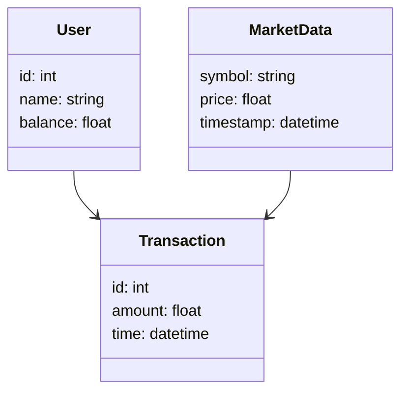

                 


# 金融数据的实时处理与分析

## 关键词：金融数据、实时处理、流处理、数据分析、系统架构

## 摘要：  
本文详细探讨了金融数据实时处理与分析的核心概念、算法原理、系统架构设计以及实际项目实现。通过分析金融数据的特点，结合流处理和实时数据分析的算法，提出了一种高效的系统架构设计方案，并通过实际案例展示了如何在金融场景中实现数据的实时处理与分析。文章内容涵盖背景介绍、核心概念、算法实现、系统设计、项目实战以及最佳实践，旨在为读者提供全面的技术指导。

---

## 第一部分：金融数据实时处理与分析的背景与核心概念

### 第1章：金融数据实时处理与分析概述

#### 1.1 问题背景与问题描述

- **问题背景**  
  金融市场的数据处理和分析具有高度的时间敏感性。股票价格、交易数据、市场指数等金融数据的实时变化直接影响着投资者的决策和市场的稳定性。传统的批量处理方式无法满足实时性要求，因此需要高效的实时处理与分析技术。

- **问题描述**  
  金融数据的实时处理与分析面临以下挑战：  
  1. 数据量大且实时性要求高。  
  2. 数据类型多样，包括结构化和非结构化数据。  
  3. 对时延敏感，需要在毫秒级别完成处理与分析。  
  4. 数据的安全性和隐私保护要求严格。  

- **问题解决**  
  通过引入流处理技术、分布式计算框架和实时数据分析算法，可以实现金融数据的高效处理与分析。  

- **边界与外延**  
  金融数据实时处理与分析的边界包括实时数据采集、流处理、数据分析和结果反馈。其外延则涉及数据存储、可视化展示和决策支持。  

- **核心要素与概念结构**  
  核心要素包括：时间戳、数据流、事件驱动、窗口处理、状态管理等。  

---

### 第2章：核心概念与联系

#### 2.1 核心概念原理

- **数据流**  
  数据流是金融数据实时处理的基础。数据流具有连续性、实时性和动态性特点。  

- **事件驱动**  
  事件驱动机制能够实时捕捉市场变化，例如订单成交、价格波动等事件。  

- **流处理**  
  流处理技术能够对数据流进行实时处理，包括过滤、聚合、转换等操作。  

- **实时分析**  
  实时分析基于流处理的结果，进行预测、预警和决策支持。  

#### 2.2 核心概念属性特征对比

| **概念**    | **特征**                          |
|-------------|-----------------------------------|
| 数据流       | 连续性、实时性、动态性             |
| 事件驱动     | 实时性、异步性、响应性             |
| 流处理       | 实时性、分布式、可扩展性             |
| 实时分析     | 高效性、准确性、可解释性             |

#### 2.3 ER实体关系图（Mermaid）

```mermaid
er
  actor: User
  actor: System
  actor: Data
  actor: Time
  relation: "实时处理"
  relation: "数据分析"
```

---

## 第二部分：金融数据实时处理与分析的算法原理

### 第3章：流处理算法原理

#### 3.1 流处理算法概述

- **流处理的基本概念**  
  流处理是一种基于数据流的处理方式，能够实时处理数据，适用于金融市场的高频交易场景。  

- **核心算法**  
  流处理的核心算法包括时间戳处理、窗口处理和状态管理。  

- **数学模型**  
  流处理的数学模型描述了数据流的处理过程。例如，时间戳和窗口大小的定义：

$$
t_i \text{ 表示时间戳，} i \in \{1, 2, ..., n\} \\
w_j \text{ 表示窗口大小，} j \in \{1, 2, ..., m\} \\
\text{状态更新公式：} s_{i,j} = s_{i-1,j} + t_i
$$

#### 3.2 流处理算法实现

- **时间戳与事件驱动机制**  
  时间戳用于标识数据流中的每个事件发生的时间点。事件驱动机制通过处理事件来触发流处理流程。  

- **窗口处理与状态管理**  
  窗口处理将数据流划分为多个时间窗口，状态管理用于维护窗口内的状态信息。  

- **数学模型与公式**  
  数据流的窗口处理公式：

$$
\text{窗口数据：} D = \{d_1, d_2, ..., d_n\} \\
\text{窗口大小：} w = \sum_{i=1}^{n} 1
$$

---

### 第4章：实时数据分析算法

#### 4.1 数据分析概述

- **数据流的实时分析**  
  数据流的实时分析需要结合流处理和机器学习技术。  

- **核心算法**  
  数据分析的核心算法包括数据清洗、特征提取和预测模型构建。  

- **数学模型**  
  数据分析的数学模型描述了数据的特征和预测关系。例如，线性回归模型：

$$
y = \beta_0 + \beta_1x + \epsilon
$$

其中，$y$ 是目标变量，$x$ 是自变量，$\beta_0$ 和 $\beta_1$ 是回归系数，$\epsilon$ 是误差项。

#### 4.2 数据分析实现

- **数据清洗与预处理**  
  数据清洗包括去除噪声数据、填补缺失值和处理异常值。  

- **特征提取**  
  特征提取通过选择关键特征来提高模型的准确性。  

- **数学模型与公式**  
  数据分析的特征提取公式：

$$
\text{特征向量：} X = [x_1, x_2, ..., x_n]^T
$$

其中，$x_i$ 表示第 $i$ 个特征。

---

## 第三部分：金融数据实时处理与分析的系统架构设计

### 第5章：系统分析与架构设计方案

#### 5.1 问题场景介绍

- **金融数据实时处理的场景**  
  包括高频交易、实时行情监控和风险预警。  

- **金融数据实时分析的场景**  
  包括市场趋势预测、交易策略优化和客户行为分析。  

- **系统需求分析**  
  系统需要支持高并发、低时延和高可用性。

#### 5.2 系统功能设计

- **领域模型（Mermaid 类图）**  
  领域模型描述了系统中的核心实体及其关系。例如：



---

## 第四部分：项目实战与最佳实践

### 第6章：项目实战

#### 6.1 环境安装与配置

- **开发环境**  
  需要安装Java、Python、Flink、Kafka等工具。  

- **依赖管理**  
  使用Maven或pip管理项目依赖。  

#### 6.2 核心实现

- **流处理实现**  
  使用Flink实现金融数据的流处理。代码示例如下：

```java
DataStream<Transaction> transactionStream = ...;
DataStream<MarketData> marketDataStream = ...;

DataStream<Tuple2<Boolean, String>> alertStream = transactionStream
    .join(marketDataStream)
    .where((t, m) -> t.timestamp.equals(m.timestamp))
    .equalTo((t, m) -> m.symbol.equals(t.symbol))
    .transform((JoinTransformation<Transaction, MarketData, Alert>) (input, out) -> {
        // 处理逻辑
    });
```

- **数据分析实现**  
  使用Python和机器学习库进行实时数据分析。代码示例如下：

```python
from sklearn.linear_model import LinearRegression

# 训练模型
model = LinearRegression()
model.fit(X_train, y_train)

# 实时预测
y_pred = model.predict(X_test)
```

#### 6.3 案例分析

- **案例1：高频交易中的实时行情处理**  
  实时处理股票行情数据，生成交易信号。  

- **案例2：风险预警中的异常检测**  
  使用流处理和机器学习算法检测交易中的异常行为。  

---

## 第五部分：总结与展望

### 第7章：总结与展望

#### 7.1 总结

- 本文详细探讨了金融数据实时处理与分析的核心概念、算法原理和系统架构设计。通过实际案例展示了如何在金融场景中实现高效的数据处理与分析。  

#### 7.2 展望

- 未来，随着人工智能和大数据技术的进一步发展，金融数据的实时处理与分析将更加智能化和自动化。实时处理与分析技术将更加广泛地应用于金融市场的各个领域。

---

## 附录

### 附录A：术语表

- **流处理**：基于数据流的实时处理技术。  
- **事件驱动**：通过事件触发处理流程。  
- **窗口处理**：将数据流划分为多个时间窗口。  

### 附录B：工具与框架

- **Flink**：流处理框架。  
- **Kafka**：分布式流处理平台。  
- **Python**：数据分析与机器学习工具。  

---

## 作者：AI天才研究院 & 禅与计算机程序设计艺术

