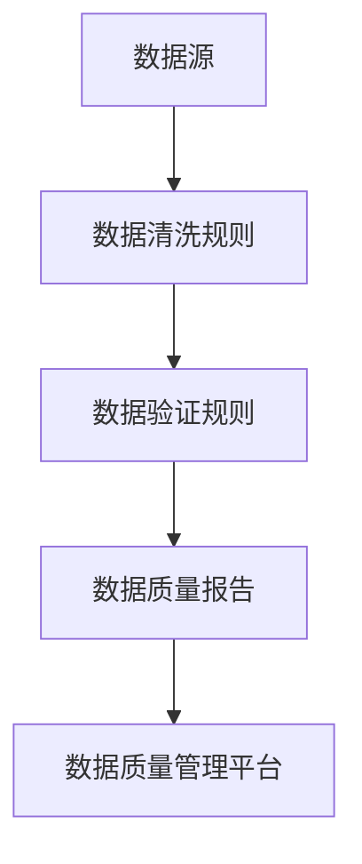
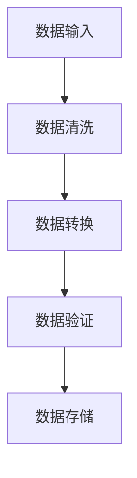
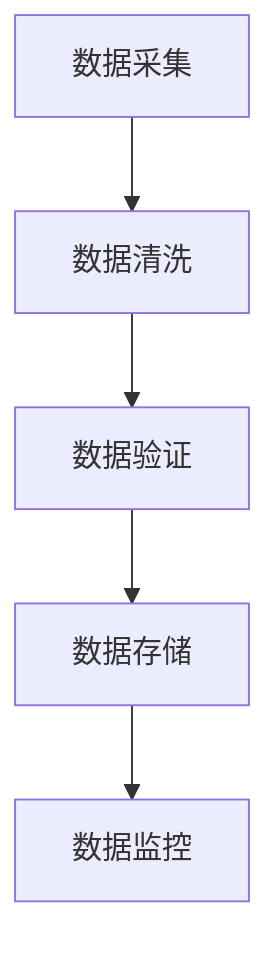
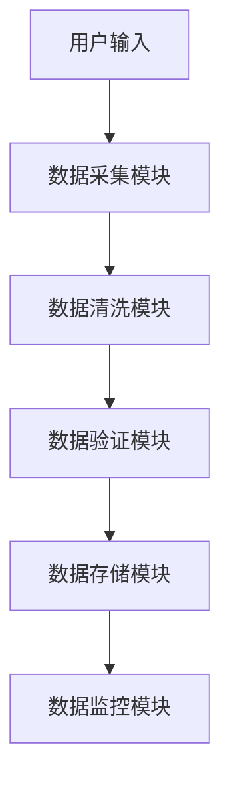

                 


# 《金融数据质量控制系统》

## 关键词：金融数据质量控制，数据清洗，数据验证，数据增强，数据质量管理，金融数据系统

## 摘要：  
金融数据质量控制系统是金融行业的一项重要基础工程，旨在通过系统化的数据清洗、验证、增强和监控，确保金融数据的准确性、完整性和一致性。本文将从金融数据质量控制的背景、核心概念、算法原理、系统架构、项目实战等多个维度进行深入分析，结合实际案例，探讨如何构建一个高效、可靠的金融数据质量控制系统。

---

# 第1章: 金融数据质量控制的背景与问题

## 1.1 数据质量管理的背景

### 1.1.1 金融数据的特点

金融数据具有高价值性、实时性和复杂性等特点。金融数据的质量直接影响到金融机构的决策、风险控制和合规性。

### 1.1.2 数据质量管理的重要性

在金融行业，数据质量是确保业务流程正常运行、防范金融风险的核心保障。数据质量问题可能导致严重的经济损失和声誉损害。

### 1.1.3 金融行业数据质量问题的现状

当前，金融行业在数据质量管理方面面临数据来源多样化、数据格式不统一、数据清洗成本高等挑战。

## 1.2 金融数据质量问题的描述

### 1.2.1 数据不完整性的表现

数据缺失、字段值为空等现象在金融数据中常见，导致数据无法准确反映业务情况。

### 1.2.2 数据不一致性的表现

同一数据在不同系统中表示不一致，例如日期格式、金额单位等不统一。

### 1.2.3 数据错误与异常值的来源

数据录入错误、系统转换错误、外部数据接口问题等都可能导致数据错误。

## 1.3 数据质量管理的目标与解决思路

### 1.3.1 数据质量管理的目标

确保数据的准确性、完整性、一致性和及时性，为金融机构提供可靠的数据支持。

### 1.3.2 数据质量问题的解决思路

通过数据清洗、数据验证、数据增强和数据监控等手段，逐步解决数据质量问题。

### 1.3.3 数据质量管理的边界与外延

数据质量管理的边界包括数据的采集、存储、处理和使用环节，外延则涉及数据安全、数据隐私等方面。

## 1.4 数据质量管理的核心要素

### 1.4.1 数据质量维度分析

| 数据质量维度 | 描述 |
| ------------ | ---- |
| 准确性 | 数据反映真实业务情况的程度 |
| 完整性 | 数据是否包含所有必要信息 |
| 一致性 | 数据在不同系统中的表示是否统一 |
| 及时性 | 数据是否能够及时更新和提供 |

### 1.4.2 数据质量评估指标

- 数据完整率
- 数据准确率
- 数据一致性率
- 数据及时率

### 1.4.3 数据质量管理的流程

1. 数据采集
2. 数据清洗
3. 数据转换
4. 数据验证
5. 数据存储
6. 数据监控

## 1.5 本章小结

本章从金融数据的特点出发，分析了数据质量管理的重要性，描述了数据质量问题的具体表现，并提出了数据质量管理的目标和解决思路。通过数据质量维度和评估指标的分析，明确了数据质量管理的核心要素。

---

# 第2章: 数据质量管理的核心概念与联系

## 2.1 数据质量的核心概念

### 2.1.1 数据质量的定义与属性

数据质量是指数据的准确性、完整性、一致性和及时性等方面的综合表现。

### 2.1.2 数据质量管理的框架

数据质量管理的框架包括数据采集、数据清洗、数据验证、数据存储和数据监控五个阶段。

### 2.1.3 数据质量与数据安全的关系

数据质量管理与数据安全相互关联，数据安全是数据质量管理的前提，数据质量管理则是数据安全的重要保障。

## 2.2 数据质量管理的关键维度

### 2.2.1 数据准确性

数据是否反映真实业务情况，是数据质量管理的核心维度。

### 2.2.2 数据完整性

数据是否包含所有必要信息，是数据质量管理的重要维度。

### 2.2.3 数据一致性

数据在不同系统中的表示是否统一，是数据质量管理的关键维度。

### 2.2.4 数据及时性

数据是否能够及时更新和提供，是数据质量管理的重要维度。

## 2.3 数据质量管理的实体关系分析



## 2.4 数据质量管理的流程模型



## 2.5 本章小结

本章详细阐述了数据质量管理的核心概念，包括数据质量的定义、框架和关键维度。通过实体关系图和流程模型，明确了数据质量管理的整体架构和工作流程。

---

# 第3章: 数据质量管理的算法与原理

## 3.1 数据清洗算法

### 3.1.1 数据去重算法

通过去除重复数据，确保数据的唯一性。

```python
# 示例代码：数据去重
import pandas as pd

data = pd.DataFrame({'id': [1, 2, 2, 3, 4], 'name': ['A', 'B', 'B', 'C', 'D']})
data.drop_duplicates(subset=['id'], keep='first', inplace=True)
print(data)
```

### 3.1.2 数据填补算法

通过填补缺失值，确保数据的完整性。

```python
# 示例代码：填补缺失值
import pandas as pd

data = pd.DataFrame({'id': [1, 2, 3, 4], 'value': [10, 20, None, 40]})
data['value'].fillna(data['value'].mean(), inplace=True)
print(data)
```

### 3.1.3 数据标准化与归一化

通过标准化和归一化，确保数据的一致性。

```python
# 示例代码：数据标准化
from sklearn.preprocessing import StandardScaler

data = pd.DataFrame({'feature': [1, 2, 3, 4, 5]})
scaler = StandardScaler()
data_scaled = scaler.fit_transform(data)
print(data_scaled)
```

## 3.2 数据增强算法

### 3.2.1 数据增强的定义

通过增加数据的多样性和丰富性，提升数据的质量。

### 3.2.2 常见数据增强方法

- 数据采样
- 数据变换
- 数据合成

## 3.3 数据验证算法

### 3.3.1 数据校验规则

通过校验规则，确保数据的准确性。

### 3.3.2 数据匹配算法

通过数据匹配，确保数据的一致性。

## 3.4 数据质量管理的数学模型

### 3.4.1 数据清洗的数学模型

$$ \text{清洗后数据} = f(\text{清洗规则}, \text{原始数据}) $$

### 3.4.2 数据增强的数学模型

$$ \text{增强后数据} = g(\text{增强规则}, \text{清洗后数据}) $$

### 3.4.3 数据验证的数学模型

$$ \text{验证结果} = h(\text{验证规则}, \text{增强后数据}) $$

---

## 3.5 本章小结

本章详细介绍了数据质量管理中常用的算法与原理，包括数据清洗、数据增强和数据验证的实现方法，并通过数学模型和代码示例进行了具体说明。

---

# 第4章: 金融数据质量控制的系统架构

## 4.1 问题场景介绍

### 4.1.1 金融机构的业务需求

金融机构需要确保数据的准确性、完整性和一致性，以支持业务决策和风险控制。

### 4.1.2 数据质量管理的系统目标

构建一个高效、可靠的金融数据质量控制系统，实现数据的全生命周期管理。

## 4.2 系统功能设计

### 4.2.1 数据采集模块

- 数据源管理
- 数据格式转换

### 4.2.2 数据清洗模块

- 数据去重
- 数据填补

### 4.2.3 数据验证模块

- 数据校验
- 数据匹配

### 4.2.4 数据存储模块

- 数据仓库
- 数据湖

## 4.3 系统架构设计



## 4.4 接口设计与交互流程

### 4.4.1 系统接口设计

- 数据输入接口
- 数据输出接口
- 数据监控接口

### 4.4.2 系统交互流程图



## 4.5 本章小结

本章从系统架构的角度，详细设计了金融数据质量控制系统的功能模块和交互流程，明确了系统的整体架构和实现方式。

---

# 第5章: 金融数据质量控制系统的项目实战

## 5.1 环境安装

### 5.1.1 安装Python

```bash
python --version
```

### 5.1.2 安装Jupyter Notebook

```bash
pip install jupyter
```

## 5.2 核心代码实现

### 5.2.1 数据采集模块

```python
import pandas as pd

def data_collection():
    # 数据采集逻辑
    pass

data_collection()
```

### 5.2.2 数据清洗模块

```python
def data_cleaning(data):
    # 数据清洗逻辑
    pass

cleaned_data = data_cleaning(data)
```

## 5.3 代码解读与分析

### 5.3.1 数据采集模块解读

数据采集模块负责从多种数据源中采集数据，并进行初步的格式转换。

### 5.3.2 数据清洗模块解读

数据清洗模块通过对数据去重和填补缺失值，确保数据的完整性和一致性。

## 5.4 实际案例分析

### 5.4.1 案例背景

某金融机构需要对客户数据进行清洗和验证，确保数据的准确性和一致性。

### 5.4.2 数据清洗过程

```python
import pandas as pd

data = pd.DataFrame({'id': [1, 2, 2, 3, 4], 'name': ['A', 'B', 'B', 'C', 'D']})
data.drop_duplicates(subset=['id'], keep='first', inplace=True)
print(data)
```

### 5.4.3 数据验证过程

```python
def data_validation(data):
    # 数据验证逻辑
    pass

validated_data = data_validation(data)
```

## 5.5 项目小结

通过实际案例分析，验证了金融数据质量控制系统的有效性，展示了系统的实际应用场景和实现方法。

---

# 第6章: 金融数据质量控制系统的最佳实践

## 6.1 小结

金融数据质量控制系统是金融行业的重要基础设施，通过系统化的数据清洗、验证、增强和监控，确保数据的准确性、完整性和一致性。

## 6.2 注意事项

- 数据质量管理需要结合业务需求
- 数据质量管理需要持续优化
- 数据质量管理需要多部门协作

## 6.3 拓展阅读

- 《数据质量管理：方法与实践》
- 《金融数据分析与挖掘》

---

# 作者：AI天才研究院/AI Genius Institute & 禅与计算机程序设计艺术 /Zen And The Art of Computer Programming

