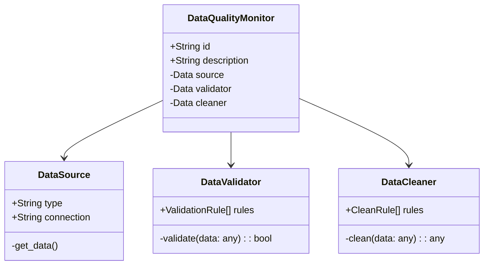
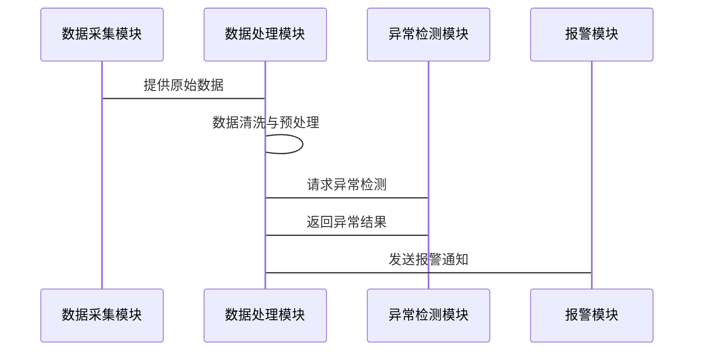

                 


# 《金融数据质量自动化监控系统》

## 关键词：
金融数据质量，自动化监控，数据异常检测，机器学习，系统架构设计

## 摘要：
随着金融业务的快速发展，数据质量成为影响决策准确性的重要因素。本文详细探讨了金融数据质量的定义、监控系统的核心技术，以及基于机器学习的异常检测算法。通过系统化的架构设计和实际案例分析，展示了如何构建高效、可靠的金融数据质量自动化监控系统。

---

# 第一部分: 金融数据质量自动化监控系统概述

## 第1章: 问题背景与数据质量的重要性

### 1.1 问题背景
#### 1.1.1 数据质量问题的背景
- 数据是金融业务的核心，但数据质量问题（如缺失、错误、重复）严重影响决策的准确性。
- 金融行业的监管严格，数据质量问题可能导致合规风险和经济损失。

#### 1.1.2 数据质量问题对金融业务的影响
- 影响信用评估和风险控制，导致错误决策。
- 数据不一致可能导致交易失败或合规问题。
- 数据错误可能引发客户信任危机。

#### 1.1.3 数据质量监控的必要性
- 及时发现数据问题，减少潜在风险。
- 提高数据可用性，支持精准决策。
- 符合监管要求，避免法律风险。

### 1.2 金融数据的特点与挑战
#### 1.2.1 数据的多样性
- 包括结构化数据（如交易记录）和非结构化数据（如文档、图像）。
- 数据来源多样，可能来自不同的系统和渠道。

#### 1.2.2 数据的实时性与准确性
- 金融交易需要实时数据处理，延迟可能导致损失。
- 数据准确性是金融决策的基础，任何错误都可能引发严重后果。

#### 1.2.3 数据安全与隐私保护
- 金融数据涉及客户隐私，必须确保数据安全。
- 符合GDPR等数据保护法规，防止数据泄露。

## 第2章: 数据质量监控系统的目标与意义

### 2.1 系统目标
#### 2.1.1 数据完整性保障
- 确保数据无缺失，覆盖所有必要字段。
- 数据清洗与修复，提高数据完整性。

#### 2.1.2 数据准确性监控
- 检测数据错误，如无效值或不合理值。
- 通过算法识别数据偏差，确保数据真实反映业务状态。

#### 2.1.3 数据一致性维护
- 确保不同系统中的数据保持一致。
- 通过数据关联和匹配，减少数据冲突。

### 2.2 系统意义
#### 2.2.1 提升金融业务的决策效率
- 高质量数据支持精准决策，降低错误率。
- 快速识别问题，优化业务流程。

#### 2.2.2 降低数据错误带来的风险
- 及时发现数据问题，避免重大损失。
- 提高系统稳定性，减少因数据错误引发的故障。

#### 2.2.3 优化数据管理流程
- 自动化监控减少人工干预，提高效率。
- 数据质量管理标准化，降低管理成本。

---

# 第二部分: 核心概念与技术基础

## 第3章: 数据质量的核心概念

### 3.1 数据质量的定义与维度
#### 3.1.1 数据完整性
- 数据无缺失，所有记录都包含必要的信息。
- 示例：检测交易记录中的缺失字段。

#### 3.1.2 数据准确性
- 数据真实反映实际情况。
- 示例：检测交易金额是否合理，防止虚假交易。

#### 3.1.3 数据一致性
- 数据在不同系统或记录中保持一致。
- 示例：确保客户信息在前端和后端一致。

#### 3.1.4 数据及时性
- 数据反映最新的业务状态。
- 示例：实时监控交易数据，确保数据更新及时。

#### 3.1.5 数据规范性
- 数据符合预定义的格式和规则。
- 示例：日期格式统一，避免解析错误。

### 3.2 数据质量监控的关键技术
#### 3.2.1 数据清洗技术
- 去除重复数据，修复错误值。
- 示例：使用Python的Pandas库清洗数据。

#### 3.2.2 数据匹配与关联技术
- 对比不同数据源，识别不一致。
- 示例：关联客户ID，确保数据关联正确。

#### 3.2.3 数据异常检测技术
- 使用统计和机器学习算法识别异常。
- 示例：检测交易金额的异常波动。

#### 3.2.4 数据质量管理工具
- 使用ETL工具（如Informatica）进行数据处理。
- 示例：配置数据质量管理规则，自动化检查。

## 第4章: 数据监控系统的核心技术基础

### 4.1 数据采集与预处理
#### 4.1.1 数据采集方法
- 使用API接口获取实时数据。
- 示例：从数据库中抽取交易记录。

#### 4.1.2 数据清洗与标准化
- 去除噪声数据，标准化格式。
- 示例：清洗缺失值，统一日期格式。

#### 4.1.3 数据存储与管理
- 使用分布式数据库存储海量数据。
- 示例：使用Hadoop存储日志数据。

### 4.2 数据特征提取与分析
#### 4.2.1 数据特征提取方法
- 提取关键字段，如金额、时间、用户ID。
- 示例：从交易记录中提取交易金额和时间。

#### 4.2.2 数据分析与可视化
- 使用图表展示数据分布，识别异常。
- 示例：绘制箱线图，观察数据分布。

#### 4.2.3 数据异常检测算法
- 基于统计的方法，如Z-score。
- 示例：计算每个交易金额的Z-score，识别异常交易。

---

# 第三部分: 算法原理与实现

## 第5章: 数据异常检测算法原理

### 5.1 基于统计的异常检测
#### 5.1.1 基于均值与标准差的异常检测
- 计算数据的均值和标准差，判断数据是否偏离正常范围。
- 示例：
  - 均值：$\mu = \frac{1}{n}\sum_{i=1}^{n}x_i$
  - 标准差：$\sigma = \sqrt{\frac{1}{n}\sum_{i=1}^{n}(x_i - \mu)^2}$
  - 异常判断：$|x - \mu| > 3\sigma$

#### 5.1.2 基于分位数的异常检测
- 使用中位数和四分位数范围判断异常。
- 示例：
  - 下四分位数：$Q_1$
  - 上四分位数：$Q_3$
  - 异常判断：$x < Q_1 - 1.5(Q_3 - Q_1)$ 或 $x > Q_3 + 1.5(Q_3 - Q_1)$

#### 5.1.3 基于马尔可夫链的异常检测
- 利用马尔可夫链的状态转移概率，判断数据是否异常。
- 示例：应用于时间序列数据，如股票价格波动。

### 5.2 基于机器学习的异常检测
#### 5.2.1 基于聚类的异常检测
- 使用K-means等算法，识别离群点。
- 示例：将交易金额聚类，识别异常交易。

#### 5.2.2 基于深度学习的异常检测
- 使用LSTM或GAN模型，捕捉复杂数据模式。
- 示例：训练LSTM模型，预测正常交易行为，识别异常。

#### 5.2.3 基于决策树的异常检测
- 使用Isolation Forest算法，通过树结构分割数据。
- 示例：用于高维数据的异常检测。

### 5.3 异常检测算法的实现
#### 5.3.1 使用Python实现基于Z-score的异常检测
```python
import numpy as np

data = [10, 20, 30, 40, 50, 1000, 60, 70]
mu = np.mean(data)
sigma = np.std(data)
threshold = 3 * sigma

for x in data:
    if abs(x - mu) > threshold:
        print(f"异常值：{x}")
```

#### 5.3.2 使用机器学习模型实现异常检测
```python
from sklearn.ensemble import IsolationForest

data = np.array([10, 20, 30, 40, 50, 1000, 60, 70]).reshape(-1, 1)
model = IsolationForest(random_state=42)
model.fit(data)
predictions = model.predict(data)
outliers = data[predictions == -1]
print("异常值：", outliers)
```

---

# 第四部分: 系统分析与架构设计

## 第6章: 系统功能设计

### 6.1 领域模型类图


### 6.2 系统架构设计


### 6.3 系统接口设计
- 数据采集接口：`GET /api/data?source=交易记录`
- 数据验证接口：`POST /api/validate`
- 异常检测接口：`POST /api/detect`

### 6.4 系统交互流程图


---

# 第五部分: 项目实战

## 第7章: 环境安装与核心代码实现

### 7.1 环境配置
- 安装Python和相关库：
  ```bash
  pip install numpy pandas scikit-learn matplotlib
  ```

### 7.2 核心代码实现
#### 7.2.1 数据采集模块
```python
import requests

def get_data(api_url):
    response = requests.get(api_url)
    return response.json()
```

#### 7.2.2 数据清洗模块
```python
import pandas as pd

def clean_data(data):
    df = pd.DataFrame(data)
    df = df.dropna()
    return df.to_dict('records')
```

#### 7.2.3 异常检测模块
```python
from sklearn.ensemble import IsolationForest

def detect_anomalies(data):
    model = IsolationForest(random_state=42)
    model.fit(data)
    predictions = model.predict(data)
    outliers = [x for x, y in zip(data, predictions) if y == -1]
    return outliers
```

### 7.3 系统测试与优化
- 使用测试数据集验证系统准确性。
- 优化算法性能，减少计算时间。

## 第8章: 实际案例分析

### 8.1 案例背景
- 监控某银行的交易数据，发现异常交易。

### 8.2 数据分析与处理
- 数据清洗：处理缺失值和重复值。
- 特征提取：提取交易金额、时间、用户ID。

### 8.3 异常检测与报警
- 使用Isolation Forest算法检测异常交易。
- 报警模块通知相关人员处理。

---

# 第六部分: 部署与优化

## 第9章: 系统部署方案

### 9.1 系统部署架构
- 使用容器化技术（如Docker）部署系统。
- 部署流程：
  1. 编写Dockerfile。
  2. 构建镜像。
  3. 部署到云平台（如AWS、Azure）。

### 9.2 系统优化策略
- 使用分布式架构处理海量数据。
- 优化算法性能，减少资源消耗。

## 第10章: 性能监控与维护

### 10.1 性能监控
- 监控系统响应时间。
- 监控异常检测的准确率和召回率。

### 10.2 系统维护
- 定期更新模型，适应数据变化。
- 监控数据源稳定性，确保数据采集无误。

---

# 第七部分: 总结与展望

## 第11章: 总结与展望

### 11.1 总结
- 本文详细介绍了金融数据质量监控系统的设计与实现。
- 系统通过自动化监控，有效提升了数据质量。

### 11.2 展望
- 结合AI技术，进一步提高异常检测的准确性。
- 扩展系统功能，支持更多数据源和应用场景。

---

# 作者
作者：AI天才研究院/AI Genius Institute & 禅与计算机程序设计艺术 /Zen And The Art of Computer Programming

