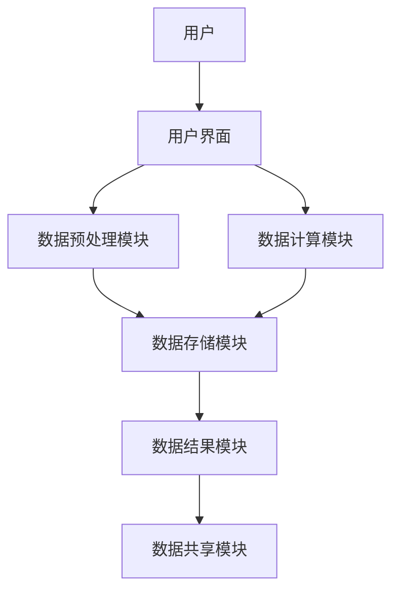
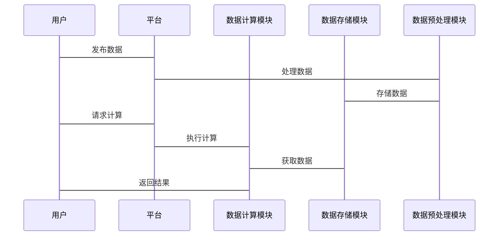

                 


# 《金融数据隐私保护与共享平台设计》

---

## 关键词：金融数据隐私、数据共享、隐私保护、联邦学习、隐私计算、数据安全

---

## 摘要：  
金融数据的隐私保护与共享是一个复杂而重要的问题。随着数字化金融的发展，如何在保护隐私的前提下实现数据共享，已成为金融机构和监管部门关注的焦点。本文通过分析金融数据隐私保护的核心技术与共享平台的设计，探讨隐私计算、联邦学习、同态加密等技术在金融领域的应用，提出了一种基于隐私计算的金融数据共享平台设计方案，并通过实际案例展示了平台的应用价值。

---

## 目录大纲

---

## 第一部分：金融数据隐私保护与共享平台概述

### 第1章：金融数据隐私保护的背景与挑战

#### 1.1 金融数据隐私保护的重要性
- **1.1.1 金融数据的敏感性与价值**
  - 金融数据的敏感性：包括个人隐私、交易记录、账户信息等，一旦泄露可能导致严重的经济损失和信誉损害。
  - 金融数据的价值：金融机构通过分析数据优化决策、提升服务质量和防范金融风险。
- **1.1.2 数据隐私保护的法律要求**
  - 《数据安全法》《个人信息保护法》等法律法规对金融数据的收集、存储和使用提出了严格要求。
  - GDPR（通用数据保护条例）等国际法规的影响。
- **1.1.3 数字化时代金融数据共享的需求**
  - 金融机构之间需要共享数据以实现业务协同，例如信用评估、反欺诈等。
  - 数据共享的必要性与隐私保护的矛盾。

#### 1.2 金融数据隐私保护的现状与挑战
- **1.2.1 当前金融数据共享的主要模式**
  - 集中式共享：数据集中在第三方平台，存在数据泄露风险。
  - 分散式共享：数据分布于不同机构，共享难度大。
- **1.2.2 数据隐私保护中的主要问题**
  - 数据泄露风险：技术漏洞、内部人员不当操作等。
  - 数据共享的信任问题：如何确保数据不被滥用。
  - 数据安全技术的局限性：现有技术难以在保护隐私的前提下实现高效共享。
- **1.2.3 技术与法律的双重挑战**
  - 技术层面：如何平衡数据隐私与数据可用性。
  - 法律层面：如何在合规的前提下实现数据共享。

#### 1.3 金融数据共享平台的目标与意义
- **1.3.1 平台的目标与核心功能**
  - 提供安全的数据共享环境。
  - 支持多方数据协作，同时保护数据隐私。
  - 提供数据脱敏、加密等技术手段。
- **1.3.2 平台对金融行业的影响**
  - 提升金融机构的数据利用效率。
  - 降低数据共享的成本和风险。
  - 促进金融创新和普惠金融的发展。
- **1.3.3 平台对数据隐私保护的创新意义**
  - 提供一种新的数据共享模式，兼顾隐私保护与数据价值的挖掘。

#### 1.4 本章小结
- 本章介绍了金融数据隐私保护的重要性和必要性，分析了当前金融数据共享的主要模式和技术挑战，提出了金融数据共享平台的目标和意义。

---

## 第2章：数据隐私保护的核心概念与技术

#### 2.1 数据分类与隐私级别
- **2.1.1 数据分类标准**
  - 数据按敏感程度分类：高敏感数据（如账户信息）、低敏感数据（如交易时间）。
  - 数据按使用场景分类：交易数据、信用数据、用户数据等。
- **2.1.2 数据隐私级别的划分**
  - 根据数据敏感程度，分为公开数据、受限数据、高度机密数据等。
  - 数据隐私级别的动态调整：根据数据使用场景和用户权限变化。
- **2.1.3 不同隐私级别的数据处理方式**
  - 公开数据：可自由共享和使用。
  - 受限数据：需要授权方可共享。
  - 高度机密数据：严格限制访问和使用。

#### 2.2 数据隐私保护模型
- **2.2.1 数据生命周期模型**
  - 数据生成、存储、传输、处理、销毁的全生命周期管理。
  - 在每个阶段实施相应的隐私保护措施。
- **2.2.2 数据访问控制模型**
  - 基于角色的访问控制（RBAC）：根据用户角色授予数据访问权限。
  - 基于属性的访问控制（ABAC）：根据用户属性（如职位、部门）动态调整访问权限。
  - 基于规则的访问控制：根据预设规则自动调整访问权限。
- **2.2.3 数据脱敏技术**
  - 数据脱敏的定义与作用：对敏感数据进行处理，使其在不泄露隐私的前提下可用。
  - 常见的脱敏方法：随机化、替换、泛化、格式化等。
  - 脱敏数据的可逆性：可逆脱敏（数据可以恢复）与不可逆脱敏（数据无法恢复）。

#### 2.3 数据加密与安全传输
- **2.3.1 加密算法的选择与应用**
  - 对称加密：速度快，适用于大量数据加密，如AES算法。
  - 非对称加密：安全性高，适用于公钥加密，如RSA算法。
  - 混合加密：结合对称和非对称加密，用于数字签名和数据加密，如SM2算法。
- **2.3.2 数据安全传输协议**
  - HTTPS协议：通过SSL/TLS加密传输数据，保障数据在传输过程中的安全性。
  - VPN（虚拟专用网络）：通过建立专用通道传输数据，防止数据被中间人窃听。
  - SSH协议：用于远程安全连接，保障数据传输的安全性。
- **2.3.3 加密技术的优缺点对比**
  - 对称加密：速度快，但密钥管理复杂。
  - 非对称加密：安全性高，但加密速度慢。
  - 混合加密：结合了对称和非对称加密的优势，但实现复杂。

#### 2.4 数据共享的安全性保障
- **2.4.1 数据共享的安全性原则**
  - 最小化原则：仅共享必要的数据。
  - 同步最小化原则：在共享过程中尽量减少数据暴露。
  - 可追溯性：记录数据共享的操作日志，便于追溯和审计。
- **2.4.2 数据共享的安全性措施**
  - 数据加密：在共享过程中对数据进行加密，确保数据在传输和存储过程中的安全性。
  - 访问控制：基于权限管理，确保只有授权的用户才能访问数据。
  - 数据脱敏：对敏感数据进行脱敏处理，降低数据泄露风险。

#### 2.5 本章小结
- 本章详细介绍了数据分类与隐私级别的划分，数据隐私保护模型，数据加密与安全传输技术，以及数据共享的安全性保障措施。

---

## 第3章：数据共享的技术挑战

#### 3.1 数据共享的技术挑战
- **3.1.1 数据孤岛问题**
  - 数据孤岛的定义：数据分散在不同的系统中，无法有效共享和利用。
  - 数据孤岛的原因：技术、组织、利益等多种因素导致。
- **3.1.2 数据共享的技术障碍**
  - 数据隐私保护与数据可用性之间的矛盾。
  - 数据共享中的信任问题：如何确保数据不被滥用。
  - 数据格式和接口不统一：不同系统之间的数据难以互通。
- **3.1.3 数据共享的成本与效率问题**
  - 数据共享的高成本：技术、时间和人力成本较高。
  - 数据共享的低效率：复杂的流程导致效率低下。

#### 3.2 数据共享的技术解决方案
- **3.2.1 联邦学习（Federated Learning）**
  - 联邦学习的定义：一种分布式机器学习技术，允许不同机构在不共享原始数据的情况下共同训练模型。
  - 联邦学习的优势：保护数据隐私，同时利用多方数据提升模型性能。
  - 联邦学习的实现方式：基于加密通信的联邦学习、基于安全多方计算的联邦学习等。
- **3.2.2 同态加密（Homomorphic Encryption）**
  - 同态加密的定义：允许在加密数据上进行计算，而不需要解密。
  - 同态加密的应用：支持在加密数据上进行统计分析、机器学习模型训练等。
  - 同态加密的实现方式：基于完全同态加密（如BFV、CKKS）和部分同态加密（如RSA）。
- **3.2.3 差分隐私（Differential Privacy）**
  - 差分隐私的定义：通过在数据中加入噪声，确保单个数据点不会对整体数据产生显著影响。
  - 差分隐私的应用：保护数据隐私，同时支持数据统计和分析。
  - 差分隐私的实现方式：基于拉普拉斯分布、几何分布等噪声添加方法。

#### 3.3 技术解决方案的优缺点对比
- **3.3.1 联邦学习的优缺点**
  - 优点：保护数据隐私，提升模型性能。
  - 缺点：计算复杂度高，通信成本大。
- **3.3.2 同态加密的优缺点**
  - 优点：支持复杂的数据计算，保护数据隐私。
  - 缺点：计算效率低，实现难度大。
- **3.3.3 差分隐私的优缺点**
  - 优点：保护数据隐私，支持数据统计和分析。
  - 缺点：可能影响数据的准确性。

#### 3.4 本章小结
- 本章分析了数据共享的技术挑战，并介绍了联邦学习、同态加密和差分隐私等技术解决方案，对比了不同技术的优缺点。

---

## 第4章：隐私计算技术

#### 4.1 多方安全计算（MPC）
- **4.1.1 多方安全计算的定义**
  - MPC的定义：允许多个参与方在不泄露各自数据的情况下，共同计算一个函数。
  - MPC的应用场景：隐私保护下的多方数据计算。
- **4.1.2 MPC的实现原理**
  - 分布式计算：数据分布在多个参与方，通过通信协议进行计算。
  - 门限方案：基于秘密共享技术，确保只有足够多的参与方合作才能完成计算。
  - 信誉机制：通过信誉评估确保参与方的可信度。
- **4.1.3 MPC的实现步骤**
  1. 数据预处理：将数据分割成多个密钥或分片。
  2. 数据通信：通过安全通道传输数据分片。
  3. 并行计算：多个参与方协同计算，生成最终结果。
  4. 结果汇总：将计算结果汇总，返回给调用方。

#### 4.2 同态加密（Homomorphic Encryption）
- **4.2.1 同态加密的定义**
  - HE的定义：允许在加密数据上进行计算，而不需要解密。
  - HE的分类：基于完全同态加密和部分同态加密。
- **4.2.2 HE的实现原理**
  - 加密过程：对明文数据进行加密，生成密文。
  - 计算过程：在密文上进行计算，得到加密结果。
  - 解密过程：将加密结果解密，得到明文结果。
- **4.2.3 HE的实现步骤**
  1. 密钥生成：生成加密密钥和解密密钥。
  2. 数据加密：将明文数据加密成密文。
  3. 数据计算：在密文上进行计算，生成加密结果。
  4. 结果解密：将加密结果解密成明文结果。

#### 4.3 差分隐私（Differential Privacy）
- **4.3.1 DP的定义**
  - DP的定义：通过在数据中加入噪声，确保单个数据点不会对整体数据产生显著影响。
  - DP的应用场景：保护数据隐私，支持数据统计和分析。
- **4.3.2 DP的实现原理**
  - 噪声添加：在数据中添加随机噪声，确保单个数据点的贡献无法被识别。
  - 数据发布：发布加噪声后的数据，供分析使用。
  - 数据分析：基于加噪声的数据进行统计分析，确保结果的隐私性。
- **4.3.3 DP的实现步骤**
  1. 数据预处理：对原始数据进行标准化处理。
  2. 噪声添加：根据隐私预算ε，计算噪声并添加到数据中。
  3. 数据发布：将加噪声后的数据发布到共享平台。
  4. 数据分析：基于加噪声的数据进行统计分析和建模。

#### 4.4 隐私计算技术的对比与选择
- **4.4.1 多方安全计算与同态加密的对比**
  - 计算能力：MPC适用于复杂计算，HE适用于简单计算。
  - 通信成本：MPC通信成本高，HE通信成本低。
  - 适用场景：MPC适用于多方协作，HE适用于单方计算。
- **4.4.2 选择隐私计算技术的原则**
  - 根据具体需求选择：数据共享的场景、数据的敏感程度、计算的复杂性。
  - 综合考虑计算效率和隐私保护：在保护隐私的前提下，选择计算效率较高的技术。

#### 4.5 本章小结
- 本章详细介绍了隐私计算技术中的多方安全计算、同态加密和差分隐私，对比了不同技术的优缺点，提出了选择隐私计算技术的原则。

---

## 第5章：平台架构与设计

#### 5.1 平台架构设计
- **5.1.1 平台整体架构**
  - 分层架构：分为数据层、计算层、应用层。
  - 模块化设计：数据存储模块、计算模块、用户界面模块。
- **5.1.2 功能模块设计**
  - 数据预处理模块：负责数据清洗、脱敏、格式转换。
  - 数据计算模块：负责执行隐私计算任务，如联邦学习、同态加密计算。
  - 数据存储模块：负责存储原始数据、计算结果、日志信息。
- **5.1.3 系统安全设计**
  - 数据加密：采用AES算法对数据进行加密存储。
  - 访问控制：基于角色的访问控制，确保只有授权用户才能访问数据。
  - 日志记录：记录数据访问日志，便于审计和追溯。

#### 5.2 平台功能设计
- **5.2.1 数据预处理功能**
  - 数据清洗：去除重复数据、处理缺失值。
  - 数据脱敏：对敏感数据进行脱敏处理，如替换、随机化。
  - 数据格式转换：将数据转换为统一格式，便于后续计算。
- **5.2.2 数据共享功能**
  - 数据发布：用户可以将数据发布到共享平台。
  - 数据订阅：其他用户可以订阅数据，进行数据协作。
  - 数据权限管理：基于角色的权限管理，确保数据的安全共享。
- **5.2.3 数据计算功能**
  - 数据分析：基于隐私计算技术，支持数据统计、建模。
  - 模型训练：支持联邦学习、同态加密等技术，进行模型训练。
  - 结果输出：将计算结果输出，供用户使用。

#### 5.3 系统架构图


#### 5.4 平台交互流程图


#### 5.5 本章小结
- 本章详细介绍了平台的架构设计和功能设计，展示了平台的整体架构和交互流程。

---

## 第6章：平台实现与实战

#### 6.1 环境搭建
- **6.1.1 开发环境**
  - 操作系统：Linux（推荐Ubuntu 20.04）
  - 开发工具：PyCharm、Jupyter Notebook
  - 依赖库：PyTorch、TensorFlow、PaddleFL（飞BAT框架）
  - 加密库：Paillier、Crypto
- **6.1.2 数据准备**
  - 数据来源：模拟金融交易数据，包括交易时间、交易金额、用户ID等。
  - 数据格式：CSV格式，包含若干字段和记录。

#### 6.2 核心代码实现
- **6.2.1 数据预处理代码**
```python
import pandas as pd
import numpy as np

# 加载数据
data = pd.read_csv('financial_data.csv')

# 数据清洗
data.dropna(inplace=True)
data.drop_duplicates(inplace=True)

# 数据脱敏：对用户ID进行哈希处理
data['user_id'] = data['user_id'].apply(lambda x: hash(x))

# 数据格式转换：将日期格式统一
data['transaction_time'] = pd.to_datetime(data['transaction_time']).astype(str)
```

- **6.2.2 联邦学习实现代码**
```python
from paddle_fl import fleet

# 初始化 fleet
fleet.init()

# 数据分发到不同参与方
data0 = data.iloc[:100]
data1 = data.iloc[100:200]

# 参与方0的数据处理
with fleet.exclusive_worker(0):
    data0.to_csv('data0.csv', index=False)

# 参与方1的数据处理
with fleet.exclusive_worker(1):
    data1.to_csv('data1.csv', index=False)

# 联邦学习训练
fleet.run_fleet(role='worker', worker_id=0)
fleet.run_fleet(role='worker', worker_id=1)
```

- **6.2.3 同态加密实现代码**
```python
import sys
from crypto import Paillier

# 初始化加密器
public_key, private_key = Paillier.generate_keys()

# 加密数据
encrypted_data = [Paillier.encrypt(public_key, x) for x in data['transaction_amount'].tolist()]

# 解密数据
decrypted_data = [Paillier.decrypt(private_key, x) for x in encrypted_data]

# 验证结果
assert decrypted_data == data['transaction_amount'].tolist()
```

#### 6.3 功能测试
- **6.3.1 数据预处理测试**
  - 测试数据清洗功能：检查是否有重复数据和缺失值。
  - 测试数据脱敏功能：确保用户ID已被哈希处理。
  - 测试数据格式转换：检查日期格式是否统一。
- **6.3.2 数据共享测试**
  - 测试数据发布功能：确保数据已成功发布到共享平台。
  - 测试数据订阅功能：其他用户可以订阅数据。
  - 测试数据权限管理：确保只有授权用户才能访问数据。
- **6.3.3 数据计算测试**
  - 测试联邦学习模型训练：确保模型能够正确训练并返回结果。
  - 测试同态加密计算：确保加密数据能够正确解密并返回明文结果。
  - 测试差分隐私计算：确保数据统计结果的隐私性和准确性。

#### 6.4 案例分析
- **6.4.1 信用评估案例**
  - 案例背景：某银行需要评估客户的信用风险，但数据分散在多个部门。
  - 数据共享：通过平台共享客户数据，利用联邦学习训练信用评估模型。
  - 实施步骤：
    1. 数据预处理：清洗和脱敏数据。
    2. 数据发布：各部门将数据发布到共享平台。
    3. 模型训练：利用联邦学习技术训练信用评估模型。
    4. 模型评估：评估模型的准确性和效率。
- **6.4.2 反欺诈案例**
  - 案例背景：某支付平台需要检测交易中的欺诈行为，数据分散在多个渠道。
  - 数据共享：通过平台共享交易数据，利用同态加密技术进行实时分析。
  - 实施步骤：
    1. 数据预处理：清洗和加密数据。
    2. 数据共享：各渠道将数据发布到共享平台。
    3. 实时分析：利用同态加密技术进行实时欺诈检测。
    4. 结果输出：将欺诈检测结果返回给支付平台。

#### 6.5 本章小结
- 本章详细介绍了平台的实现过程，包括环境搭建、核心代码实现、功能测试和实际案例分析，展示了平台的实际应用价值。

---

## 第7章：安全与法律合规

#### 7.1 数据隐私保护的法律法规
- **7.1.1 中国的《数据安全法》和《个人信息保护法》**
  - 数据分类分级：要求企业根据数据的重要性和敏感程度进行分类管理。
  - 数据跨境传输：明确规定数据出境的安全评估和审批流程。
  - 数据安全责任：明确企业对数据安全的主体责任。
- **7.1.2 GDPR（通用数据保护条例）**
  - GDPR的适用范围：适用于欧盟境内所有处理个人数据的企业。
  - 数据主体权利：包括数据访问权、数据更正权、数据删除权等。
  - 数据泄露通知：企业需在72小时内向数据保护机构报告数据泄露事件。

#### 7.2 数据共享的合规要求
- **7.2.1 数据共享的合法性**
  - 需要获得数据主体的授权同意。
  - 数据共享需符合相关法律法规。
- **7.2.2 数据共享的合规措施**
  - 数据加密：确保数据在共享过程中的安全性。
  - 访问控制：基于角色的访问控制，确保数据只被授权方访问。
  - 数据脱敏：对敏感数据进行脱敏处理，降低数据泄露风险。
- **7.2.3 数据共享的合规风险**
  - 数据泄露风险：未正确实施数据加密和访问控制可能导致数据泄露。
  - 数据滥用风险：数据共享后可能被滥用，导致隐私问题。
  - 数据跨境传输风险：未通过安全评估的数据跨境传输可能违反法规。

#### 7.3 安全与合规的最佳实践
- **7.3.1 数据分类与分级管理**
  - 根据数据的重要性和敏感程度进行分类管理。
  - 高敏感数据：如账户信息、交易记录，需严格控制访问权限。
  - 低敏感数据：如公开信息，可适当放宽访问权限。
- **7.3.2 数据安全技术的实施**
  - 数据加密：采用AES、RSA等加密算法，保护数据在传输和存储过程中的安全性。
  - 访问控制：基于角色的访问控制，确保数据只被授权用户访问。
  - 数据脱敏：对敏感数据进行脱敏处理，降低数据泄露风险。
- **7.3.3 数据共享的合规管理**
  - 建立数据共享审批流程，确保数据共享符合法律法规。
  - 建立数据共享日志记录，便于审计和追溯。
  - 建立数据共享风险评估机制，定期评估数据共享的风险。

#### 7.4 案例分析：数据共享中的合规问题
- **7.4.1 合规失败的案例**
  - 某银行因未正确实施数据加密措施，导致客户数据泄露。
  - 某支付平台因未获得用户授权，擅自共享用户数据，违反GDPR规定。
- **7.4.2 合规成功的案例**
  - 某保险公司通过平台共享客户数据，利用联邦学习技术进行风险评估，确保数据隐私和合规性。
  - 某银行通过数据脱敏和访问控制技术，成功实现数据共享，同时满足合规要求。

#### 7.5 本章小结
- 本章详细介绍了数据隐私保护的法律法规和数据共享的合规要求，提出了安全与合规的最佳实践，并通过案例分析展示了合规管理的重要性。

---

## 第8章：案例分析与未来展望

#### 8.1 案例分析
- **8.1.1 某银行的数据共享平台**
  - 平台背景：某银行需要与多家金融机构共享客户数据，进行信用评估和风险控制。
  - 平台实现：采用联邦学习技术，保护客户数据隐私，同时支持多方数据协作。
  - 实施效果：提升信用评估的准确性，降低欺诈风险。
- **8.1.2 某支付平台的反欺诈系统**
  - 系统背景：某支付平台需要实时检测交易中的欺诈行为，数据分散在多个渠道。
  - 系统实现：采用同态加密技术，支持实时数据分析，保护数据隐私。
  - 实施效果：降低欺诈交易的发生率，提升交易安全性。

#### 8.2 未来技术展望
- **8.2.1 隐私计算技术的未来发展**
  - 同态加密技术的优化：提高计算效率，降低实现复杂度。
  - 多方安全计算的创新：探索更高效的通信协议和计算模型。
  - 差分隐私的改进：降低噪声对数据准确性的负面影响。
- **8.2.2 数据共享模式的创新**
  - 跨平台数据共享：支持不同平台之间的数据协作。
  - 智能合约：通过智能合约自动执行数据共享的条件和权限。
  - 数据联邦：构建数据联邦网络，支持更大规模的数据协作。
- **8.2.3 人工智能与数据隐私保护的结合**
  - 增强学习：结合增强学习技术，提升数据隐私保护的效果。
  - 自动化隐私保护：通过自动化技术实现数据隐私保护的智能化管理。
  - 智能合约：利用智能合约自动执行数据隐私保护的规则。

#### 8.3 本章小结
- 本章通过实际案例展示了平台的应用价值，并展望了未来的技术发展趋势，提出了未来研究的方向和可能的应用场景。

---

## 第9章：总结与展望

#### 9.1 总结
- 本章总结了全文的核心内容和主要结论。
  - 金融数据隐私保护是数字化时代的重要任务，数据共享平台的设计是实现数据价值的重要手段。
  - 隐私计算技术是实现数据共享的核心技术，包括联邦学习、同态加密和差分隐私等。
  - 平台架构设计和功能设计是平台实现的关键，需要综合考虑数据安全、计算效率和用户需求。

#### 9.2 展望
- 未来的研究方向：
  - 探索更高效的隐私计算技术，提升数据共享的效率和安全性。
  - 研究数据隐私保护的法律与伦理问题，推动数据共享的合规性。
  - 推动数据共享平台的广泛应用，促进金融行业的数据驱动创新。

#### 9.3 本章小结
- 本章总结了全文的主要内容，并展望了未来的研究方向和应用前景。

---

## 作者：AI天才研究院/AI Genius Institute & 禅与计算机程序设计艺术 /Zen And The Art of Computer Programming

---

**感谢您的耐心阅读！希望这篇文章能为金融数据隐私保护与共享平台的设计提供有价值的参考和启发。**

