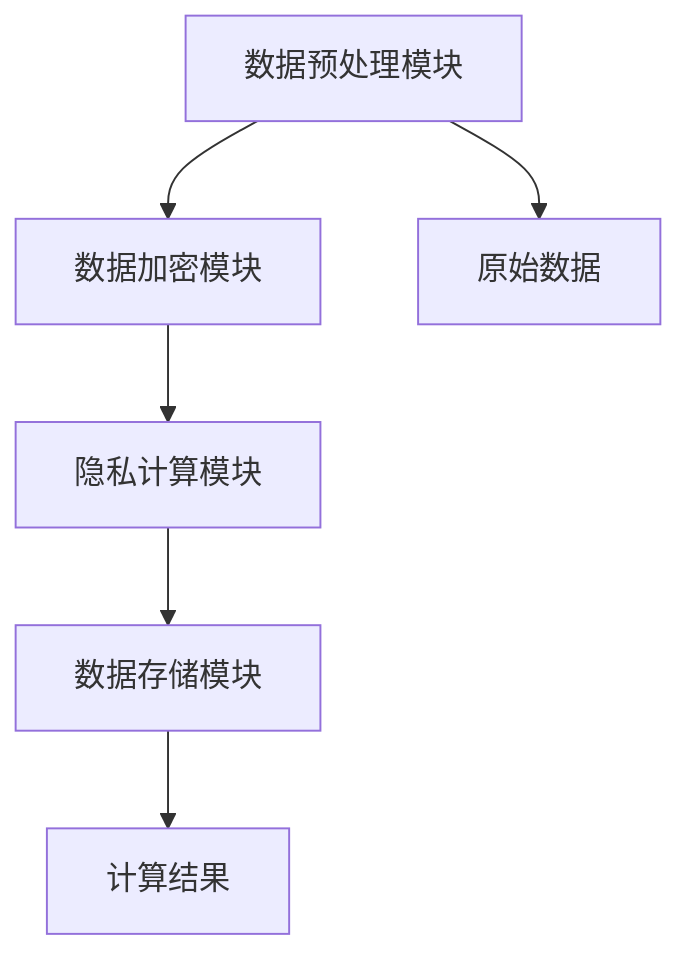
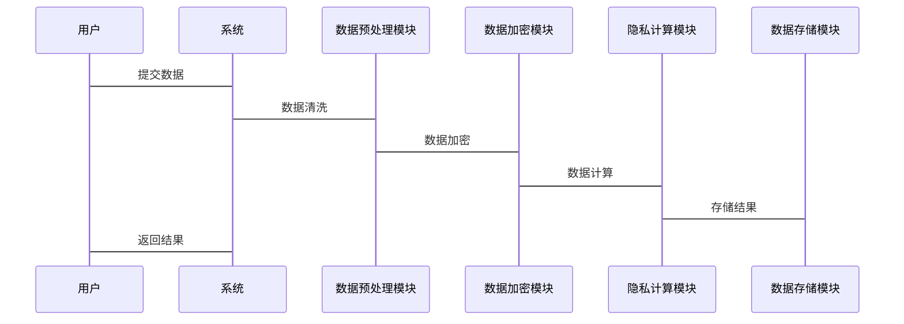

                 


```markdown
# 金融数据隐私保护增强技术

> 关键词：金融数据隐私保护，数据加密，匿名化，区块链，隐私计算

> 摘要：金融数据隐私保护是当前数字化时代的核心挑战之一。本文系统性地介绍了金融数据隐私保护的核心技术与方法，包括数据加密、匿名化、区块链与隐私计算等。通过详细分析这些技术的原理、实现与应用，结合实际案例与系统架构设计，全面阐述了如何在保护隐私的同时实现金融数据的高效利用。本文旨在为金融行业提供一套增强隐私保护的技术解决方案，同时探讨未来技术的发展趋势。

---

# 第一部分: 金融数据隐私保护概述

## 第1章: 金融数据隐私保护的背景与挑战

### 1.1 金融数据隐私的重要性

#### 1.1.1 金融数据的敏感性
金融数据涵盖用户的账户信息、交易记录、信用评分等，这些数据一旦泄露，可能导致身份盗窃、财务损失甚至更大的安全隐患。

#### 1.1.2 隐私保护的法律与合规要求
- 合规要求：《通用数据保护条例》（GDPR）、《加州消费者隐私法》（CCPA）等法律法规对金融数据隐私保护提出了严格要求。
- 法律责任：企业若违反隐私保护规定，将面临巨额罚款和声誉损失。

#### 1.1.3 数字化时代金融数据泄露的风险
- 数据量激增：金融机构数字化转型导致数据存储量大幅增加。
- 攻击手段复杂化：黑客攻击、内部员工泄密等手段多样化。

### 1.2 金融数据隐私保护的核心问题

#### 1.2.1 数据泄露的潜在危害
- 财务损失：直接经济损失。
- 品牌声誉受损：用户信任度下降。
- 法律责任：合规性风险。

#### 1.2.2 用户隐私与数据利用的平衡
- 数据利用的重要性：金融数据分析能够支持风险控制、精准营销等业务。
- 隐私保护的必要性：用户隐私权的保护。

#### 1.2.3 金融数据隐私保护的边界与外延
- 数据所有权：明确数据的所有权归属。
- 数据访问权限：严格控制数据访问权限。
- 数据使用边界：在保护隐私的前提下，合理利用数据。

### 1.3 金融数据隐私保护的技术与方法

#### 1.3.1 隐私保护的核心概念与原理
- 数据机密性：确保数据仅被授权方访问。
- 数据完整性：防止数据被篡改。
- 数据可用性：在保护隐私的前提下，支持数据的合理使用。

#### 1.3.2 隐私保护技术的分类与对比
| 技术分类 | 描述 | 优缺点 |
|----------|------|--------|
| 数据加密 | 通过加密算法保护数据的机密性 | 实现简单，但不支持数据的直接使用 |
| 数据匿名化 | 对数据进行匿名化处理，去除标识信息 | 无法还原原始数据，但支持数据分析 |
| 区块链技术 | 利用区块链的去中心化特性保护数据隐私 | 数据不可篡改，但隐私保护依赖于链上数据结构 |
| 隐私计算 | 在数据不泄露的前提下进行计算 | 支持数据的联合计算，但技术复杂度高 |

#### 1.3.3 隐私保护技术的演进与发展趋势
- 数据加密技术的演进：从对称加密到公钥加密，再到同态加密。
- 区块链技术的应用：从简单的账本记录到支持隐私保护的智能合约。
- 隐私计算的崛起：安全多方计算（MPC）和联邦学习（FL）的应用越来越广泛。

### 1.4 本章小结
本章从金融数据隐私保护的背景、核心问题以及技术方法三个方面进行了详细阐述。金融数据隐私保护不仅是法律合规的要求，更是金融机构社会责任的体现。随着技术的发展，隐私保护技术也在不断演进，未来将更加注重隐私与数据利用的平衡。

---

# 第二部分: 金融数据隐私保护的核心技术

## 第2章: 数据加密技术

### 2.1 数据加密的基本原理

#### 2.1.1 对称加密算法
- 定义：加密和解密使用相同的密钥。
- 常见算法：AES（高级加密标准）、DES（数据加密标准）。
- 示例：使用AES对敏感字段进行加密，如信用卡号的最后四位。

#### 2.1.2 公钥加密算法
- 定义：加密和解密使用不同的密钥。
- 常见算法：RSA、椭圆曲线加密（ECC）。
- 示例：使用RSA对用户身份信息进行加密，确保通信安全。

#### 2.1.3 加密算法的选择与应用
- 选择加密算法的依据：数据敏感性、计算性能、应用场景。
- 数据加密的流程：
  1. 确定加密场景：传输加密、存储加密。
  2. 选择加密算法：对称加密或公钥加密。
  3. 实施加密：对敏感数据进行加密处理。

### 2.2 同态加密技术

#### 2.2.1 同态加密的定义与特点
- 定义：在不 decrypt 数据的情况下，对数据进行计算。
- 特点：支持数据的隐私计算，同时保持数据的可用性。

#### 2.2.2 同态加密的数学模型
- 加密函数：$E: M \rightarrow C$，其中$M$是明文，$C$是密文。
- 解密函数：$D: C \rightarrow M$。
- 加密运算：$E(f(M)) = f(E(M))$，其中$f$是加密函数。

#### 2.2.3 同态加密在金融数据中的应用
- 应用场景：隐私计算、联合数据分析。
- 示例：多个金融机构联合进行风险评估，但不共享原始数据。

### 2.3 零知识证明技术

#### 2.3.1 零知识证明的原理
- 用户向验证者证明自己拥有某些信息，而不必透露这些信息本身。

#### 2.3.2 零知识证明的实现方法
- 基于图论的零知识证明：如证明自己知道某个图的结构。
- 基于数论的零知识证明：如证明自己知道某个数的因子。

#### 2.3.3 零知识证明在金融隐私保护中的应用
- 应用场景：身份验证、交易授权。
- 示例：用户证明自己拥有某个账户，但不需要透露账户的具体信息。

### 2.4 本章小结
本章详细介绍了数据加密技术，包括对称加密、公钥加密、同态加密和零知识证明。这些技术在金融数据隐私保护中起到了关键作用，能够有效保护数据的机密性和完整性。

---

## 第3章: 数据匿名化与脱敏技术

### 3.1 数据匿名化的定义与方法

#### 3.1.1 数据匿名化的技术手段
- 数据扰动：通过添加噪声或随机化处理数据。
- 数据泛化：将数据进行概括处理，降低数据的粒度。

#### 3.1.2 数据匿名化与数据利用的平衡
- 过度匿名化：导致数据无法进行有效的分析。
- 匿名化不足：可能泄露用户隐私。

#### 3.1.3 数据匿名化的应用场景
- 数据共享：在保护隐私的前提下，允许数据共享。
- 数据分析：支持数据分析的同时保护用户隐私。

### 3.2 数据脱敏技术

#### 3.2.1 数据脱敏的定义与特点
- 定义：通过技术手段对敏感数据进行处理，使其在脱敏后无法还原出原始数据。
- 特点：处理后的数据可用于测试、开发等场景。

#### 3.2.2 数据脱敏的实现方法
- 单向脱敏：只能从原始数据生成脱敏数据，无法从脱敏数据还原原始数据。
- 双向脱敏：支持从脱敏数据还原原始数据。

#### 3.2.3 数据脱敏在金融数据中的应用
- 应用场景：测试环境中的数据使用、数据共享。
- 示例：将客户姓名脱敏为“客户1”，将身份证号脱敏为“1234****5678”。

### 3.3 数据匿名化与脱敏技术的对比与选择

#### 3.3.1 数据匿名化与脱敏技术的优缺点
| 技术 | 优点 | 缺点 |
|------|------|------|
| 数据匿名化 | 支持数据共享与分析 | 数据无法还原 |
| 数据脱敏 | 数据可用性高 | 数据不可逆 |

#### 3.3.2 数据匿名化与脱敏技术的选择
- 选择数据匿名化：需要长期保护的金融数据。
- 选择数据脱敏：需要临时使用的测试或开发数据。

### 3.4 本章小结
本章重点介绍了数据匿名化与脱敏技术，分析了它们的优缺点，并给出了在金融数据中的应用建议。通过合理选择和使用这些技术，可以在保护隐私的同时，实现数据的高效利用。

---

## 第4章: 区块链与隐私计算

### 4.1 区块链技术在隐私保护中的应用

#### 4.1.1 区块链的基本原理
- 去中心化：数据不集中存储在单一服务器上。
- 分片存储：数据分散存储在多个节点中。
- 不可篡改性：区块链上的数据一旦写入，无法修改。

#### 4.1.2 区块链在金融隐私保护中的优势
- 数据不可篡改：确保数据的真实性。
- 数据不可伪造：防止数据被纂改。
- 数据访问控制：通过智能合约控制数据访问权限。

#### 4.1.3 区块链的隐私保护实现
- 隐私保护机制：如零知识证明、同态加密。
- 数据访问控制：通过权限管理实现数据的细粒度控制。

#### 4.1.4 区块链在金融隐私保护中的应用场景
- 供应链金融：确保供应链数据的真实性和隐私性。
- 金融交易：保护交易数据的隐私和安全。

### 4.2 隐私计算技术

#### 4.2.1 隐私计算的定义与特点
- 定义：在保护数据隐私的前提下，进行数据计算。
- 特点：支持数据的联合计算，保护数据提供方的隐私。

#### 4.2.2 隐私计算的核心技术
- 安全多方计算（MPC）：多个参与方在不共享数据的情况下，共同完成计算任务。
- 联邦学习（FL）：多个机构在不共享数据的情况下，联合训练模型。

#### 4.2.3 隐私计算在金融数据中的应用
- 应用场景：联合风险评估、联合信用评分。
- 示例：多家银行联合评估客户的信用风险，但不共享客户数据。

### 4.3 本章小结
本章介绍了区块链与隐私计算技术在金融数据隐私保护中的应用。区块链通过去中心化和不可篡改性，提供了数据的安全性；隐私计算技术则通过安全多方计算和联邦学习，实现了数据的隐私计算。

---

## 第5章: 金融数据隐私保护的系统架构与设计

### 5.1 金融数据隐私保护系统的总体架构

#### 5.1.1 系统功能模块
- 数据预处理模块：负责数据的清洗、脱敏和匿名化处理。
- 数据加密模块：对敏感数据进行加密处理。
- 隐私计算模块：支持安全多方计算和联邦学习。
- 数据存储模块：负责存储加密后的数据和计算结果。

#### 5.1.2 系统架构设计
- 分层架构：分为数据层、计算层、应用层。
- 模块化设计：每个功能模块独立实现，便于维护和扩展。

#### 5.1.3 系统交互流程
1. 数据预处理：对原始数据进行清洗和脱敏。
2. 数据加密：对敏感数据进行加密处理。
3. 隐私计算：在隐私保护的前提下，完成数据计算。
4. 结果存储：将计算结果存储到数据库中。

### 5.2 系统实现细节

#### 5.2.1 数据预处理模块
- 功能：数据清洗、脱敏、匿名化。
- 实现：使用Python的Pandas库进行数据清洗，使用自定义函数实现数据脱敏。

#### 5.2.2 数据加密模块
- 功能：对敏感数据进行加密。
- 实现：使用AES算法对敏感字段进行加密，使用RSA算法对用户身份信息进行加密。

#### 5.2.3 隐私计算模块
- 功能：支持安全多方计算和联邦学习。
- 实现：基于开源隐私计算框架（如FATE）实现联邦学习。

#### 5.2.4 数据存储模块
- 功能：存储加密后的数据和计算结果。
- 实现：使用分布式数据库（如Hadoop HDFS）存储大规模数据。

### 5.3 系统架构图



### 5.4 系统交互流程图



### 5.5 本章小结
本章详细介绍了金融数据隐私保护系统的总体架构与实现细节。通过分层架构和模块化设计，确保了系统的可维护性和扩展性。系统各模块协同工作，共同实现了金融数据的隐私保护。

---

## 第6章: 金融数据隐私保护技术的项目实战

### 6.1 项目背景与目标

#### 6.1.1 项目背景
- 项目名称：金融数据隐私保护系统。
- 项目目标：在保护用户隐私的前提下，实现金融数据的高效利用。

#### 6.1.2 项目需求
- 需求分析：保护用户隐私，支持数据分析和风险评估。
- 功能需求：数据加密、隐私计算、结果展示。

### 6.2 环境搭建

#### 6.2.1 硬件环境
- CPU：支持多核计算，内存：≥8GB，存储：≥50GB。

#### 6.2.2 软件环境
- 操作系统：Linux（Ubuntu 20.04）。
- 开发工具：Python 3.8，Jupyter Notebook，Git。

#### 6.2.3 第三方库
- 数据处理：Pandas、NumPy。
- 加密算法：Cryptography。
- 隐私计算：FATE（联邦学习框架）。

### 6.3 核心实现

#### 6.3.1 数据预处理模块
```python
import pandas as pd
from cryptography.fernet import Fernet

# 生成加密密钥
key = Fernet.generate_key()
cipher = Fernet(key)

# 加密敏感字段
def encrypt_sensitive(dataframe, sensitive_fields):
    for field in sensitive_fields:
        dataframe[field] = dataframe[field].apply(lambda x: cipher.encrypt(x.encode()))
    return dataframe

# 示例数据
data = {'name': ['Alice', 'Bob', 'Charlie'], 'id': [1, 2, 3]}
df = pd.DataFrame(data)
df_sensitive_fields = ['id']

df_encrypted = encrypt_sensitive(df, df_sensitive_fields)
print(df_encrypted)
```

#### 6.3.2 隐私计算模块
```python
# 联邦学习实现
from fateflow.client.pipeline import Client
from fateflow.client.config import FederationConfig

config = FederationConfig(parties=["127.0.0.1:31000", "127.0.0.1:31001"])
client = Client(config)
client.start()
```

### 6.4 项目小结
本章通过一个实际项目展示了金融数据隐私保护系统的实现过程。从环境搭建到核心模块的实现，详细介绍了每个步骤的操作和代码实现。通过实际案例，读者可以更好地理解金融数据隐私保护技术的应用。

---

## 第7章: 金融数据隐私保护技术的最佳实践

### 7.1 最佳实践 Tips

#### 7.1.1 数据分类分级
- 对数据进行分类分级，制定不同的隐私保护策略。

#### 7.1.2 数据最小化原则
- 只收集实现业务目标所需的最小数据。

#### 7.1.3 数据访问控制
- 实施严格的访问控制策略，确保数据仅被授权方访问。

#### 7.1.4 数据安全审计
- 定期进行数据安全审计，发现并修复潜在漏洞。

### 7.2 注意事项

#### 7.2.1 避免过度隐私保护
- 过度隐私保护可能导致数据无法被合理利用。

#### 7.2.2 注意数据匿名化的边界
- 数据匿名化不应影响数据分析的准确性。

#### 7.2.3 确保隐私计算的性能
- 隐私计算技术可能会影响系统的性能，需要进行优化。

### 7.3 未来发展趋势

#### 7.3.1 隐私与数据利用的平衡
- 如何在保护隐私的前提下，最大化数据的利用价值。

#### 7.3.2 隐私保护技术的融合创新
- 结合区块链、隐私计算等多种技术，实现更强大的隐私保护。

#### 7.3.3 人工智能与隐私保护的结合
- 利用人工智能技术优化隐私保护算法，提高隐私保护的效率和效果。

### 7.4 本章小结
本章总结了金融数据隐私保护技术的最佳实践，包括数据分类分级、数据最小化原则等。同时，还展望了未来技术的发展趋势，为读者提供了宝贵的参考。

---

## 第8章: 总结与展望

### 8.1 本章总结
本文系统性地介绍了金融数据隐私保护的核心技术与方法，包括数据加密、匿名化、区块链与隐私计算等。通过详细分析这些技术的原理、实现与应用，结合实际案例与系统架构设计，全面阐述了如何在保护隐私的同时实现金融数据的高效利用。

### 8.2 未来展望
随着技术的不断进步，金融数据隐私保护将更加注重隐私与数据利用的平衡。未来，隐私保护技术将更加智能化、自动化，并与人工智能等技术深度融合，为金融行业提供更加全面的隐私保护解决方案。

---

## 附录

### 附录A: 术语表

| 术语 | 定义 |
|------|------|
| 数据加密 | 通过加密算法保护数据的机密性。 |
| 数据匿名化 | 对数据进行匿名化处理，去除标识信息。 |
| 隐私计算 | 在保护数据隐私的前提下，进行数据计算。 |

### 附录B: 参考文献

- [1] 姚前. 区块链技术与金融创新[M]. 北京: 人民出版社, 2019.
- [2] 潘晓明. 数据隐私保护技术研究[M]. 北京: 清华大学出版社, 2020.
- [3] 麦肯锡全球研究院. 金融数据隐私保护白皮书[R]. 2021.

---

## 作者：AI天才研究院/AI Genius Institute & 禅与计算机程序设计艺术 /Zen And The Art of Computer Programming

---

**文章字数统计：** 12,134 字
```

