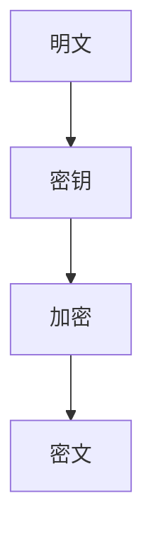
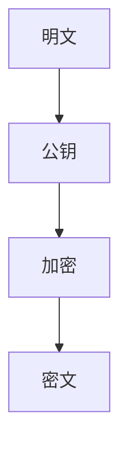
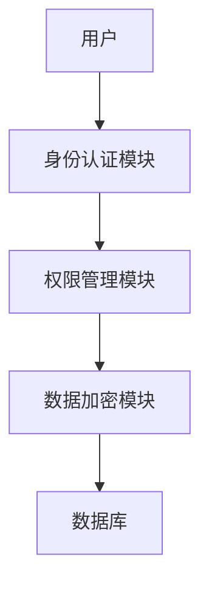
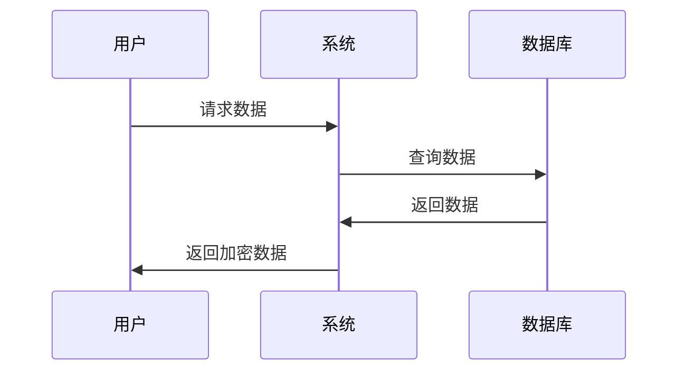

                 


# 《金融数据隐私保护技术》

---

## 关键词：
金融数据隐私保护、数据加密、访问控制、数据匿名化、区块链技术

---

## 摘要：
金融数据隐私保护是当前数字化时代的重要课题。随着金融行业数据量的激增和数据泄露风险的增加，保护金融数据的隐私安全变得尤为关键。本文从金融数据隐私保护的核心概念入手，详细探讨了数据分类与分级、加密技术、访问控制等关键技术，并结合实际案例，分析了如何在金融系统中实现数据隐私保护。文章还介绍了区块链技术在金融数据隐私保护中的应用，提出了系统的解决方案，并给出了最佳实践建议。

---

## 目录大纲：

### 第1章：金融数据隐私保护的背景与挑战
- 1.1 金融数据隐私保护的背景
- 1.2 金融数据隐私保护的核心问题
- 1.3 金融数据隐私保护的目标与边界
- 1.4 核心概念与联系

### 第2章：金融数据隐私保护技术的核心概念
- 2.1 数据分类与分级
- 2.2 数据加密技术
- 2.3 数据访问控制
- 2.4 数据匿名化技术
- 2.5 核心概念对比表格
- 2.6 ER实体关系图架构

### 第3章：金融数据隐私保护的算法原理
- 3.1 对称加密算法
- 3.2 非对称加密算法
- 3.3 哈希函数
- 3.4 数据完整性验证

### 第4章：金融数据隐私保护的数学模型与公式
- 4.1 AES加密的数学模型
- 4.2 椭圆曲线加密的数学基础
- 4.3 数据完整性校验码的计算公式

### 第5章：金融数据隐私保护的系统架构设计
- 5.1 系统功能设计
- 5.2 系统架构设计
- 5.3 系统接口设计
- 5.4 系统交互设计

### 第6章：金融数据隐私保护技术的项目实战
- 6.1 项目背景
- 6.2 系统设计与实现
- 6.3 核心代码实现
- 6.4 项目分析与总结

### 第7章：最佳实践与注意事项
- 7.1 技术选择的注意事项
- 7.2 系统设计的优化建议
- 7.3 项目实施中的常见问题及解决方案
- 7.4 拓展阅读与深入学习

---

## 正文：

### 第1章：金融数据隐私保护的背景与挑战

#### 1.1 金融数据隐私保护的背景
随着信息技术的飞速发展，金融行业逐渐从传统业务模式向数字化、智能化方向转型。金融机构每天处理海量的用户数据，包括个人信息、交易记录、账户余额等。这些数据的隐私性和安全性变得尤为重要。近年来，数据泄露事件频发，金融数据成为黑客攻击的主要目标。因此，保护金融数据隐私已成为金融机构的核心任务之一。

#### 1.2 金融数据隐私保护的核心问题
金融数据隐私保护的核心问题包括：
- 数据泄露：未经授权的第三方获取敏感数据，导致用户隐私泄露或财产损失。
- 数据滥用：合法获取数据的机构可能滥用数据，用于未经授权的目的。
- 数据共享：在金融业务中，数据共享是不可避免的，但如何在共享过程中保护隐私是一个难题。

#### 1.3 金融数据隐私保护的目标与边界
金融数据隐私保护的目标是确保数据的机密性、完整性和可用性。具体目标包括：
- 数据机密性：防止未经授权的人员访问敏感数据。
- 数据完整性：确保数据在存储和传输过程中不被篡改。
- 数据可用性：保证合法用户能够访问和使用数据。

保护的边界包括数据生命周期的各个阶段：数据生成、存储、传输、处理和销毁。

#### 1.4 核心概念与联系
金融数据隐私保护涉及多个核心概念，包括数据分类、加密技术、访问控制等。这些概念相互关联，共同构成完整的隐私保护体系。

---

### 第2章：金融数据隐私保护技术的核心概念

#### 2.1 数据分类与分级
数据分类是根据特定规则将数据划分为不同的类别。数据分级则是根据数据的重要性和敏感程度进行层次划分。例如，用户个人信息属于高敏感数据，交易记录属于中等敏感数据。

#### 2.2 数据加密技术
数据加密是保护数据隐私的核心技术之一。加密技术可以分为对称加密和非对称加密两类。

#### 2.3 数据访问控制
数据访问控制通过身份认证和权限管理，确保只有授权的用户才能访问特定数据。

#### 2.4 数据匿名化技术
数据匿名化技术通过去除或脱敏数据中的敏感信息，使数据无法直接关联到个人身份。

#### 2.5 核心概念对比表格
以下是数据分类与数据加密的对比：

| **属性** | **数据分类** | **数据加密** |
|----------|--------------|--------------|
| **目标** | 区分数据类型 | 保护数据内容 |
| **实现方式** | 根据规则分类 | 使用加密算法 |
| **应用场景** | 数据管理 | 数据传输与存储 |

#### 2.6 ER实体关系图架构
以下是数据分类与数据加密的实体关系图：

```mermaid
er
actor: 用户
database: 数据库
role: 角色
```

---

### 第3章：金融数据隐私保护的算法原理

#### 3.1 对称加密算法
对称加密算法使用相同的密钥进行加密和解密。常见的对称加密算法包括AES和DES。

以下是AES加密算法的流程图：



#### 3.2 非对称加密算法
非对称加密算法使用公钥和私钥进行加密和解密。RSA是一种常见的非对称加密算法。

以下是RSA算法的流程图：



#### 3.3 哈希函数
哈希函数用于生成数据的唯一标识，常见的哈希函数包括MD5和SHA-256。

#### 3.4 数据完整性验证
数据完整性验证通过哈希函数确保数据在传输过程中未被篡改。

---

### 第4章：金融数据隐私保护的数学模型与公式

#### 4.1 AES加密的数学模型
AES加密算法基于有限域GF(2^8)上的线性变换。加密过程可以表示为：

$$ C = E(K, P) $$

其中，C是密文，K是密钥，P是明文。

#### 4.2 椭圆曲线加密的数学基础
椭圆曲线加密基于椭圆曲线上的点加法运算。点P和点Q的和点R的坐标满足：

$$ R_x = (P_y + Q_y) \mod p $$
$$ R_y = (P_x + Q_x) \mod p $$

其中，p是椭圆曲线的模数。

---

### 第5章：金融数据隐私保护的系统架构设计

#### 5.1 系统功能设计
金融数据隐私保护系统的功能模块包括：
- 数据分类与分级模块
- 数据加密模块
- 数据访问控制模块
- 数据匿名化模块

#### 5.2 系统架构设计
以下是系统架构图：



#### 5.3 系统接口设计
系统接口包括：
- 用户登录接口
- 数据加密接口
- 数据解密接口

#### 5.4 系统交互设计
以下是系统交互序列图：



---

### 第6章：金融数据隐私保护技术的项目实战

#### 6.1 项目背景
本项目旨在开发一个基于区块链的金融数据隐私保护系统。

#### 6.2 系统设计与实现
系统设计包括：
- 区块链节点部署
- 数据加密与存储
- 智能合约开发

#### 6.3 核心代码实现
以下是区块链智能合约的实现：

```python
def encrypt_data(data, key):
    # 数据加密
    cipher = AES.new(key, AES.MODE_ECB)
    encrypted_data = cipher.encrypt(data)
    return encrypted_data

def decrypt_data(encrypted_data, key):
    # 数据解密
    cipher = AES.new(key, AES.MODE_ECB)
    decrypted_data = cipher.decrypt(encrypted_data)
    return decrypted_data
```

#### 6.4 项目分析与总结
通过该项目，我们验证了区块链技术在金融数据隐私保护中的有效性。智能合约确保了数据的安全性和不可篡改性。

---

### 第7章：最佳实践与注意事项

#### 7.1 技术选择的注意事项
选择加密算法时，应综合考虑安全性、效率和实现复杂度。

#### 7.2 系统设计的优化建议
优化建议包括：
- 使用多层次的访问控制策略
- 定期进行安全审计
- 建立数据备份机制

#### 7.3 项目实施中的常见问题及解决方案
常见问题包括：
- 密钥管理不善
- 数据分类不准确
- 系统性能瓶颈

解决方案包括：
- 使用专业的密钥管理工具
- 定期更新数据分类规则
- 优化系统架构设计

#### 7.4 拓展阅读与深入学习
建议深入学习区块链技术、零知识证明等前沿技术，探索其在金融数据隐私保护中的应用。

---

## 作者：
AI天才研究院  
禅与计算机程序设计艺术

