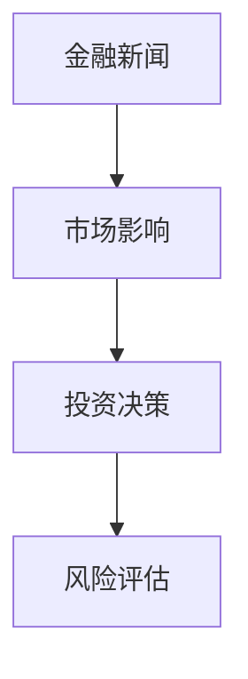
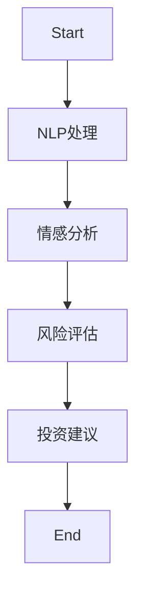

                 


# 金融新闻分析与投资影响评估

> 关键词：金融新闻分析，投资影响评估，自然语言处理，情感分析，机器学习

> 摘要：本文将详细探讨金融新闻分析与投资影响评估的核心概念、算法原理、系统架构设计以及实际应用。通过理论分析与实践案例相结合的方式，帮助读者理解如何利用自然语言处理和机器学习技术，从海量金融新闻中提取关键信息，并评估其对投资决策的影响。本文还提供了详细的代码实现和系统架构设计，为读者提供从理论到实践的完整指导。

---

# 第1章: 金融新闻分析与投资影响评估概述

## 1.1 问题背景与描述

### 1.1.1 金融新闻分析的必要性
金融市场是一个高度动态和不确定的环境，每天都有海量的金融新闻发布，这些新闻可能影响市场的走势和投资者的决策。例如，一家公司发布了令人意外的财报，或者政府宣布了新的经济政策，这些信息都会引起市场的波动。然而，对于普通投资者来说，如何快速、准确地从这些新闻中提取关键信息，并评估其对投资的影响，是一个巨大的挑战。

### 1.1.2 投资影响评估的核心问题
投资影响评估的核心问题是，如何量化新闻内容对市场和投资决策的影响。这包括以下几个方面：
- **市场情绪分析**：判断新闻内容是正面、负面还是中性。
- **市场波动预测**：预测新闻发布后市场可能的波动情况。
- **投资决策支持**：基于新闻分析结果，为投资者提供具体的买卖建议。

### 1.1.3 问题解决的路径与方法
要解决上述问题，我们需要结合自然语言处理（NLP）和机器学习技术，构建一个能够自动分析金融新闻、评估其影响，并为投资者提供决策支持的系统。

## 1.2 核心概念与边界

### 1.2.1 金融新闻分析的定义
金融新闻分析是指对金融市场相关的新闻内容进行结构化处理，提取其中的关键信息，并分析其对市场和投资的影响。这包括对新闻标题、正文、时间戳等信息的处理。

### 1.2.2 投资影响评估的边界与外延
投资影响评估的边界是指，我们仅关注新闻内容对市场和投资的影响，而不涉及其他外部因素（如宏观经济政策、突发事件等）。其外延则包括对市场情绪、市场波动、投资决策等多个维度的影响。

### 1.2.3 核心概念的结构与组成
金融新闻分析与投资影响评估的核心概念可以分为以下几个部分：
- **新闻内容**：包括标题、正文、时间戳等。
- **市场情绪**：包括正面、负面、中性三种状态。
- **市场波动**：包括波动幅度和波动方向（上升或下降）。
- **投资建议**：包括买入、卖出、持有三种建议。

## 1.3 本章小结
本章介绍了金融新闻分析与投资影响评估的必要性、核心问题以及解决路径。通过定义和边界分析，我们明确了后续章节的研究范围和技术路径。

---

# 第2章: 核心概念与联系

## 2.1 核心概念原理

### 2.1.1 金融新闻的特征与属性
金融新闻具有以下特征：
- **时间性**：新闻的发布时间会影响其对市场的影响。
- **相关性**：新闻内容与市场相关性越高，其影响越大。
- **情感倾向**：新闻的情感倾向（正面、负面、中性）是影响市场情绪的关键因素。

### 2.1.2 投资影响的评估维度
投资影响的评估维度包括：
- **市场情绪**：新闻对市场情绪的影响。
- **市场波动**：新闻可能引起的市场波动幅度和方向。
- **投资建议**：基于新闻分析结果，给出的具体投资建议。

### 2.1.3 两者的关联与协同
金融新闻分析与投资影响评估是相互关联的。新闻分析为投资影响评估提供数据支持，而投资影响评估的结果反过来指导新闻分析的方向和深度。

## 2.2 核心概念属性对比

### 2.2.1 表格形式的核心概念对比
```markdown
| 概念       | 特征       | 描述                                   |
|------------|------------|---------------------------------------|
| 金融新闻   | 时间性     | 反映市场实时动态                     |
| 投资影响   | 风险性     | 评估投资风险                         |
| 市场情绪   | 情感倾向   | 正面、负面、中性                      |
| 市场波动   | 波动幅度   | 波动幅度和方向                        |
| 投资建议   | 决策支持   | 买入、卖出、持有                    |
```

## 2.3 ER实体关系图



## 2.4 本章小结
本章通过对比和分析金融新闻与投资影响的核心概念，明确了两者之间的关联与协同关系，并为后续章节的算法设计和系统架构提供了基础。

---

# 第3章: 算法原理讲解

## 3.1 算法流程



## 3.2 数学模型与公式

### 3.2.1 情感分析模型

$$ P(\text{positive}|text) = \frac{\sum_{i=1}^{n} w_i \cdot x_i}{\sum_{i=1}^{n} w_i} $$

其中，$w_i$ 是词袋模型中各个词的权重，$x_i$ 是各个词的词向量。

### 3.2.2 风险评估模型

$$ R = \alpha \cdot S + \beta \cdot V $$

其中，$S$ 是市场情绪，$V$ 是市场波动率，$\alpha$ 和 $\beta$ 是权重系数。

## 3.3 代码实现

### 3.3.1 情感分析代码

```python
def sentiment_score(text):
    # NLP处理代码
    pass
```

### 3.3.2 风险评估代码

```python
def risk_assessment(sentiment):
    # 风险评估代码
    pass
```

## 3.4 本章小结
本章详细介绍了金融新闻分析与投资影响评估的算法流程，包括情感分析模型和风险评估模型的数学公式，并通过代码实现展示了算法的具体步骤。

---

# 第4章: 系统分析与架构设计

## 4.1 问题场景介绍

### 4.1.1 项目目标
构建一个能够自动分析金融新闻、评估其对投资影响的系统。

### 4.1.2 项目范围
- 数据来源：金融新闻网站、财经媒体等。
- 分析范围：市场情绪分析、市场波动预测、投资建议生成。

## 4.2 系统功能设计

### 4.2.1 领域模型


### 4.2.2 系统架构设计

```mermaid
graph TD
    User --> API Gateway
    API Gateway --> News Crawler
    News Crawler --> News Database
    News Database --> NLP Processor
    NLP Processor --> Sentiment Analyzer
    Sentiment Analyzer --> Risk Assessor
    Risk Assessor --> Investment Advisor
    Investment Advisor --> User
```

## 4.3 本章小结
本章通过系统分析与架构设计，明确了金融新闻分析与投资影响评估系统的整体架构和技术实现路径。

---

# 第5章: 项目实战

## 5.1 环境安装

### 5.1.1 Python环境
安装Python 3.8及以上版本。

### 5.1.2 依赖库安装
使用以下命令安装依赖库：
```bash
pip install numpy pandas scikit-learn spacy
```

## 5.2 核心代码实现

### 5.2.1 新闻爬取代码

```python
import requests
from bs4 import BeautifulSoup

def fetch_news(url):
    response = requests.get(url)
    soup = BeautifulSoup(response.text, 'html.parser')
    articles = soup.find_all('article')
    for article in articles:
        title = article.find('h2').text
        content = article.find('p').text
        print(f"标题: {title}\n内容: {content}\n")
```

### 5.2.2 情感分析代码

```python
from sklearn.feature_extraction.text import TfidfVectorizer
from sklearn.naive_bayes import MultinomialNB

def train_sentiment_model(X, y):
    vectorizer = TfidfVectorizer()
    X_vec = vectorizer.fit_transform(X)
    model = MultinomialNB()
    model.fit(X_vec, y)
    return model, vectorizer

def predict_sentiment(model, vectorizer, text):
    text_vec = vectorizer.transform([text])
    prediction = model.predict(text_vec)
    return prediction[0]
```

## 5.3 案例分析与详细解读

### 5.3.1 案例分析
假设我们有一条新闻：“美联储宣布降息，预计将刺激经济增长。” 我们可以通过上述代码提取其标题和内容，并进行情感分析。

### 5.3.2 详细解读
1. **新闻爬取**：从指定的新闻网站获取金融新闻。
2. **情感分析**：使用TF-IDF和朴素贝叶斯模型对新闻内容进行情感分析。
3. **风险评估**：基于情感分析结果，评估市场波动风险。
4. **投资建议**：根据风险评估结果，生成相应的投资建议。

## 5.4 本章小结
本章通过实际案例分析，展示了金融新闻分析与投资影响评估系统的具体实现过程，并详细解读了每一步的操作和原理。

---

# 第6章: 最佳实践与总结

## 6.1 最佳实践 tips

### 6.1.1 数据质量
确保数据来源可靠，数据清洗充分。

### 6.1.2 模型优化
根据实际需求，不断优化情感分析和风险评估模型。

## 6.2 小结

### 6.2.1 核心内容总结
本文详细探讨了金融新闻分析与投资影响评估的核心概念、算法原理、系统架构设计以及实际应用。通过理论分析与实践案例相结合的方式，帮助读者理解如何利用自然语言处理和机器学习技术，从海量金融新闻中提取关键信息，并评估其对投资决策的影响。

### 6.2.2 注意事项
- 在实际应用中，需要结合市场实际情况不断调整模型参数。
- 数据隐私和安全问题需要注意。

## 6.3 拓展阅读
建议读者进一步阅读以下内容：
- 《自然语言处理实战：基于Python的自然语言处理》
- 《机器学习实战》
- 《金融时间序列分析》

---

# 作者：AI天才研究院/AI Genius Institute & 禅与计算机程序设计艺术 /Zen And The Art of Computer Programming

---

感谢您的阅读！希望本文能为您提供有价值的信息和启发。

