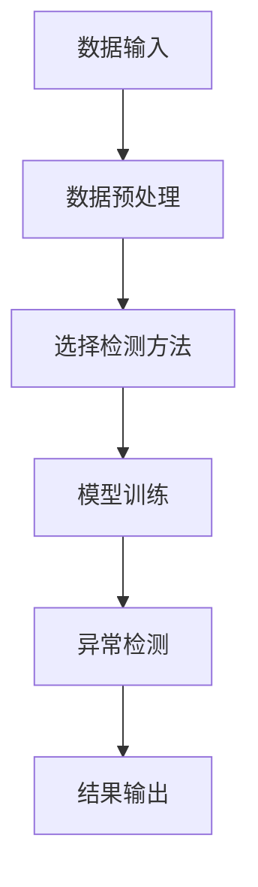
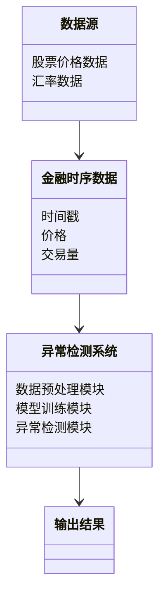
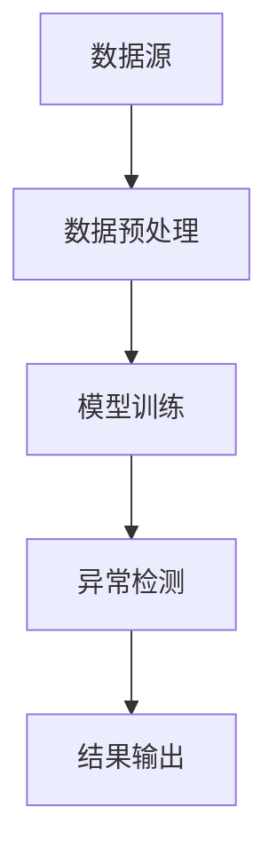

                 


# 金融时序数据异常检测的AI方法

> **关键词**：金融时序数据、异常检测、AI方法、时间序列、机器学习、深度学习

> **摘要**：  
本文系统地探讨了金融时序数据异常检测的AI方法，从背景介绍到核心概念，从算法原理到系统架构，从项目实战到最佳实践，全面剖析了金融时序数据异常检测的技术要点。文章结合理论与实践，深入分析了统计方法、机器学习方法和深度学习方法在金融时序数据异常检测中的应用，同时通过Mermaid图、数学公式和Python代码展示了具体实现细节，为读者提供了一套完整的金融时序数据异常检测解决方案。

---

# 第一部分: 金融时序数据异常检测的背景与核心概念

## 第1章: 金融时序数据与异常检测概述

### 1.1 金融时序数据的定义与特点
#### 1.1.1 金融时序数据的定义  
金融时序数据是指在金融领域中按时间顺序记录的数值型数据，例如股票价格、汇率、交易量等。这些数据通常具有连续性和时序性，能够反映金融市场的动态变化。

#### 1.1.2 金融时序数据的特点  
- **连续性**：数据按时间顺序排列，通常以固定的时间间隔记录（如分钟、小时、天）。
- **波动性**：金融数据往往波动较大，受市场情绪、经济指标等多种因素影响。
- **关联性**：不同金融资产之间存在复杂的关联关系，例如股票价格与宏观经济指标的相关性。
- **周期性**：金融数据通常具有周期性特征，例如季节性波动、周期性波动等。

#### 1.1.3 金融时序数据的应用场景  
- 股票价格预测
- 汇率预测
- 交易量分析
- 风险管理
- 异常交易检测

---

### 1.2 异常检测的定义与重要性
#### 1.2.1 异常检测的定义  
异常检测是指通过分析数据，识别出与正常数据模式不符的异常数据点或数据序列。在金融领域，异常检测可以帮助发现市场操纵、欺诈交易、突发事件等。

#### 1.2.2 异常检测在金融领域的应用  
- 识别异常交易行为
- 发现潜在的市场风险
- 监测系统性风险
- 支持投资决策

#### 1.2.3 异常检测的重要性与挑战  
- **重要性**：及时发现异常数据有助于防范金融风险，维护市场稳定。
- **挑战**：  
  - 数据噪声大，异常点占比低。  
  - 数据具有高度波动性，难以找到统一的异常检测模型。  
  - 异常类型多样，包括单点异常、趋势异常、分布异常等。

---

### 1.3 传统异常检测方法的局限性
#### 1.3.1 基于统计的方法  
- **均值与标准差法**：通过计算数据的均值和标准差，判断数据点是否偏离均值超过一定倍数的标准差。  
  $$ z = \frac{x - \mu}{\sigma} $$  
  其中，$\mu$ 是均值，$\sigma$ 是标准差，$z$ 是标准化的分数。  
  - 优点：简单易实现。  
  - 缺点：难以应对数据分布的变化，且对异常点敏感。

- **经验分布法**：通过经验分布函数计算数据点的累积概率，判断其是否落在极值区域。  
  $$ P(X \leq x) = \frac{k}{n} $$  
  其中，$k$ 是小于等于$x$的观测数，$n$ 是总样本数。  
  - 优点：适用于小样本数据。  
  - 缺点：对异常点的检测不够敏感。

- **马尔可夫链法**：通过马尔可夫链模型预测未来状态，判断当前状态是否偏离预期。  
  - 优点：适合处理时间序列数据。  
  - 缺点：需要假设状态转移概率矩阵，实际应用中难以准确建模。

#### 1.3.2 基于规则的方法  
- **阈值法**：设定一个阈值，当数据点超过阈值时标记为异常。  
  $$ \text{异常} = 1 \text{ if } x > \text{threshold} \text{ else } 0 $$  
  - 优点：简单直观。  
  - 缺点：难以应对复杂多变的金融数据。

#### 1.3.3 传统方法的局限性与不足  
- 数据分布变化难以捕捉。  
- 对异常点的定义不够灵活。  
- 无法处理复杂的时序关系。  

---

## 第2章: 异常检测的核心概念与联系

### 2.1 异常检测的核心原理
#### 2.1.1 异常检测的基本原理  
异常检测的核心在于识别数据中偏离正常模式的点。在金融时序数据中，正常模式通常由统计分布、时间序列模型或机器学习模型描述，而异常点则是在这些模式之外的点。

#### 2.1.2 异常检测的分类  
- **基于统计的方法**：利用统计学原理检测异常点，如均值-标准差法、经验分布法等。  
- **基于机器学习的方法**：利用监督学习或无监督学习算法，如支持向量机（SVM）、随机森林（Random Forest）等。  
- **基于深度学习的方法**：利用神经网络模型，如循环神经网络（RNN）、长短期记忆网络（LSTM）等。  

#### 2.1.3 异常检测的关键指标  
- **准确率（Accuracy）**：正确分类的样本数与总样本数的比值。  
- **召回率（Recall）**：真实异常点中被正确识别的比例。  
- **F1分数（F1 Score）**：准确率和召回率的调和平均值。  

---

### 2.2 异常检测的核心概念对比
#### 2.2.1 统计方法与机器学习方法的对比  
| 对比维度       | 统计方法                     | 机器学习方法               |
|----------------|-----------------------------|-----------------------------|
| 假设           | 数据分布已知                 | 数据分布未知               |
| 灵活性         | 较低                        | 较高                        |
| 适用场景       | 数据分布稳定                | 数据分布变化较大            |
| 实现难度       | 较低                        | 较高                        |

#### 2.2.2 监督学习与无监督学习的对比  
| 对比维度       | 监督学习                     | 无监督学习               |
|----------------|-----------------------------|-----------------------------|
| 标签需求       | 需要标签数据                 | 不需要标签数据             |
| 模型复杂性     | 较低                        | 较高                        |
| 适用场景       | 知道异常点标签               | 未知异常点标签             |

#### 2.2.3 基于时间序列的异常检测方法  
时间序列异常检测的核心在于建模时序关系，常用的模型包括ARIMA、LSTM、GRU等。这些模型能够捕捉时序数据中的趋势、周期性和季节性特征。

---

### 2.3 实体关系图与流程图
#### 2.3.1 实体关系图（ER图）  
```mermaid
erd
  金融机构 --|{拥有}| 交易数据
  交易数据 --|{包含}| 时间戳, 价格, 交易量
  异常检测系统 --|{使用}| 统计方法, 机器学习方法, 深度学习方法
  异常检测系统 --|{输出}| 异常点报告
```

#### 2.3.2 异常检测流程图  


---

## 第3章: 异常检测算法原理与数学模型

### 3.1 统计方法与异常检测
#### 3.1.1 基于均值与标准差的异常检测  
- **数学公式**  
  $$ z = \frac{x - \mu}{\sigma} $$  
  其中，$\mu$ 是数据集的均值，$\sigma$ 是标准差，$z$ 是标准化分数。  
  - 当 $|z| > 3$ 时，认为数据点 $x$ 是异常点。  

- **代码实现**  
  ```python
  def detect_anomalies_stats(data, threshold=3):
      mu = np.mean(data)
      sigma = np.std(data)
      anomalies = []
      for x in data:
          if abs((x - mu) / sigma) > threshold:
              anomalies.append(x)
      return anomalies
  ```

---

### 3.2 机器学习方法与异常检测
#### 3.2.1 基于支持向量机（SVM）的异常检测  
- **数学公式**  
  SVM通过最大化分类边界来区分正常点和异常点。异常点通常位于支持向量之外。  
  $$ \text{损失函数} = \sum_{i=1}^{n} \xi_i + \frac{1}{2} C \sum_{i=1}^{n} \xi_i^2 $$  

- **代码实现**  
  ```python
  from sklearn.svm import OneClassSVM

  def detect_anomalies_svm(data, nu=0.1):
      model = OneClassSVM(nu=nu)
      model.fit(data)
      anomalies = []
      for i, x in enumerate(data):
          if model.predict(x.reshape(1, -1)) == -1:
              anomalies.append(i)
      return anomalies
  ```

---

### 3.3 深度学习方法与异常检测
#### 3.3.1 基于LSTM的异常检测  
- **数学公式**  
  LSTM通过长短期记忆单元捕捉时序数据中的长程依赖关系。模型结构如下：  
  $$ f_t = \sigma(W_f \cdot [h_{t-1}, x_t]) $$  
  $$ i_t = \sigma(W_i \cdot [h_{t-1}, x_t]) $$  
  $$ o_t = \sigma(W_o \cdot [h_{t-1}, x_t]) $$  
  $$ h_t = f_t \cdot c_t + i_t \cdot x_t $$  

- **代码实现**  
  ```python
  import tensorflow as tf
  from tensorflow.keras import layers

  def build_lstm_model(input_shape):
      model = tf.keras.Sequential()
      model.add(layers.LSTM(64, return_sequences=True, input_shape=input_shape))
      model.add(layers.LSTM(32, return_sequences=False))
      model.add(layers.Dense(1, activation='sigmoid'))
      model.compile(loss='binary_crossentropy', optimizer='adam', metrics=['accuracy'])
      return model
  ```

---

## 第4章: 系统分析与架构设计

### 4.1 问题场景介绍  
我们以股票价格监控系统为例，设计一个基于AI的异常检测系统。系统需要实时监控股票价格，识别异常波动，并发出预警。

---

### 4.2 系统功能设计  
#### 4.2.1 领域模型  


---

### 4.3 系统架构设计  


---

## 第5章: 项目实战

### 5.1 环境安装  
- Python 3.8+
- NumPy、Pandas、Scikit-learn、Keras、TensorFlow

---

### 5.2 核心实现代码  
#### 5.2.1 数据预处理  
```python
import pandas as pd
import numpy as np

def preprocess_data(data_path):
    df = pd.read_csv(data_path)
    df['时间戳'] = pd.to_datetime(df['时间戳'])
    df.set_index('时间戳', inplace=True)
    return df
```

#### 5.2.2 模型训练  
```python
def train_model(data, model_type='lstm'):
    if model_type == 'lstm':
        # LSTM模型训练代码
        pass
    elif model_type == 'svm':
        # SVM模型训练代码
        pass
```

---

## 第6章: 最佳实践与总结

### 6.1 最佳实践  
- **数据预处理**：时序数据需要进行标准化或归一化处理，尤其是不同资产之间的数据。  
- **模型选择**：根据数据特征选择合适的模型，例如，对于复杂时序关系，优先选择LSTM模型。  
- **模型调参**：通过网格搜索优化模型参数，提升检测准确率。  

---

## 第7章: 作者信息

作者：AI天才研究院/AI Genius Institute & 禅与计算机程序设计艺术 /Zen And The Art of Computer Programming

