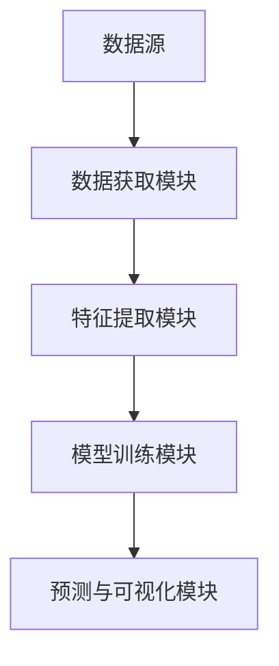
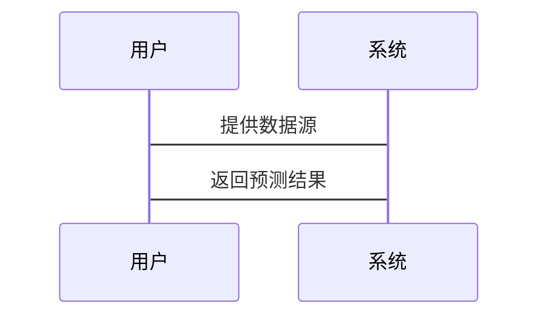

                 


# 《金融时序数据的多尺度分析与预测研究》

> **关键词**：金融时序数据，多尺度分析，时间序列预测，小波分析，LSTM，ARIMA

> **摘要**：  
本文深入探讨了金融时序数据的多尺度分析与预测研究，从金融数据的特点出发，结合多尺度分析的方法，系统性地分析了时间序列预测的核心算法与实现。文章首先介绍了金融数据的特性与挑战，详细阐述了多尺度分析的背景与意义。随后，从算法原理、数学模型、系统架构等多个维度，全面解析了金融时序数据的预测方法。最后，通过实际案例展示了多尺度分析在金融预测中的应用，并总结了研究的成果与展望。

---

## 第1章：金融数据的特点与挑战

### 1.1 金融数据的特性
金融数据具有以下显著特点：
- **高频性**：金融市场数据通常以分钟、秒甚至更短的时间间隔生成。
- **非线性**：金融市场的波动往往遵循非线性规律，难以用简单的线性模型描述。
- **不可预测性**：市场的随机性和不确定性使得预测具有挑战性。
- **异常值**：金融市场中经常出现极端事件（如“黑天鹅”事件），对模型的鲁棒性提出更高要求。

### 1.2 时序数据分析的重要性
时序数据分析在金融领域具有重要意义：
- **市场趋势分析**：通过分析历史数据，识别市场趋势和周期性规律。
- **风险管理**：利用时序数据预测波动性，帮助投资者规避风险。
- **投资决策支持**：基于时序数据的分析结果，为投资决策提供支持。

### 1.3 多尺度分析的必要性
金融市场的复杂性要求我们从多个时间尺度（如短期、中期、长期）进行分析：
- **多层次结构**：市场的微观结构（如订单簿）和宏观结构（如指数走势）需要不同时间尺度的分析。
- **模式识别**：不同时间尺度下可能存在不同的模式（如短期波动、中期趋势、长期周期）。

---

## 第2章：多尺度分析的方法

### 2.1 常见的多尺度分析方法

#### 2.1.1 小波分析
- **定义**：小波分析是一种多分辨率分析方法，能够在不同尺度上分解信号。
- **实现步骤**：
  1. 对信号进行小波变换，得到不同尺度的分解系数。
  2. 分析各个尺度上的系数，识别模式和特征。
  3. 反变换重构信号，保留感兴趣的信息。

#### 2.1.2 多重分形分析
- **定义**：多重分形分析用于研究数据的分形特性，捕捉数据的复杂性和不均匀性。
- **实现步骤**：
  1. 计算数据的分形维数。
  2. 分析数据在不同尺度下的分形特性。

#### 2.1.3 时间序列分解方法
- **定义**：时间序列分解方法（如ARIMA、LSTM）可以用于提取不同尺度的特征。

### 2.2 多尺度分析的实现步骤

#### 2.2.1 数据预处理
- **数据清洗**：去除异常值、填补缺失值。
- **数据标准化**：将数据归一化，便于模型训练。

#### 2.2.2 数据分解与重构
- **分解**：将数据分解为多个时间尺度的子序列。
- **重构**：根据分解结果，识别和提取关键特征。

---

## 第3章：金融时序数据的预测模型

### 3.1 常见的金融时序预测模型

#### 3.1.1 ARIMA模型
- **定义**：ARIMA（自回归积分滑动平均模型）是一种经典的时序预测模型。
- **数学公式**：
  $$ ARIMA(p, d, q) $$
  其中，p为自回归阶数，d为差分阶数，q为滑动平均阶数。
- **实现步骤**：
  1. 确定模型参数p、d、q。
  2. 用历史数据训练模型。
  3. 进行预测并评估模型性能。

#### 3.1.2 LSTM模型
- **定义**：LSTM（长短期记忆网络）是一种基于循环神经网络的深度学习模型。
- **数学公式**：
  $$ f_t = \sigma(W_f [h_{t-1}, x_t]) $$
  $$ i_t = \sigma(W_i [h_{t-1}, x_t]) $$
  $$ o_t = \sigma(W_o [h_{t-1}, x_t]) $$
  $$ h_t = f_t \cdot c_t + i_t \cdot c_{t-1} $$
  $$ c_t = o_t \cdot h_t $$
- **实现步骤**：
  1. 构建LSTM网络。
  2. 用历史数据训练模型。
  3. 进行预测并评估模型性能。

#### 3.1.3 小波神经网络
- **定义**：小波神经网络结合了小波分析和神经网络的优势，能够捕捉数据的多尺度特征。
- **实现步骤**：
  1. 对数据进行小波变换，提取多尺度特征。
  2. 将特征输入神经网络进行训练。
  3. 进行预测并评估模型性能。

### 3.2 多尺度预测模型的构建

#### 3.2.1 多尺度特征提取
- **方法**：从不同时间尺度提取特征，如短期波动、中期趋势和长期周期。
- **实现步骤**：
  1. 对数据进行多尺度分解。
  2. 提取各个尺度下的特征。

#### 3.2.2 多模型集成预测
- **方法**：将多个预测模型的输出进行集成，提高预测精度。
- **实现步骤**：
  1. 训练多个预测模型。
  2. 对模型输出进行加权融合。
  3. 进行预测并评估模型性能。

---

## 第4章：金融时序数据的系统架构设计

### 4.1 问题场景介绍
- **目标**：构建一个金融时序数据的多尺度分析与预测系统。
- **需求**：支持多种时间尺度的分析与预测，能够处理高频金融数据。

### 4.2 系统功能设计

#### 4.2.1 数据获取模块
- **功能**：从金融数据源获取时序数据。
- **流程**：
  1. 确定数据源（如股票市场、外汇市场）。
  2. 获取数据并进行预处理。

#### 4.2.2 特征提取模块
- **功能**：从数据中提取多尺度特征。
- **流程**：
  1. 对数据进行小波变换，提取多尺度特征。
  2. 对特征进行标准化处理。

#### 4.2.3 模型训练模块
- **功能**：训练预测模型。
- **流程**：
  1. 选择预测模型（如ARIMA、LSTM）。
  2. 用训练数据训练模型。

#### 4.2.4 预测与可视化模块
- **功能**：进行预测并可视化结果。
- **流程**：
  1. 用测试数据进行预测。
  2. 可视化预测结果与实际值的对比。

### 4.3 系统架构设计

#### 4.3.1 系统架构图


#### 4.3.2 系统交互图


---

## 第5章：项目实战

### 5.1 环境安装
- **工具**：Python、NumPy、Pandas、Scikit-learn、Keras、Matplotlib。

### 5.2 核心实现源代码

#### 5.2.1 数据获取与预处理
```python
import pandas as pd
import numpy as np

# 获取数据
data = pd.read_csv('financial_data.csv')

# 数据预处理
data = data.dropna()
data = (data - data.mean()) / data.std()  # 标准化
```

#### 5.2.2 小波分析实现
```python
import pywt

# 小波分解
coeffs = pywt.wavedec(data, 'db5', level=5)
```

#### 5.2.3 LSTM模型实现
```python
from keras.models import Sequential
from keras.layers import LSTM, Dense

# 构建LSTM模型
model = Sequential()
model.add(LSTM(50, input_shape=(timesteps, features)))
model.add(Dense(1))
model.compile(optimizer='adam', loss='mean_squared_error')
```

#### 5.2.4 预测与可视化
```python
# 进行预测
predictions = model.predict(test_data)

# 可视化
plt.plot(actual_prices, color='blue', label='Actual Price')
plt.plot(predictions, color='red', label='Predicted Price')
plt.legend()
plt.show()
```

### 5.3 实际案例分析
- **案例**：股票价格预测。
- **分析**：通过多尺度分析，识别股票价格的短期波动和长期趋势。

---

## 第6章：总结与展望

### 6.1 总结
- 本文系统性地探讨了金融时序数据的多尺度分析与预测方法。
- 通过理论分析与实际案例，展示了多尺度分析在金融预测中的应用。

### 6.2 展望
- **未来方向**：研究更高效的多尺度分析算法，结合深度学习技术提升预测精度。
- **应用前景**：多尺度分析在金融风险管理、投资决策等领域具有广阔的应用前景。

### 6.3 最佳实践 Tips
- 数据质量是预测模型的基础，需重视数据清洗与预处理。
- 模型选择需结合实际问题和数据特性，避免盲目追求复杂模型。
- 预测结果需结合市场实际情况进行解读，避免过度依赖模型。

---

**作者**：AI天才研究院/AI Genius Institute & 禅与计算机程序设计艺术 /Zen And The Art of Computer Programming

