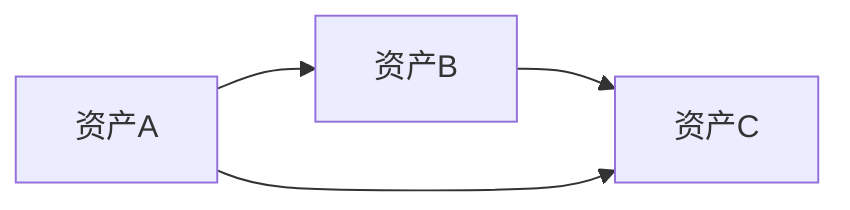
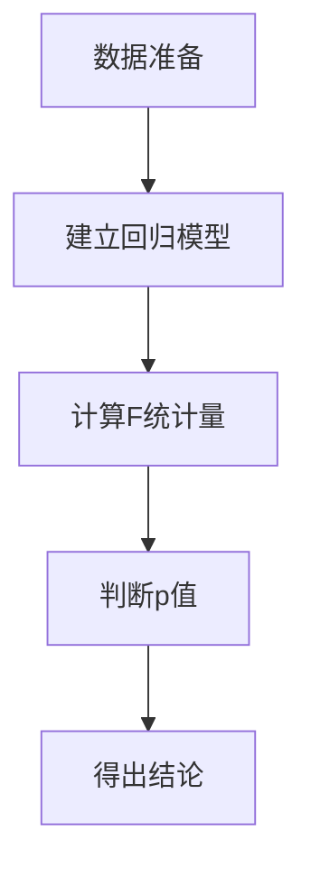
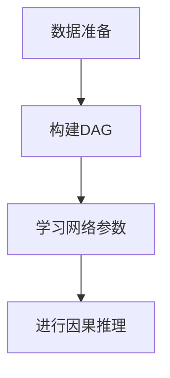
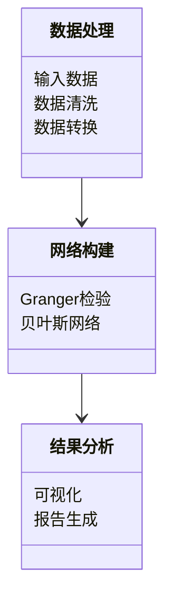
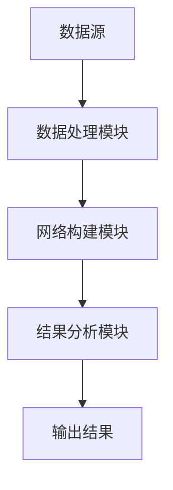
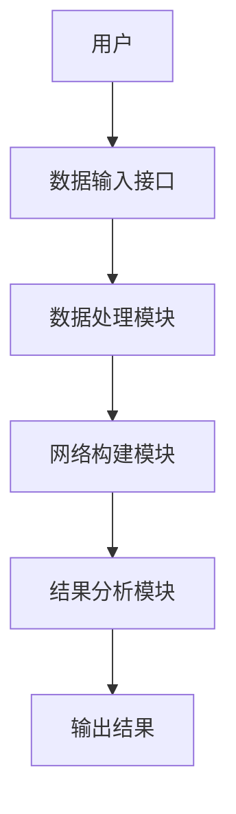

                 


# 金融时间序列因果关系网络分析

> 关键词：金融时间序列，因果关系网络，Granger因果检验，贝叶斯网络，金融数据分析

> 摘要：本文探讨金融时间序列数据中的因果关系网络分析，介绍了Granger因果检验和贝叶斯网络等方法，展示了如何通过这些方法分析和建模金融时间序列数据，揭示变量之间的因果关系，并通过实际案例分析，展示了这些方法在金融数据分析中的应用和价值。

---

# 第1章 金融时间序列因果关系网络分析的背景与概念

## 1.1 问题背景与问题描述

### 1.1.1 金融时间序列分析的背景
金融时间序列分析是金融学和计量经济学中的重要研究领域，通过对历史价格、收益率、成交量等数据的分析，揭示金融市场的规律和趋势。然而，传统的统计分析往往局限于相关性分析，无法直接揭示变量之间的因果关系。

### 1.1.2 因果关系网络分析的定义
因果关系网络分析是一种通过构建有向图来描述变量之间因果关系的方法。在金融领域，因果关系网络可以用于分析不同资产、市场指数或经济指标之间的因果关系，帮助理解市场的传递机制和风险传播路径。

### 1.1.3 金融时间序列因果关系网络的核心问题
金融时间序列因果关系网络的核心问题是通过统计方法和算法，从时间序列数据中识别和量化变量之间的因果关系。这包括确定因果方向、因果强度以及因果关系的动态变化。

## 1.2 问题解决与边界

### 1.2.1 金融时间序列因果关系网络的解决思路
通过引入Granger因果检验和贝叶斯网络等方法，结合时间序列数据的特性，构建因果关系网络模型，量化变量之间的因果关系。

### 1.2.2 问题的边界与外延
- 数据范围：限于时间序列数据，不考虑截面数据。
- 分析范围：限于变量之间的因果关系，不考虑复杂的非线性关系。
- 时间范围：限于历史数据，不考虑实时预测。

### 1.2.3 核心概念与要素组成
- 变量：金融资产价格、收益率、市场指数等。
- 因果关系：变量之间的因果关系方向和强度。
- 网络结构：变量之间的因果关系网络图。

## 1.3 本章小结

### 1.3.1 核心概念回顾
- 金融时间序列分析：研究金融市场的时间序列数据。
- 因果关系网络：通过有向图描述变量之间的因果关系。

### 1.3.2 问题解决框架总结
通过因果关系网络分析，揭示金融时间序列数据中变量之间的因果关系，帮助理解金融市场机制。

### 1.3.3 下文铺垫
下一章将详细探讨因果关系网络的基本概念和属性，包括因果关系网络的定义、属性以及与其他相关概念的对比。

---

# 第2章 因果关系网络的基本概念与属性

## 2.1 因果关系网络的定义与属性

### 2.1.1 因果关系网络的定义
因果关系网络是一种通过有向图描述变量之间因果关系的模型，节点代表变量，边代表因果关系的方向和强度。

### 2.1.2 因果关系网络的属性特征
| 属性 | 描述 |
|------|------|
| 有向性 | 边的方向表示因果关系的方向 |
| 权重 | 边的权重表示因果关系的强度 |
| 连通性 | 网络中节点的连接程度 |
| 动态性 | 因果关系可能随时间变化而变化 |

### 2.1.3 与其他相关概念的对比分析
- **相关关系**：衡量变量之间的相关性，不考虑因果方向。
- **因果关系**：明确变量之间的因果方向和强度。
- **依赖关系**：描述变量之间的依赖关系，不明确因果方向。

## 2.2 因果关系网络的实体关系图

### 2.2.1 ER实体关系图的构建
使用Mermaid绘制因果关系网络的实体关系图，展示变量之间的因果关系。

```mermaid
graph LR
    A[资产A] -> B[资产B]
    B -> C[资产C]
    A -> C
```

### 2.2.2 用Mermaid绘制的因果关系网络架构图


## 2.3 本章小结

### 2.3.1 核心概念回顾
- 因果关系网络：通过有向图描述变量之间的因果关系。
- 属性特征：有向性、权重、连通性和动态性。

### 2.3.2 问题解决框架总结
通过因果关系网络的实体关系图，可以清晰地展示变量之间的因果关系。

### 2.3.3 下文铺垫
下一章将详细探讨金融时间序列因果关系网络的算法原理，包括Granger因果检验和贝叶斯网络的实现。

---

# 第3章 金融时间序列因果关系网络的算法原理

## 3.1 Granger因果检验

### 3.1.1 Granger因果检验的定义
Granger因果检验是一种统计方法，用于检验一个时间序列是否是另一个时间序列的“原因”。其基本思想是，如果时间序列X可以预测时间序列Y，则X是Y的Granger原因。

### 3.1.2 Granger因果检验的算法流程
1. 对控制变量进行回归，得到残差序列。
2. 对残差序列进行F检验，计算F统计量和对应的p值。
3. 如果p值小于显著性水平，则拒绝原假设，认为X是Y的Granger原因。

### 3.1.3 Granger因果检验的数学模型
考虑两个时间序列X和Y，Granger因果检验的回归模型为：
$$
Y_t = \alpha + \beta X_t + \gamma Y_{t-1} + \epsilon_t
$$
$$
X_t = \alpha + \beta Y_t + \gamma X_{t-1} + \epsilon_t
$$

### 3.1.4 Granger因果检验的Mermaid流程图


### 3.1.5 Python实现代码示例
```python
import statsmodels.api as sm

def granger_test(x, y, max_lag=1):
    model = sm.tsa.GrangerTest(x, y, max_lag=max_lag)
    results = model.fit()
    return results.pvalues['F']
```

## 3.2 贝叶斯网络

### 3.2.1 贝叶斯网络的定义
贝叶斯网络是一种基于概率论的图形化模型，通过有向无环图（DAG）描述变量之间的条件概率关系。

### 3.2.2 贝叶斯网络的算法流程
1. 确定变量之间的依赖关系。
2. 构建贝叶斯网络的结构，即DAG。
3. 学习网络参数，计算变量之间的条件概率。
4. 使用贝叶斯推理进行因果关系分析。

### 3.2.3 贝叶斯网络的数学模型
贝叶斯网络的概率分布表示为：
$$
P(X_1, X_2, ..., X_n) = \prod_{i=1}^n P(X_i | \text{Parents}(X_i))
$$
其中，$\text{Parents}(X_i)$表示$X_i$的父节点。

### 3.2.4 贝叶斯网络的Mermaid流程图


### 3.2.5 Python实现代码示例
```python
from pgmpy.models import BayesianNetwork
from pgmpy.estimators import MaximumLikelihoodEstimator

model = BayesianNetwork(dag)
estimator = MaximumLikelihoodEstimator(model)
estimator.estimate_parameters(data)
```

## 3.3 本章小结

### 3.3.1 核心概念回顾
- Granger因果检验：基于回归分析检验因果关系。
- 贝叶斯网络：基于概率论的图形化模型，描述变量之间的条件概率关系。

### 3.3.2 问题解决框架总结
通过Granger因果检验和贝叶斯网络，可以有效地识别和量化变量之间的因果关系。

### 3.3.3 下文铺垫
下一章将详细探讨这些算法的数学模型和公式，帮助读者更好地理解其背后的理论基础。

---

# 第4章 金融时间序列因果关系网络的数学模型

## 4.1 Granger因果检验的数学模型

### 4.1.1 Granger因果检验的F检验统计量
Granger因果检验的F统计量为：
$$
F = \frac{(SSE_1 - SSE_2)/(k_1 - k_2)}{SSE_2/(n - k_1 - 1)}
$$
其中，$SSE_1$和$SSE_2$分别为包含和不包含变量的残差平方和，$k_1$和$k_2$分别为回归模型的参数个数。

### 4.1.2 Granger因果检验的p值计算
Granger因果检验的p值是F统计量在F分布下的概率值：
$$
p = P(F_{k_1 - k_2, n - k_1 - 1} \geq F)
$$

### 4.1.3 Granger因果检验的公式推导
通过推导F统计量的公式，可以证明Granger因果检验的F统计量服从自由度为$(k_1 - k_2, n - k_1 - 1)$的F分布。

## 4.2 贝叶斯网络的数学模型

### 4.2.1 贝叶斯网络的概率分布
贝叶斯网络的概率分布表示为：
$$
P(X_1, X_2, ..., X_n) = \prod_{i=1}^n P(X_i | \text{Parents}(X_i))
$$

### 4.2.2 贝叶斯网络的条件概率计算
条件概率$P(X_i | \text{Parents}(X_i))$可以通过最大似然估计或贝叶斯估计进行计算。

### 4.2.3 贝叶斯网络的公式推导
通过推导条件概率公式，可以证明贝叶斯网络的概率分布是正确的。

## 4.3 本章小结

### 4.3.1 核心概念回顾
- Granger因果检验：基于F检验统计量和p值判断因果关系。
- 贝叶斯网络：基于概率论的条件概率模型，描述变量之间的因果关系。

### 4.3.2 问题解决框架总结
通过数学模型的推导，可以更好地理解Granger因果检验和贝叶斯网络的理论基础。

### 4.3.3 下文铺垫
下一章将详细探讨金融时间序列因果关系网络的系统分析与架构设计，包括系统功能设计、架构设计等内容。

---

# 第5章 金融时间序列因果关系网络的系统分析与架构设计

## 5.1 系统功能设计

### 5.1.1 领域模型
使用Mermaid绘制领域模型类图，展示系统的功能模块。



### 5.1.2 系统架构设计
使用Mermaid绘制系统架构图，展示系统的整体架构。



## 5.2 系统接口设计

### 5.2.1 系统接口设计
系统接口包括数据输入接口、网络构建接口和结果输出接口。

### 5.2.2 系统交互流程图
使用Mermaid绘制系统交互流程图，展示系统的运行流程。



## 5.3 系统实现与测试

### 5.3.1 系统实现
系统实现包括数据处理、网络构建和结果分析三个模块。

### 5.3.2 系统测试
系统测试包括单元测试、集成测试和性能测试。

## 5.4 本章小结

### 5.4.1 核心概念回顾
- 系统功能设计：包括数据处理、网络构建和结果分析。
- 系统架构设计：模块化设计，确保系统的可扩展性和可维护性。

### 5.4.2 问题解决框架总结
通过系统分析与架构设计，可以更好地理解金融时间序列因果关系网络的实现过程。

### 5.4.3 下文铺垫
下一章将详细探讨金融时间序列因果关系网络的项目实战，包括环境安装、数据处理、模型训练和结果分析等内容。

---

# 第6章 金融时间序列因果关系网络的项目实战

## 6.1 环境安装

### 6.1.1 环境需求
- Python 3.8及以上
- NumPy、Pandas、statsmodels、pgmpy等库

### 6.1.2 安装依赖
```bash
pip install numpy pandas statsmodels pgmpy
```

## 6.2 数据处理

### 6.2.1 数据获取
从金融数据源获取时间序列数据，例如股票价格、指数收益率等。

### 6.2.2 数据清洗
处理缺失值、异常值等数据问题。

## 6.3 模型训练

### 6.3.1 Granger因果检验
使用statsmodels库进行Granger因果检验。

```python
from statsmodels.tsa.stattools import grangercausalitytests

x = data['资产A']
y = data['资产B']
grangercausalitytests(x, y, max_lag=1)
```

### 6.3.2 贝叶斯网络
使用pgmpy库构建贝叶斯网络。

```python
from pgmpy.models import BayesianNetwork
from pgmpy.estimators import MaximumLikelihoodEstimator

model = BayesianNetwork(dag)
estimator = MaximumLikelihoodEstimator(model)
estimator.estimate_parameters(data)
```

## 6.4 结果分析

### 6.4.1 可视化
使用Matplotlib或Seaborn库进行网络可视化。

### 6.4.2 结果解读
分析因果关系网络的结构和权重，解释变量之间的因果关系。

## 6.5 本章小结

### 6.5.1 核心概念回顾
- 环境安装：安装必要的Python库。
- 数据处理：数据获取、清洗和预处理。
- 模型训练：Granger因果检验和贝叶斯网络的实现。
- 结果分析：可视化和结果解读。

### 6.5.2 问题解决框架总结
通过项目实战，读者可以掌握金融时间序列因果关系网络的实现过程。

### 6.5.3 下文铺垫
下一章将总结全文，并展望未来的研究方向。

---

# 第7章 总结与展望

## 7.1 总结

### 7.1.1 核心内容回顾
- 金融时间序列因果关系网络分析的核心概念和方法。
- Granger因果检验和贝叶斯网络的实现过程。
- 系统分析与架构设计的要点。

### 7.1.2 研究的局限性
- 数据的局限性：Granger因果检验假设线性关系，可能无法捕捉复杂的非线性关系。
- 计算的复杂性：贝叶斯网络的计算复杂度较高，适用于小规模数据。

## 7.2 未来的研究方向

### 7.2.1 研究方向
- 引入非线性因果关系模型，如深度学习方法。
- 研究动态因果关系网络，捕捉因果关系的时变性。

### 7.2.2 挑战与机遇
- 挑战：数据的复杂性、模型的可解释性。
- 机遇：人工智能和大数据技术的发展为金融时间序列因果关系网络分析提供了新的工具和方法。

## 7.3 本章小结

### 7.3.1 核心概念回顾
- 金融时间序列因果关系网络分析的核心内容。
- 研究的局限性和未来的研究方向。

### 7.3.2 问题解决框架总结
通过总结全文，读者可以全面理解金融时间序列因果关系网络分析的理论和实践。

### 7.3.3 下文铺垫
本文到此结束，感谢读者的阅读。

---

# 作者

作者：AI天才研究院/AI Genius Institute  
联系邮箱：contact@aising genius.com  
个人简介：致力于人工智能与金融交叉领域的研究与实践，专注于时间序列分析、因果关系网络和金融风险管理。

