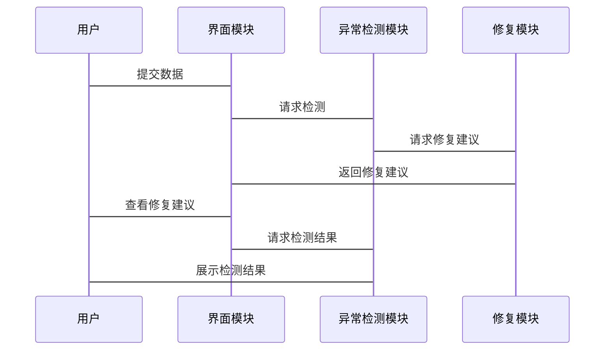

                 


```markdown
# 金融时间序列异常检测与修复系统

> 关键词：金融时间序列，异常检测，修复系统，机器学习，深度学习，系统架构

> 摘要：本文详细探讨了金融时间序列异常检测与修复系统的设计与实现。首先介绍了金融时间序列的基本概念和异常检测的重要性，然后从数学模型、算法原理、系统架构等多个维度进行了深入分析。通过对比不同异常检测算法的优缺点，提出了基于机器学习和深度学习的解决方案，并结合实际案例展示了系统的实现过程。最后总结了系统的设计经验与未来发展方向。

---

# 第一部分：金融时间序列异常检测与修复系统概述

# 第1章：引言

## 1.1 问题背景
金融市场的数据通常以时间序列表示，例如股票价格、交易量和市场指数等。这些数据的波动性和复杂性使得异常检测成为一个具有挑战性的任务。异常数据可能导致严重的经济损失，例如欺诈交易、市场操纵和风险管理失误。因此，设计一个高效的金融时间序列异常检测与修复系统至关重要。

## 1.2 问题描述
时间序列异常检测的核心目标是识别偏离正常模式的数据点或子序列。修复系统则需要根据检测到的异常情况，提出合理的修复建议或自动修复策略。本文将从算法选择、系统架构和实际应用三个维度展开讨论。

## 1.3 研究意义
通过异常检测和修复系统，金融机构可以有效降低风险，提高交易效率和决策准确性。本文提出的方法结合了传统统计方法和现代机器学习技术，具有较高的实用价值。

---

# 第2章：金融时间序列数据的特性

## 2.1 时间序列数据的特点
时间序列数据具有以下特点：
1. **有序性**：数据按时间顺序排列。
2. **趋势性**：数据可能呈现上升或下降的趋势。
3. **周期性**：数据可能受到季节性或周期性因素的影响。
4. **随机性**：数据中可能包含随机噪声。

## 2.2 金融时间序列的应用场景
- 股票价格预测
- 交易量分析
- 市场风险评估
- 欺诈检测

## 2.3 异常检测的定义与分类
### 2.3.1 基于统计的异常检测
使用统计方法（如Z-score、标准差）检测偏离均值的异常值。

### 2.3.2 基于机器学习的异常检测
利用监督或无监督学习算法（如随机森林、神经网络）识别异常模式。

### 2.3.3 基于深度学习的异常检测
使用循环神经网络（RNN）、长短期记忆网络（LSTM）等深度学习模型捕捉复杂的时间序列模式。

## 2.4 修复系统的目标
修复系统的目标包括：
1. 自动识别异常数据。
2. 提供修复建议或自动修复策略。
3. 保持数据的连续性和完整性。

## 2.5 系统的边界与外延
系统边界包括数据输入、异常检测和修复建议生成。外延部分涉及数据存储、用户界面和修复后的数据验证。

---

# 第3章：时间序列分析的数学模型

## 3.1 自回归模型（ARIMA）
ARIMA模型适用于非平稳时间序列数据的预测。模型由以下三个参数组成：
- **p**：自回归阶数
- **d**：差分阶数
- **q**：移动平均阶数

### 3.1.1 ARIMA模型的数学公式
$$ ARIMA(p, d, q) = y_t - \phi_1 y_{t-1} - \phi_2 y_{t-2} - \dots - \phi_p y_{t-p} = \theta_1 \epsilon_{t-1} + \theta_2 \epsilon_{t-2} + \dots + \theta_q \epsilon_{t-q} + \epsilon_t $$

### 3.1.2 ARIMA模型的优缺点
- **优点**：适合处理具有趋势和季节性的数据。
- **缺点**：对异常值敏感，需要先进行数据预处理。

## 3.2 广义自回归条件异方差模型（GARCH）
GARCH模型用于估计时间序列的波动性，特别适用于金融时间序列的 volatility 建模。

### 3.2.1 GARCH模型的数学公式
$$ GARCH(p, q)： ARCH_p(\epsilon_t) = \alpha_0 + \alpha_1 \epsilon_{t-1}^2 + \dots + \alpha_p \epsilon_{t-p}^2 $$

### 3.2.2 GARCH模型的应用场景
- 金融市场的波动性分析
- 风险管理

### 3.2.3 GARCH模型的优缺点
- **优点**：能够捕捉到金融时间序列中的波动性。
- **缺点**：模型参数较多，计算复杂。

## 3.3 时间序列分解模型
时间序列分解模型将数据分解为趋势、季节性和随机性三部分。

### 3.3.1 加性模型（Additive Model）
$$ Y_t = T_t + S_t + R_t $$

### 3.3.2 乘性模型（Multiplicative Model）
$$ Y_t = T_t \times S_t \times R_t $$

---

# 第4章：异常检测的核心原理

## 4.1 基于统计的方法
### 4.1.1 Z-score方法
$$ Z = \frac{x - \mu}{\sigma} $$
其中，$\mu$ 是均值，$\sigma$ 是标准差。

### 4.1.2 标准差法
将数据点与均值的偏差与标准差进行比较，判断是否为异常值。

### 4.1.3 Grubbs检验
Grubbs检验用于检测单个异常值，适用于小样本数据。

## 4.2 基于机器学习的方法
### 4.2.1 基于聚类的异常检测
使用K-means或DBSCAN算法将数据点聚类，检测远离主要簇的异常点。

### 4.2.2 基于分类的异常检测
使用监督学习算法（如SVM、随机森林）对正常和异常样本进行分类。

### 4.2.3 基于深度学习的异常检测
使用循环神经网络（RNN）或变体（如LSTM）捕捉时间序列中的复杂模式。

## 4.3 基于时间序列的异常检测算法对比
### 4.3.1 各种算法的优缺点对比
| 算法类型 | 优点 | 缺点 |
|----------|------|------|
| 基于统计 | 简单易实现 | 对复杂模式敏感度低 |
| 基于聚类 | 发现数据分布中的自然群集 | 计算复杂度高 |
| 基于分类 | 高准确性 | 需要大量标注数据 |
| 基于深度学习 | 捕捉复杂模式 | 训练时间长 |

### 4.3.2 适用场景分析
- 基于统计方法适用于简单的时间序列数据。
- 基于聚类方法适用于发现未知的异常模式。
- 基于深度学习方法适用于复杂且非线性的金融时间序列。

### 4.3.3 算法选择的建议
根据数据特征和应用场景选择合适的算法。例如，对于高维金融数据，可以结合统计方法和深度学习方法进行联合检测。

---

# 第5章：异常检测与修复的系统架构

## 5.1 系统需求分析
### 5.1.1 功能需求
- 数据采集与预处理
- 异常检测
- 修复建议生成
- 可视化界面

### 5.1.2 性能需求
- 实时性
- 高可用性
- 可扩展性

## 5.2 系统功能设计
### 5.2.1 数据采集模块
负责从数据库或API获取金融时间序列数据。

### 5.2.2 数据预处理模块
对数据进行清洗、标准化和特征提取。

### 5.2.3 异常检测引擎
基于选择的算法对数据进行异常检测。

### 5.2.4 修复模块
根据检测到的异常情况生成修复建议或自动修复。

## 5.3 系统架构设计
使用分层架构，包括数据层、业务逻辑层和表现层。

### 5.3.1 数据层
- 数据库：存储原始数据和处理后的数据。
- 数据接口：与数据源进行交互。

### 5.3.2 业务逻辑层
- 异常检测模块：执行异常检测算法。
- 修复模块：根据检测结果生成修复建议。

### 5.3.3 表现层
- 用户界面：展示检测结果和修复建议。
- 报告生成：输出检测报告和修复方案。

## 5.4 系统接口设计
### 5.4.1 数据接口
定义数据输入和输出的格式，确保与其他系统的兼容性。

### 5.4.2 用户接口
设计直观的用户界面，方便用户操作和查看结果。

## 5.5 系统交互流程
使用Mermaid序列图展示系统的交互流程。



---

# 第6章：项目实战

## 6.1 环境搭建
### 6.1.1 安装Python和相关库
- Python 3.8+
- NumPy、Pandas、Scikit-learn、Keras、TensorFlow

### 6.1.2 数据源获取
从Yahoo Finance API获取股票价格数据。

## 6.2 核心实现

### 6.2.1 数据采集与预处理
```python
import pandas as pd
import requests

def get_data(ticker, start_date, end_date):
    url = f"https://query1.finance.yahoo.com/ws"
    params = {
        "period1": start_date,
        "period2": end_date,
        "interval": "1d",
        "symbol": ticker
    }
    response = requests.get(url, params=params)
    data = response.json()
    df = pd.DataFrame(data['chart']['result'][0]['prices'])
    df['Date'] = pd.to_datetime(df[0])
    df = df.set_index('Date')
    df = df[['1. open', '2. high', '3. low', '4. close', '5. volume']]
    return df
```

### 6.2.2 异常检测实现
使用LSTM模型进行异常检测。

```python
from tensorflow.keras.models import Sequential
from tensorflow.keras.layers import LSTM, Dense, Dropout

def build_model(input_shape):
    model = Sequential()
    model.add(LSTM(64, return_sequences=True, input_shape=input_shape))
    model.add(Dropout(0.2))
    model.add(LSTM(32, return_sequences=False))
    model.add(Dense(1, activation='sigmoid'))
    model.compile(loss='binary_crossentropy', optimizer='adam', metrics=['accuracy'])
    return model

model = build_model((None, 5))
model.fit(X_train, y_train, epochs=10, batch_size=32)
```

### 6.2.3 修复模块实现
根据检测结果自动调整数据或发出警报。

## 6.3 实际案例分析
以某股票的价格数据为例，展示系统的实现过程和结果。

## 6.4 代码实现与分析
详细解读每一步代码的功能和实现细节。

---

# 第7章：最佳实践与总结

## 7.1 最佳实践
### 7.1.1 数据预处理的重要性
确保数据的完整性和准确性，避免噪声干扰。

### 7.1.2 算法选择的灵活性
根据具体场景选择合适的算法组合。

### 7.1.3 系统架构的可扩展性
设计模块化架构，方便后续功能扩展。

## 7.2 本章小结
本文详细探讨了金融时间序列异常检测与修复系统的设计与实现，结合理论分析和实际案例，提出了基于机器学习和深度学习的解决方案。

## 7.3 注意事项
- 数据隐私保护
- 系统性能优化
- 异常检测的误报率和召回率平衡

## 7.4 拓展阅读
推荐相关书籍和论文，进一步深入学习。

---

# 第8章：参考文献

[此处列出相关的书籍、论文和在线资源。]

---

# 作者

作者：AI天才研究院/AI Genius Institute & 禅与计算机程序设计艺术/Zen And The Art of Computer Programming
```

