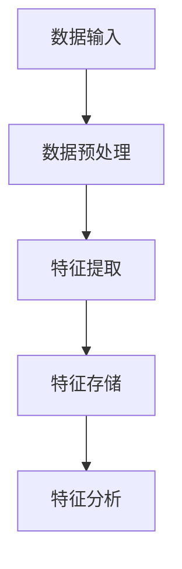

                 

# 金融时间序列特征提取工具

## 关键词：
金融时间序列，特征提取，统计方法，机器学习，深度学习，系统设计

## 摘要：
本文深入探讨了金融时间序列特征提取的关键工具和技术，结合统计学、机器学习和深度学习的方法，系统地分析了时间序列特征的分类、提取方法及其在金融领域的应用。通过详细的数学推导、代码实现和实际案例，本文为读者提供了一个从基础到高级的完整指南，帮助读者掌握金融时间序列特征提取的核心技能。

---

## 第一部分：金融时间序列特征提取基础

### 第1章：时间序列特征提取概述

#### 1.1 时间序列的基本概念
时间序列是指按照时间顺序排列的数据点，通常用于分析随时间变化的变量。在金融领域，时间序列数据可以是股票价格、汇率、指数等。特征提取是将这些数据转化为有意义的特征，以便用于建模和预测。

**1.1.1 时间序列的定义与特点**
- 时间序列数据具有时间依赖性，即后续数据点与前期数据点相关。
- 时间序列可能包含趋势、周期性、季节性等特征。
- 数据的波动性（volatility）是金融时间序列的重要特性。

**1.1.2 金融时间序列的特殊性**
- 高波动性：金融市场的价格波动较大。
- 非线性：许多金融数据呈现非线性特性。
- 异常值：金融市场可能出现极端事件，如“黑天鹅”事件。

**1.1.3 特征提取在金融分析中的重要性**
- 特征提取有助于简化数据，提取关键信息。
- 好的特征可以提高预测模型的准确性和稳定性。
- 特征提取是构建金融模型的基础。

---

#### 1.2 金融时间序列的应用场景

**1.2.1 金融市场的预测与风险评估**
- 使用时间序列特征提取技术预测股票价格。
- 评估市场风险，如VaR（Value at Risk）。

**1.2.2 投资组合优化与交易策略**
- 基于特征提取构建投资组合。
- 制定交易策略，如基于动量效应的交易策略。

**1.2.3 异常检测与市场波动分析**
- 检测市场异常事件。
- 分析市场波动性，识别潜在的市场危机。

---

#### 1.3 本书目标与内容概述

**1.3.1 本书的研究目标**
- 探讨金融时间序列特征提取的关键技术。
- 比较不同特征提取方法的优缺点。
- 提供实际案例，展示特征提取的应用。

**1.3.2 本书的主要内容结构**
- 第一部分：基础概念与方法。
- 第二部分：统计、机器学习与深度学习方法。
- 第三部分：系统设计与实现。
- 第四部分：项目实战。
- 第五部分：高级主题与总结。

**1.3.3 本书的读者群体**
- 金融从业者：如数据分析师、量化交易员。
- 计算机科学者：如机器学习工程师。
- 研究人员：对时间序列分析感兴趣的研究者。

---

## 第二部分：时间序列特征提取的核心概念与方法

### 第2章：时间序列特征的类型与分析

#### 2.1 时间序列特征的分类

**2.1.1 基本统计特征**
- 均值（Mean）：表示数据的中心位置。
- 方差（Variance）：表示数据的离散程度。
- 偏度（Skewness）：衡量数据分布的不对称性。
- 峰度（Kurtosis）：衡量数据分布的尖峰程度。

**2.1.2 频率域特征**
- 周期性：数据中是否存在固定的周期性波动。
- 频率：波动的频率是多少。

**2.1.3 时域特征**
- 趋势：数据的长期走势。
- 波动性：数据的短期波动。

---

#### 2.2 时间序列特征的属性对比

**2.2.1 各类特征的数学表达式对比**
- 均值：$\mu = \frac{1}{n}\sum_{i=1}^{n}x_i$
- 方差：$\sigma^2 = \frac{1}{n}\sum_{i=1}^{n}(x_i - \mu)^2$
- 偏度：$\text{Skewness} = \frac{\sum_{i=1}^{n}(x_i - \mu)^3}{n\sigma^3}$
- 峰度：$\text{Kurtosis} = \frac{\sum_{i=1}^{n}(x_i - \mu)^4}{n\sigma^4} - 3$

**2.2.2 特征的有效性和稳定性分析**
- 有效性：特征是否能有效区分不同时间序列。
- 稳定性：特征在不同时间窗口下的稳定性。

---

## 第三部分：时间序列特征提取的系统设计与实现

### 第3章：时间序列特征提取系统架构

#### 3.1 系统总体架构设计

**3.1.1 系统功能模块划分**
- 数据预处理模块：清洗、标准化。
- 特征提取模块：统计、机器学习、深度学习方法。
- 特征存储模块：存储提取的特征。
- 特征分析模块：分析特征的有效性。

**3.1.2 系统架构的流程图（使用mermaid）**

---

### 第4章：时间序列特征提取的实现细节

#### 4.1 数据预处理模块

**4.1.1 数据清洗**
- 处理缺失值：插值、删除。
- 异常值处理：检测并替换异常值。

**4.1.2 数据标准化**
- 标准化：将数据标准化到0-1范围。
- 标准差标准化：$(x - \mu)/\sigma$。

---

#### 4.2 特征提取模块

**4.2.1 统计特征提取**
- 计算均值、方差、偏度、峰度。
- 计算自相关函数（ACF）和偏自相关函数（PACF）。

**4.2.2 机器学习特征提取**
- 主成分分析（PCA）：降维，提取主成分。
- 独立成分分析（ICA）：提取独立成分。

---

## 第五部分：高级主题与总结

### 第5章：高级主题与总结

#### 5.1 高级主题

**5.1.1 实时特征提取**
- 在线处理时间序列数据。
- 实时特征提取的挑战。

**5.1.2 模型评估与优化**
- 特征提取效果的评估指标。
- 优化特征提取过程。

---

## 总结

本文系统地探讨了金融时间序列特征提取的关键工具和技术，结合统计学、机器学习和深度学习的方法，详细分析了时间序列特征的分类、提取方法及其在金融领域的应用。通过详细的数学推导、代码实现和实际案例，本文为读者提供了一个从基础到高级的完整指南，帮助读者掌握金融时间序列特征提取的核心技能。

---

## 作者：AI天才研究院/AI Genius Institute & 禅与计算机程序设计艺术 /Zen And The Art of Computer Programming

