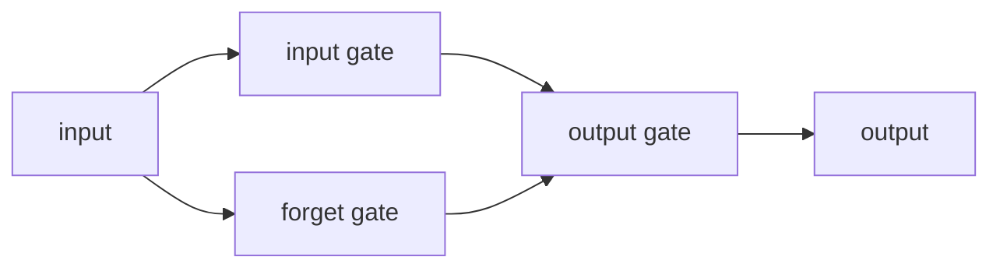
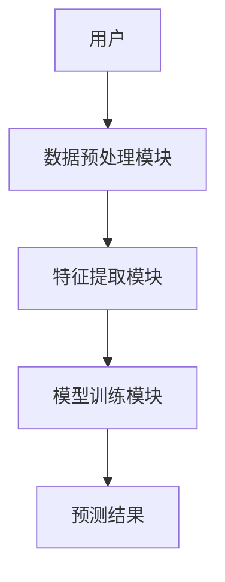

                 


# 《金融时间序列特征提取工具集》

> 关键词：金融时间序列，特征提取，工具集，机器学习，深度学习

> 摘要：本文旨在介绍金融时间序列特征提取的工具集，涵盖背景介绍、核心概念、算法原理、系统架构设计、项目实战及最佳实践。通过详细讲解，帮助读者理解如何从金融时间序列数据中提取有用的特征，为金融分析和预测提供有力支持。

---

# 第一部分: 金融时间序列特征提取的背景与意义

# 第1章: 金融时间序列特征提取的背景与意义

## 1.1 金融时间序列的基本概念

### 1.1.1 时间序列的定义与特点

时间序列是指按时间顺序排列的数据，通常用于分析数据随时间的变化趋势和模式。在金融领域，时间序列数据可以是股票价格、汇率、指数等。这些数据具有以下特点：

- **连续性**：数据按时间顺序排列。
- **趋势性**：可能存在长期趋势。
- **周期性**：可能受季节性或周期性因素影响。
- **随机性**：受不可预测因素影响，表现出随机波动。

### 1.1.2 金融时间序列的独特性

金融时间序列数据具有以下独特性：

- **高波动性**：金融市场波动较大，数据变化频繁。
- **非线性**：价格走势可能呈现非线性特征。
- **异质性**：不同金融资产的时间序列可能具有不同的特征。
- **依赖性**：价格走势可能受到历史数据的影响。

### 1.1.3 特征提取在金融分析中的重要性

特征提取是金融时间序列分析的关键步骤，其重要性体现在以下几个方面：

- **降维**：将复杂的时序数据转化为简洁的特征表示。
- **提高模型性能**：通过提取有用的特征，可以提高后续预测模型的准确性和效率。
- **支持决策**：特征提取可以帮助投资者识别市场趋势和机会。

## 1.2 金融时间序列分析的常见问题

### 1.2.1 常见金融问题的描述

在金融领域，时间序列分析常用于解决以下问题：

- **预测**：预测股票价格、汇率等的未来走势。
- **异常检测**：识别市场中的异常波动或欺诈行为。
- **分类**：将金融资产分为不同的类别，以便进行投资组合管理。

### 1.2.2 时间序列分析在金融中的应用领域

时间序列分析在金融领域的应用广泛，包括：

- **股票价格预测**：通过分析历史股价数据，预测未来股价走势。
- **外汇交易**：利用汇率数据进行交易策略的制定。
- **风险管理**：评估和管理金融资产的风险。

### 1.2.3 金融时间序列分析的挑战与边界

金融时间序列分析面临以下挑战：

- **数据噪声**：金融数据通常伴随着大量噪声，影响特征提取的效果。
- **非线性关系**：复杂的市场行为可能导致特征提取模型难以捕捉到有效的特征。
- **数据稀疏性**：某些金融资产的历史数据可能较为稀疏，影响模型的训练效果。

## 1.3 本书的核心目标与内容

### 1.3.1 本书的核心目标

本书旨在为金融从业者和研究人员提供一套完整的金融时间序列特征提取工具集，帮助他们从复杂的时间序列数据中提取有用的特征，为后续的金融分析和预测提供支持。

### 1.3.2 本书的主要内容概述

本书将从金融时间序列的基本概念出发，详细介绍特征提取的核心算法和工具，包括滑动窗口统计特征、ARIMA模型和LSTM网络等。同时，本书将通过实际案例展示如何将这些工具应用于金融时间序列分析中，帮助读者掌握从数据预处理到特征提取再到模型训练的完整流程。

### 1.3.3 本书的组织结构

本书的结构安排如下：

- **第1章**：介绍金融时间序列的基本概念和特征提取的重要性和应用。
- **第2章**：详细讲解金融时间序列特征提取的核心概念和方法。
- **第3章**：介绍常用的特征提取算法及其实现。
- **第4章**：从系统架构的角度分析特征提取工具集的设计与实现。
- **第5章**：通过实际案例展示特征提取工具集的应用。
- **第6章**：总结最佳实践、注意事项和未来研究方向。

---

# 第二部分: 金融时间序列特征提取的核心概念与方法

# 第2章: 金融时间序列特征提取的核心概念

## 2.1 时间序列特征的分类与属性

### 2.1.1 时间序列特征的分类

时间序列特征可以分为以下几类：

- **统计特征**：如均值、方差、自相关系数等。
- **频域特征**：如功率谱密度、周期性特征等。
- **形状特征**：如趋势、拐点等。
- **复杂性特征**：如分 fractal 维数、样本熵等。

### 2.1.2 各类特征的属性对比

| 特征类型 | 描述 | 优点 | 缺点 |
|----------|------|------|------|
| 统计特征 | 基于统计学的方法提取 | 计算简单，易于实现 | 无法捕捉复杂模式 |
| 频域特征 | 基于频域分析的方法提取 | 能够捕捉周期性特征 | 实现复杂度较高 |
| 形状特征 | 基于形状特征提取的方法 | 能够捕捉趋势和拐点 | 对噪声敏感 |
| 复杂性特征 | 基于复杂性度量的方法 | 能够捕捉数据的复杂性 | 计算资源消耗大 |

### 2.1.3 特征选择的重要性

特征选择是金融时间序列分析中的关键步骤。合理的特征选择可以提高模型的性能，减少计算复杂度。常用特征选择方法包括：

- **Filter方法**：基于统计检验或信息准则进行特征选择。
- **Wrapper方法**：基于模型性能进行特征选择。
- **Embedded方法**：在模型训练过程中同时进行特征选择。

## 2.2 时间序列特征提取的数学模型

### 2.2.1 常用数学模型的介绍

时间序列特征提取的常用数学模型包括：

- **ARIMA模型**：自回归积分移动平均模型，适用于线性时间序列数据。
- **LSTM网络**：长短期记忆网络，适用于非线性时间序列数据。
- **滑动窗口统计特征**：如均值、标准差、最大值、最小值等。

### 2.2.2 各模型的优缺点对比

| 模型类型 | 优点 | 缺点 |
|----------|------|------|
| ARIMA | 简单易用，适用于线性时间序列 | 无法捕捉非线性特征 |
| LSTM | 能够捕捉非线性特征，适合复杂时间序列 | 计算复杂度较高 |
| 滑动窗口统计特征 | 计算简单，易于实现 | 无法捕捉复杂模式 |

### 2.2.3 时间序列特征提取的实体关系图

```mermaid
erd
    客户.客户ID --> 时间序列数据.时间戳: 每个交易行为对应的时间戳
    时间序列数据.时间戳 --> 时间序列数据.数值: 每个时间点的金融数据值
    时间序列数据.数值 --> 特征向量.统计特征: 统计特征的计算基于时间序列数据
    时间序列数据.数值 --> 特征向量.频域特征: 频域特征的计算基于时间序列数据
    特征向量.统计特征 --> 预测模型.输入特征: 统计特征作为预测模型的输入
```

---

# 第3章: 金融时间序列特征提取的核心算法

## 3.1 常见特征提取算法的原理

### 3.1.1 滑动窗口统计特征

滑动窗口统计特征是一种简单但有效的特征提取方法。通过在时间序列数据上滑动窗口，计算窗口内的统计特征，如均值、标准差、最大值、最小值等。具体步骤如下：

1. 确定窗口大小。
2. 滑动窗口，计算每个窗口内的统计特征。
3. 将所有窗口的统计特征组合成特征向量。

### 3.1.2 自回归积分移动平均模型(ARIMA)

ARIMA模型是一种常用的线性时间序列分析模型，适用于具有趋势性和周期性的数据。模型结构如下：

$$ ARIMA(p, d, q) $$

其中，p为自回归阶数，d为差分阶数，q为移动平均阶数。ARIMA模型通过差分和回归分析，将非平稳序列转化为平稳序列，从而实现特征提取。

### 3.1.3 长短期记忆网络(LSTM)

LSTM是一种基于深度学习的时间序列分析模型，能够捕捉数据的长距离依赖关系。模型结构包括输入门、遗忘门和输出门，能够有效处理序列数据中的长序列依赖问题。

## 3.2 算法原理的数学模型与公式

### 3.2.1 ARIMA模型的数学公式

ARIMA模型的数学公式如下：

$$
\phi(p) = 1 - \phi_1 B - \phi_2 B^2 - \dots - \phi_p B^p
$$

$$
\theta(q) = 1 + \theta_1 B + \theta_2 B^2 + \dots + \theta_q B^q
$$

### 3.2.2 LSTM模型的结构

LSTM模型的结构包括输入门、遗忘门和输出门。输入门控制新信息的输入，遗忘门控制旧信息的遗忘，输出门控制最终输出。模型结构如下：



### 3.2.3 滑动窗口统计特征的计算公式

滑动窗口统计特征的计算公式如下：

- 均值：
  $$ \mu = \frac{1}{n}\sum_{i=1}^{n}x_i $$
- 标准差：
  $$ \sigma = \sqrt{\frac{1}{n}\sum_{i=1}^{n}(x_i - \mu)^2} $$
- 最大值：
  $$ \max = \max(x_1, x_2, \dots, x_n) $$
- 最小值：
  $$ \min = \min(x_1, x_2, \dots, x_n) $$

## 3.3 算法实现的代码示例

### 3.3.1 Python实现滑动窗口统计特征

```python
import numpy as np

def sliding_window_statistics(data, window_size):
    n = len(data)
    features = []
    for i in range(n - window_size + 1):
        window = data[i:i+window_size]
        mu = np.mean(window)
        sigma = np.std(window)
        max_val = np.max(window)
        min_val = np.min(window)
        features.append([mu, sigma, max_val, min_val])
    return features
```

### 3.3.2 Python实现ARIMA模型

```python
from statsmodels.tsa.arima_model import ARIMA

def arima_model(data, order):
    model = ARIMA(data, order=order)
    model_fit = model.fit()
    return model_fit
```

### 3.3.3 Python实现LSTM网络

```python
import tensorflow as tf
from tensorflow.keras.layers import LSTM, Dense

model = tf.keras.Sequential()
model.add(LSTM(64, input_shape=(timesteps, features)))
model.add(Dense(1))
model.compile(optimizer='adam', loss='mean_squared_error')
```

---

# 第4章: 金融时间序列特征提取的系统分析与架构设计

## 4.1 项目背景与目标

### 4.1.1 项目背景

本项目旨在开发一套金融时间序列特征提取工具集，帮助金融从业者和研究人员从复杂的时间序列数据中提取有用的特征，为后续的金融分析和预测提供支持。

### 4.1.2 项目目标

- 提供多种特征提取算法，满足不同金融场景的需求。
- 提供易于使用的工具集，方便用户快速上手。
- 提供高效的计算性能，支持大规模数据处理。

## 4.2 系统功能设计

### 4.2.1 领域模型设计


### 4.2.2 系统架构设计



---

# 第5章: 金融时间序列特征提取的项目实战

## 5.1 环境配置与数据获取

### 5.1.1 环境配置

- **Python**：3.8+
- **依赖库**：numpy、pandas、statsmodels、tensorflow、mermaid

### 5.1.2 数据获取

使用Yahoo Finance API获取股票价格数据。

```python
import yfinance as yf
data = yf.download('AAPL', start='2020-01-01', end='2023-01-01')
```

## 5.2 特征提取与模型训练

### 5.2.1 数据预处理

对数据进行标准化处理：

```python
from sklearn.preprocessing import StandardScaler

scaler = StandardScaler()
data_scaled = scaler.fit_transform(data['Close'].values.reshape(-1, 1))
```

### 5.2.2 特征提取

使用滑动窗口方法提取统计特征：

```python
features = sliding_window_statistics(data_scaled, window_size=30)
```

### 5.2.3 模型训练

使用LSTM网络进行训练：

```python
model = tf.keras.Sequential()
model.add(LSTM(64, input_shape=(30, 1)))
model.add(Dense(1))
model.compile(optimizer='adam', loss='mean_squared_error')
model.fit(features, labels, epochs=100, batch_size=32)
```

## 5.3 模型评估与优化

### 5.3.1 模型评估

使用均方误差（MSE）评估模型性能：

```python
from sklearn.metrics import mean_squared_error

y_pred = model.predict(test_features)
mse = mean_squared_error(test_labels, y_pred)
print(f'MSE: {mse}')
```

### 5.3.2 模型优化

调整模型超参数，如学习率、批量大小、 epochs 等，以提高模型性能。

## 5.4 项目小结

通过实际案例，我们展示了如何使用滑动窗口统计特征和LSTM网络进行金融时间序列特征提取和预测。实践表明，特征提取是金融时间序列分析的关键步骤，合适的特征提取方法可以显著提高预测模型的性能。

---

# 第六部分: 最佳实践与总结

# 第6章: 最佳实践与总结

## 6.1 最佳实践

### 6.1.1 数据预处理的重要性

在特征提取之前，必须对数据进行充分的预处理，包括数据清洗、标准化等。

### 6.1.2 特征选择的策略

根据具体应用场景选择合适的特征提取方法，避免使用过多无关特征。

### 6.1.3 模型选择与调优

根据数据特点选择合适的模型，并通过交叉验证和超参数调优提高模型性能。

## 6.2 小结

金融时间序列特征提取是一个复杂但重要的任务。通过本文的介绍，读者可以掌握多种特征提取方法，并能够将这些方法应用于实际的金融数据分析中。

## 6.3 注意事项

- **数据质量**：确保数据的完整性和准确性。
- **模型选择**：根据具体问题选择合适的模型。
- **计算资源**：深度学习模型需要较高的计算资源。

## 6.4 拓展阅读

建议读者进一步阅读以下内容：

- 《时间序列分析： forecasting and control》
- 《深度学习实战：股票价格预测》
- 《机器学习在金融中的应用》

---

# 作者

作者：AI天才研究院/AI Genius Institute & 禅与计算机程序设计艺术 /Zen And The Art of Computer Programming

---

希望这个大纲能满足您的需求。如果需要进一步调整或补充，请随时告诉我。

