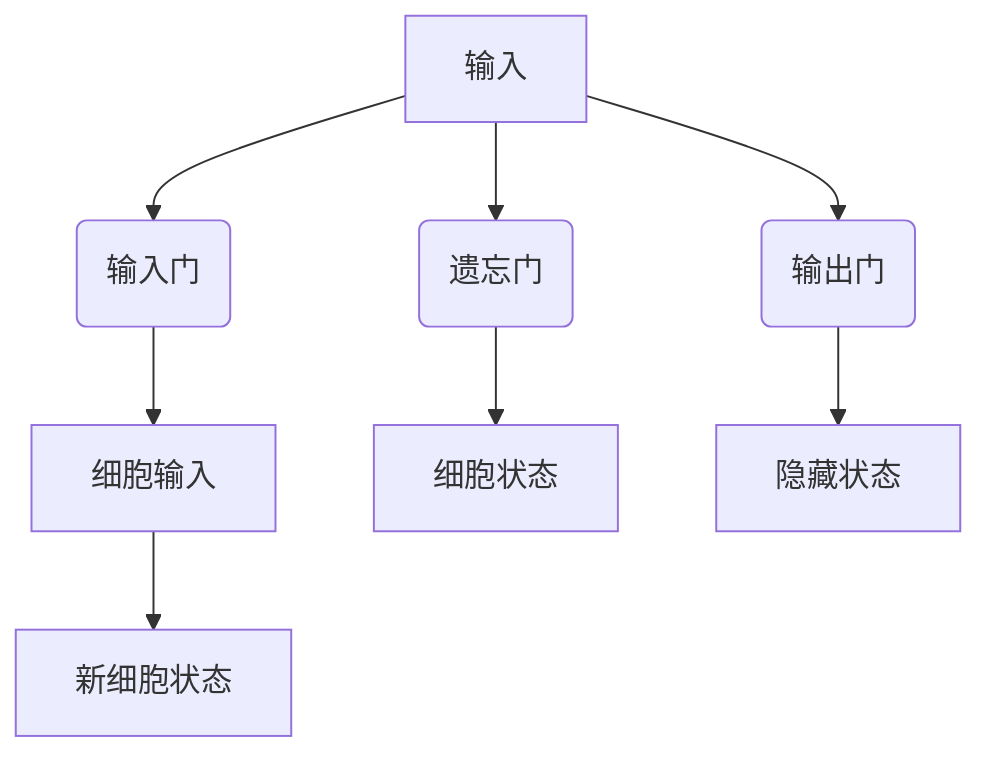
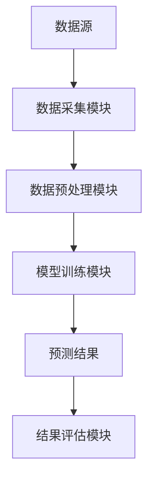

                 

# 《金融时间序列预测模型比较》

---

## 关键词

金融时间序列预测模型，ARIMA，LSTM，Prophet，机器学习，深度学习，金融数据分析

---

## 摘要

金融时间序列预测是金融领域中的核心任务之一，旨在通过历史数据预测未来的市场趋势和价格波动。本文通过比较多种金融时间序列预测模型，包括经典统计模型（如ARIMA）、机器学习模型（如Prophet）和深度学习模型（如LSTM），分析它们在金融场景中的优缺点、适用场景及性能表现。文章从模型原理、算法实现、系统架构设计、项目实战等多角度展开，为读者提供全面的模型比较和实践指导。

---

## 第一部分: 金融时间序列预测模型的背景与基础

### 第1章: 金融时间序列预测概述

#### 1.1 时间序列的基本概念

时间序列是指按照时间顺序排列的数据点，常用于分析随时间变化的动态系统。在金融领域，时间序列数据通常包括股票价格、汇率、指数等，这些数据具有以下特点：

- **趋势性**：数据可能呈现上升或下降的趋势。
- **周期性**：数据可能受到季节性或周期性因素的影响。
- **随机性**：数据中可能包含不可预测的噪声。
- **波动性**：金融市场的波动性较高，容易受到多种因素影响。

#### 1.2 金融时间序列预测的核心问题

金融时间序列预测的核心问题在于如何准确捕捉数据中的趋势、周期性和波动性，并基于这些特征建立有效的预测模型。以下是金融时间序列预测中的几个关键问题：

- **数据的非平稳性**：金融数据通常是非平稳的，即其统计特性会随时间变化。
- **高度波动性**：金融市场的波动性较高，预测模型需要具备较强的鲁棒性。
- **外部因素的影响**：金融数据往往受到宏观经济、政策变化等外部因素的影响，增加了预测的复杂性。

#### 1.3 金融时间序列预测的常见应用

金融时间序列预测在以下几个方面具有重要应用：

- **股票价格预测**：通过预测股票价格走势，帮助投资者做出投资决策。
- **汇率预测**：预测汇率波动，帮助企业和个人进行跨境交易和风险管理。
- **金融风险评估**：通过预测市场波动性，评估和管理金融风险。

---

## 第二部分: 常用金融时间序列预测模型介绍

### 第2章: 经典时间序列预测模型

#### 2.1 ARIMA模型

ARIMA（Autoregressive Integrated Moving Average）是一种经典的统计模型，广泛应用于时间序列预测。以下是ARIMA模型的核心组成部分：

- **自回归（AR）部分**：基于过去的时间序列值进行预测。
- **移动平均（MA）部分**：基于过去预测误差进行预测。
- **差分（I）部分**：通过对数据进行差分处理，消除数据的非平稳性。

**ARIMA模型的公式表示**：

$$ARIMA(p, d, q) = 0$$

其中，p为自回归阶数，d为差分阶数，q为移动平均阶数。

**优缺点**：

- **优点**：模型简单，易于实现，适合处理线性时间序列数据。
- **缺点**：对非线性数据表现较差，对异常值敏感。

#### 2.2 Prophet模型

Prophet是由Facebook开源的时间序列预测模型，基于时间序列分解的思想，将数据分解为趋势、周期性和余项三部分。以下是Prophet模型的核心思想：

1. **趋势分解**：通过非线性回归捕捉数据中的趋势。
2. **周期性分解**：基于傅里叶级数捕捉数据中的周期性。
3. **余项建模**：通过高斯过程回归捕捉数据中的噪声。

**Prophet模型的公式表示**：

$$y(t) = g(t) + s(t) + \epsilon$$

其中，$g(t)$表示趋势，$s(t)$表示周期性，$\epsilon$表示余项。

**优缺点**：

- **优点**：模型易于使用，适合处理具有明显趋势和周期性的数据。
- **缺点**：对异常值的鲁棒性较差，对长周期数据的预测精度有限。

---

## 第三部分: 深度学习模型在金融时间序列预测中的应用

### 第3章: 基于LSTM的金融时间序列预测

LSTM（Long Short-Term Memory）是一种特殊的循环神经网络（RNN），能够有效捕捉时间序列中的长期依赖关系。以下是LSTM模型的核心原理：

- **细胞状态**：LSTM通过细胞状态来记忆长期信息。
- **门控机制**：通过输入门、遗忘门和输出门来控制信息的流动。

**LSTM模型的结构图**：

**LSTM模型的公式表示**：

$$
\begin{aligned}
    f_t &= \sigma(W_f \cdot [h_{t-1}, x_t] + b_f) \\
    i_t &= \sigma(W_i \cdot [h_{t-1}, x_t] + b_i) \\
    o_t &= \sigma(W_o \cdot [h_{t-1}, x_t] + b_o) \\
    g_t &= \tanh(W_g \cdot [h_{t-1}, x_t] + b_g) \\
    c_t &= f_t \cdot c_{t-1} + i_t \cdot g_t \\
    h_t &= o_t \cdot \tanh(c_t)
\end{aligned}
$$

**优缺点**：

- **优点**：能够捕捉时间序列中的长期依赖关系，对非线性数据表现较好。
- **缺点**：模型复杂度较高，训练时间较长，对超参数敏感。

---

## 第四部分: 模型比较与优化策略

### 第4章: 金融时间序列预测模型的比较

#### 4.1 模型性能对比

以下表格对比了ARIMA、Prophet和LSTM模型在金融时间序列预测中的表现：

| 模型       | 优点                           | 缺点                           |
|------------|--------------------------------|--------------------------------|
| ARIMA      | 简单易用，适合线性数据         | 对非线性数据表现较差           |
| Prophet    | 易于使用，适合趋势和周期性数据 | 对异常值鲁棒性较差             |
| LSTM       | 能捕捉长期依赖关系             | 训练时间长，模型复杂度高       |

#### 4.2 模型优化策略

为了提高模型的预测精度，可以采用以下优化策略：

1. **集成学习**：结合多个模型的预测结果，提高预测的稳定性。
2. **超参数调优**：通过网格搜索等方法优化模型的超参数。
3. **特征工程**：引入更多的特征，如宏观经济指标、市场情绪等，丰富模型的输入信息。
4. **数据预处理**：对数据进行标准化、去噪等预处理，提高模型的训练效果。

---

## 第五部分: 项目实战与系统架构设计

### 第5章: 金融时间序列预测系统设计

#### 5.1 系统功能设计

金融时间序列预测系统主要包括以下功能模块：

- **数据采集**：从金融数据源获取时间序列数据。
- **数据预处理**：对数据进行清洗、标准化等处理。
- **模型训练**：基于预处理后的数据训练预测模型。
- **预测与评估**：生成预测结果，并评估模型的预测精度。

#### 5.2 系统架构设计

以下为金融时间序列预测系统的架构图：

---

## 第六部分: 结论与展望

### 第6章: 结论

通过对ARIMA、Prophet和LSTM模型的比较分析，我们可以得出以下结论：

- **ARIMA模型**适合处理线性时间序列数据，但对非线性数据表现较差。
- **Prophet模型**适合处理具有明显趋势和周期性的数据，但对异常值的鲁棒性较差。
- **LSTM模型**能够捕捉时间序列中的长期依赖关系，对非线性数据表现较好，但模型复杂度较高。

### 6.2 未来展望

未来，随着深度学习技术的不断发展，金融时间序列预测模型将更加智能化和自动化。以下是一些可能的研究方向：

- **集成学习**：研究如何更好地结合多个模型的优势，提高预测精度。
- **强化学习**：探索强化学习在金融时间序列预测中的应用。
- **实时预测**：研究如何实现金融时间序列的实时预测，满足金融交易的实时性需求。

---

## 结语

金融时间序列预测是一个复杂但重要的任务，需要结合多种模型和技术手段。通过对ARIMA、Prophet和LSTM模型的比较分析，我们可以更好地理解不同模型的优缺点，并根据实际需求选择合适的模型。同时，随着技术的进步，金融时间序列预测模型将变得更加智能化和高效。

---

## 作者

作者：AI天才研究院/AI Genius Institute & 禅与计算机程序设计艺术 /Zen And The Art of Computer Programming

---

