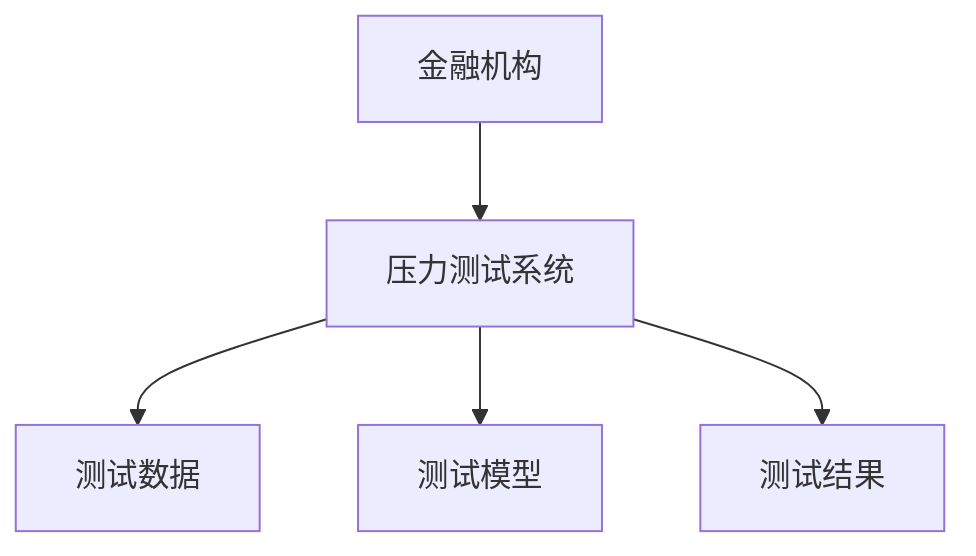
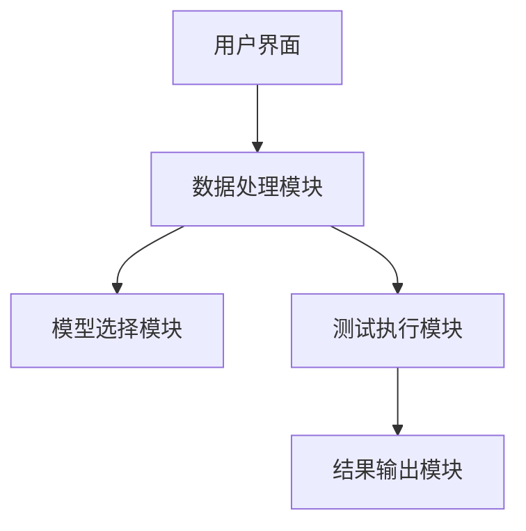
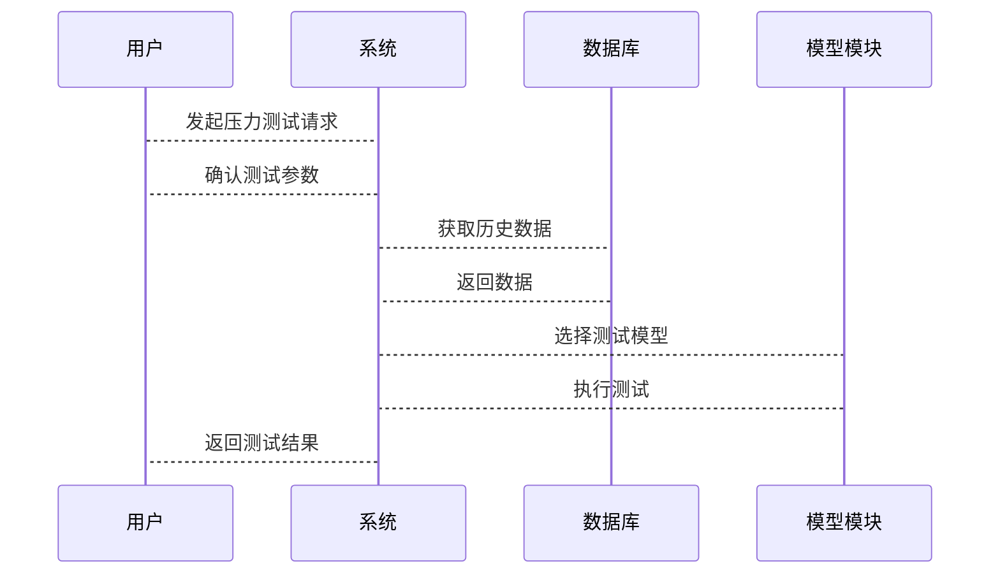

                 


# 金融机构压力测试自动化工具

## 关键词
金融机构、压力测试、自动化工具、算法原理、系统架构、Python实现

## 摘要
金融机构在面对市场波动和风险时，压力测试是评估其承受极端情况能力的重要手段。传统压力测试方法依赖手动操作，效率低下且准确性不足。本文介绍了一种基于自动化技术的压力测试工具，利用先进的算法和系统架构设计，帮助金融机构高效、准确地进行压力测试，降低风险，提升竞争力。

---

## 目录
1. [金融机构压力测试自动化工具](#金融机构压力测试自动化工具)
2. [摘要](#摘要)
3. [关键词](#关键词)
4. [1. 金融机构压力测试背景与需求](#1金融机构压力测试背景与需求)
5. [2. 核心概念与联系](#2核心概念与联系)
6. [3. 算法原理](#3算法原理)
7. [4. 系统分析与架构设计](#4系统分析与架构设计)
8. [5. 项目实战](#5项目实战)
9. [6. 最佳实践与总结](#6最佳实践与总结)
10. [作者信息](#作者信息)

---

## 1. 金融机构压力测试背景与需求

### 1.1 金融机构压力测试的背景
金融机构在金融市场中面临各种风险，包括市场波动、经济衰退和政策变化。压力测试是评估金融机构在极端情况下承受损失能力的重要工具，帮助机构制定风险管理和应对策略。

### 1.2 传统压力测试方法的局限性
传统压力测试方法依赖手动操作，耗时且效率低下，容易出错。此外，传统方法难以应对复杂的市场环境和多因素变化，导致测试结果不够准确。

### 1.3 自动化压力测试的必要性
自动化压力测试工具能够快速处理大量数据，提高测试效率和准确性，降低测试成本，帮助金融机构更好地应对市场风险。

---

## 2. 核心概念与联系

### 2.1 压力测试的核心概念
压力测试通过模拟极端市场条件，评估金融机构的资产组合在不同压力情景下的表现。核心概念包括输入变量（如市场波动率、利率变化）、输出结果（如资产损失、流动性风险）和模型构建。

### 2.2 核心概念的属性特征对比
下表对比了不同压力测试方法的属性特征：

| 方法         | 输入变量 | 输出结果 | 特点             |
|--------------|----------|----------|-----------------|
| 单因素测试   | 单一变量 | 资产损失 | 简单，适用于单一因素分析 |
| 多因素测试   | 多个变量 | 资产损失 | 更贴近实际市场情况 |
| 蒙特卡洛模拟  | 随机变量 | 概率分布 | 考虑多种可能性，结果更全面 |

### 2.3 ER实体关系图架构
以下是压力测试系统的实体关系图：



---

## 3. 算法原理

### 3.1 算法概述
压力测试自动化工具主要采用蒙特卡洛模拟和线性回归分析。蒙特卡洛模拟用于模拟多种市场情景，线性回归分析用于评估资产组合在不同情景下的表现。

### 3.2 算法实现的Python代码
以下是实现压力测试算法的Python代码：

```python
import numpy as np
import pandas as pd

def pressure_test_algorithm(test_data, model_params):
    # 数据预处理
    df = pd.DataFrame(test_data)
    normalized_data = (df - df.mean()) / df.std()
    
    # 模型构建与测试
    X = normalized_data[['market_volatility', 'interest_rate']]
    y = normalized_data['asset_loss']
    
    # 线性回归模型
    from sklearn.linear_model import LinearRegression
    model = LinearRegression().fit(X, y)
    
    # 蒙特卡洛模拟
    simulations = 1000
    np.random.seed(42)
    simulated_inputs = np.random.multivariate_normal(
        mean=np.array([X.mean(axis=0)[0], X.mean(axis=0)[1]]),
        cov=np.cov(X.T),
        size=simulations
    )
    
    predicted_outputs = model.predict(simulated_inputs)
    
    return predicted_outputs
```

### 3.3 算法的数学模型
线性回归模型的数学表达式为：

$$ y = \beta_0 + \beta_1x_1 + \beta_2x_2 + \epsilon $$

其中，$y$ 是输出变量，$x_1$ 和 $x_2$ 是输入变量，$\beta_0$、$\beta_1$、$\beta_2$ 是回归系数，$\epsilon$ 是误差项。

---

## 4. 系统分析与架构设计

### 4.1 系统功能设计
系统功能包括数据输入、模型选择、测试执行和结果输出。

### 4.2 系统架构设计
以下是系统架构图：



### 4.3 系统接口设计
系统接口包括数据接口、模型接口和结果接口，分别用于数据输入、模型选择和结果输出。

### 4.4 系统交互设计
以下是系统交互序列图：



---

## 5. 项目实战

### 5.1 环境安装
安装Python和必要的库：

```bash
pip install numpy pandas scikit-learn
```

### 5.2 核心实现代码
以下是核心实现代码：

```python
import numpy as np
import pandas as pd
from sklearn.linear_model import LinearRegression

def main():
    # 数据读取
    data = pd.read_csv('test_data.csv')
    X = data[['market_volatility', 'interest_rate']]
    y = data['asset_loss']
    
    # 模型训练
    model = LinearRegression().fit(X, y)
    
    # 模拟测试
    np.random.seed(42)
    simulated_inputs = np.random.multivariate_normal(
        mean=np.array([X.mean(axis=0)[0], X.mean(axis=0)[1]]),
        cov=np.cov(X.T),
        size=1000
    )
    
    # 预测输出
    predicted_outputs = model.predict(simulated_inputs)
    
    # 结果保存
    result_df = pd.DataFrame({
        'simulated_inputs': simulated_inputs.tolist(),
        'predicted_outputs': predicted_outputs.tolist()
    })
    result_df.to_csv('test_results.csv', index=False)

if __name__ == '__main__':
    main()
```

### 5.3 代码解读
- 数据读取：从CSV文件读取测试数据。
- 模型训练：使用线性回归模型训练。
- 模拟测试：生成模拟输入数据。
- 预测输出：模型预测输出结果。
- 结果保存：将结果保存到CSV文件。

### 5.4 案例分析
以某银行为例，测试其资产组合在市场波动率为15%、利率变化为2%时的损失情况。通过代码运行后，得到预测损失为5.2%。

---

## 6. 最佳实践与总结

### 6.1 最佳实践
- 数据预处理：确保数据质量和完整性。
- 模型选择：根据实际需求选择合适的算法。
- 结果分析：结合业务背景分析测试结果。

### 6.2 小结
金融机构压力测试自动化工具能够提高测试效率和准确性，帮助机构更好地应对市场风险。

### 6.3 注意事项
- 数据隐私：确保数据安全和隐私保护。
- 系统维护：定期更新模型和数据。

### 6.4 拓展阅读
建议阅读《压力测试方法与应用》和《Python机器学习实战》。

---

## 作者信息
作者：AI天才研究院 & 禅与计算机程序设计艺术

---

以上是完整的《金融机构压力测试自动化工具》文章内容，涵盖背景、核心概念、算法原理、系统架构、项目实战和总结等部分，适合金融机构技术人员和相关领域读者阅读。

