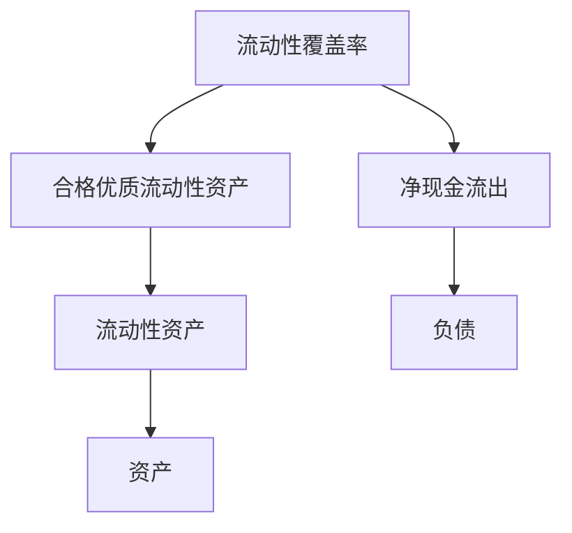
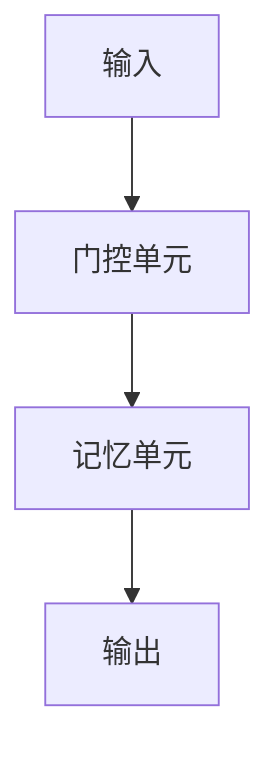
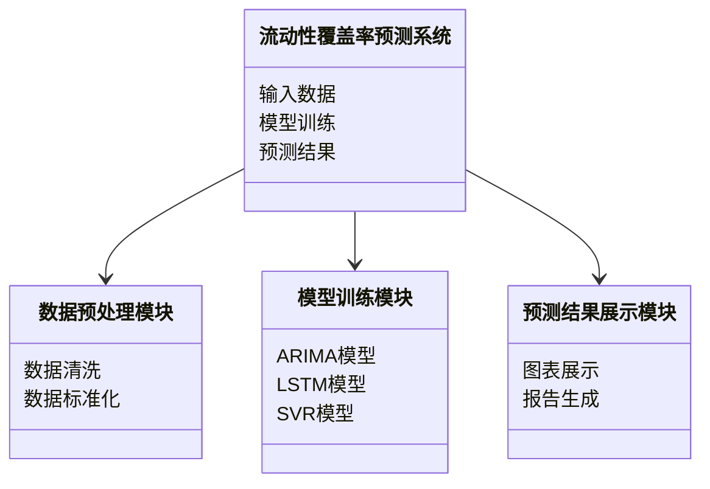
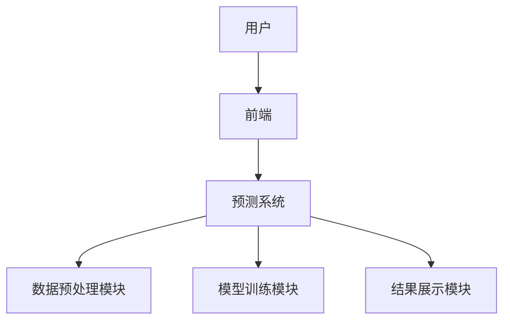
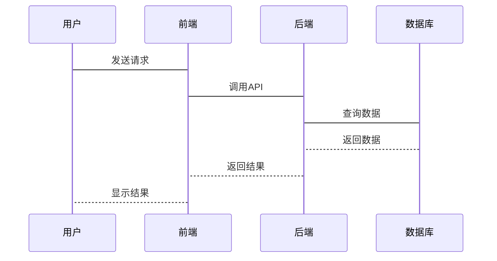

                 


# 金融机构流动性覆盖率预测

> **关键词**：流动性覆盖率、预测模型、机器学习、时间序列分析、金融机构、风险管理  
> 
> **摘要**：本文详细探讨了金融机构流动性覆盖率预测的方法与应用，结合理论分析和实践案例，介绍了多种预测模型，包括时间序列分析、机器学习和深度学习算法，并通过系统架构设计展示了如何构建预测系统。文章旨在帮助金融机构的风险管理部门更好地理解和预测流动性覆盖率，从而有效管理流动性风险。

---

## 第1章：流动性覆盖率的基本概念与重要性

### 1.1 流动性覆盖率的定义与计算方法

流动性覆盖率（LCR）是衡量金融机构短期流动性的重要指标，用于评估银行在面临压力时，能否在30天内保持流动性。其计算公式为：

$$ \text{流动性覆盖率} = \frac{\text{合格优质流动性资产}}{\text{净现金流出}} $$

流动性覆盖率越高，说明金融机构的短期流动性越强。

### 1.2 流动性覆盖率的适用范围与应用场景

#### 1.2.1 金融机构的流动性风险管理
流动性覆盖率主要用于银行等金融机构的流动性风险管理，帮助机构评估其在压力情况下的流动性状况。

#### 1.2.2 流动性覆盖率在监管中的作用
监管机构通过流动性覆盖率评估银行的流动性风险，确保银行在遇到短期资金需求时能够保持偿付能力。

#### 1.2.3 流动性覆盖率的国际标准与差异
国际上，巴塞尔协议III对流动性覆盖率提出了具体要求，不同国家和地区可能根据自身情况调整具体标准。

### 1.3 流动性覆盖率预测的必要性与挑战

#### 1.3.1 流动性覆盖率预测的必要性
准确预测流动性覆盖率可以帮助金融机构提前应对可能的流动性风险，优化资产配置和负债管理。

#### 1.3.2 流动性覆盖率预测的主要挑战
- 数据获取的难度：需要收集高频、高质量的市场数据。
- 模型的复杂性：流动性覆盖率受多种因素影响，预测模型需要考虑宏观经济、市场行为等多方面因素。
- 模型的可解释性：复杂的预测模型可能导致结果难以解释。

#### 1.3.3 如何克服预测中的困难
- 使用多种预测模型进行对比，选择最优模型。
- 引入外部数据源，如宏观经济指标，提高模型的准确性。
- 定期更新模型参数，适应市场变化。

---

## 第2章：流动性覆盖率预测的核心概念与联系

### 2.1 流动性覆盖率预测的基本原理

流动性覆盖率预测主要基于历史数据，利用统计学和机器学习方法，构建预测模型。常见的预测方法包括时间序列分析和机器学习算法。

### 2.2 流动性覆盖率与相关指标的关系

#### 2.2.1 流动性覆盖率与其他流动性指标的对比
- **净稳定资金比例（NSFR）**：衡量中长期流动性。
- **流动性缺口**：衡量一定时间段内的资金净流出。

#### 2.2.2 流动性覆盖率与资本充足率的关系
资本充足率衡量银行的资本质量，而流动性覆盖率衡量流动性，两者共同构成银行的风险管理框架。

#### 2.2.3 流动性覆盖率与市场风险的关系
流动性覆盖率与市场风险密切相关，市场波动可能影响流动性资产的价值和可用性。

### 2.3 流动性覆盖率预测的实体关系图

以下是流动性覆盖率预测的核心要素的实体关系图：



---

## 第3章：流动性覆盖率预测的算法原理

### 3.1 时间序列分析方法

#### 3.1.1 自回归积分滑动平均模型（ARIMA）

ARIMA模型通过捕捉数据的自相关性进行预测。模型分为三个部分：自回归（AR）、积分（I）和滑动平均（MA）。

- **AR部分**：使用过去的数据点进行预测。
- **I部分**：消除数据的平稳性。
- **MA部分**：考虑预测误差的影响。

#### 3.1.2 长期记忆网络模型（LSTM）

LSTM是一种特殊的RNN，能够捕捉长期依赖关系。其核心在于记忆单元（cell）和门控机制。



#### 3.1.3 其他时间序列分析模型
- **指数平滑法（ES）**：适用于简单趋势预测。
- **Prophet模型**：基于分解趋势法的时间序列模型。

### 3.2 机器学习算法在流动性覆盖率预测中的应用

#### 3.2.1 线性回归模型
线性回归通过最小化预测值与实际值的平方差进行预测。

$$ y = \beta_0 + \beta_1x + \epsilon $$

#### 3.2.2 支持向量回归模型（SVR）
SVR通过构建支持向量回归器，利用核函数进行非线性预测。

#### 3.2.3 随机森林回归模型
随机森林通过构建多个决策树，集成预测结果，具有较强的鲁棒性。

### 3.3 深度学习算法在流动性覆盖率预测中的应用

#### 3.3.1 卷积神经网络（CNN）
CNN通过卷积操作提取数据特征，适用于图像和序列数据的预测。

#### 3.3.2 循环神经网络（RNN）
RNN适用于时间序列数据的预测，但存在梯度消失问题。

#### 3.3.3 长短时记忆网络（LSTM）
LSTM通过记忆单元和门控机制，有效捕捉长期依赖关系。

---

## 第4章：流动性覆盖率预测的数学模型与公式

### 4.1 时间序列分析模型

#### 4.1.1 ARIMA模型
ARIMA模型的公式为：

$$ (1 - B)^d (1 - \phi_1B - \dots - \phi_pB^p)(1 - \theta_1B - \dots - \theta_qB^q)X_t = \epsilon_t $$

其中，$B$ 是后移算子，$d$ 是差分阶数，$p$ 是AR阶数，$q$ 是MA阶数。

#### 4.1.2 LSTM模型
LSTM的公式为：

$$
i_t = \sigma(W_{xi}x_t + W_{hi}h_{t-1} + b_i) \\
f_t = \sigma(W_{xf}x_t + W_{hf}h_{t-1} + b_f) \\
o_t = \sigma(W_{xo}x_t + W_{ho}h_{t-1} + b_o) \\
g_t = \tanh(W_{xg}x_t + W_{hg}h_{t-1} + b_g) \\
h_t = i_t \cdot g_t + f_t \cdot h_{t-1} \\
o_t = o_t \cdot h_t
$$

### 4.2 机器学习模型

#### 4.2.1 线性回归模型
线性回归的损失函数为：

$$ L = \sum_{i=1}^n (y_i - \hat{y}_i)^2 $$

#### 4.2.2 支持向量回归模型（SVR）
SVR的目标是最小化预测误差，使用拉格朗日乘子法求解。

#### 4.2.3 随机森林回归模型
随机森林通过构建多个决策树，集成预测结果，公式为：

$$ \hat{y} = \frac{1}{n} \sum_{i=1}^n y_i $$

### 4.3 深度学习模型

#### 4.3.1 卷积神经网络（CNN）
CNN通过卷积操作提取特征，适用于图像和序列数据的预测。

#### 4.3.2 循环神经网络（RNN）
RNN的公式为：

$$ h_t = \tanh(W_{hh}h_{t-1} + W_{xh}x_t + b_h) \\
y_t = W_{hy}h_t + b_y
$$

#### 4.3.3 长短时记忆网络（LSTM）
LSTM的公式为：

$$
i_t = \sigma(W_{xi}x_t + W_{hi}h_{t-1} + b_i) \\
f_t = \sigma(W_{xf}x_t + W_{hf}h_{t-1} + b_f) \\
o_t = \sigma(W_{xo}x_t + W_{ho}h_{t-1} + b_o) \\
g_t = \tanh(W_{xg}x_t + W_{hg}h_{t-1} + b_g) \\
h_t = i_t g_t + f_t h_{t-1} \\
o_t = o_t h_t
$$

---

## 第5章：流动性覆盖率预测的系统分析与架构设计

### 5.1 系统功能设计

#### 5.1.1 领域模型类图
以下是领域模型的类图：



### 5.2 系统架构设计

#### 5.2.1 系统架构图
以下是系统架构图：



### 5.3 系统接口设计

#### 5.3.1 API接口
以下是API接口设计：



---

## 第6章：项目实战

### 6.1 环境安装

#### 6.1.1 安装Python环境
使用Anaconda安装Python 3.8及以上版本。

#### 6.1.2 安装依赖库
安装必要的Python库：

```bash
pip install numpy pandas scikit-learn keras tensorflow
```

### 6.2 核心实现源代码

#### 6.2.1 ARIMA模型实现

```python
from statsmodels.tsa.arima_model import ARIMA

# 数据准备
data = [...]  # 历史流动性覆盖率数据

# 模型训练
model = ARIMA(data, order=(5,1,0))
model_fit = model.fit()

# 预测
forecast = model_fit.forecast(steps=10)
print(forecast)
```

#### 6.2.2 LSTM模型实现

```python
from keras.models import Sequential
from keras.layers import LSTM, Dense

# 数据准备
train_data = [...]  # 训练数据
test_data = [...]  # 测试数据

# 模型构建
model = Sequential()
model.add(LSTM(50, input_shape=(timesteps, features)))
model.add(Dense(1))
model.compile(loss='mean_squared_error', optimizer='adam')

# 模型训练
model.fit(train_data, epochs=50, batch_size=32)

# 预测
predictions = model.predict(test_data)
```

### 6.3 实际案例分析

#### 6.3.1 数据来源与预处理
使用某银行的历史流动性覆盖率数据，进行数据清洗和标准化。

#### 6.3.2 模型训练与评估
训练多个模型，比较其预测精度，选择最优模型进行预测。

#### 6.3.3 结果分析
分析预测结果，评估模型的准确性和鲁棒性。

### 6.4 项目小结

通过实际案例，展示了如何利用ARIMA和LSTM模型进行流动性覆盖率预测，验证了模型的有效性。

---

## 第7章：总结与展望

### 7.1 主要结论

本文详细探讨了流动性覆盖率预测的方法与应用，结合理论分析和实践案例，介绍了多种预测模型，包括时间序列分析、机器学习和深度学习算法。

### 7.2 未来研究方向

未来可以进一步研究以下方向：
- 更多复杂模型的应用，如集成学习和图神经网络。
- 利用外部数据源，如社交媒体数据，提高预测精度。
- 研究多目标预测，同时预测多个流动性指标。

---

## 作者

作者：AI天才研究院/AI Genius Institute & 禅与计算机程序设计艺术/Zen And The Art of Computer Programming

---

通过以上思考过程，我系统地组织了文章的各个部分，确保内容全面且逻辑清晰。接下来，我会根据这个大纲，逐步撰写完整的文章内容，确保每个章节和小节都详尽且有条理，同时保持语言的专业性和可读性。

