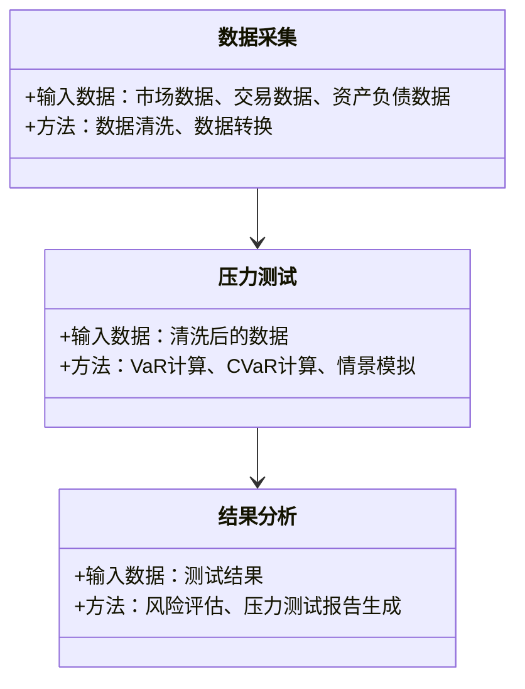

                 


# 金融机构流动性风险压力测试与管理平台

## 关键词

- 金融机构
- 流动性风险
- 压力测试
- 管理平台
- 系统架构
- 算法原理

## 摘要

本文详细探讨了金融机构流动性风险压力测试与管理平台的构建，从理论基础到系统设计，再到实际应用，全面分析了流动性风险的定义、压力测试的方法论、相关算法的实现，以及平台的整体架构和功能模块。文章还通过实际案例展示了平台的构建过程，并提供了最佳实践建议，帮助金融机构有效管理和应对流动性风险。

---

## 第一部分：金融机构流动性风险压力测试与管理平台概述

### 第1章：流动性风险与压力测试概述

#### 1.1 流动性风险的基本概念

流动性风险是指金融机构无法在不损失价值的情况下迅速满足其负债偿还或资产增长需求的风险。其主要特征包括时间性、不确定性、传染性以及系统性。流动性风险可以分为短期流动性风险和长期流动性风险，分别对应不同期限内的资金缺口问题。

#### 1.2 压力测试的重要性

压力测试是一种评估金融机构在极端市场条件下的承受能力的方法。其主要目的是识别潜在的风险点，评估机构在极端情况下的生存能力和恢复能力。压力测试的方法论包括历史情景法、情景分析法和蒙特卡洛模拟法等。

#### 1.3 金融机构面临的流动性风险挑战

金融机构在流动性管理中面临的主要挑战包括市场波动、资金流动性问题以及监管要求的变化。这些问题可能导致资金来源减少、资金运用受阻，从而引发流动性风险。

#### 1.4 平台建设的必要性

构建流动性风险压力测试与管理平台有助于提高金融机构的风险防控能力，优化资源配置，并支持管理层的决策制定。

### 第2章：流动性风险压力测试的方法论

#### 2.1 压力测试的基本框架

压力测试的基本框架包括测试目标的确定、测试情景的设计、测试模型的选择等关键步骤。测试目标通常包括识别风险敞口、评估缓解措施的有效性以及制定应对策略。

#### 2.2 常见的压力测试方法

常用的压力测试方法包括历史情景法、情景分析法和蒙特卡洛模拟法。每种方法都有其优缺点，适用于不同的测试场景。

#### 2.3 流动性风险压力测试的关键指标

流动性风险压力测试的关键指标包括现金流缺口分析、资金净流出分析和资产负债期限错配分析。这些指标帮助金融机构量化潜在的流动性风险。

---

## 第二部分：流动性风险压力测试与管理平台的核心概念与理论

### 第3章：流动性风险压力测试的核心概念

#### 3.1 流动性风险的核心要素

流动性风险的核心要素包括资金来源分析、资金运用分析和资金流动性分析。这些分析帮助金融机构了解其资金的流动性和稳定性。

#### 3.2 压力测试的核心要素

压力测试的核心要素包括测试情景的设计、测试模型的选择和测试结果的解读。这些要素确保压力测试的有效性和准确性。

### 第4章：流动性风险与压力测试的联系

流动性风险与压力测试密切相关。压力测试通过模拟极端市场条件，评估金融机构在不同情景下的流动性状况，从而帮助机构制定有效的风险管理策略。

---

## 第三部分：流动性风险压力测试与管理平台的算法原理

### 第5章：VaR算法原理与实现

#### 5.1 VaR的基本概念

VaR（Value at Risk）是一种衡量金融资产风险的方法，表示在一定置信水平下，资产可能遭受的最大损失。VaR的计算公式为：

$$ VaR = \text{资产价值} - \text{置信水平下的损失} $$

#### 5.2 VaR算法实现

VaR算法可以通过历史模拟法和蒙特卡洛模拟法实现。以下是Python代码示例：

```python
import numpy as np

def calculate VaR(returns, confidence_level):
    sorted_returns = sorted(returns)
    percentile = (1 - confidence_level) * len(sorted_returns)
    VaR = -sorted_returns[int(percentile)]
    return VaR

returns = np.array([0.01, -0.02, 0.03, -0.01, 0.02])
confidence_level = 0.95
print(calculate VaR(returns, confidence_level))
```

### 第6章：CVaR算法原理与实现

#### 6.1 CVaR的基本概念

CVaR（Conditional Value at Risk）是VaR的扩展，表示在VaR超过置信水平后的平均损失。CVaR的计算公式为：

$$ CVaR = \frac{1}{(1 - \text{置信水平})} \sum_{i=1}^{(1 - \text{置信水平})} \text{损失值} $$

#### 6.2 CVaR算法实现

CVaR可以通过排序和计算超阈值损失的平均值来实现。以下是Python代码示例：

```python
import numpy as np

def calculate CVaR(returns, confidence_level):
    sorted_returns = sorted(returns)
    percentile = (1 - confidence_level) * len(sorted_returns)
    losses = [ -return for return in sorted_returns[:int(percentile)] ]
    CVaR = np.mean(losses)
    return CVaR

returns = np.array([0.01, -0.02, 0.03, -0.01, 0.02])
confidence_level = 0.95
print(calculate CVaR(returns, confidence_level))
```

---

## 第四部分：流动性风险压力测试与管理平台的系统架构设计

### 第7章：系统功能设计

平台功能模块包括数据采集、压力测试、结果分析、报告生成和用户管理。以下是功能模块的类图：



### 第8章：系统架构设计

平台的系统架构包括数据层、业务逻辑层和用户界面层。以下是系统架构图：

```mermaid
div class="mermaid"
graph TD
    A[数据层] --> B[业务逻辑层]
    B --> C[用户界面层]
    A --> C
end
```

### 第9章：系统接口设计

系统接口包括数据接口、测试接口和报告接口。以下是系统接口设计：

```mermaid
div class="mermaid"
sequenceDiagram
    客户端 -> 数据层: 获取数据
    数据层 -> 业务逻辑层: 数据处理
    业务逻辑层 -> 客户端: 返回结果
end
```

---

## 第五部分：流动性风险压力测试与管理平台的项目实战

### 第10章：环境安装与配置

安装Python、NumPy、Pandas和Matplotlib库：

```bash
pip install numpy pandas matplotlib
```

### 第11章：核心代码实现

#### 11.1 数据采集与处理

```python
import pandas as pd

data = pd.read_csv('market_data.csv')
cleaned_data = data.dropna()
```

#### 11.2 压力测试实现

```python
import numpy as np

def calculate VaR(returns, confidence_level):
    sorted_returns = sorted(returns)
    percentile = (1 - confidence_level) * len(sorted_returns)
    VaR = -sorted_returns[int(percentile)]
    return VaR

returns = cleaned_data['returns'].values
confidence_level = 0.95
VaR_value = calculate VaR(returns, confidence_level)
print(f'VaR at {confidence_level} confidence level: {VaR_value}')
```

---

## 第六部分：总结与展望

### 第12章：总结与展望

本文详细探讨了金融机构流动性风险压力测试与管理平台的构建，从理论到实践，从算法到系统架构，提供了全面的解决方案。未来的发展方向包括算法优化、平台功能扩展以及与其他系统的集成。

---

## 作者

作者：AI天才研究院/AI Genius Institute & 禅与计算机程序设计艺术 /Zen And The Art of Computer Programming

---

以上是《金融机构流动性风险压力测试与管理平台》的完整内容，涵盖背景介绍、核心概念、算法原理、系统架构设计、项目实战以及总结与展望。通过详细的讲解和实际案例分析，帮助读者全面理解和应用流动性风险压力测试与管理平台的相关知识。

