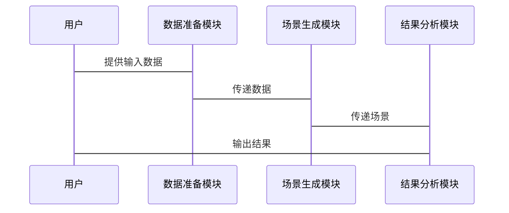

                 


# 金融监管压力测试场景生成

## 关键词：压力测试，金融监管，风险管理，人工智能，大数据分析

## 摘要：  
金融监管中的压力测试是评估金融机构在极端市场条件下的稳健性的重要工具。随着金融市场复杂性的增加，压力测试场景的生成需要更加智能化和自动化。本文将详细介绍压力测试的背景、核心概念、场景生成的方法、系统架构设计以及基于统计和机器学习的算法原理，结合实际案例，帮助读者理解如何有效生成压力测试场景，以支持金融监管机构做出更科学、更精准的决策。

---

## 第一部分: 金融监管压力测试背景与概念

### 第1章: 金融监管压力测试概述

#### 1.1 什么是压力测试
压力测试是一种模拟极端市场条件下的情景分析方法，用于评估金融机构在不利环境下的表现和稳健性。压力测试的核心在于通过模拟市场波动、经济衰退、政策变化等极端情况，评估金融机构的资本充足性、流动性风险和信用风险。

#### 1.2 压力测试在金融监管中的作用
压力测试是金融监管的重要工具之一，主要用于以下方面：
- 评估金融机构在极端情况下的抗风险能力。
- 识别潜在的风险点，制定相应的风险管理策略。
- 监测金融机构的资本充足性和流动性，确保其稳健运行。
- 为监管政策的制定提供数据支持。

#### 1.3 压力测试场景生成的重要性
压力测试场景生成是压力测试的核心环节，决定了测试的准确性和有效性。一个合理的场景生成方法能够模拟出多种极端市场条件，帮助金融机构全面评估其风险敞口和应对能力。

---

## 第二部分: 压力测试场景生成的核心概念与联系

### 第2章: 压力测试场景生成的原理与方法

#### 2.1 压力测试场景生成的原理
压力测试场景生成基于以下原理：
1. **统计分析**：利用历史数据，通过统计方法（如均值回归、方差分析）模拟极端市场条件。
2. **机器学习**：通过训练模型，识别数据中的模式和特征，生成符合特定条件的场景。
3. **情景分析**：结合专家判断和市场知识，构建合理的测试场景。

#### 2.2 压力测试场景生成的方法
以下是三种主要的场景生成方法：

##### 2.2.1 基于统计的方法
- **蒙特卡洛模拟**：通过随机抽样生成大量市场情景，评估金融机构在不同情景下的表现。
- **历史模拟法**：利用历史市场数据，模拟极端事件的发生。

##### 2.2.2 基于机器学习的方法
- **深度学习**：使用神经网络模型，学习市场数据中的复杂模式，生成极端情景。
- **聚类分析**：通过聚类算法，识别市场数据中的异常情况，生成测试场景。

##### 2.2.3 基于规则的方法
- **专家判断法**：根据市场专家的经验，手动构建极端情景。
- **假设分析法**：基于假设的极端市场条件（如GDP下降、利率飙升），生成测试场景。

#### 2.3 不同方法的对比与选择
| 方法类型 | 优点 | 缺点 | 适用场景 |
|----------|------|------|----------|
| 统计方法 | 计算简单，易于实现 | 可能无法捕捉复杂市场动态 | 适用于简单场景生成 |
| 机器学习 | 高度自动化，能够捕捉复杂模式 | 计算资源需求高 | 适用于复杂场景生成 |
| 规则方法 | 结果可控，符合监管要求 | 依赖专家经验，主观性强 | 适用于简单场景生成 |

---

## 第三部分: 压力测试场景生成的系统分析与架构设计

### 第3章: 系统架构设计方案

#### 3.1 系统功能模块划分
- **数据准备模块**：负责收集和整理市场数据、机构数据等输入数据。
- **场景生成模块**：基于输入数据，生成压力测试场景。
- **结果分析模块**：对生成的场景进行分析，评估金融机构的风险暴露。

#### 3.2 系统架构设计


#### 3.3 系统接口设计
- **数据接口**：模块之间的数据传递接口。
- **用户接口**：供用户输入参数和查看结果的界面。

#### 3.4 系统交互流程设计


---

## 第四部分: 压力测试场景生成的算法原理与数学模型

### 第4章: 压力测试场景生成的算法原理

#### 4.1 蒙特卡洛模拟算法
蒙特卡洛模拟是一种基于随机抽样的方法，用于生成大量可能的市场情景。

##### 4.1.1 算法步骤
1. 确定输入变量（如市场收益率、波动率）。
2. 生成随机数，模拟极端情景。
3. 计算金融机构在不同情景下的表现。

##### 4.1.2 数学模型
$$
R_i = \mu + \sigma \times Z_i
$$
其中，$R_i$ 是第 $i$ 种情景的收益率，$\mu$ 是均值，$\sigma$ 是标准差，$Z_i$ 是标准正态分布随机数。

#### 4.2 遗传算法
遗传算法是一种基于自然选择和遗传机制的优化算法。

##### 4.2.1 算法步骤
1. 初始化种群。
2. 计算适应度。
3. 选择、交叉和变异。
4. 重复迭代。

##### 4.2.2 数学模型
$$
适应度函数 = f(x) = \sum_{i=1}^n x_i^2
$$
其中，$x_i$ 是种群中的个体特征。

#### 4.3 机器学习算法
机器学习算法通过训练模型，识别数据中的模式和特征，生成极端情景。

##### 4.3.1 神经网络模型
使用深度学习模型（如LSTM）预测市场走势，生成极端情景。

##### 4.3.2 聚类分析
通过聚类算法，识别市场数据中的异常情况，生成测试场景。

---

## 第五部分: 压力测试场景生成的项目实战

### 第5章: 项目实战

#### 5.1 环境安装
- 安装Python和相关库（如NumPy、Pandas、Scikit-learn、Keras）。
- 配置开发环境（如Jupyter Notebook）。

#### 5.2 数据准备
- 收集市场数据（如股票价格、利率、汇率）。
- 数据清洗和预处理。

#### 5.3 模型实现
##### 5.3.1 蒙特卡洛模拟实现
```python
import numpy as np

mu = 0.05
sigma = 0.2
n = 1000
Z = np.random.normal(0, 1, n)
R = mu + sigma * Z
```

##### 5.3.2 遗传算法实现
```python
import numpy as np

def fitness(x):
    return np.sum(x**2)

population = np.random.rand(10, 2)
```

#### 5.4 结果分析
- 对生成的场景进行分析，评估金融机构的风险暴露。
- 输出结果报告。

#### 5.5 案例分析
- 基于实际市场数据，生成压力测试场景。
- 分析结果，提出风险管理建议。

---

## 第六部分: 总结与展望

### 第6章: 总结与展望

#### 6.1 本章总结
本文详细介绍了压力测试场景生成的方法、系统架构设计和算法原理，结合实际案例，展示了如何利用统计分析和机器学习技术生成压力测试场景。

#### 6.2 未来展望
- 结合大数据和人工智能技术，进一步提高压力测试的准确性和效率。
- 开发更复杂、更动态的场景生成方法，应对金融市场的新挑战。

---

## 作者：AI天才研究院 & 禅与计算机程序设计艺术

---

**总结：** 本文系统地介绍了压力测试场景生成的理论和实践，为金融监管机构提供了有效的工具和方法，帮助其更好地评估和管理金融市场风险。

